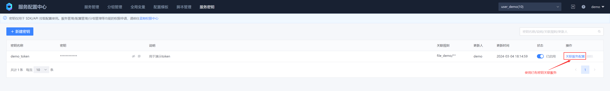

# 键值型配置
## 一、创建服务


## 二、添加配置


## 三、生成版本


## 四、上线版本


## 五、已有服务密钥关联服务配置




## 六、键值配置项拉取

### 1. 命令行配置拉取

https://github.com/TencentBlueKing/bscp-go/releases/

```bash
# 安装bscp命令行
go install github.com/TencentBlueKing/bscp-go/cmd/bscp@latest

# 下载bscp命令行，下载最新版本
https://github.com/TencentBlueKing/bscp-go/releases/
```

配置客户端参数，配置完后把内容保存为文件 bscp.yaml

```yaml
# BSCP 服务订阅地址，在BSCP后台部署的集群上执行（默认在容器平台的“蓝鲸”项目下）,执行以下命令获取：
# kubectl get svc bk-bscp-feed-feedserver-nodeport -n bk-bscp
# 如果客户端到集群Node网络不通，可以自行给feedserver配置LoadBalancer
feed_addr: "10.0.0.1:31510"

# 填写上一步的服务密钥
token: ABCDEFGHIJKLMNOPQRSTUVWXYZ1234

# 填写业务ID
biz: 10
```

可使用环境变量支持路径

```bash
export BSCP_CONFIG=./bscp.yaml
```

命令行使用

```bash
# 在当前环境下加载客户端配置
./bscp
bscp is a command line tool for blueking service config platform

Usage:
  bscp [command]

Available Commands:
  get         Display app or kv resources
  pull        pull file to temp-dir and exec hooks
  watch       watch release then pull file, exec hooks
  version     show version of the bscp-go cli.
  help        Help about any command

Flags:
  -c, --config string      config file path [env BSCP_CONFIG]
  -h, --help               help for bscp
      --log-level string   log filtering level, One of: debug|info|warn|error. (default info)

Use "bscp [command] --help" for more information about a command.

# 获取bscp服务列表
 ./bscp get app
NAME        CONFIG TYPE   REVISER   UPDATEAT    
file_demo   file          demo      5 hours ago   
kv_demo     kv            demo      2 hours ago

# 如果需要对输出结果格式化
./bscp get app -o json
[
    {
        "id": 205,
        "name": "file_demo",
        "config_type": "file",
        "revision": {
            "creator": "demo",
            "reviser": "demo",
            "create_at": "2024-03-04T09:33:44Z",
            "update_at": "2024-03-04T09:33:44Z"
        }
    },
    {
        "id": 206,
        "name": "kv_demo",
        "config_type": "kv",
        "revision": {
            "creator": "demo",
            "reviser": "demo",
            "create_at": "2024-03-04T12:23:42Z",
            "update_at": "2024-03-04T12:23:42Z"
        }
    }
]

# 获取 kv 列表
./bscp get kv --app kv_demo
KEY          TYPE     REVISER   UPDATEAT   
string_key   string   demo      1 hour ago   
json_key     json     demo      1 hour ago

# 获取 kv 的元数据
./bscp get kv --app kv_demo string_key -o json
[
    {
        "id": 0,
        "key": "string_key",
        "kv_type": "string",
        "revision": {
            "creator": "demo",
            "reviser": "demo",
            "create_at": "2024-03-04T12:38:49Z",
            "update_at": "2024-03-04T12:38:49Z"
        },
        "kv_attachment": {
            "biz_id": 10,
            "app_id": 206
        }
    }
]
./bscp get kv --app kv_demo json_key -o json
[
    {
        "id": 0,
        "key": "json_key",
        "kv_type": "json",
        "revision": {
            "creator": "demo",
            "reviser": "demo",
            "create_at": "2024-03-04T12:42:34Z",
            "update_at": "2024-03-04T12:42:34Z"
        },
        "kv_attachment": {
            "biz_id": 10,
            "app_id": 206
        }
    }
]

# 获取 kv 的值
./bscp get kv --app kv_demo string_key -o value
string_value

./bscp get kv --app kv_demo json_key -o value
{
    "name": "blueking",
    "desc": "Blueking is an operation and maintenance platform"
}

```


### 2. GO SDK
https://github.com/TencentBlueKing/bscp-go

### 3. Java SDK
https://github.com/TencentBlueKing/bscp-java-sdk

### 4. Python SDK
https://github.com/TencentBlueKing/bscp-python-sdk

### 5. C++ SDK
https://github.com/TencentBlueKing/bscp-cpp-sdk