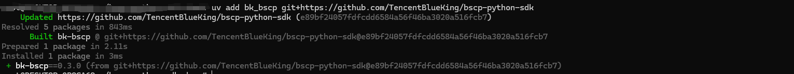

# BSCP Python SDK 依赖说明
[BSCP Python SDK](https://github.com/TencentBlueKing/bscp-python-sdk) 依赖以下库：

* Python 版本 3.8 及以上
* grpcio 版本 1.60.0 及以上
* typing-extensions 版本 4.9.0 及以上
* protobuf 版本 4.25.2 及以上

为了快速体验 BSCP Python SDK 示例，我们采用了开源项目 "[rye](https://github.com/astral-sh/rye)"，它易用、跨平台且能灵活管理 Python 版本与依赖，请注意，正式业务环境Python版本及组件依赖部署需由开发和运维团队确定


## 1. 安装rye

```bash
# 在Linux服务器上执行以下命令行,安装rye组件
curl -sSf https://rye.astral.sh/get | bash
```


```bash
# 配置 Rye 和 Python 的环境变量路径
source "$HOME/.rye/env"

# 查看当前环境python版本号
python -V
```


## 2. 部署BSCP Python SDK依赖

```bash
# 初始化 bscp-python-sdk-demo 项目
rye init bscp-python-sdk-demo

# 进入bscp-python-sdk-demo目录
cd bscp-python-sdk-demo

# 添加 grpcio 依赖
rye add "grpcio>=1.60.0"

# 添加 typing-extensions 依赖
rye add "typing-extensions>=4.9.0"

# 添加 protobuf 依赖
rye add "protobuf>=4.25.2"
```


## 3. 部署BSCP Python SDK组件

```bash
# 如果部署服务器环境有git命令，可以执行以下命令部署BSCP Python SDK组件
rye add bk_bscp --git=https://github.com/TencentBlueKing/bscp-python-sdk

# 如果没有git命令，部署出错，可以使用如下命令部署BSCP Python SDK组件，如果组件有更新时，需要把v0.1.0替换为最新版本
rye add bk_bscp --url=https://github.com/TencentBlueKing/bscp-python-sdk/archive/refs/tags/v0.1.0.tar.gz
```



## 4. 验证BSCP Python SDK组件

在验证BSCP Python SDK组件之前，需要首先在服务配置中心（BSCP）创建一个键值型服务，并添加相应的键值配置。接下来，生成并发布版本。有关操作指南，请参阅白皮书：[键值型配置](https://bk.tencent.com/docs/markdown/ZH/BSCP/1.29/UserGuide/QuickStart/kv.md)

把配置示例里的demo保存为demo.py文件，把{{ YOUR_KEY }}替换为业务实际的Key

```python
### Get

from bk_bscp.client import BscpClient

SERVER_ADDRS = ["feed.demo.com:9510"]
TOKEN = "AAm***ayQ"
BIZ_ID = 2
APP = "demo"
LABELS = {}

def main(key):
    with BscpClient(SERVER_ADDRS, TOKEN, BIZ_ID) as client:
        pair = client.get(APP, key, LABELS)
        print(pair.value)

if __name__ == "__main__":
    # 请将 {{ YOUR_KEY }} 替换为您的实际 Key
    key = {{ YOUR_KEY }}
    main(key)
```

```bash
# 执行demo.py获取指定Key的Value
python demo.py
```


