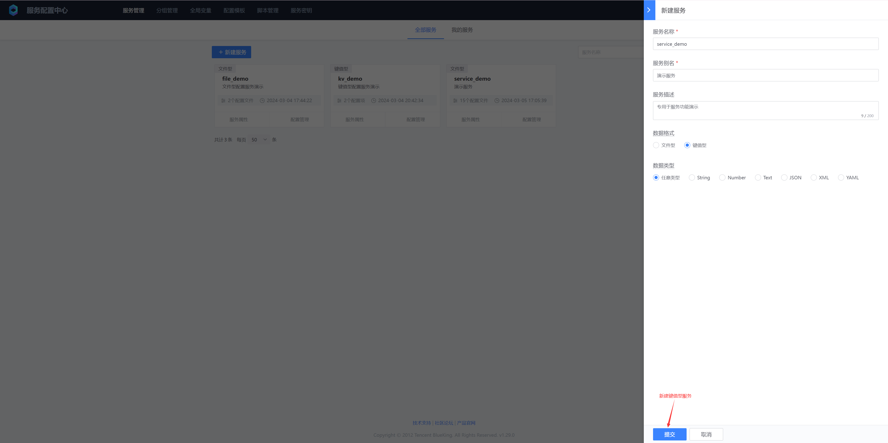
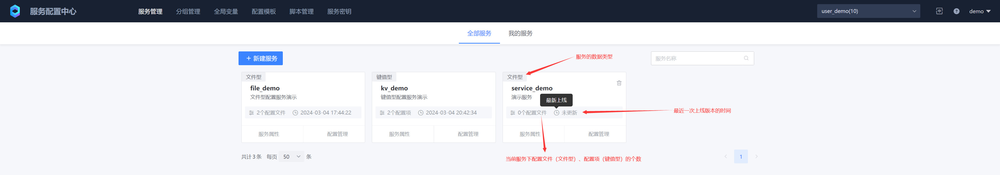
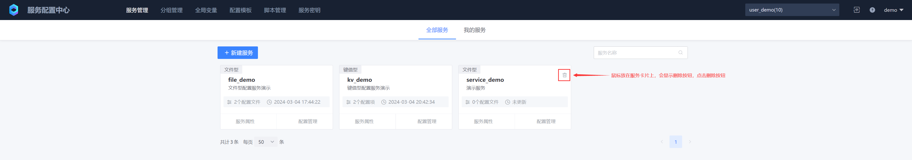

# 服务管理

蓝鲸服务配置平台（BK BSCP）是以蓝鲸配置平台（BK CMDB）中的“业务”作为顶层，进行资源隔离，一个业务下可以创建一个或多个服务，一个服务可以代表业务的一个模块，具体划分不同服务的逻辑以业务为准。

## 一、新建服务

* 服务名称
  业务下服务唯一标识，客户端在消费服务配置时使用
* 服务别名
  服务别名，可以使用中文字符，便于记忆和提升可读性
* 服务描述
  对该服务的用途场景说明，也可以备注其他信息
* 数据格式
  * 文件型
    通常以文件的形式存储,通常具有良好的可读性和可维护性
  * 键值型
    以键值对的形式存储，其中键（key）用于位置标识一个配置项，值（value）为该配置项的具体内容，kv型配置通常存储在数据库，使用SDK或API的方式读取
* 数据类型
  * 任意类型
    不对配置项的类型做限制。如果选择下方某个类型，则只能创建指定类型的配置项
  * String
    单行字符串
  * Number
    数值，包含整数、浮点数、会校验数据类型
  * Text
    多行字符串文本，不校验数据结构，大小2Mb
  * JSON、XML、YAML
    不同格式的结构化数据，会校验数据结构

## 二、查看服务
查看服务列表，可按“全部服务”、“我的服务”两种方式查看服务列表，“我的服务”下是我创建的服务列表

## 三、编辑服务属性

文件型服务支持编辑“服务别名”与“服务描述”，键值型服务还支持编辑“数据类型”

键值型配置编辑调整数据类型时需要注意：从“任意类型”调整到其他类型时，此时服务下的“未命名版本”下的所有配置项都必须为此类型，例如：从“任意类型”调整为“String”类型时，此时该服务的未命名版本下必须全部都是String类型配置项，否则会调整失败

## 四、删除服务

当业务不再使用该服务下的配置即可删除服务，服务删除后不可恢复，请谨慎操作

服务删除后，已经下发到客户端的配置文件不会受影响

