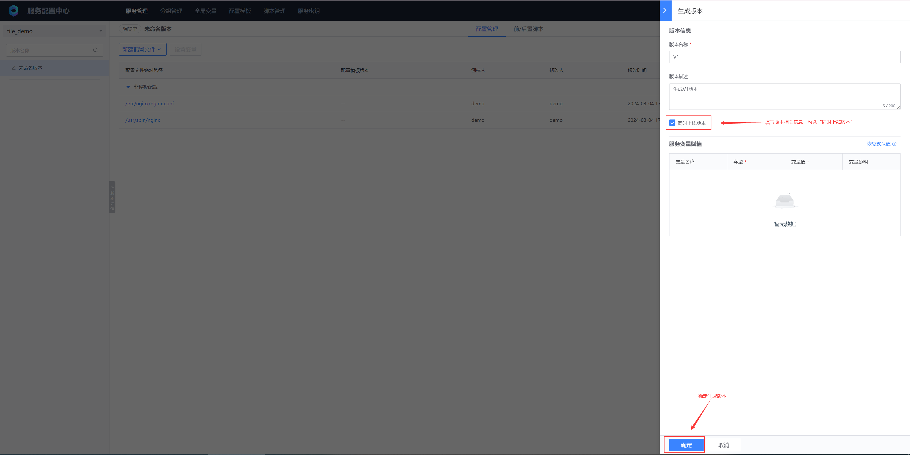

# 文件型配置
## 一、创建服务


## 二、添加配置


## 三、生成版本




## 四、上线版本


## 五、创建服务密钥


## 六、配置Sidecar

```yaml
apiVersion: apps/v1
kind: Deployment
metadata:
  name: test-listener
  namespace: default
spec:
  selector:
    matchLabels:
      app: test-listener
  template:
    metadata:
      labels:
        app: test-listener
    spec:
      initContainers:
        # BSCP init 容器，负责第一次拉取配置文件到指定目录下
        - name: bscp-init
          image: ccr.ccs.tencentyun.com/blueking/bscp-init:latest
          env:
            # BSCP 业务 ID
            - name: biz
              value: "10"
            # BSCP 服务名称
            - name: app
              value: "file_demo"
            # BSCP 服务订阅地址，在BSCP后台部署的集群上执行（默认在容器平台的“蓝鲸”项目下）,执行以下命令获取：
            # kubectl get svc bk-bscp-feed-feedserver-nodeport -n bk-bscp
            # 如果客户端到集群Node网络不通，可以自行给feedserver配置LoadBalancer
            - name: feed_addrs
              value: "10.0.0.1:31510"
            # 服务秘钥，填写上一步创建的服务密钥
            - name: token
              value: "ABCDEFGHIJKLMNOPQRSTUVWXYZ1234"
            # 配置文件临时目录，文件将下发到 {temp_dir}/files 目录下
            - name: temp_dir
              value: '/data/bscp'
          # 需要同时挂载文件临时目录到 init 容器，sidecar 容器，业务容器
          volumeMounts:
            - mountPath: /data/bscp
              name: bscp-temp-dir
      containers:
        # 业务容器
        - name: test-listener
          image: alpine
          command:
          - "/bin/sh"
          - "-c"
          - |
            apk add --no-cache inotify-tools
            echo "start watch ..."
            while true; do
            # 监听 /data/bscp/metadata.json 的写入事件
            inotifywait -m /data/bscp/metadata.json -e modify |
                while read path action file; do
                    # 递归遍历 /data/bscp/files 目录下的所有文件，输出其绝对路径
                    find /data/bscp/files
                done
            done
          resources:
            limits:
              memory: "128Mi"
              cpu: "500m"
          # 需要同时挂载文件临时目录到 init 容器，sidecar 容器，业务容器
          volumeMounts:
            - mountPath: /data/bscp
              name: bscp-temp-dir
        # BSCP sidecar 容器，负责监听版本变更时间，并更新临时目录下的配置文件，更新完成后向 metadata.json 写入事件
        - name: bscp-sidecar
          image: ccr.ccs.tencentyun.com/blueking/bscp-sidecar:latest
          env:
            # bscp-sidecar 容器的环境变量配置和 bscp-init 容器完全一致
            - name: biz
              value: "10"
            - name: app
              value: "file_demo"
            - name: feed_addrs
              value: "10.0.0.1:31510"
            - name: token
              value: "ABCDEFGHIJKLMNOPQRSTUVWXYZ1234"
            - name: temp_dir
              value: '/data/bscp'
          resources:
            limits:
              memory: "128Mi"
              cpu: "500m"
          volumeMounts:
            - mountPath: /data/bscp
              name: bscp-temp-dir
      volumes:
        - name: bscp-temp-dir
          emptyDir: {}
```

## 七、检查文件是否下发成功

bscp_sidecar容器查看客户端拉取的配置文件

