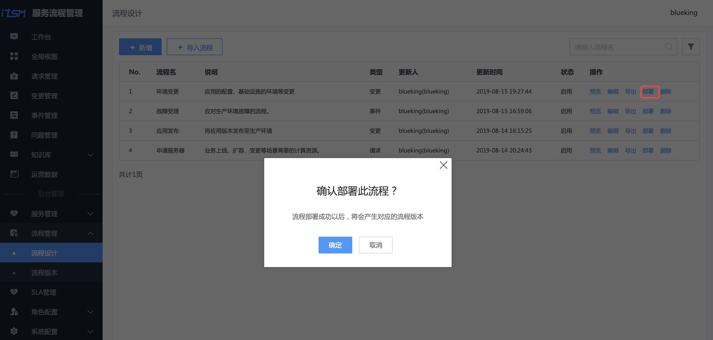
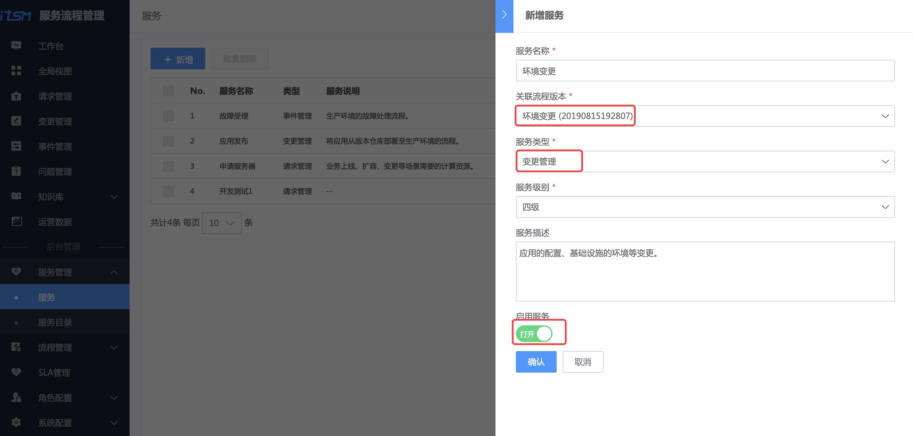

# 流程服务：环境变更流程线上化

## 情景

变更是运维的职能之一，包含应用的配置、基础设施的环境等变更。

应用所依赖的服务器已经服役 5 年，不在维保期限，故障率抖升，为了保障应用的稳定性，运维团队计划在业务低峰期，完成服务器的以旧换新。

流程服务中的变更管理（Change Managent）规范了变更环节的操作，确保**高效有序的完成环境变更**，对应用的可用性负责，并对生产环境的变更满足**合规性检查**。

变更管理是蓝鲸流程服务的一个模块，接下来介绍在蓝鲸流程服务如何**完成这次服务器的替换升级**。

## 前提条件

- 准备环境变更流程中 [多个角色](../../../../PaaS/1.0/UserGuide/ProductFeatures/SystemManagement/UserManageEE.md) 的账号，包含`运维`、`QC`、`产品`，以及流程设计的`管理员`。

## 操作步骤

- 梳理环境变更流程
- 创建环境变更服务目录及流程
- 一次环境变更示例

### 梳理环境变更流程

从流程服务理论出发，梳理**环境变更流程图**，包含运维**变更申请**、**受理变更**、**变更操作和总结**，以及最后质量保证（QC）对变更的**评估管理**。

> 流程图中是一个实践案例，部分数据需要从周边系统获取，此处功能需要做二次开发，本教程专注流程本身。

### 创建环境变更服务目录及流程

先设计环境变更的**流程**，**流程依附在服务目录上对外提供服务**。

#### 角色设置

参照 [角色设置](./Release_Management.md) 完成对`运维`、`产品`和`QC`的授权。

#### 设计环境变更流程

##### 填写流程信息

选择菜单【流程设计】 ，点击【新增】按钮，按提示填写流程信息。

流程类型选择【变更】，需要【关联业务】，因为**环境变更和业务相关**，同时关联业务对应的角色：产品、运维。

点击【下一步】，进入【定义与配置流程】环节。

##### 定义与配置流程

点击上图【流程画布】中的【齿轮】，配置【提单】流程节点的字段。

一般是**运维**提环境变更单据，所以操作角色选择【CMDB 业务公用角色】-> 【运维人员】(角色授权详见给角色分配权限 ）。

点击【新增字段】，参照 **梳理环境变更流程**，新增每个环节中需要的字段。

参照 **梳理环境变更流程**，，完成整个环境变更流程的配置。

##### 启用流程

【启用流程】，选择适合的通知策略，点击【提交】完成流程设计。

##### 流程模板实例化

选择菜单【流程设计】，找到刚编辑的环境变更流程，点击【部署】，生成流程实例。

#### 在服务目录中新增"环境变更"服务，并绑定流程

选择菜单【服务】，点击【新增】按钮，新增"环境变更"服务，并**关联**刚生成的流程实例。

选择菜单【服务目录】，选中【根目录】，点击右侧【 **⋮** 】，点击【新增】，按提示新增一个名为**环境变更**的服务目录。

选中刚刚创建的服务目录【环境变更】，右侧会显示【添加】按钮，点击该按钮添加**环境变更**服务。

至此，**流程设计和服务目录已新建好**，接下来做一次环境变更演示。

### 一次环境变更示例

#### 运维：变更申请

用`运维`账号登录流程服务，选择【变更管理】菜单，点击【新增变更】，选择【环境变更】服务，点击【提交】。

在【新增变更】界面，填写**本次环境变更的关键信息**，包括变更原因、范围以及时间等。

点击【提交】，完成变更申请。

#### 运维组长：变更审核

运维组长收到一封**待处理**的**变更审核**邮件。

使用**运维**账号登录流程服务，在待办列表中，找到待处理的环境变更单。

点击链接，审核本次变更，点击【通过】，完成本环节流程。

#### 运维：变更操作及总结

环境变更完毕后，填写变更总结。

#### QC：变更评估

QC（质量保障）人员在工作台的待办列表中，找到本次环境变更的单据。

QC 依据该业务的业务关键指标数据、投诉情况，做出**变更评估**。

至此，一次**环境变更的流程结束**。

