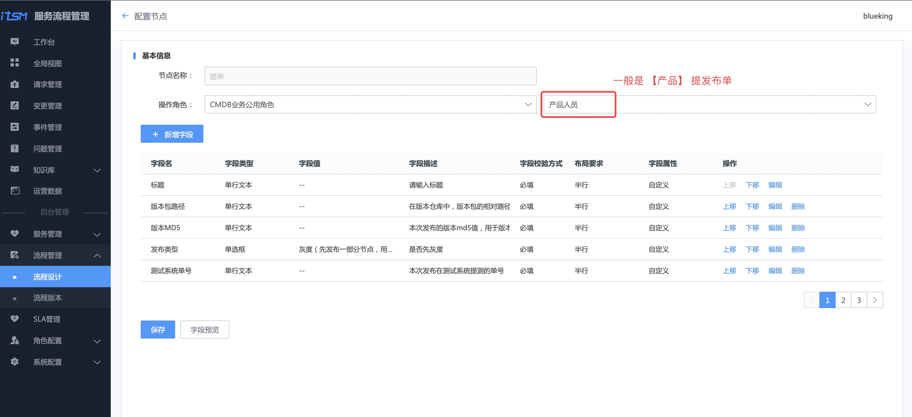
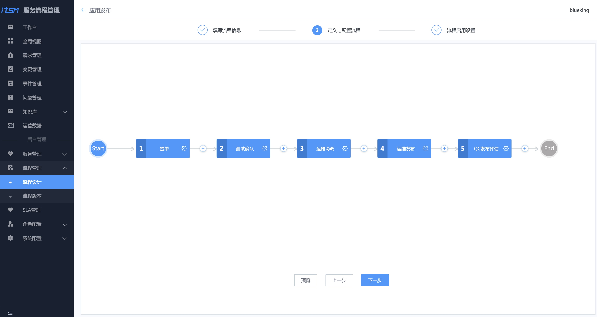
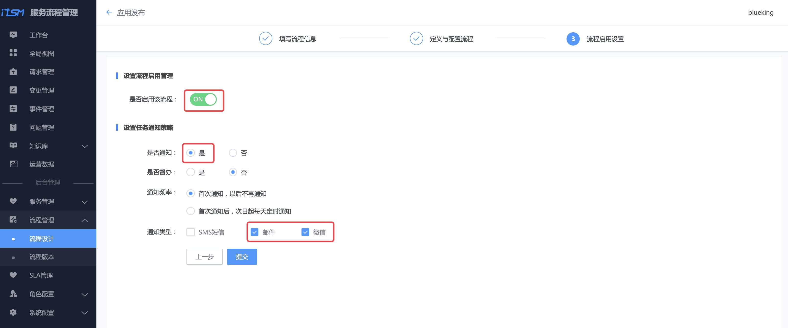
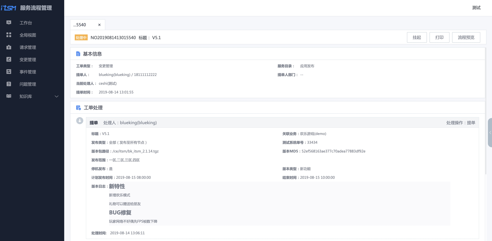
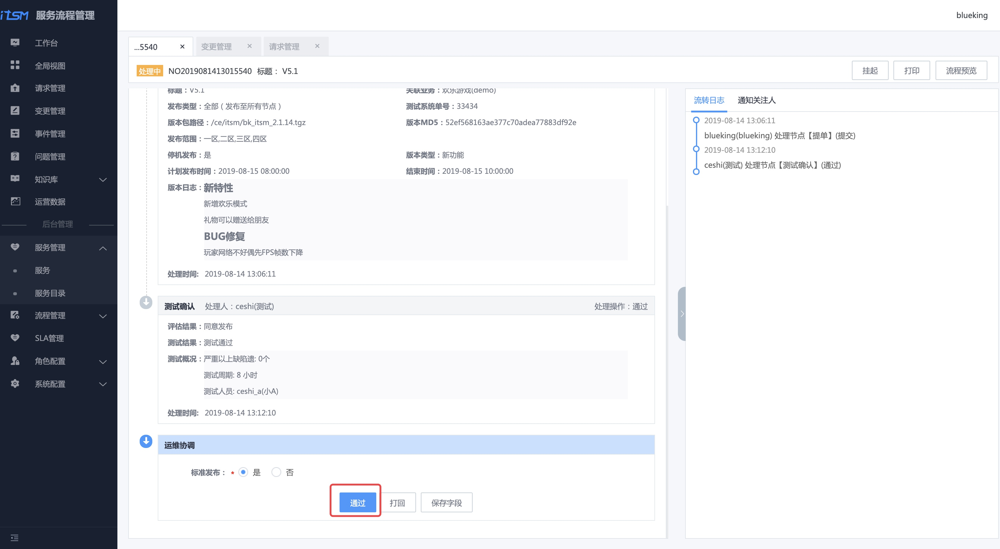

# 流程服务：发布流程线上化

## 情景

应用发布是运维的职能之一，传统的应用发布通过邮件交付，沟通成本太高，而且不符合合规性检查。

接下来，以**一个业务的应用发布为例**，看蓝鲸流程服务是如何解决这个痛点的。

## 前提条件

- 准备发布流程中的 [各个角色](.../../../../PaaS/1.0/UserGuide/ProductFeatures/SystemManagement/UserManageEE.md)) 的账号，包含流程设计的`管理员`，以及应用发布流程中的`产品`、`运维`、`测试`、`QC`。

## 操作步骤

- 梳理应用发布流程
- 创建应用发布服务目录及流程
- 一次应用发布示例

### 梳理应用发布流程

从流程服务理论出发，梳理一个应用发布流程图，**将测试环境验收通过的版本，部署到生产环境**。包含研发运营环节的**测试**、产品**提交发布需求**、运维**协调发布资源**、**发布**，以及最后质量保证(QA)对应用**发布质量的管理**。

> 流程图中是一个实践案例，部分数据需要从周边系统获取，此处功能需要做二次开发，本教程专注流程本身。

### 创建"应用发布"流程及服务目录

先设计应用发布的**流程**，**流程依附在服务目录上对外提供服务**。

#### 角色设置

使用蓝鲸管理员账号给该业务**分配对应角色的权限**。

使用管理员账号**新增通用角色** QC ，并添加用户 qc_c（该账户是前提条件中准备的）。

#### 设计应用发布流程

##### 填写流程信息

选择菜单【流程设计】 ，点击【新增】按钮，按提示填写流程信息。

流程类型选择【变更】，需要【关联业务】，因为应用发布和业务相关，同时关联业务对应的角色：产品、运维、测试。

点击【下一步】，进入【定义与配置流程】环节。

##### 定义与配置流程

点击上图【流程画布】中的【齿轮】，配置【提单】流程节点的字段。

一般是业务的**产品**提应用的发布单据，所以操作角色选择【CMDB 业务公用角色】-> 【产品人员】。

点击【新增字段】，参照 **梳理应用发布流程**，新增每个环节中需要的字段。

参照 **梳理应用发布流程**，完成整个应用发布流程的配置。

##### 启用流程

【启用流程】，选择适合的通知策略，点击【提交】完成流程设计。

##### 流程模板实例化

选择菜单【流程设计】，找到刚编辑的应用发布流程，点击【部署】，生成流程实例。

#### 在服务目录中新增"应用发布"服务，并绑定流程

选择菜单【服务】，点击【新增】按钮，新增"应用发布"服务，并**关联**刚生成的流程实例。

选择菜单【服务目录】，选中【根目录】，点击右侧【 **⋮** 】，点击【新增】，按提示新增一个名为**应用发布**的服务目录。

选中刚刚创建的服务目录【应用发布】，右侧会显示【添加】按钮，点击该按钮添加**应用发布**服务。

### 一次应用发布示例

创建完"应用发布"流程及服务目录后，接下来做**一次应用发布演示**。

#### 产品提交发布需求

用`产品`账号登录流程服务，选择【变更管理】菜单，点击【新增变更】，选择【应用发布】服务，点击【提交】。

在变更申请界面，填写**本次版本发布的关键信息**，包括版本包路径、MD5 ，用于自动化应用发布系统直接从仓库中获取版本，以及版本发布范围和时间。

点击【提交】，创建发布需求。

#### 测试确认版本质量

测试人员收到一封**待处理**的**测试确认**邮件。

使用测试账号登录流程服务，在待办列表中，找到刚刚产品提的发布单。

点击链接，选择评估结果和测试结果，并填写测试概况，点击【通过】，完成本环节流程。

#### 运维协调资源

使用运维的账号登录流程服务，在待办列表找到单据。

点击【通过】，开始协调发布资源，做好发布准备。

#### 运维实施发布

完成了发布准备，到了计划发布时间，在自动化应用发布系统（如标准运维）上完成应用发布后，在该发布单的运维发布环节填写**本次运维发布的概况**。

#### QC 发布评估

QC（质量保障）人员在工作台的待办列表中，找到本次发布的单据。

QC 根据业务指标监控系统的数据以及事件管理中是否存在关联的事件，对此次发布做出发布评估。

至此，一次应用发布的流程结束。

