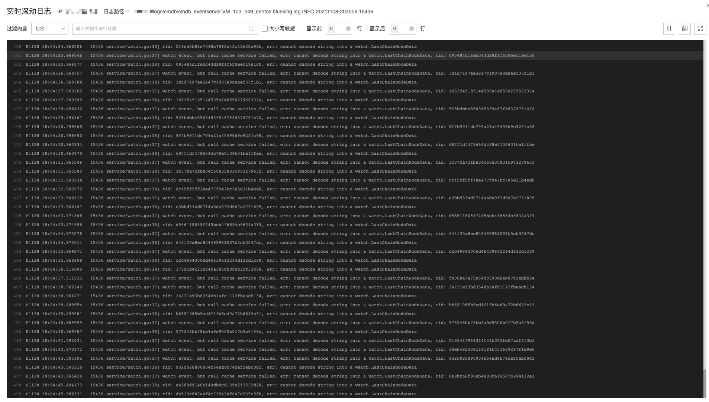

# 日志检索

日志检索主要是用来快速定位问题，避免在服务器端进行日志的查询，优点是性能高效和工具便捷。

## 工作原理

能够进行日志的检索，需要已经有数据源的接入并且形成**索引集**，才可以用来检索和监控。

## 检索


### 查询语句

点击搜索框，会列出当前日志的字段名


支持 QueryString 语法和正则匹配。具体的查询语法查看[query string 详解](../../../LogSearch/4.6/UserGuide/ProductFeatures/data-visualization/query_string.md)。

```
精确匹配(支持AND、OR)
author:"John Smith" AND age:20

字段名匹配(*代表通配符)：
status:active
title:(quick brown)

字段名模糊匹配：
vers\*on:(quick brown)

通配符匹配：
qu?ck bro*

正则匹配：
name:/joh?n(ath[oa]n/

范围匹配(数值类型)：
count:[1 TO 5]
count:[1 TO 5}
count:[10 TO *]
```

点击log字段，输入关键字string，检索结果如下


## 过滤条件

**添加过滤条件**可以更精确的定位到日志内容。

### IP 快选

**IP 快选**通过关联 CMDB 的业务拓扑，控制日志检索范围。


### 添加条件


注意：

* 值列出的是当前已检索出日志中的值，默认是列出50条日志。如果当前日志中不存在需要的值，则需要手动输入。
* 从添加条件中检索，和输入查询ES的语句其实是一样的效果。
     

#### 操作符

`is`
`is one of `
`is not`
`is not one of`
`大于`
`小于`
`等于`
`大于等于`
`小于等于`
`exists`
`does not exists`     
     
      
### 快捷添加条件

* `+` 号 添加 key is value
* `-` 号 添加 key is not value


## 收藏 


## 自动查询


默认自动查询，输入查询语句后，自动会进行检索，但有时习惯上想输入完整的查询语句之后，再点击检索来查询会更明确，就可以关闭自动查询

## 日志格式展示


内容会联动：

* 主机IP ， 监控的IP详情
* traceID，会联动对应的调用链


日志聚类具体查看[日志](../../../LogSearch/4.6/UserGuide/ProductFeatures/data-visualization/log_reduce.md)

## 日志导出


默认导出是1万条，如需导出更多日志，则可以使用异步下载功能，通过邮件发送下载链接，最大支持100万条日志。

## 加载更多日志

向下滑动，则可以继续加载更多日志


## 实时日志

**实时日志滚动。**





## 上下文查看

上下文日志，一般是查询到敢兴趣的关键字后，需要对产生该日志的上下文进行深究的场景，如下图所示


## 容器webConsole

如果采集的日志来自BCS容器，会有WebConsole可以直接打开查看


## 字段显示和排序 

**字段显示和顺序，还有多列排序功能。**


