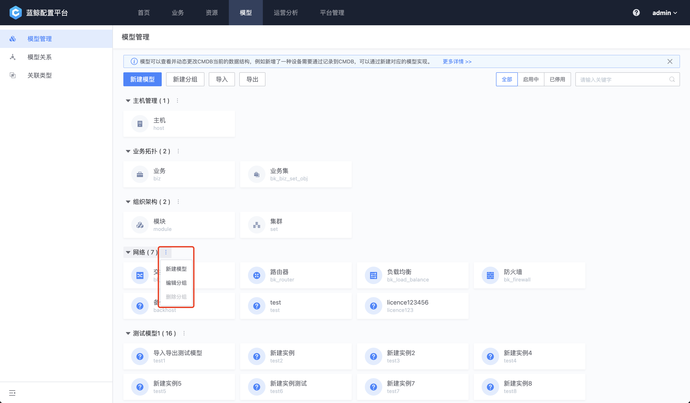
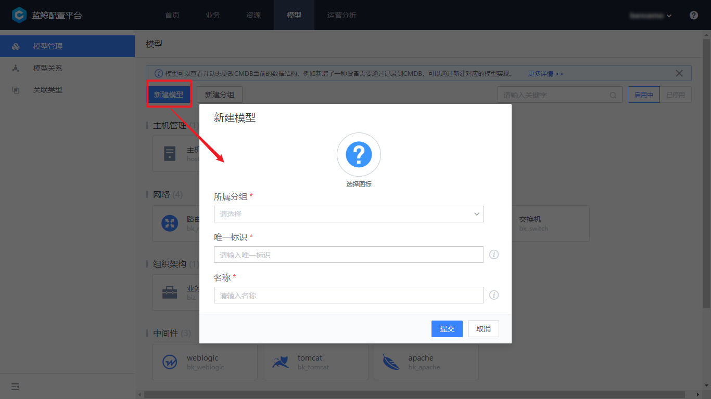
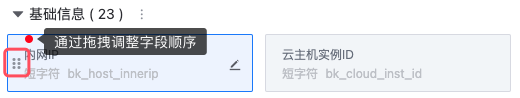
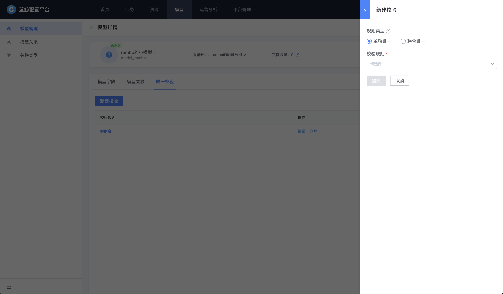

# 模型管理

配置平台中管理的信息实例，均是基于模型构造而成。

目前内置的模型有业务、集群、模块、主机、进程、云区域。

如果内置模型不能够满足，可以通过自定义新增、编辑模型，从而构造出企业特有的 CMDB。

## 现有模型查看

管理员可以通过“模型 - 模型管理”中查看到当前系统中存在的所有模型。

图1.现有模型查看

## 模型分组

系统支持对模型按照使用的功能进行分组。分组类型分为“系统内置”和“用户自定义”。

1. 系统内置分组：目前包含“主机管理”、“业务拓扑”、“组织构架”和“网络”。内置分组不可以修改和删除

2. 用户自定义分组：可以通过侧边的新增按钮进行新增。如需修改已有自定义分组，可以通过鼠标悬停在分组名称上，然后点击修改按钮

图2.新增分组

图3.编辑/删除分组

## 模型创建

在新增的分组面板中，点击“立即创建”打开创建一个新的模型。

- 所属分组：模型的管理分组，可以让模型分类更加清晰易于检索，后续版本将会支持根据分组设定权限
- 唯一标识：模型的在系统中的唯一标识，不可以重复，新建以后将不可修改，主要用于 API 的识别和调用
- 名称：模型的在视图上的可见名称，建议尽命名可能简洁易懂

图4.新增模型

模型创建成功以后，进入模型的查看页面，可以发现当前模型已经自动创建了：

- 字段分组“default”，这是一个内置分组不可删除，可以修改名称
- 字段“实例名”，这是一个必填字段，在系统需要简写的场景，CMDB 会优先显示此字段以便于用户快速识别当前设备的用途或者归属

接下来可以通过点击“添加”按钮增加更多字段。

图5.新增字段

目前支持已经支持的字段类型如下：

- 短字符：长度 256 个英文字符或 85 个中文字符
- 长字符：长度 2000 英文或 666 个中文字符
- 数字：正负整数
- 浮点：可以包含小数点的数字
- 【不推荐】枚举：包含 K-V 结构的列表
- 枚举(多选)：包含 K-V 结构的可多选列表
- 日期：日期格式
- 时间：时间格式
- 时区：国际时区的枚举
- 用户：可以输入蓝鲸中已经录入的用户
- 布尔：布尔类型，常用于开关
- 列表：可以理解为数组类型，只包含值的列表
- 表格：支持短字符、长字符、数字、浮点、枚举(多选)、bool的集合数据结构类型

图6.字段类型

不同的字符类型有对应的配置选项，含义如下：

- 可编辑：当前字段仅在初始创建和导入的时候可以编辑，在系统中不可修改
- 必填：当前字段必须填写
- 正则校验：字符类型的字段可以填写正则表达式，以保证录入数据格式准确，常用于邮箱、手机号码等内容
- 最大、最小值：数字类型可以设定支持的数字范围
- 枚举值：枚举类型中设定枚举可选项，ID 是用户不可见，值为用户可见选项
- 列表值：列表类型中设定列表可选项
- 默认值：默认值是枚举和列表类型用于设定用户如果没有填写，使用哪个作为默认输入
- 用户提示：提供给用户描述 tips，一般哦用于指导如何填写当前字段

## 字段的布局调整

您可以通过以下方式让实例的详情查询、编辑页面更加友好：

1. 调整字段分组顺序

   

   
图7.1 字段分组布局

2. 拖动移动字段顺序

图7.2 字段布局

## 唯一校验

为了保证配置平台录入的实例数据正确有效，唯一校验可以在录入前做好校验防护，避免出现重复数据。

### 默认校验

默认情况下，自定义的模型会以“实例名”作为唯一校验。即如果输入了重复的实例名称，系统会拒绝录入并提示数据从服务。默认校验有以下特性：

1. 不可以被删除
2. 默认校验必须不为空，即使当前字段没有设定为“必填”，在录入的时候也会被要求一定要填写

您可以修改默认校验为模型中已经存在的其他字符、数字类型字段，例如改为“固资编号”、“设备 SN”、“MAC 地址”等。也可以修改为多个字段联合作为唯一校验，常见的场景有：“区域+区域唯一标识”。

图8.可选校验

除了默认校验，可以创建多组辅助校验规则以让实例的录入更严谨，辅助校验的字段如果未设定为必填，在录入的时候如果为空则不会校验。如果希望辅助校验也能够同默认校验一样，需要在字段属性中把字段设置为必填。

## 模型删除

删除模型：在模型的详情页面，可以通过右上角的“删除”功能完全删掉当前模型设定。需要注意的是为了尽可能减少误删除情况，删除模型请求时候系统会先确认对应实例已经清空。

图9.模型删除

## 模型停用

1. 禁用模型：如果只是暂时不启用，可以使用右上角的停用功能，与删除不同的是，禁用仅会隐藏系统的显示，数据均会保留

2. 启用模型：模型被禁用以后，可以通过在模型管理中，切换到已停用标签，找到当前禁用模型，重新启用以后，原有的实例和关联关系都会重新恢复显示

图10.查看停用的模型

