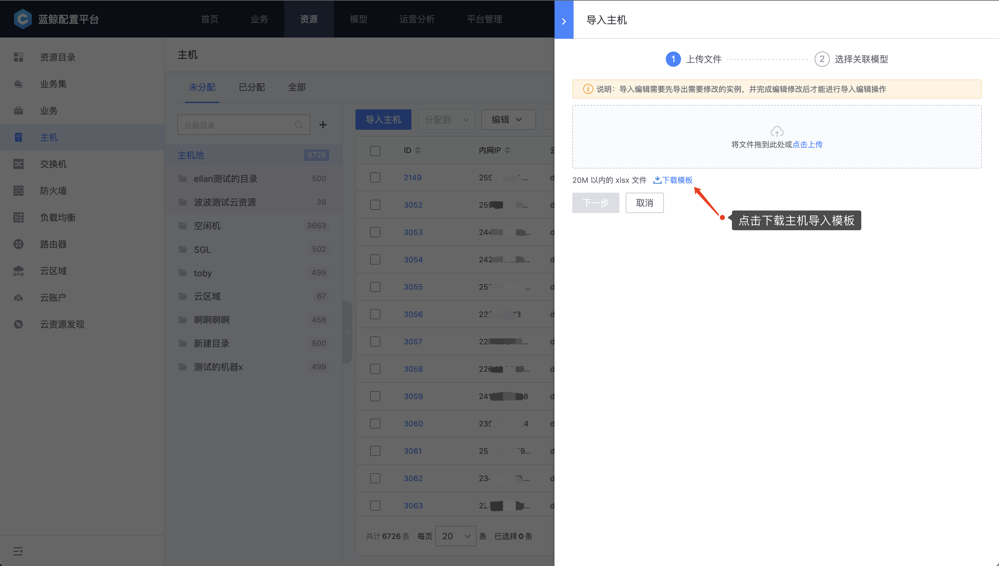
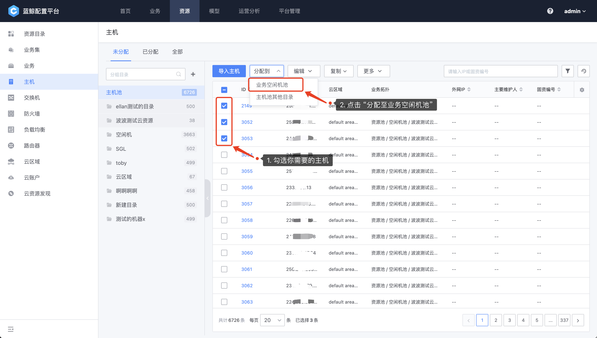

# 主机和资源池

主机实例是 CMDB 中比较重要的对象之一，系统内置了“资源池”，即未分配到业务的主机。导入的新主机，默认进入到资源池中。

图1.主机资源池

## 主机录入

目前在配置平台录入主机有两种方法：

1. 在配置平台中以 Excel 方式导入

2. 在节点管理安装 Agent 后，会自动将主机同步到配置平台

### 在配置平台中以 Excel 方式导入

点击 “导入主机”，并下载主机 Excel 导入模板：

图2.下载模版

打开 Excel 文档以后，前三行为系统标识，第四行以后每行为一条记录。

- 标注红色为必填字段，其他字段可以留空
- 其他字段根据模型中的字段顺序排列

> 注意的是：录入同样内网 IP，是属性覆盖的操作，可以使用此特性对主机属性进行批量更新。

图3.Excel字段说明

### 在节点管理安装 Agent 后，会自动将主机同步到配置平台

节点管理的 Agent 安装流程详见：[Agent 安装](../../../../NodeMan/2.2/UserGuide/Feature/Agent.md)

## 资源分配到业务

先选中要分配主机，点击分配到按钮，选择业务后可以完成主机资源的分配，默认是放到业务的空闲机池。

## 资源池目录管理

公司内不同的部门，业务对于主机资源的管理可能有所不同，我们可以通过创建资源池目录的方式，隔离各个不同团队的资源，避免混用。

###  创建资源池目录

点击创建目录按钮，输入资源池名称后回车完成创建，需要注意的是，资源池的目录名称是其唯一标识不允许重复。

### 资源池目录管理

资源池的目录编辑删除可以通过点击其后的“更多”按钮进行操作，需要注意的是，当资源池下没有任何资源的时候，才可以删除此目录。

### 资源池目录导入主机

把主机导入到资源池的目录有两种方式：直接导入和通过资源池目录转移。

#### 直接导入

导入主机的时候，可以选择是否同时导入Excel中的实例关联关系。

#### 通过资源池目录转移

也可以通过从其他资源池目录转移主机资源到当前目录下。勾选要操作的资源以后，选择“分配到”-“资源池其他目录”，可以把当前选中的资源转移到当前目录。

