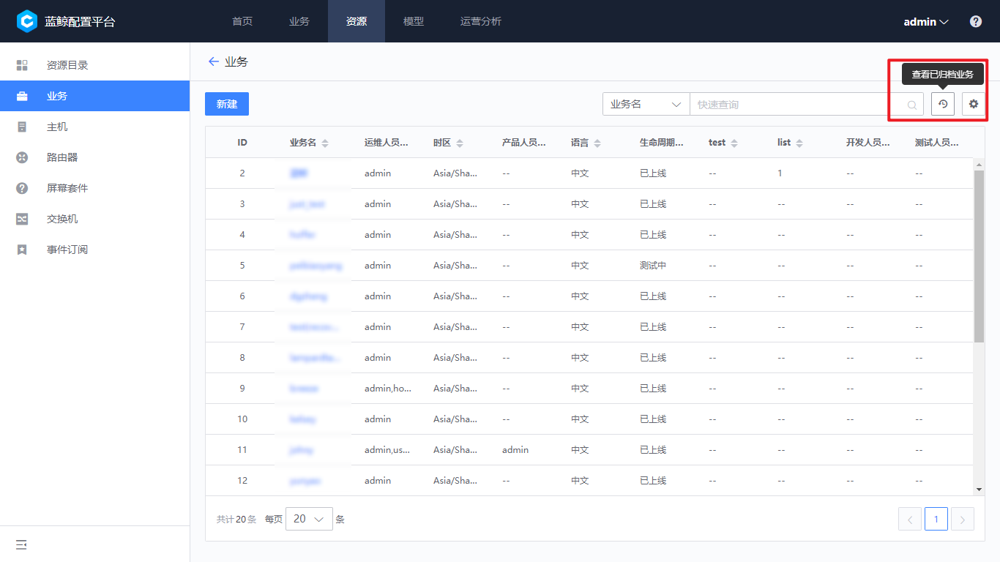

# 如何创建业务并导入主机到业务中

具体步骤：

**创建业务 -- 创建业务拓扑 -- 导入主机到资源池 -- 查看未分配到业务的主机 -- 分配主机到业务空闲机池 -- 分配主机到业务模块**

## 创建业务

业务是蓝鲸持续部署环节比较重要的概念，主要用于资源和配置隔离，在配置平台创建的业务，默认同时应用于作业平台、标准运维、监控平台、故障自愈等场景。

通过导航栏点击“基础资源 - 业务”，进入业务管理功能页，然后点击【新建】按钮。

> **注意：** 初始状态下，业务只有配置平台管理员能够新增和管理业务。管理员可以根据实际企业需要，通过权限分组的方式，给指定用户组分配业务管理权限。

- 业务是蓝鲸体系内较为关键的资源，所以业务不提供删除功能，当业务不再需要的业务可以使用 **业务归档** 功能把业务从列表中移除。

- 当业务归档的时候，用户需要确认其他 SaaS 已经没有使用此业务，包含并不限于业务下的定时任务、监控配置已经停止，否则会产生过多异常。

业务被归档以后，所有 SaaS 均无法看到此业务。

- 归档的业务需要还原时，可以使用 **业务归档的还原** 功能恢复到正常使用状态：

业务归档还原以后，可以在业务的归档列表中，看到已经归档的业务。

点击【恢复业务】可把业务恢复到正常使用状态，为了方便用户辨识，从归档恢复的业务会默认在业务名称后方加上（-archived）标识，用户根据需要修改业务名称即可。

## 创建业务拓扑

创建业务以后，在“业务资源 - 业务拓扑”中，可以看到下拉菜单中增加了刚刚新增的业务。业务创建完成会自动创建“空闲机”，“故障机”,“待回收”三个模块。

此时我们可以对业务定义业务拓扑。点击拓扑树上的业务，后方出现的【新建】按钮可以创建业务的直接下级即“集群”和其直接下级“模块”。

## 导入主机到资源池

为了标准化管理和提高主机资源利用率，设计了资源池模式，所有主机需要统一先录入到主机资源池中，然后再分配到业务中。

导航进入“基础资源 -- 主机”页面，点击【导入主机】按钮进行导入主机。

目前在配置平台导入主机分以下两种，一种是 `Excel 批量导入`，一种是通过 `节点管理` 进行自动导入。

首先点击“基础资源 -- 主机”页面的 【导入主机】 按钮打开导入对话框。

### 方法 1：通过 Excel 批量导入

当主机在直连区域（蓝鲸中控环境可以直接访问区域）时，可以使用此方法。点击 【下载模版】 按钮，下载到符合格式好的 Excel 文档。

打开 Excel 文档以后，可以到内网 IP 是必填属性，其他属性如果不需要导入，可以把相关列删除。Excel 中第二个 Sheet 中有详细的填写说明，建议首次使用用户先查看此说明。

> **注意：** 录入同样内网 IP，是属性覆盖的操作，可以使用此特性对主机属性进行批量更新。

### 方法 2：节点管理进行自动导入

切换到自动导入的 Tab 页，通过点击跳转到链接可以打开 `Agent 安装` 应用，根据节点管理对 Agent 的安装流程，相关主机会自动录入到配置平台对应业务下的的资源池中。

## 查看未分配到业务的主机

通过侧边导航“基础资源 -- 主机”，默认功能页面中即显示了当前企业中尚未分配到业务的主机。

- 查看企业内所有主机：

在主机资源池管理页面，同构勾选查询范围下的已分配主机，进行查询，可以查询到当前企业中所有的主机资源。

## 分配主机到业务空闲机池

选中目标主机后，选择上方分配到指定业务，默认是放到业务的空闲机池。

## 分配主机到业务模块

导航进入“业务资源 -- 业务拓扑”页面。

可以看到主机已经被分配到业务的“空闲机”模块中，勾选需要转移的主机，点击上方的【转移】按钮，在对话框中选择目标模块，点击【保存】完成转移。

> Note :
> 需要注意，考虑到实际业务的应用场景，主机转移有以下特性：
1. 一个主机可以属于多个模块
2. 主机归属于空闲机、故障机时，不可同时属于其他业务模块（当选中空闲机、故障机时系统会提示是否去除其他选中模块）
3. 主机需要归还企业的资源池时，必须先转移到空闲机模块
