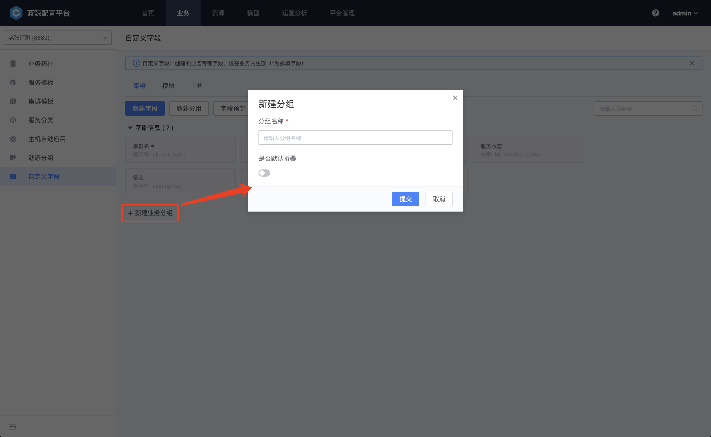
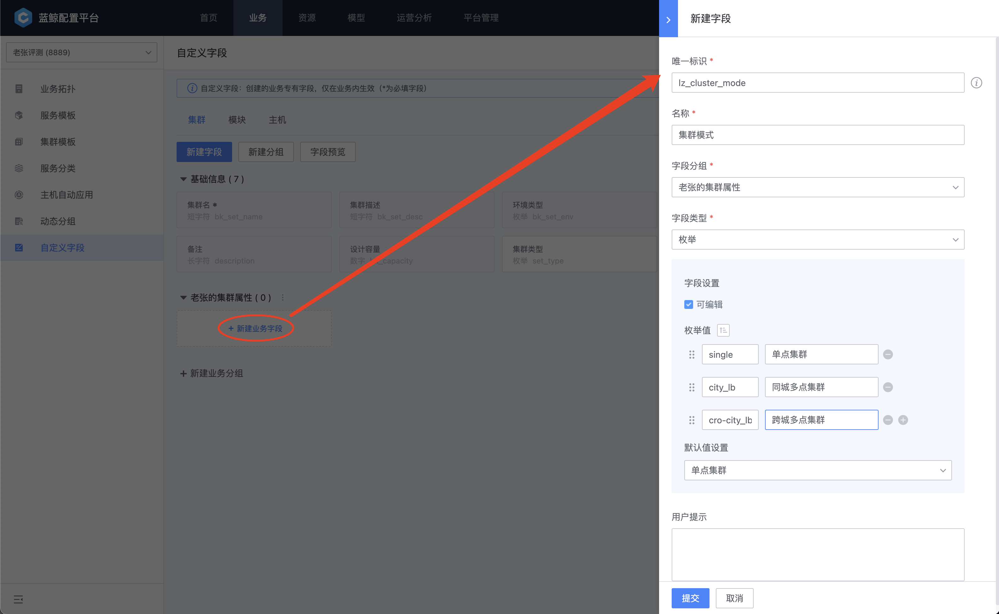

# 自定义字段

您可以根据业务的特性，为业务的每个层级设定必要的字段。

进入“业务-自定义字段”功能，可以用看到当前集群、模块、主机已经存在的字段信息，先创建一个业务分组。

- 分组的默认折叠：当自定义的业务字段并非必填，希望能够尽可能减少打扰，可以打开默认折叠。在编辑、创建节点的时候，将看不到这个分组的属性，需要主动展开编辑。

图1.自定义分组

分组创建完成以后，可以进入创建自定义字段的页面，这里的操作与全局模型配置中一致，需要注意的是唯一标识和名称不可以与现有字段重复。

图2.新建字段

