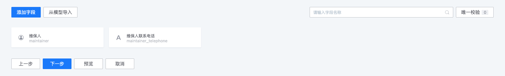
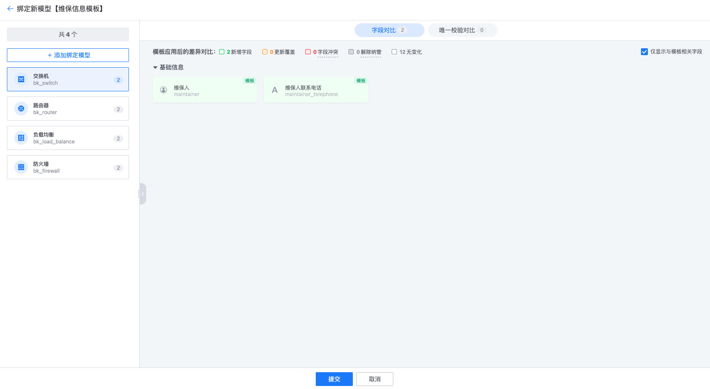
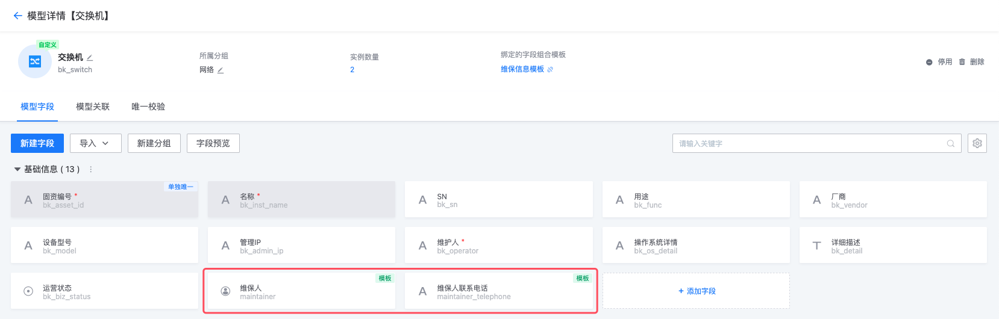

# 字段组合模板

## 功能描述

字段组合模板是一种用于批量管理模型中字段和唯一校验的功能，适用于管理不同模型中相同字段的场景。它能够在模板中设置多个字段和唯一校验，并将其批量应用到模型上。

## 创建字段组合模板

1. 进入“字段组合模板”页面，点击“新建”；

   

2. 填写模板的基础信息；

   

3. 在模板中添加字段或唯一校验，您可以选择“手动添加”或“从模型中的字段直接导入”；

   

4. 保存成功后，您可以直接将模板绑定到模型上；

​	

## 绑定模型

1. 选择需要绑定的模型。选择后，系统会对模板与模型的设置进行对比。若存在“冲突”，说明当前模板的字段或唯一校验设置与模型有不兼容的情况，需要您确认如何进行修改。冲突的情况包括：

   - 字段冲突：
     - 模板字段与模型字段 ID 类型一样，但已经被其他模板绑定
     - 模板字段与模型字段的 ID 一样，但字段类型不一致
     - 模板字段与模型字段的字段名称相同，但字段 ID 不一致
   - 唯一校验冲突：
     - 模板设置的唯一校验规则与模型已存在的规则冲突（关于唯一校验的规则，请点击[此处](https://github.com/TencentBlueKing/bk-cmdb/issues/5240)了解更多）

   

2. 点击提交后，系统将在后台执行绑定任务。绑定成功后，您选择的模型将会拥有模板中设置的字段和规则；

   

## 注意事项

- 您无法删除模型中由字段组合模板添加的字段和唯一校验规则。如不需要这些字段，可通过“解绑模板”操作，但此操作会将模板中的所有字段和唯一校验从模型中移除；
- 当模板中有多个字段或唯一校验规则时，您无法仅绑定其中一个字段或规则到模型上，因为这会给您未来的管理带来困扰；
- 修改模板中的字段并保存后，系统会立即将更改应用到所有绑定的模型上，因为在模板场景下，不及时应用只会增加管理复杂度；
- 当您删除模板中的字段或唯一校验规则后，系统不会在绑定的模型上删除该字段和规则，这些字段和规则后续统一在模型中进行管理；
