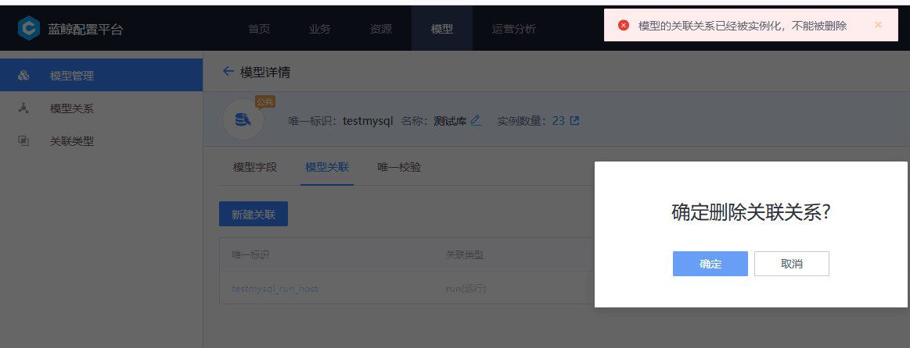

# 模型相关 FAQ
## 常见问题一：配置平台删除模型关联报错“模型的关联关系已经被实例化，不能删除”

**解决方案**
[https://bk.tencent.com/s-mart/community/question/8190?type=answer](https://bk.tencent.com/s-mart/community/question/8190?type=answer)
