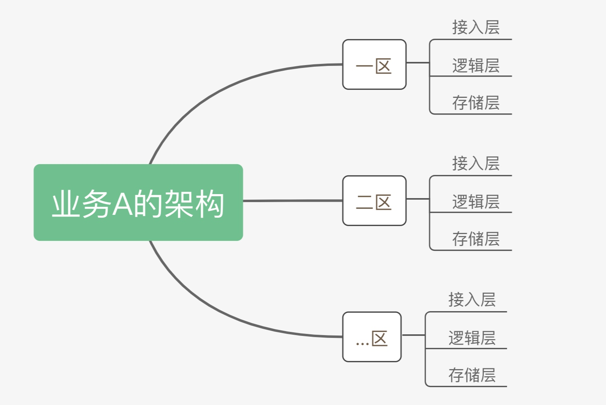

# CMDB 如何管理主机

## 情景

新业务（常见的三层架构：接入层、逻辑层、存储层）上线，需要用 CMDB 管理业务上线依赖的主机资源，便于后续实现发布、变更、故障处理等场景的自动化流程。

## 前提条件

在配置平台中 [新建完业务](../快速入门/case1.md)，并导入主机及将主机分配到业务中。

## 操作步骤

- 梳理业务架构
- 新建集群
- 新建模块
- 使用场景：在作业平台中查询接入层的磁盘使用率

### 梳理业务架构

业务的架构设计最终要体现在 CMDB 的业务拓扑树上，所以我们先梳理业务的架构。

以业务“欢乐游戏( demo )"为例，其架构是常见的三层架构：`接入层` -> `逻辑层` -> `存储层`

为了满足全国各地用户就近接入，按照地域划分了不同的区，但架构一致。

### 新建集群

按照上述业务架构，可将做如下对应：

- 业务中的区 <-> CMDB 中的集群
- 业务中的分层架构 <-> CMDB 中模块

在`业务资源` -> `业务拓扑`中，选中根节点`业务`，新建节点`集群`一区。

创建完成以后，可以在“节点信息”中看到当前集群的属性

> 环境类型：一般保持`正式`；测试环境设置为`测试`，让测试环境的发布流程模板只能选择`测试`集群；

> 服务状态：一般保持`开放`，在某些场景如开区准备的时候，状态可置为`关闭`，让发布系统无法选中；

新建完集群`一区`、`二区`后，可看到如下业务拓扑。

接下来，在集群下创建模块。

### 新建模块

选中`集群`节点，新建模块。

> 服务分类用于标识当前模块的实际功能组件，例如 mysql 组件、Nginx 组件，甚至业务的自定义组件等

创建完成以后，可以在“节点信息”中看到当前模块的详情属性

> 模块类型：一般为`普通`，当模块类型为数据库类时，选择`数据库`
> 
> 主要维护人、备份维护人：该模块维护人，一般在告警推送时会用到；区别在于电话通知时优先`主要维护人`，如果`主要维护人`未接听，自动转`备份维护人`，此处逻辑需要自行实现；

模块创建好了，接下来 [分配主机](../快速入门/case1.md#分配主机到业务空闲机池)，将 `主机资源` -> `主机` 中的资源按照业务架构分配至对应的模块；

### 使用场景：在作业平台中查询接入层的磁盘使用率

通过一个简单的场景，体验 [作业平台](../../../../JOB/3.2/产品白皮书/Introduction/What-is-Job.md) 如何消费主机实例。

media/cmdb_job_consume.mp4

## 扩展阅读

### 蓝鲸内置 SaaS 的 CMDB 消费场景

#### 应用发布、变更：资源编排工具 标准运维

应用发布、变更流程包含版本在多台主机上的文件分发、命令执行等操作，如何优雅的选择这批主机，需要使用 CMDB 的查询主机实例功能。

（在标准运维中一次应用交付的执行历史）

在参数中使用`动态IP`变量，**运维无需关心主机扩缩容、故障替换等场景带来的主机变更**，无需担心漏更新主机或更新错主机。

#### 故障处理：监控、故障自愈

针对业务架构中的某一层级模块（如接入层）设置一个 [告警检测策略](../../../../Monitor/3.3/产品白皮书/functions/conf/rules.md)，无需关心实例的新增、删除及修改。

如何实现实时感知，背后的逻辑是通过 CMDB 的事件推送功能，实时感知实例的新增、修改、删除等动作。

在 故障自愈 中的消费场景也是如此，一个或多个模块的某一个告警，关联对应的处理动作。

#### 平台团队对资源的管控，例如全业务 DBA、AIX SA

以 DBA 为例，需要管控所有 DB，可将运行数据库的主机所属模块的类型设置为`数据库`，然后通过`动态分组`功能查询模块类型为`数据库`的主机。

在 [蓝鲸作业平台](../../../../JOB/3.2/产品白皮书/Introduction/What-is-Job.md) 中可使用该动态分组来选择 DB 主机。

### 三级拓扑不够用，怎么办？新建多级拓扑节点

如果业务架构在大区（`集群`）之上还有一级（平台：如`Android_Weixin`、`Android_QQ`等）。

可在`业务模型`中，`业务`与`集群`间新建一级或多级拓扑

新的业务拓扑如下：

> 注：当前版本新增层级拓扑的生效范围是所有业务，在未来的某一个版本中可调整生效范围；
> 蓝鲸体系在未来的某一个迭代中，将重点弱化业务和细化权限。

### Master DB 和 Slave DB 如何实现物理架构的高可用

两者一定不要放在同一个机架或交换机下，否则机架或交换机掉电，亦或是交换机故障，Master DB 和 Slave DB 都宕机，无法正常切换，导致业务无法对外提供服务。

操作方法：[模型管理] -> [模型] -> [主机] -> [模型字段]，新增`存放机架 ID`、`网络设备 ID`。

此外，配置主机与机架或上联交换机的关联可使用`模型关联`，确保数据的唯一性可设置`唯一校验`，另外`字段分组`可调整 CI 属性的呈现方式。

