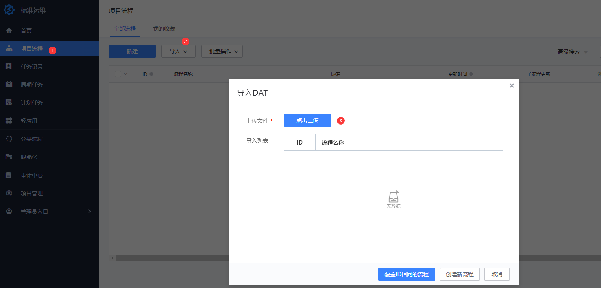
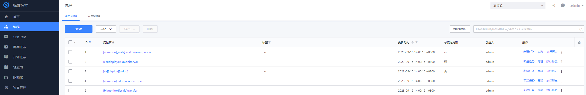

# 监控日志套餐部署

> 该套餐属于蓝鲸社区版增值套餐，请确认基础套餐已经部署完成；如未部署请参考[基础套餐部署](./quick_install.md)

该套餐主要适用于监控告警、日志采集的分析的场景。

主要包含蓝鲸相关产品：监控平台、日志平台

## 前期准备

> 说明：因模块间存在依赖关系，需要按照顺序依次部署： `监控平台 -> 日志平台`。

该套餐部署是通过标准运维流程实现，在部署前需要做如下准备：

### 软件包准备

监控日志套餐的软件包已经合入至基础环境的整包。所以只需要根据该文档进行部署即可。

### 1.准备机器

> 为了更稳定的功能使用，建议生产环境使用跟基础套餐独立的机器资源。

- 建议操作系统： CentOS 7.6
- 建议机器配置
  - 生产环境：建议 8 核 16 G，硬盘 100G 以上（可根据实际情况适当调整配置），机器数量：2 台
  - 功能体验：建议 8 核 16 G，机器数量：1 台

### 2.实现免密

开始部署前，请确保新增主机跟中控机已实现免密。

```bash
ssh-copy-id <ip>
```

### 3.请先前往节点管理，对新增主机进行 agent 安装

- 前往节点管理进行安装，根据图中步骤填写相关信息。


- 安装成功示意图，如果失败请解决报错后再进行重试或者重装。


### 5. 将需要部署产品的标准运维流程模版导入至标准运维

标准运维流程模版 [下载](https://bkopen-1252002024.file.myqcloud.com/ce/1bba77a/bk_sops_co_package-v6.2.1.dat)

**详细步骤：** `打开标准运维 -> 项目流程 -> 导入 -> 点击上传 -> 创建新流程`



假设需要部署的 `监控告警及日志服务套餐包` 已放置中控机的 `/data` 目录 ，`对应套餐包的标准运维流程模版` 已导入至标准运维。导入可参考如下:



### 6.检查 install.config

检查 install.config 文件是否已经包含增强套餐的相关模块分布。如果有请先移除相关模块。

```bash
value_modules=(monitorv3\(influxdb-proxy\) monitorv3\(monitor\) monitorv3\(grafana\) influxdb\(bkmonitorv3\) monitorv3\(transfer\) beanstalk log\(grafana\) log\(api\) kafka\(config\) monitorv3\(unify-query\) monitorv3\(ingester\))

for module in ${value_modules[@]}; do if grep ${module} /data/install/install.config >/dev/null; then echo -e "The \e[1;31m ${module} \e[0m module exists in install.config, please remove it before deploying."; fi; done
```

## 开始部署

### 监控平台

**注意：** 社区版 6.2 后的版本全新部署默认是轻量化版本，如需在生产环境下使用，请切换成完整版进行部署或者在部署完成后按照 [监控平台运行模式切换](../../MaintenanceManual/DailyMaintenance/bkmonitorv3_run_mode.md) 进行切换。

选择 `[ce][deploy][bkmonitorv3]` 流程模版进行新建任务，根据提示填写相关信息。确认填写信息无误后，开始执行任务。

填写信息包括：

- `ctrl_ip`：基础环境的中控机 IP
- `deply_iplist`：新增的机器 IP（如果基础环境的资源有富余，可以复用）

该部署流程主要相关操作：

- 生成监控平台 install.config 配置
- 初始化新增节点机器
- 授权监控平台所需的 MySQL 访问权限
- 安装监控相关依赖、监控平台后台、监控平台 SaaS

### 日志平台

选择 `[ce][deploy][bklog]` 流程模版进行新建任务，根据提示填写相关信息。确认填写信息无误后，开始执行任务。

填写信息包括：

- `ctrl_ip`：基础环境的中控机 IP
- `deply_iplist`：新增的机器 IP（如果基础环境的资源有富余，可以复用）

该部署流程主要相关操作：

- 生成日志平台 install.config 配置
- 初始化新增节点机器
- 授权日志平台所需的 MySQL 访问权限
- 安装日志平台相关依赖、日志平台后台、日志平台 SaaS

