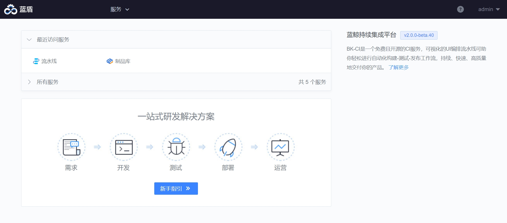

# 持续集成套餐 2.0 安装指引

## 概述

本文档适用于在蓝鲸社区版基础套餐中加装蓝鲸持续集成套餐。

蓝鲸持续集成套餐分为 流水线（CI，也称为“蓝盾”）、制品库（Repo）、代码检查（CodeCC）等 3 个系统。

## 流水线（CI）
### 资源准备

请按照如下清单准备服务器或虚拟机（暂不支持容器），用于正式部署持续集成套餐。

机器数量： 2 （一台用作服务端，一台用作公共构建机（ ci(dockerhost) ），请勿复用蓝鲸基础套餐机器）<br>
要求操作系统： CentOS 7.X （请勿使用其他系统）<br>
建议硬件配置：8 核 32GB （测试环境可使用 16GB 内存，性能略低）<br>
磁盘大小：100GB

### 准备工作
#### 蓝鲸组件依赖

请先安装蓝鲸社区版 6.2 基础环境。并安装 “权限中心”，“节点管理”，“标准运维”等 SaaS （安装完成可在蓝鲸工作台“应用列表”中看到）。

如果您没有部署监控日志套餐，则默认不会安装 `es7`，需在中控机检查 es7 并安装：

```bash
cd "${CTRL_DIR:-/data/install}"
./bkcli status es7   # 检查es7是否安装并启动。应该显示为active。
./bkcli install es7  # 安装 es7
./bkcli start es7    # 启动 es7
```

#### 描述部署拓扑
> **提醒**
>
> 从 `v1.2.x` 系列版本升级的用户，请更新 `install.config` 文件。

编辑 install.config，指示 ci 的安装拓扑。参考示例：（请修改 IP1 等为合适的 IP）

```bash
# 服务端(网关+微服务), 单节点要求最低配置8核16G. 后期可升级节点硬件配置或分散微服务到不同节点.
IP1 ci(gateway)
IP1 ci(artifactory),ci(auth),ci(dispatch),ci(dispatch-docker),ci(environment)
IP1 ci(image),ci(log),ci(misc),ci(notify)
IP1 ci(openapi),ci(plugin),ci(process),ci(project),ci(quality)
IP1 ci(repository),ci(store),ci(ticket),ci(websocket)
# 可选的无编译环境. 资源开销较dockerhost低, 可以和服务端混合部署. 如无则无法使用"无编译环境".
IP1 ci(agentless)
# 可选的公共构建机. 至少1台, 按需新增. 建议16核32G内存500GB磁盘.
IP2 ci(dockerhost)
# 私有构建机无需配置install.config, 默认仅支持Linux系统, 其他系统需参考官网文档完成实施.
```

如需修改配置，请编辑中控机的 `$CTRL_DIR/bin/03-userdef/ci.env` 文件。然后重新执行流程。

#### 配置 ssh 免密

在中控机使用 `./configure_ssh_without_pass` 脚本配置 ssh 免密登录。

#### 安装 gse agent

登录蓝鲸 PaaS，打开“节点管理”。点击“agent 管理”界面下的“安装 Agent”按钮，安装“CI 主机”到 《`蓝鲸`》 业务下。如中控机未安装，需一并安装。 

节点管理会自动注册 CMDB。安装成功后，在 CMDB 首页搜索“中控机”及“新增的 CI 主机”的 IP，搜索结果中对应 IP 的“业务拓扑”应当以“蓝鲸”开头。

#### yum 源

部署过程中会自动安装 `jq`，此软件来自 EPEL 仓库。请确保 CI 主机已经配置了 EPEL 仓库。

#### 离线环境部署（可选）

部署流程中，会自动在中控机联网下载资源，如果中控机网络受限，可自行下载后传输到预期路径。 

资源列表如下：
1. CI 安装包（以 `v2.0.4` 为例，其他版本请自行替换版本号）：
  * 预期放置路径： `/data/src/bkci-v2.0.4-slim.tar.gz`
  * 参考下载地址（蓝鲸官网）： [bkci-v2.0.4-slim.tar.gz](https://bkopen-1252002024.file.myqcloud.com/bkci/bkci-v2.0.4-slim.tar.gz)，此文件的 MD5 值为：`ca1dbb2bbe493ca640969c39424ca4b6`
  * 参考下载地址（GitHub）： [bkci-v2.0.4-slim.tar.gz](https://github.com/TencentBlueKing/bk-ci/releases/download/v2.0.4/bkci-slim.tar.gz) （注意修改为预期放置路径的文件名）
2. rabbitmq_delayed_message_exchange 插件 （版本固定，不能修改）：
 * 预期放置路径: `/data/src/rabbitmq_delayed_message_exchange-3.8.0.ez`
 * 参考下载地址： [rabbitmq_delayed_message_exchange-3.8.0.ez](https://github.com/rabbitmq/rabbitmq-delayed-message-exchange/releases/download/v3.8.0/rabbitmq_delayed_message_exchange-3.8.0.ez)

### 快速部署 BKCI
1. **导入标准运维流程模板**

进入“标准运维”，选择《`蓝鲸`》业务，导入 [部署流程模板](https://bkopen-1252002024.file.myqcloud.com/bkci/bkci-deploy-202411111447.dat) 。
2. **执行部署**


选择 " [蓝鲸持续集成] [CI]部署或升级流水线” 模板新建任务
>填写蓝鲸中控机 IP 及版本号。版本号填写 **v2.0.4**
流程中会自动下载重命名安装包，也可手动下载安装包，并传输到中控机上，确保文件路径为 /data/src/bkci-版本号-slim.tar.gz，可自动跳过下载步骤。
如果出现异常，请查看具体步骤的报错，故障排除后可直接重试对应的步骤。

### 访问蓝盾

请配置 DNS 系统或本地 hosts 文件。将 `BK_CI_FQDN` 解析到 `ci（gateway）` 所在的 IP。

我们在部署结果中提示了访问链接及参考的 hosts 内容。请查看部署流程中 “集群初始配置” 步骤中的“job 任务链接”，在 console 输出的末尾显示访问的域名及 IP。

完成域名解析后，即可在蓝鲸工作台打开“蓝盾”。



相关链接：
* [快速入门](../../../../../ZH/Devops/2.0/UserGuide/Quickstarts/Link-your-first-repo.md)
* [产品白皮书](../../../../../ZH/Devops/2.0/UserGuide/intro/README.md)
* [BKCI Docs](https://docs.bkci.net/)
* [常见问题](../../../../../ZH/Devops/2.0/UserGuide/Reference/faqs/README.md)
* [部署详解](./CI-V2.md)
* [日常维护](../../../../../ZH/DeploymentGuides/6.2/EnhancePackageMaintenance/BKCI/Maintenance.md)
* [私有构建机方案](../../../../../ZH/DeploymentGuides/6.2/EnhancePackageMaintenance/BKCI/Private-build-setup.md)

## 蓝盾制品库 Repo 部署指南

本章节适用于在蓝鲸社区版（二进制方式部署）6.2版本 基础套餐中加装蓝鲸持续集成-制品库（Repo）服务

### 资源准备

请按照如下清单准备服务器或虚拟机（暂不支持容器），用于正式部署 Repo 服务。要求如下

- 机器数量： 2（请勿复用蓝鲸基础套餐机器）
- 要求操作系统： CentOS 7.X （请勿使用其他系统）
- 建议硬件配置：8 核 16GB （测试环境可使用 8GB 内存，性能略低）
- 磁盘大小：100GB

### 准备工作

#### 蓝鲸组件依赖

请先安装蓝鲸社区版 6.2 基础环境。并安装 “权限中心”，“节点管理”，“标准运维”等 SaaS （安装完成可在蓝鲸工作台“应用列表”中看到）。

#### 描述部署拓扑

- 编辑 install.config，指示 repo 的安装拓扑。参考示例：（请修改 IP3/IP4 等为合适的 IP）
```bash
## 服务端(网关+微服务), 单节点要求最低配置 8 核 16 G. 后期可升级节点硬件配置或分散微服务到不同节点。请勿与部署 ci(gateway) 机器复用
IP3 repo(gateway)
IP4 repo(auth),repo(generic),repo(repository),repo(replication),repo(job)
```
- 如需修改配置，请编辑中控机的 `$CTRL_DIR/bin/03-userdef/repo.env` 文件。然后重新执行流程。

#### 配置 ssh 免密

在中控机使用 `./configure_ssh_without_pass` 脚本配置 ssh 免密登录。

#### 安装 gse agent

- 蓝鲸 PaaS，打开 “节点管理” 。点击 “agent 管理” 界面下的 “安装 Agent” 按钮，安装 “Repo 主机” 到 《`蓝鲸`》 业务下。如中控机未安装，需一并安装
- 节点管理会自动注册 CMDB。安装成功后，在 CMDB 首页搜索 “中控机” 及 “新增的 Repo 主机” 的 IP，搜索结果中对应 IP 的 “业务拓扑” 应当以 “蓝鲸” 开头

#### yum 源
部署过程中会自动安装 `jq`，此软件来自 EPEL 仓库。请确保 CI 主机已经配置了 EPEL 仓库。

#### 离线环境部署（可选）
部署流程中，需要提前下载资源，下载完毕后传输到中控机指定路径。

资源列表如下：
1. Repo 安装包（蓝盾6.2版本，对应制品库需使用 `v1.3.24-rc.2` 版本）：
    - 预期放置路径： `/data/src/bkrepo_ce-v1.3.24-rc.2.tar.gz`
    - 下载地址：[bkrepo_ce-v1.3.24-rc.2.tar.gz](https://bkopen-1252002024.file.myqcloud.com/bkrepo/bkrepo_ce-v1.3.24-rc.2.tar.gz)
    - 请提前下载这个包到中控机/data/src目录下

### 快速部署

1. 导入标准运维流程模板
    - 进入“标准运维”，选择《`蓝鲸`》业务，下载并导入 [部署流程模板文件](https://bkopen-1252002024.file.myqcloud.com/bkrepo/bkrepo-deploy-20241108150307.dat)，此文件 MD5 值为：`689b667d835e8f1326268a8a9ac97dea` 

2. 执行部署
    - 从模板 “[蓝鲸持续集成][REPO]部署制品库” 新建任务
    - 直接点击下一步。（初次部署勾选全部步骤，后续按需取消）
    - 填写 `蓝鲸中控机IP (${bk_controller_ip})` 中控机IP
    - 填写 `制品库版本包Version版本号 (${TARGET_REPO_VERSION})`，值为：`v1.3.24-rc.2`
    - 填写 `制品库版本包Repo Md5值 (${TARGET_REPO_MD5SUM})`，值为：`2b508fff8e444ddd1eb852d5eb77b364`
    - 如果出现异常，请查看具体步骤的报错，故障排除后可直接重试对应的步骤

### 访问制品库

- 请配置 DNS 系统或本地 hosts 文件。将 `BK_REPO_FQDN` 解析到 `repo(gateway)` 所在的 IP。如配置 `$BK_REPO_GATEWAY_IP0` `$BK_REPO_FQDN`到本机 hosts 文件
- 域名解析后，即可在蓝盾主页的服务中，打开制品库

## 流水线插件
蓝鲸精选了一批流水线插件，可以提供更多的能力。更多插件请探索 https://github.com/orgs/TencentBlueKing/repositories?q=ci 。

### 插件信息表
二进制环境中无法直接通过 作业平台 传输文件，故暂未提供对接 作业平台 的插件。相关改造计划请关注： https://github.com/TencentBlueKing/bk-ci/issues/9450

| 代号（atomCode）          | 插件名称        | 描述                                                                                                                                                                                  |
| ------------------------- | --------------- | ------------------------------------------------------------------------------------------------------------------------------------------------------------------------------------- |
| uploadArtifact            | 归档构件        | 本插件将构建机本地的文件归档至流水线仓库或自定义仓库，对产出物进行归档                                                                                                                |
| uploadReport              | 归档报告        | 可将构建机上的 html 报告归档，同时发送邮件出来                                                                                                                                        |
| downloadArtifact          | 拉取构件        | 将制品库中的文件拉取到构建机上，支持拉取流水线仓库或自定义仓库                                                                                                                        |
| checkout                  | Checkout        | checkout 插件为蓝盾平台提供基本的 git 拉取操作，可以拉取所有的 git 仓库                                                                                                               |
| run                       | RunScript       | Execute the script plugin. Support cross-system use.                                                                                                                                  |
| sendEmail                 | sendEmail       | Send email to any one                                                                                                                                                                 |
| SubPipelineExec           | 子流水线调用    | 以同步/异步的方式启动运行指定的项目下的流水线                                                                                                                                         |
| AcrossProjectDistribution | 跨项目推送构件  | 跨项目上传构件至其他项目自定义仓库                                                                                                                                                    |
| CodeCCCheckAtom           | CodeCC 代码检查 | 支持 Linux、MacOS、Windows 系统下执行所有 CodeCC 代码检查工具，包括代码缺陷（bkcheck 等）、安全漏洞（敏感信息、高危组件等）、代码规范（CppLint、CheckStyle 等）、圈复杂度、重复率等。 |

### 下载插件部署脚本
请在中控机执行以下命令
```bash
mkdir ~/bin
curl -sSf https://bkopen-1252002024.file.myqcloud.com/bkci/bkci-atom-install.sh -o ~/bin/bkci-atom-install.sh
chmod +x ~/bin/bkci-atom-install.sh
```

### 部署插件
此操作只能新建插件，每个插件只能上传一次，如果重复执行会报错 `{status": 2100001, "message": "系统内部繁忙，请稍后再试", …}`。

后续如需更新插件，请访问 “蓝盾” —— “研发商店” —— “工作台” 界面，在列表中找到对应插件选择 “升级” 操作。

请在 **中控机** 执行如下命令进行部署：
``` bash
cd ~/bin
./bkci-atom-install.sh
```

## 蓝盾代码检查CodeCC部署指南

本文档适用于在蓝鲸社区版（二进制方式部署）6.2 版本 基础套餐中加装蓝鲸持续集成-代码检查（CodeCC）服务

### 资源准备

请按照如下清单准备服务器或虚拟机（暂不支持容器），用于正式部署代码检查（CodeCC）服务。要求如下

- 机器数量： 2
- 要求操作系统： CentOS 7.X （请勿使用其他系统）
- 建议硬件配置：8 核 32GB （测试环境可使用 16GB 内存，性能略低）
- 磁盘大小：100GB

### 准备工作

#### 蓝鲸组件依赖

请先安装蓝鲸社区版 6.2 基础环境。并安装 “权限中心”，“节点管理”，“标准运维” 等 SaaS （安装完成可在蓝鲸工作台 “应用列表” 中看到）。

#### 描述部署拓扑

- 编辑 install.config，指示 codecc 的安装拓扑。参考示例：（请修改 IP5/IP6 等为合适的 IP）
```bash
# 服务端(网关+微服务), 单节点要求最低配置8核16G. 后期可升级节点硬件配置或分散微服务到不同节点.
IP5 codecc(gateway)
IP6 codecc(asyncreport),codecc(codeccjob),codecc(defect)
IP6 codecc(quartz),codecc(report),codecc(schedule),codecc(task)
```
- 如需修改配置，请编辑中控机的 `$CTRL_DIR/bin/03-userdef/codecc.env` 文件。然后重新执行流程。

#### 配置 ssh 免密

在中控机使用 `./configure_ssh_without_pass` 脚本配置 ssh 免密登录。

#### 安装 gse agent

- 蓝鲸 PaaS，打开 “节点管理” 。点击 “agent 管理” 界面下的 “安装 Agent” 按钮，安装 “CodeCC 主机” 到 《`蓝鲸`》 业务下。如中控机未安装，需一并安装
- 节点管理会自动注册 CMDB。安装成功后，在 CMDB 首页搜索 “中控机” 及 “新增的 CodeCC 主机” 的 IP，搜索结果中对应 IP 的 “业务拓扑” 应当以 “蓝鲸” 开头

#### 离线环境部署（可选）
部署流程中，需要提前下载资源，下载完毕后传输到中控机指定路径。

资源列表如下：
1. Repo 安装包（蓝盾6.2版本，对应制品库需使用 `v2.1.1` 版本）：
    - 预期放置路径： `/data/src/bkcodecc-v2.1.1-slim.tar.gz`
    - 下载地址：[bkcodecc-v2.1.1-slim.tar.gz](https://bkopen-1252002024.file.myqcloud.com/bkcodecc/bkcodecc-v2.1.1-slim.tar.gz)，此文件 MD5 值为：`8abd8f3cb22594d0297dfceb81fd9203`
    - 请提前下载这个包到中控机/data/src目录下

### 快速部署

1. 导入标准运维流程模板
    - 进入“标准运维”，选择《`蓝鲸`》业务，下载并导入 [部署流程模板文件](https://bkopen-1252002024.file.myqcloud.com/bkcodecc/bkcodecc-deploy-20240417101432.dat)，此文件 MD5 值为：`3a40cbce0932e455e7a602abb1f8f437`

2. 执行部署
    - 从模板`[蓝鲸持续集成][CodeCC]部署或升级代码检查`新建任务
    - 直接点击下一步。（初次部署勾选全部步骤，后续按需取消）
    - 填写 `蓝鲸中控机 IP (${bk_controller_ip})` 中控机IP
    - 填写 `CodeCC 版本号 (${TARGET_CODECC_VERSION})`，值为：`v2.1.1`
    - 填写 `安装模式 (${INSTALL_MODE})`，使用默认值，`分批滚动更新（多实例时服务不中断）`
    - 填写 `下载链接模板 (${CODECC_DOWNLOAD_URL_FMT})`，保持值不变
    - 填写 `CTRL_DIR (${CTRL_DIR})`，保持值不变
    - 如果出现异常，请查看具体步骤的报错，故障排除后可直接重试对应的步骤

### 访问代码检查（CodeCC）服务

- 请配置 DNS 系统或本地 hosts 文件。将 `$BK_CODECC_FQDN` 解析到 `codecc(gateway)` 所在的 IP。如配置 `$BK_CODECC_GATEWAY_IP0` `$BK_CODECC_FQDN` 到本机 hosts 文件
- 域名解析后，即可在蓝盾主页的服务中，打开代码检查（CodeCC）服务
