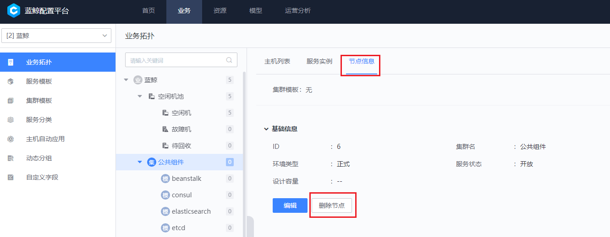

# 作业平台运行模式切换

> 该文档适用于社区版 6.2.1 作业平台运行模式的切换

## 确认运行模式

首先，请确认当前环境上是以哪种模式运行，再根据当前运行的模式选择对应的切换方案。

lite 代表轻量化， stable 代表完整版。

```bash
source $CTRL_DIR/utils.fc
echo $BK_JOB_RUN_MODE
```

## 轻量化 (lite) 切换至完整版 (stable)

### 修改运行标识

```bash
if  [[ -f "$CTRL_DIR/bin/03-userdef/job.env" ]];then
    if grep -q "BK_JOB_RUN_MODE" "$CTRL_DIR/bin/03-userdef/job.env"; then
        sed -i "s#BK_JOB_RUN_MODE=.*#BK_JOB_RUN_MODE=stable#g" "$CTRL_DIR/bin/03-userdef/job.env"
    else
        echo "BK_JOB_RUN_MODE=stable" >> $CTRL_DIR/bin/03-userdef/job.env
    fi
else
    echo "BK_JOB_RUN_MODE=stable" >> $CTRL_DIR/bin/03-userdef/job.env
fi
```

### 重新渲染变量

```bash
./bkcli install bkenv
./bkcli sync common
```

### 停进程清文件

停止原来的服务进程  并清理服务进程相关文件

- 停进程

    ```bash
    pcmd -m job "systemctl disable --now bk-job-gateway.service bk-job-assemble.service"
    ```

- 清文件

    ```bash
    # 清理服务进程相关文件
    pcmd -m job "rm -rvf /etc/sysconfig/bk-job-* /usr/lib/systemd/system/bk-job-* && systemctl daemon-reload"
    ```

### 重新部署 JOB

```bash
./bkcli install job
```

### 启动 JOB

```bash
./bkcli start job
./bkcli check job
```

### 重建 topo

该操作主要是为了解决在服务切换后，避免产生主机服务进程的告警 (如果有部署监控平台)

#### 开启允许删除原拓扑结构

```bash
source $CTRL_DIR/utils.fc
curl -H 'BK_USER:admin' -H 'BK_SUPPLIER_ID:0' -H 'HTTP_BLUEKING_SUPPLIER_ID:0' -X POST $BK_CMDB_IP0:9000/migrate/v3/migrate/system/user_config/blueking_modify/true 

# 预期返回内容
{
     "result": true,
     "bk_error_code": 0,
     "bk_error_msg": "success",
     "permission": null,
     "data": "modify system user config success"
}
```

#### Web 页面删除拓扑接口



#### 删掉所有的蓝鲸集群模板与进程模板

```bash
source $CTRL_DIR/utils.fc && /opt/py36/bin/python ${CTRL_DIR}/bin/create_blueking_set.py -c ${BK_PAAS_APP_CODE}  -t ${BK_PAAS_APP_SECRET} --delete
```

#### 替换进程模版主机与服务的关联

```bash
sed -i 's/"job": \[.*\]/"job": \["job-config", "job-crontab", "job-execute", "job-gateway", "job-logsvr", "job-manage", "job-backup", "job-analysis"\]/' $CTRL_DIR/bin/create_blueking_set.py
```

#### 重建拓扑

```bash
./bkcli initdata topo
```

## 完整版 (stable) 切换至轻量化 (lite)

### 修改运行标识

```bash
if  [[ -f "$CTRL_DIR/bin/03-userdef/job.env" ]];then
    if grep -q "BK_JOB_RUN_MODE" "$CTRL_DIR/bin/03-userdef/job.env"; then
        sed -i "s#BK_JOB_RUN_MODE=.*#BK_JOB_RUN_MODE=lite#g" "$CTRL_DIR/bin/03-userdef/job.env"
    else
        echo "BK_JOB_RUN_MODE=lite" >> $CTRL_DIR/bin/03-userdef/job.env
    fi
else
    echo "BK_JOB_RUN_MODE=lite" >> $CTRL_DIR/bin/03-userdef/job.env
fi
```

### 重新渲染变量

```bash
./bkcli install bkenv
./bkcli sync common
```

### 停进程清文件

停止原来的服务进程  并清理服务进程相关文件

- 停进程

    ```bash
    pcmd -m job "systemctl disable --now bk-job-gateway.service bk-job-execute.service bk-job-backup.service bk-job-logsvr.service bk-job-crontab.service bk-job-config.service bk-job-analysis.service bk-job-manage.service"
    ```

- 清文件

    ```bash
    # 清理服务进程相关文件
    pcmd -m job "rm -rvf /etc/sysconfig/bk-job-* /usr/lib/systemd/system/bk-job-* && systemctl daemon-reload"
    ```

### 重新部署 JOB

```bash
./bkcli install job
```

### 启动 JOB

```bash
./bkcli start job
./bkcli check job
```

### 重建 topo

#### 开启允许删除原拓扑结构

```bash
source $CTRL_DIR/utils.fc
curl -H 'BK_USER:admin' -H 'BK_SUPPLIER_ID:0' -H 'HTTP_BLUEKING_SUPPLIER_ID:0' -X POST $BK_CMDB_IP0:9000/migrate/v3/migrate/system/user_config/blueking_modify/true 

# 预期返回内容
{
     "result": true,
     "bk_error_code": 0,
     "bk_error_msg": "success",
     "permission": null,
     "data": "modify system user config success"
}
```

#### Web 页面删除拓扑接口


#### 删掉所有的蓝鲸集群模板与进程模板

```bash
source $CTRL_DIR/utils.fc && /opt/py36/bin/python ${CTRL_DIR}/bin/create_blueking_set.py -c ${BK_PAAS_APP_CODE}  -t ${BK_PAAS_APP_SECRET} --delete
```

#### 替换进程模版主机与服务的关联

主要是为了解决在服务切换后，避免产生主机服务进程的告警 (`如果有部署监控平台`)

```bash
sed -i 's/"job": \[.*\]/"job": \["job-gateway", "job-assemble"\]/' $CTRL_DIR/bin/create_blueking_set.py
```

#### 重建拓扑

```bash
./bkcli initdata topo
```
