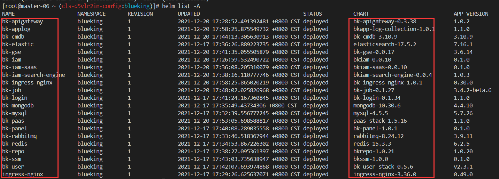

>本文简单介绍了容器化版相关说明，同时详细介绍了容器化版蓝鲸各产品、组件和 release、charts 包的说明，以及各个服务对应 pod 的主要功能，建议在部署容器化版前，阅读此篇文章，对容器化版蓝鲸有大致的了解，以便理解容器化整体的形态及部署过程遇到某个流程异常的排查。


# 部署前须知
>目前只支持 CentOS 7.X

## 容器化蓝鲸基本认识
1. 容器化蓝鲸对应的版本号是 7.0，相较于 6.X 最大的区别主要是部署方式的改变，6.X 是二进制部署。
2. 容器化版蓝鲸不是简单的拉起一个镜像 Docker run，平台涉及多个自研模块及诸多开源组件，是基于 K8S 改造的全平台容器化形态
3. 容器化版蓝鲸的搭建部署、运行维护需要一定的容器知识基础，包括不限于 Docker、K8S、helm 等；
4. 蓝鲸智云 7.0 容器化部署流程


## 一些有用的相关文档分享
- [K8S 官方文档](https://kubernetes.io/zh/docs/home/)
- [helm 官方文档](https://helm.sh/zh/docs/)
- [了解 helmfile](https://cloud.tencent.com/developer/article/1766822)
- [kubectl 命令](https://kubernetes.io/docs/reference/generated/kubectl/kubectl-commands)
- [Docker 官方文档](https://docs.docker.com/get-started/)
- [chart 仓库介绍](http://www.coderdocument.com/docs/helm/v2/charts/intro_to_charts.html)
- K8S 基本概念快速预览
	- **Master**: k8s 的主控组件，对应的对象是 node。
	- **Node**: 是 k8s 集群的机器节点，相当于 master-node。一个 node 就对应一个具体的物理机或者虚拟机。
	- **Container**: 是一个镜像容器，一个 container 是一个镜像实例
	- **Pod**: 是 k8s 集群的最小单元，一个 pod 可以包含一个或者多个 container
	- **Service**: 多个相同的 pod 组成一个服务，统一对外提供服务。
	- **Volume**: 存储卷，pod 对外暴露的共享目录，它可以挂载在宿主机上，这样就能让同 node 上多个 pod 共享一个目录。
	- **Replication Controller**: 用于控制 pod 集群的控制器，可以制定各种规则来让它控制一个 service 中的多个 pod 的创建和消亡, 很多地方简称为 rc。
	- **Namespace**: 命名空间，用于将一个 k8s 集群隔离成不同的空间，pod, service, rc, volume 都可以在创建的时候指定其 namespace。
	- **StatefulSet**: 有状态集群，比如一个主从的 mysql 集群就是有状态集群，需要先启动主再启动从，这就是一种有状态的集群。
	- **Persistent Volume**: 持久存储卷。之前说的 volume 是挂载在一个 pod 上的，多个 pod(非同 node)要共享一个网络存储，就需要使用持久存储卷，简称为 pv。
	- **Persistent Volume Claim**: 持久存储卷声明。他是为了声明 pv 而存在的，一个持久存储，先申请空间，再申明，才能给 pod 挂载 volume，简称为 pvc。
	- **Label**: 标签。我们可以给大部分对象概念打上标签，然后可以通过 selector 进行集群内标签选择对象概念，并进行后续操作。
	- **Secret**: 私密凭证。密码保存在 pod 中其实是不利于分发的。k8s 支持我们创建 secret 对象，并将这个对象打到 pod 的 volume 中，pod 中的服务就以文件访问的形式获取密钥。
	- **EndPoint**: 用于记录 service 和 pod 访问地址的对应关系。只有 service 配置了 selector, endpoint controller 才会自动创建 endpoint 对象

## 容器化版蓝鲸 release & charts 对应概览



## 开源组件部分说明

从开源的 bitnami 仓库拿 charts 包 https://charts.bitnami.com/bitnami 以及本地的 charts 包 `~/bkhelmfile/blueking/charts`：

``` plain
00-storage-mysql.yaml.gotmpl
00-storage-rabbitmq.yaml.gotmpl
00-storage-redis.yaml.gotmpl
00-storage-mongodb.yaml.gotmpl
00-storage-elasticsearch.yaml.gotmpl
```


## 蓝鲸自研产品模块说明
从蓝鲸的 bkrepo 仓库 https://hub.bktencent.com/chartrepo/blueking 以及本地的 charts 包 /bkhelmfile/blueking/charts

### PaaS 平台

#### release: bk-panel

#### chart: blueking/bk-panel

| pod | 描述 |
| -- | -- |
| bk-panel-web-* | 工作台主进程 |
| bk-panel-migrate | 工作台初始化 DB |

#### release: bk-ssm

#### chart: blueking/bkssm

| pod | 描述 |
| -- | -- |
| bkssm-* | 由蓝鲸 PaaS 平台开发的 AccessToken 统一管理服务，主要提供 AccessToken 的全生命周期管理功能 |

#### release：bk-auth
#### chart：blueking/bkauth
| pod | 描述 |
| -- | -- |
| bkauth-* | BKAuth 是由蓝鲸 PaaS 平台开发的认证服务，主要提供 AppSecret 集中认证和 OAuth2.0 用户认证授权等功能 |

| job | 描述 |
| -- | -- |
| bkauth-access-key-sync-* | 每隔 10 分钟，自动增量同步 open_paas 库里的 AppCode/AppSecret |

### PaaS3.0 开发者中心

#### release: bk-paas

#### chart: blueking/bkpaas3

| 进程名称 | 功能 |
| -- | -- |
| bkpaas3-webfe-web | PaaS 项目的前端，通过 Nginx 托管静态页面 |
| bkpaas3-apiserver-web | PaaS 主控模块，提供 API 服务 |
| bkpaas3-apiserver-worker | apiserver 后台任务进程 |
| bkpaas3-apiserver-deleting-instances | 清理已解除绑定的增强服务实例,每半小时执行一次 |
| bkpaas3-apiserver-update-pending-status | 更新长久未结束的部署任务状态，每半个小时执行一次 |
| bkpaas3-apiserver-migrate-db | 初始化 apiserver 模块 DB，并创建 bkreop 仓库和 bucket |
| bkpaas3-apiserver-init-data | 初始化数据 |
| bkpaas3-apiserver-init-devops | 初始化运行时 |
| bkpaas3-apiserver-init-npm | 初始化应用开发 NPM 包，可不开启 |
| bkpaas3-apiserver-init-pypi | 初始化应用开发 Pypi 包，可不开启 |
| bkpaas3-engine-worker | PaaS 的持续部署控制器，负责和后端 K8S 交互 |
| bkpaas3-engine-web | engine 后台任务进程 |
| bkpaas3-engine-migrate-db | 初始化 apiserver 模块 DB |
| bkpaas3-engine-initial-fixtures | 初始化数据 |
| bkpaas3-engine-generate-initial-cluster-state | 初始化应用集群信息 |
| bkpaas3-engine-clean-timeout-slug-pod | 清理超时的构建任务 |
| bkpaas3-svc-bkrepo-web | bkrepo 增强服务主进程 |
| bkpaas3-svc-bkrepo-migrate-db | 初始化 svc-bkrepo 模块 DB |
| bkpaas3-svc-mysql-web | MySQL 增强服务主进程 |
| bkpaas3-svc-mysql-migrate-db | 初始化 svc-mysql 模块 DB |
| bkpaas3-svc-mysql-deleting-instances | 清理已删除的 MySQL 增强服务实例，每半个小时执行一次 |
| bkpaas3-svc-rabbitmq-web | RabbitMQ 增强服务主进程 |
| bkpaas3-svc-rabbitmq-migrate-db | 初始化 svc-rabbitmq 模块 DB |
| bkpaas3-svc-rabbitmq-deleting-instances | 清理已删除的 RabbitMQ 增强服务实例，每半个小时执行一次 |

#### release: bk-applog

#### chart: blueking/bkapp-log-collection

蓝鲸应用日志采集旨在将所有应用日志统一采集到 ElasticSearch 中，包含三类日志：
- 应用容器标准输出
- 应用自定义 JSON 日志
- 应用接入层访问日志

| pod | 描述 |
| -- | -- |
| bkapp-log-collection-bkapp-filebeat-ingress | 采集访问日志的 filebeat 进程 |
| bkapp-log-collection-bkapp-filebeat-json | 采集结构化日志的 filebeat 进程 |
| bkapp-log-collection-bkapp-filebeat-stdout | 采集标准输出日志的 filebeat 进程 |
| bkapp-log-collection-bkapp-logstash | logstash 进程 |


#### release: bk-ingress-nginx

#### chart: blueking/bk-ingress-nginx

| pod | 描述 |
| -- | -- |
| bk-ingress-nginx-* | 为蓝鲸 APP 的 Ingress controller |

### 配置平台

#### release: bk-cmdb

#### chart: blueking/bk-cmdb

蓝鲸配置平台（蓝鲸 CMDB）是一个面向资产及应用的企业级配置管理平台。
BK-CMDB 由 15 个服务组成

| pod | 描述 |
| -- | -- |
| bk-cmdb-synchronizeserver-* | 数据同步功能服务 |
| bk-cmdb-webserver-* | Web 服务管理，用户登录管理等 |
| bk-cmdb-apiserver-* | API 网关；负责 API 路由，用户鉴权等 |
| bk-cmdb-taskserver-* | 所有异步任务管理，包括执行、状态管理等 |
| bk-cmdb-operationserver-* | 运营统计功能管理：数据统计，图表管理等 |
| bk-cmdb-coreservice-* | 核心原子接口管理服务，直接与 Mongodb 交互 |
| bk-cmdb-eventserver-* | 事件订阅管理、事件生成管理、事件推送管理等 |
| bk-cmdb-datacollection-* | 主机快照管理、中间件数据采集管理、设备采集管理 |
| bk-cmdb-cloudserver-* | 云资源管理：包括云主机同步、云区域管理、云帐户管理等 |
| bk-cmdb-adminserver-* | 自动升级管理、配置管理、权限视图管理、权限数据同步等 |
| bk-cmdb-cacheservice-* | 缓存服务管理、资源事件流管理。直接与 Mongodb/Redis 交互 |
| bk-cmdb-authserver-* | 与权限相关的功能管理，包括：鉴权、有权限资源查询、IAM 资源回调 |
| bk-cmdb-procserver-* | 服务模板管理、进程模板、服务分类管理、服务实例管理、进程实例管理、进程同步管理等 |
| bk-cmdb-toposerver-* | 业务管理，主线拓扑管理，模型管理、模型实例管理、模型关联关系管理、模型实例关联关系管理 |
| bk-cmdb-hostserver-* | 主机相关服务管理：包括主机 CRUD、主机转移、主机属性自动应用、云区域管理、动态分组管理等 |

### 管控平台

#### release: bk-gse-ce

#### chart: blueking/bk-gse-ce

| pod | 描述 |
| -- | -- |
| bk-gse-ce-api-* | 蓝鲸管控平台 API 服务，对外暴露用户所需要的主要接口 |
| bk-gse-ce-config-* | 蓝鲸管控平台配置服务，主要用于数据通道的配置录入和应用 |
| bk-gse-ce-task-* | 蓝鲸管控平台任务服务, 管理集群内 Agent 节点路由和会话，提供针对管控节点的任务下发执行能力 |
| bk-gse-ce-btsvr-* | 蓝鲸管控平台文件通道服务，负责内部文件的 BT 传输、组网等 |
| bk-gse-ce-data-* | 蓝鲸管控平台数据传输服务，主要提供数据汇聚、分类、流转能力 |
| bk-gse-ce-procmgr-* | 蓝鲸管控平台进程管理服务，提供针对管控节点进程的托管、启停等操作能力 |
| bk-gse-ce-syncdata-* | 蓝鲸管控平台主机身份同步服务，主要负责管控节点的主机身份数据同步，为蓝鲸监控提供主机的基础数据支持 |
| bk-gse-ce-alarm-* | 蓝鲸管控平台内部告警事件服务，用于管控节点 Agent 失联告警上报等 |
| bk-gse-ce-dba-* | 蓝鲸管控平台数据库代理服务，提供 Redis 的内部分片、路由能力，供内部其他服务模块进行数据的读写 |


### 作业平台

#### release: bk-job

#### chart: blueking/bk-job

https://github.com/Tencent/bk-job/blob/master/docs/overview/architecture.md

| pod | 描述 |
| -- | -- |
| bk-job-analysis-* | 统计分析微服务，为首页异常作业提示与运营分析模块提供后台接口，调度大量定时任务从其他微服务模块获取元数据进行分析与统计，生成分析结果数据与统计数据，为 bk-job 提供运营数据支撑、提高平台易用性。 |
| bk-job-backup-* | 备份管理微服务，负责 bk-job 中的作业导入导出及作业执行流水历史数据的定期归档任务。 |
| bk-job-crontab-* | 定时任务微服务，基于 Quartz 定时引擎，实现 bk-job 的定时任务调度与管理。 |
| bk-job-execute-* | 作业执行微服务，对接蓝鲸 GSE，负责向 GSE 提交文件分发/脚本执行任务、拉取任务日志、流转任务状态。 |
| bk-job-file-gateway-* | 文件网关微服务，通过与 FileWorker 通信对接多种不同类型的第三方文件源（如对象存储、文件系统存储等），负责调度文件源文件下载任务，与执行引擎配合完成第三方文件源文件分发。 |
| bk-job-file-worker-0 | 文件源接入点，独立于其他 bk-job 后台微服务的可扩展模块，可部署多个实例，与文件网关进行通信，对接不同类型的第三方文件源，是文件下载任务的执行者。 |
| bk-job-frontend-* | 存放前端页面相关的 html、JS、CSS、静态资源等文件，由 Nginx 提供前端请求服务。 |
| bk-job-gateway-* | 微服务网关，负责认证、限流、请求路由等。 |
| bk-job-logsvr-* | 日志管理微服务，对接底层 MongoDB，负责存储脚本执行、文件分发及文件源文件下载过程中产生的日志。 |
| bk-job-manage-* | 作业管理微服务，负责管理作业平台中的多种资源，具体包含脚本、账号、作业模板、执行方案、消息通知、全局设置等。 |

### 用户管理

#### release: bk-user

#### chart: blueking/bk-user

| pod | 描述 |
| -- | -- |
| bk-user-login | 统一登录主进程 |
| bk-login-migrate-db | 初始化 login 模块 DB |
| bk-user-saas | 用户管理前端 |
| bk-user-saas-migrate-db | 初始化前端模块 DB |
| bk-user-api-web | 用户管理 API 模块主进程 |
| bk-user-api-worker | 用户管理 API 后台任务进程 |
| bk-user-api-beat | 用户管理 API 模块周期任务 |
| bk-user-api-migrate-db | 初始化用户管理 API 模块 |

### 权限中心

bkiam 是由蓝鲸 PaaS 平台开发的权限中心服务，主要提供统一鉴权, 统一权限管理功能。
#### release: bk-iam

#### chart: blueking/bkiam

权限中心后台是 bkiam 的核心服务, 提供鉴权服务, 权限模型注册, 鉴权策略管理等功能

| pod | 描述 |
| -- | -- |
| bk-iam-redis-master-0 | 权限中心后台，用于数据缓存 |
| bkiam-* | 权限中心后台，处理鉴权、模型注册相关请求 |

#### release: bk-iam-saas

#### chart: blueking/bkiam-saas

权限中心 SaaS 是用于管理权限的 web 端, 提供了统一的权限管理, open api 等功能

| pod | 描述 |
| -- | -- |
| bk-iam-saas-redis-master-0 | 权限中心 SaaS，用于数据缓存 |
| bkiam-saas-beat-* | 权限中心 SaaS，web 服务，权限数据管理 |
| bkiam-saas-web-* | 权限中心 Celery，处理 SaaS 的后台任务 |
| bkiam-saas-worker-* | 权限中心 Celery beat，处理权限中心 SaaS 的定时任务 |

#### release: bk-iam-search-engine

#### chart: blueking/bkiam-search-engine

蓝鲸权限中心检索引擎（bk-iam-search-engine）对接 蓝鲸权限中心后台, 同步全局策略信息, 进行分析及索引, 提供接口用于优化权限申请/查看相关的用户体验。

| pod | 描述 |
| -- | -- |
| bkiam-search-engine-0 | 权限中心 subjects 查询引擎，处理 SaaS 查询有权限的 subjects 列表 |

### API 网关

#### release: bk-apigateway

#### chart: blueking/bk-apigateway

bk-apigateway 是由蓝鲸 PaaS 平台开发的 API 网关服务，主要提供请求代理、请求策略控制等功能。

| pod | 描述 |
| -- | -- |
| bk-apigateway-api-support-fe-* | 帮助中心前端 |
| bk-apigateway-api-support-web-* | 帮助中心 web 服务 |
| bk-apigateway-apigateway-* | 帮助中心 web 服务 |
| bk-apigateway-bk-esb-web-* | esb web 服务 |
| bk-apigateway-caddy-* | esb 配置服务 |
| bk-apigateway-dashboard-beat-* | 网关管理任务定时进程 |
| bk-apigateway-dashboard-celery-* | 网关管理任务进程 |
| bk-apigateway-dashboard-fe-* | 网关管理前端 |
| bk-apigateway-dashboard-web-* | 网关管理 web 服务 |

### 制品库

#### release: bk-repo

#### chart: blueking/bkrepo

| pod | 描述 |
| -- | -- |
| bk-repo-bkrepo-auth-* | 制品库权限模块 |
| bk-repo-bkrepo-docker-* | 制品库 docker 镜像仓库 |
| bk-repo-bkrepo-gateway-* | 制品库网关模块 |
| bk-repo-bkrepo-generic-* | 制品库通用包管理模块 |
| bk-repo-bkrepo-helm-* | 制品库 helm 包仓库模块 |
| bk-repo-bkrepo-npm-* | 制品库 npm 包仓库模块 |
| bk-repo-bkrepo-pypi-* | 制品库 pypi 包管理模块 |
| bk-repo-bkrepo-repository-* | 制品库仓库管理模块 |

### 容器管理平台

#### release: bcs-services

#### chart: blueking/bcs-services-ce

- bcs-services-ce

| 模块名 | 模块能力 | 是否必须 |
| -- | -- | -- |
| bcs-api-gateway | BCS API 网关，提供托管集群 apiserver 接口的转发、BCS 各微服务接口的自动发现和转发的能力 | 是 |
| bcs-alert-manager | BCS 事件采集告警模块，依赖监控中心 | 否 |
| bcs-cluster-manager | BCS 集群管理模块，提供集群及集群节点增删改、跨云托管集群的能力 | 是 |
| bcs-storage | 集群资源缓存模块，由托管集群的 bcs-k8s-watch 模块进行数据采集，提供集群资源增删查的能力 | 是 |
| bcs-user-manager | BCS 用户权限管理模块，负责用户及其访问 BCS 接口权限的管理 | 是 |
| cert-manager | 证书管理工具，自动生成 BCS 后台组件进行 ssl 通信的自签名证书（切勿在生产环境使用） | 否 |


- bcs-k8s-ce

| 模块名 | 模块能力 | 是否必须 |
| -- | -- | -- |
| bcs-gamedeployment-operator | 针对游戏 gameserver 实现增强版无状态应用 operator | 否 |
| bcs-gamestatefulset-operator | 针对游戏 gameserver 实现增强版有状态部署 operator | 是（在 BCS 后台集群） |
| bcs-hook-operator | BcsHook-Operator 处理应用扩缩容和发布更新过程中的各种 hook 操作，支持 webhook 和 prometheus 两种 hook 类型，是 GameDeployment 和 GameStatefulSet 的依赖组件 | 否 |
| bcs-k8s-watch | 集群资源上报模块，监听上报集群内资源，供 bcs-storage 进行缓存 | 是 |
| bcs-kube-agent | BCS 代理，与 bcs-cluster-manager 通信，负责被托管集群 apiserver 接口上报，以及跨云 websocket 链接建立 | 是 |
| bcs-webhook-server | BCS webhook server，提供随机 hostport、镜像预加载能力 | 否 |


### 监控日志套餐

#### release: bk-monitor

#### chart: blueking/bk-monitor

| pod | 描述 |
| -- | -- |
| bk-monitor-alarm-access-data-* | 时序型告警策略数据拉取任务分发进程 |
| bk-monitor-alarm-access-event-* | 事件型告警拉取任务分发进程 |
| bk-monitor-alarm-access-event-worker-* | 事件型告警拉取任务 celery worker 进程 |
| bk-monitor-alarm-access-real-time-data-* | 实时告警数据拉取任务分发进程 |
| bk-monitor-alarm-action-cron-worker-* | 套餐动作执行相关定时任务 celery worker 进程 |
| bk-monitor-alarm-action-worker-* | 套餐动作执行 celery worker 进程 |
| bk-monitor-alarm-alert-* | 告警处理任务分发进程 |
| bk-monitor-alarm-alert-worker-* | 告警处理任务执行 celery worker 进程 |
| bk-monitor-alarm-api-cron-worker-* | 部分接口定时缓存 celery worker 进程 |
| bk-monitor-alarm-beat-* | 告警后台定时任务 celery beat |
| bk-monitor-alarm-composite-* | 关联告警处理任务执行进程 |
| bk-monitor-alarm-converge-* | 套餐动作汇总任务分发进程 |
| bk-monitor-alarm-converge-worker-* | 套餐动作汇总任务执行 celery worker 进程 |
| bk-monitor-alarm-cron-worker-* | 告警后台定时任务 celery worker 进程 |
| bk-monitor-alarm-detect-* | 数据检测算法判断任务分发进程 |
| bk-monitor-alarm-fta-action-* | 告警动作执行任务分发进程 |
| bk-monitor-alarm-fta-action-worker-* | 套餐动作执行相关定时任务分发 celery worker 进程 |
| bk-monitor-alarm-image-worker-* | 图表生成任务 celery worker 进程 |
| bk-monitor-alarm-nodata-* | 无数据检测进程 |
| bk-monitor-alarm-report-cron-worker-* | 运营数据上报进程 |
| bk-monitor-alarm-service-worker-* | access 及 detect 任务执行 celery worker 进程 |
| bk-monitor-alarm-trigger-* | 告警触发条件判断进程 |
| bk-monitor-api-* | api 服务进程 |
| bk-monitor-healthz-* | 自监控进程 |
| bk-monitor-influxdb-proxy-* | influxdb-proxy 负责 influxdb 的直接写入和查询 |
| bk-monitor-ingester-* | 故障自愈事件接入模块 |
| bk-monitor-prom-agg-gateway-* | 进程指标聚合上报网关 |
| bk-monitor-transfer-default-* | 监控链路传输组件，负责从 kafka 消费数据并写入到 ES/influxdb |
| bk-monitor-unify-query-* | 时序数据查询模块，底层支持 PromQL 的查询，需要配合 influxdb-proxy 一起工作 |
| bk-monitor-web-* | web 进程，提供监控访问页面 |
| bk-monitor-web-beat-* | web 的 celery beat 进程，分发定时任务 |
| bk-monitor-web-metrics-* | 同 web 进程，提供给 servicemonitor 进行指标采集 |
| bk-monitor-web-worker-* | web 的 celery worker 进程，执行异步任务 |
| bk-monitor-web-worker-resource-* | web 页面异步操作 worker |


#### release: bkmonitor-operator

#### chart: blueking/bkmonitor-operator-stack

| pod | 描述 |
| -- | -- |
| bkmonitor-operator-bkmonitorbeat-daemonset-* | 用于在各个 node 上采集该 node 上的 endpoint 指标数据，默认最高会占用 0.5 核 和 1GB 内存，deamonset 的部署会依赖 gse agent，主机上未安装 gse agent，会导致 deamonset 启动失败 |
| bkmonitor-operator-kube-state-metrics-* | 用于采集 k8s 集群自身指标信息 |
| bkmonitor-operator-operator-deployment-* | 用于调度各个采集器的采集任务 |
| bkmonitor-operator-system-collect-* | 用于采集系统指标和日志信息 |


## 日志平台

#### release: bk-logsearch

#### chart: blueking/bk-log-search

| pod | 描述 |
| -- | -- |
| bk-logsearch-bk-log-api-* | 对外 API 服务 |
| bk-logsearch-bk-log-async-worker-* | 异步导入导出任务，由于日志比较大，暂用内存会比较多，所以独立出来用来支持日志的导入导出。 |
| bk-logsearch-bk-log-grafana-* | 为 grafana 页面提供 API 服务 |
| bk-logsearch-bk-log-migrate-* | 是一个一次性的 Job，用来提供 mysql 的数据库变更操作 |
| bk-logsearch-bk-log-search-[ops]worker-* | pipeline 的工作进程，流程相关的 worker 进程，用来执行流程任务。比如日志提取功能会用到 |
| bk-logsearch-bk-log-web-* | 应用 saas 服务,用来提供页面展示 |
| bk-logsearch-bk-log-web-beat-* | saas 服务的定时任务，celery 中的 beat 服务 |
| bk-logsearch-bk-log-web-worker-* | saas 服务用来执行异步任务的工作 pod，用来执行 celery 中异步任务 |


#### release: bklog-collector

#### chart: blueking/bk-log-collector

| pod | 描述 |
| -- | -- |
| bklog-collector-bk-log-collector-* | 用于在各个 node 上采集该 node 上的组件输出和系统日志信息 |
