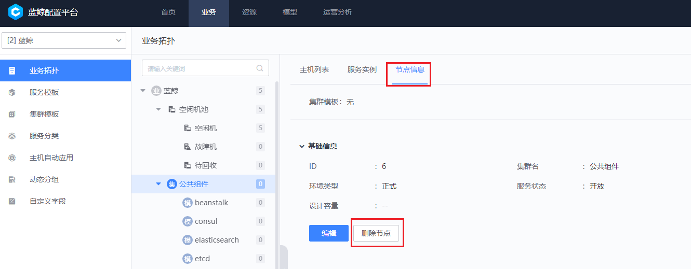

# 6.1.2-7.0 升级指引

## 说明

1. 本次升级方案为`停服更新`，升级时间较长，请避开业务繁忙期间进行升级。
2. 请仔细阅读本升级文档，并严格按照文档步骤进行操作，避免因未注意相关细节造成误操作。
3. 本升级方案所阐述的路径目录均以蓝鲸默认路径为例，如有更改，请以实际为主。
4. 此方案只适用于蓝鲸基础套餐、增强套餐升级，不包括 BCS、CI 等增强包升级。
5. 由于二进制的开发框架 2.0 与容器化的开发框架 3.0 不一致，所以请在完成相关的 SaaS 改造后再进行升级。
6. 升级前，请先阅读 [二进制升级容器化 SaaS 迁移改造](how-to-transformate-saas-from-paasv2.md)。
   - 由于二进制与容器化使用的开发框架不一致，所以在升级前需将环境上的 SaaS 进行改造后才能在容器化环境部署起来。
7. 由于升级涉及多个环境，请在执行相关命令前，确认所执行的环境是否正确，避免误操作产生问题。

## 升级版本核对

### 工具版本

|名称|版本|备注|
|---|---|---|
|helm|v3.7.2||
|helmfile|v0.142.0||
|yq|v4.30.6||

### 蓝鲸版本

|名称|chart 版本|APP 版本|备注|
|---|---|---|---|
|bk-apigateway        |bk-apigateway-0.4.48       |1.1.32||
|bk-applog            |bkapp-log-collection-1.1.2 |1.1.0||
|bk-auth              |bkauth-0.0.9               |0.0.10||
|bk-cmdb              |bk-cmdb-3.11.17            |3.10.21||
|bk-console           |bk-console-0.1.0           |0.1.0||
|bk-elastic           |elasticsearch-17.5.4       |7.16.2||
|bk-gse               |bk-gse-ce-2.0.10           |2.0.10||
|bk-iam               |bkiam-0.1.15               |1.11.9||
|bk-iam-saas          |bkiam-saas-0.1.31          |1.8.24||
|bk-iam-search-engine |bkiam-search-engine-0.0.13 |1.0.6||
|bk-ingress-nginx     |bk-ingress-nginx-1.0.2     |0.30.0||
|bk-job               |bk-job-0.2.6               |3.5.1||
|bk-log-search        |bk-log-search-4.3.5        |4.3.5||
|bk-monitor           |bk-monitor-3.6.76          |3.6.3062||
|bk-nodeman           |bk-nodeman-2.2.27          |2.2.27||
|bk-paas              |bkpaas3-0.1.4-beta2.1        |0.1.4-beta1||
|bk-rabbitmq          |rabbitmq-8.24.12           |3.9.11||
|bk-redis             |redis-15.3.3               |6.2.5||
|bk-redis-cluster     |redis-cluster-7.4.6        |6.2.6||
|bk-repo              |bkrepo-1.1.25              |1.1.25||
|bk-ssm               |bkssm-1.0.5                |0.1.0||
|bk-user              |bk-user-1.3.5              |v2.4.2||
|bk-zookeeper         |zookeeper-9.0.4            |3.8.0||
|bklog-collector      |bk-log-collector-0.0.9     |7.3.1||
|bcs-services-stack|bcs-services-stack-1.27.0|v1.27.0||
|bk_sops|-|3.25.12||
|bk_its|-|2.6.2||
|bkmonitor-operator|bkmonitor-operator-stack-3.6.21|3.6.0||

## 升级前准备

### Kubernetes 集群准备

请按照蓝鲸官网文档中心的部署前置工作，准备 [Kubernetes 集群环境](../7.0/prepare.md)。如已有集群，请忽略该步骤。

### 准备部署升级文件

#### 蓝鲸容器化部署脚本

请在 Kubernets master 机器上下载部署脚本、Agent 包、SaaS 包至 ~/bkhelmfile/ 目录

```bash
curl -sSf https://bkopen-1252002024.file.myqcloud.com/ce7/7.0-stable/bkdl-7.0-stable.sh | bash -s -- -ur latest base
curl -sSf https://bkopen-1252002024.file.myqcloud.com/ce7/7.0-stable/bkdl-7.0-stable.sh | bash -s -- -ur latest saas
```

#### 升级所需文件

请将升级相关文件放置二进制环境中控机的 /data 目录

| 文件名                     | 下载地址                                                 | MD5  | 备注                           |
| -------------------------- | -------------------------------------------------------- | ---- | ------------------------------ |
| generate_bk_custom_yaml.sh |https://bkopen-1252002024.file.myqcloud.com/ce7/f662142/generate_bk_custom_yaml.sh|f6621425905143294c69102f7f19850c| 升级容器化自定义 yaml 生成脚本 |
| iam_ignore_migrate.sql     |https://bkopen-1252002024.file.myqcloud.com/ce7/0605ba0/iam_ignore_migrate.sql|0605ba0d42bc8a5b0d752ead89156af9| 权限中心 SQL 标记文件          |
| upgrader.properties        |https://bkopen-1252002024.file.myqcloud.com/ce7/cff7d89/upgrader.properties|cff7d899b853c9027e2d9030ed229503| 作业平台迁移模板文件           |
| upgrader-3.5.0.12.jar      |https://bkopen-1252002024.file.myqcloud.com/ce7/feb8de8/upgrader-3.5.0.12.jar|feb8de8fcf7bb07645ba7c299633c707| 作业平台迁移 jar 包            |

### 安装 helm helmfile

由于蓝鲸容器化部署依赖 helm、helmfile、yq，所以请确保 Kubernets master 机器上是否具备需要的依赖，如已存在请忽略该步骤，但请注意其对应版本。

工具版本列表请参考上述 [工具版本](#工具版本)，如版本不一致，请确认获取的部署脚本是否为最新的。

```bash
cp -a ~/bkhelmfile/bin/helmfile ~/bkhelmfile/bin/helm ~/bkhelmfile/bin/yq /usr/local/bin/ && chmod +x /usr/local/bin/helm*
tar xf ~/bkhelmfile/bin/helm-plugin-diff.tgz -C ~/
```

### 生成容器化部署自定义文件

- 二进制环境下操作

    ```bash
    # 执行脚本,生成容器化相关配置文件
    bash /data/generate_bk_custom_yaml.sh -t ce -d /data/install
    
    # 检查生成的文件
    [root@localhosts data]# tar tf /data/custom_yaml.tgz
    ./app_secret.yaml
    ./bkapigateway-custom-values.yaml.gotmpl
    ./bkconsole-custom-values.yaml.gotmpl
    ./bkgse-ce-custom-values.yaml.gotmpl
    ./bkiam-saas-custom-values.yaml.gotmpl
    ./bklog-search-custom-values.yaml.gotmpl
    ./bkmonitor-custom-values.yaml.gotmpl
    ./bknodeman-custom-values.yaml.gotmpl
    ./bkpaas3-custom-values.yaml.gotmpl
    ./bkuser-custom-values.yaml.gotmpl
    ./custom.yaml
    
    # 推送文件到 kubernetes master 机器上，请注意替换 kubernetes_master_host 为实际的机器IP
    kubernetes_master_host=<127.0.0.1>
    rsync -avgz /data/custom_yaml.tgz root@$kubernetes_master_host:/data/
    ```

- 容器化中控机操作

    解压之前，请确认生成的自定义文件中，在容器化环境 `~/bkhelmfile/blueking/environments/default/` 目录下是否已存在同名文件，如果已存在，请将 `~/bkhelmfile/blueking/environments/default/` 与 `/data/tmp/` 的同名文件内容进行合并，避免直接拷贝导致原自定义文件内容被覆盖。

    ```bash
    install -d /data/tmp
    
    tar xf /data/custom_yaml.tgz -C /data/tmp
    cp -a /data/tmp/* ~/bkhelmfile/blueking/environments/default/
    ```

### 删除原二进制蓝鲸拓扑

- 此步骤只针对蓝鲸业务拓扑中，不存在自定义层级、自定义服务模板的场景，如遇自定义升级的场景，请用户根据自身情况进行处理
- 升级过程中会删除蓝鲸业务下的业务拓扑，服务模板与集群模板
- 该步骤主要规避在升级后，原蓝鲸业务拓扑不适用于容器化环境，进而产生误告警的问题

#### 转移主机

将蓝鲸业务下的所以机器转移至【空闲机池】

#### 删除原蓝鲸业务拓扑

1. 开启蓝鲸业务拓扑删除入口

    ```bash
    # 二进制中控机执行
    source /data/install/utils.fc
    curl -H 'BK_USER:admin' -H 'BK_SUPPLIER_ID:0' -H 'HTTP_BLUEKING_SUPPLIER_ID:0' -X POST $BK_CMDB_IP0:9000/migrate/v3/migrate/system/user_config/blueking_modify/true
    ```

2. 前往 Web 页面删除蓝鲸业务拓扑

    

3. 删除蓝鲸业务下的集群模版和服务模版

    ```bash
    # 中控机执行
    /opt/py36/bin/python ${CTRL_DIR}/bin/create_blueking_set.py -c ${BK_PAAS_APP_CODE}  -t ${BK_PAAS_APP_SECRET} --delete
    ```

## 停服务

### 下架所有 SaaS

访问开发者中心，下架所有 SaaS

### 停止后台服务

```bash
echo paas cmdb job appo appt bknodeman bkmonitorv3 bkssm bkiam usermgr bklog gse paas_plugins | xargs -n1 ./bkcli stop

# 观察进程是否已经停止，如果没有停止，可手动强制停止
echo paas cmdb job appo appt bknodeman bkmonitorv3 bkssm bkiam usermgr bklog gse paas_plugins | xargs -n1 ./bkcli status
```

## 备份数据

下述备份方式仅供参考，备份均在二进制环境操作。

### 备份 MySQL

- 登录至 MySQL 机器，创建备份目录

    ```bash
    source /data/install/utils.fc
    ssh $BK_MYSQL_IP

    # 创建备份目录
    source /data/install/utils.fc
    mkdir -p /data/dbbak
    ```

- 生成备份脚本

    ```bash
    cd /data/dbbak
    
    cat >dbbackup_mysql.sh <<\EOF
    #!/bin/bash
    
    ignoredblist='information_schema|mysql|test|db_infobase|performance_schema|sys'
    
    dblist="$(mysql --login-path=default-root -Nse "show databases;"|grep -Ewv "$ignoredblist"|xargs echo)"
    
    mysqldump --login-path=default-root --skip-opt --create-options --default-character-set=utf8mb4 -R  -E -q -e --single-transaction --no-autocommit --master-data=2 --max-allowed-packet=1G  --hex-blob  -B  $dblist > /data/dbbak/bk_mysql_alldata.sql
    EOF
    ```

- 开始备份

    ```bash
    # 执行备份操作，并检查导出是否正确
    bash dbbackup_mysql.sh && grep 'CREATE DATABASE' bk_mysql_alldata.sql
    ```

### 备份 MongoDB

- 登录至 MongoDB 机器

    ```bash
    source /data/install/utils.fc
    ssh $BK_MONGODB_IP

    # 创建备份目录
    install -d /data/mongodb_bak
    ```

- 开始备份

    ```bashbash
    source /data/install/utils.fc
    mongodump --host $BK_MONGODB_IP -u $BK_MONGODB_ADMIN_USER -p $BK_MONGODB_ADMIN_PASSWORD --oplog --gzip --out /data/mongodb_bak
    ```

## 数据库相关操作

1. 所有操作均在二进制环境执行
2. 执行 IAM 特殊操作

    ```bash
    # 上传文件 iam_ignore_migrate.sql 到中控的 /data 目录
    mysql --login-path=mysql-default < /data/iam_ignore_migrate.sql
    ```

3. 授权 k8s 集群访问二进制数据库

    ```bash
    # 登录至 MySQL 机器
    source /data/install/utils.fc
    ssh $BK_MYSQL_IP
    
    source /data/install/utils.fc
    
    # 请注意替换授权主机列表 $KUBERNETES_CLUSTER_IPLIST
    # KUBERNETES_CLUSTER_IPLIST 可使用该命令在容器化环境获取：kubectl get nodes -o wide | awk 'NR>1{print $6}'| tr '\n' ' '
    hosts=($KUBERNETES_CLUSTER_IPLIST)
    
    # 授权 root 用户访问
    for i in ${hosts[@]};do /data/install/bin/grant_mysql_priv.sh -n default-root -u $BK_MYSQL_ADMIN_USER  -p $BK_MYSQL_ADMIN_PASSWORD -H $i;done
    
    # 授权 PaaS 用户访问
    for app in bk_iam bk_itsm bk_log_search bk_monitorv3 bk_nodeman bk_sops bk_user_manage; do mysql --login-path=default-root -e "GRANT SELECT, INSERT, UPDATE, DELETE, CREATE, DROP, REFERENCES, INDEX, ALTER, CREATE TEMPORARY TABLES, EXECUTE, CREATE VIEW, SHOW VIEW, CREATE ROUTINE, ALTER ROUTINE ON \`$app\`.* to 'paas'@'%' identified by \"$BK_PAAS_MYSQL_PASSWORD\" with grant option;"; done;
    
    # 授权 bkmonitor 用户访问
    for i in ${hosts[@]};do /data/install/bin/grant_mysql_priv.sh -n default-root -u $BK_MONITOR_MYSQL_USER -p $BK_MONITOR_MYSQL_PASSWORD -H $i;done
    
    # 授权 apigw 用户访问
    for i in ${hosts[@]};do /data/install/bin/grant_mysql_priv.sh -n default-root -u $BK_APIGW_MYSQL_USER -p $BK_APIGW_MYSQL_PASSWORD -H $i;done
    ```

4. 新增数据库操作

    ```bash
    for db in bk_login bkauth bkiam bkiam_saas bk_apigateway bk_esb bk_user_api bk_user_saas bkpaas3_engine bkpaas3_apiserver bkpaas3_svc_mysql bkpaas3_svc_bkrepo bkpaas3_svc_rabbitmq bkpaas3_svc_otel bklog_grafana; do
        mysql --login-path=default-root -e "CREATE DATABASE IF NOT EXISTS $db CHARACTER SET utf8;"
    done
    ```

5. 修改 esb_app_account 表中 bk_monitorv3 记录的 app_token，如果与 paas_app 记录的不一致，需要做 update 操作

    ```bash
    # MySQL 机器执行，检查记录是否一致
    mysql --login-path=default-root -e "select app_token from open_paas.esb_app_account where app_code='bk_monitorv3';"
    mysql --login-path=default-root -e "select auth_token from open_paas.paas_app where code='bk_monitorv3';"

    # 如果不一致，需要与 paas_app 表中记录的 auth_token 保持一致
    auth_token=$(mysql --login-path=default-root -e "select * from open_paas.paas_app where code='bk_monitorv3'\G" | grep auth_token | awk '{print $2}')

    mysql --login-path=default-root -e "update open_paas.esb_app_account set app_token='$auth_token' where app_code='bk_monitorv3';"
    ```

6. 修改用户管理的 app_code

    ```bash
    mysql --login-path=default-root -e "update open_paas.paas_app set code='bk_usermgr' where code='bk_user_manage';"
    ```

7. 修改数据库上 SaaS 的 MySQL 地址

    由于原 SaaS 的记录是 mysql-default.service.consul ，迁移至容器化时会导致无法解析 consul，所以将其更改为 IP 的连接方式以确保更改后，容器化环境也可以正常连接数据库。

    ```bash
    # 查看涉及的记录
    mysql --login-path=default-root -e  "select app_code,db_host from open_paas.paas_app_secureinfo;"
    
    mysql --login-path=default-root -e "update open_paas.paas_app_secureinfo set db_host=REPLACE(db_host,'mysql-default.service.consul','$BK_MYSQL_IP') where db_host like '%service.consul%';"
    
    # 确认是否修改成功
    mysql --login-path=default-root -e "select app_code,db_host from open_paas.paas_app_secureinfo;"
    ```

8. 修改权限中心名称

    ```bash
    mysql --login-path=default-root -e "update open_paas.paas_app set name='权限中心' where code='bk_iam';"
    ```

9. 修改节点管理插件是否自动拉起，默认只有 bkmonitorbeat 是自动拉起的，其余保持关闭

    ```bash
    mysql --login-path=default-root -e "update bk_nodeman.node_man_gseplugindesc set auto_launch='0' where name!='bkmonitorbeat';"
    
    # 检查 auto_launch 是否都为 0
    mysql --login-path=default-root -e "select name,auto_launch from bk_nodeman.node_man_gseplugindesc where name!='bkmonitorbeat';"
    ```

### MongoDB 数据库操作

1. bkrepo 相关信息获取方式，容器化环境上获取：

    - BKREPO_DATABASE：`yq ea '. as $item ireduce ({}; . * $item )' ~/bkhelmfile/blueking/environments/default/{values,custom}.yaml | yq ea '.bkrepo.externalMongodb.database'`

    - BKREPO_USERNAME：`yq ea '. as $item ireduce ({}; . * $item )' ~/bkhelmfile/blueking/environments/default/{values,custom}.yaml | yq ea '.bkrepo.externalMongodb.username'`

    - BKREPO_PASSWORD：`yq ea '. as $item ireduce ({}; . * $item )' ~/bkhelmfile/blueking/environments/default/{values,custom}.yaml | yq ea '.bkrepo.externalMongodb.password'`

2. 在 mongodb 上创建 bkrepo 相关信息

    ```bash
    # 二进制环境操作
    source /data/install/utils.fc
    ssh $BK_MONGODB_IP
    
    # BKREPO 的变量请使用上述步骤 1 获取的实际进行替换。
    source /data/install/utils.fc
    /data/install/bin/add_mongodb_user.sh -i mongodb://$BK_MONGODB_ADMIN_USER:$BK_MONGODB_ADMIN_PASSWORD@$LAN_IP:27017/admin -d ${BKREPO_DATABASE} -u ${BKREPO_USERNAME} -p ${BKREPO_PASSWORD}
    ```

## 同步证书文件

- 同步 JOB 机器上的证书

```bash
# 二进制环境中控机执行
for c in gse_job_api_client.keystore gse_job_api_client.truststore job_server.truststore job_server.p12; do rsync -avgz root@$BK_JOB_IP:/data/bkce/cert/$c /data/src/cert/; done
```

- 将中控机上的 `/date/src/cert` 目录同步至容器化环境下的  `environments/default`  目录

```bash
# 同步至容器化 master 机器，请注意替换为实际的IP
KUBERNETES_MASTER_IP=<127.0.0.1>
rsync -avgz /data/src/cert root@$KUBERNETES_MASTER_IP:~/bkhelmfile/blueking/environments/default/

#  容器化 Master 机器确认与二进制的证书数量一致
ls ~/bkhelmfile/blueking/environments/default/cert/
```

## 修改容器化环境 docker 配置

```yaml
# 容器化环境执行
# 请确保 DOCKER_PATH 这个变量的值在 Kubernetes 集群内所有节点上的 docker 路径都是一致的，否则将会影响 SaaS 的日志采集。该值请以实际的为主。
DOCKER_PATH=$(docker info  | awk -F": " '/Docker Root Dir/{print $2"/containers"}') yq -i '.paas.platformFilebeat.containersLogPath = strenv(DOCKER_PATH)' ~/bkhelmfile/blueking/environments/default/custom.yaml

DOCKER_PATH=$(docker info  | awk -F": " '/Docker Root Dir/{print $2"/containers"}') yq -i '.apps.bkappFilebeat.containersLogPath = strenv(DOCKER_PATH)' ~/bkhelmfile/blueking/environments/default/custom.yaml
```

## 部署 StorageClasses

- 如果使用的是 TKE 集群或者已有集群均存在 StorageClasses，可忽略 `部署 StorageClasses` 的所有步骤。
- 创建 StorageClasses

    ```bash
    cd ~/bkhelmfile/blueking
    helmfile -f 00-localpv.yaml.gotmpl sync
    
    # 确认
    kubectl get sc
    ```

## 添加 REPO 仓库

```bash
helm repo add blueking https://hub.bktencent.com/chartrepo/blueking
helm repo update
helm repo list
```

## 开始升级

### 安装 ingress-nginx

```bash
helmfile -f 00-ingress-nginx.yaml.gotmpl sync
```

如果使用是 TKE 集群，请注意下述操作步骤：

1. 由于 TKE 集群默认启用了 ingressClass 为 qcloud 的 ingress-controller，可以将其禁用掉。否则，默认没有指定 ingressClass 的 LoadBalancerIP 会自动创建一个 CLB 资源，会造成资源浪费，更多请参考 [TKE 文档](https://cloud.tencent.com/document/product/457/45685)

    ```bash
    kubectl scale --replicas=0 -n kube-system deployment l7-lb-controller
    ```

2. 如果接入层使用 CLB，需要在腾讯云页面上配置下 CLB 的以下参数：

    ```bash
    client_max_body_size 10240M;
    proxy_request_buffering off;
    proxy_read_timeout 600s;
    proxy_send_timeout 600s;
    ```

### 生成 clusterAdmin 信息

- 生成 clusterAdmin 管理账号 bk-paasengine 供蓝鲸 PaaS 平台使用

```bash
./scripts/create_k8s_cluster_admin_for_paas3.sh
```

### 生成 apigateway 密钥

- 生成接入 apigateway 的网关组件 rsa key 密钥对

```bash
./scripts/generate_rsa_keypair.sh ./environments/default/bkapigateway_builtin_keypair.yaml
```

### CoreDNS 域名解析

```bash
BK_DOMAIN=$(yq e '.domain.bkDomain' environments/default/custom.yaml)
INGRESS_SVC_IP=$(kubectl get svc -n ingress-nginx -l app.kubernetes.io/instance=ingress-nginx -o jsonpath='{.items[0].spec.clusterIP}')

# 安装 jq 命令
yum -y install jq

# 配置 coredns 域名解析
./scripts/control_coredns.sh update "$INGRESS_SVC_IP" bkrepo.$BK_DOMAIN docker.$BK_DOMAIN $BK_DOMAIN bkapi.$BK_DOMAIN bkpaas.$BK_DOMAIN bkiam-api.$BK_DOMAIN bkiam.$BK_DOMAIN apps.$BK_DOMAIN bknodeman.$BK_DOMAIN

# 检查配置
kubectl describe configmap coredns -n kube-system
```

### 配置 DNS 解析

#### kubernetes 节点解析

如果容器化的环境未进行 DNS 解析，则需要在集群的各节点上绑定本地 hosts。反之，请忽略该步骤。

```bash
BK_DOMAIN=$(yq e '.domain.bkDomain' environments/default/custom.yaml)
INGRESS_SVC_IP=$(kubectl get svc -n ingress-nginx -l app.kubernetes.io/instance=ingress-nginx -o jsonpath='{.items[0].spec.clusterIP}')
KUBERNETES_NODE_LIST=($(kubectl get nodes -o wide | awk 'NR>1{print $6}'| tr '\n' ' '))

for host in ${KUBERNETES_NODE_LIST[@]}; do
    ssh "$host" "echo $INGRESS_SVC_IP $BK_DOMAIN bkrepo.$BK_DOMAIN docker.$BK_DOMAIN bknodeman.$BK_DOMAIN apps.$BK_DOMAIN >> /etc/hosts"
done
```

#### 配置本地 hosts 解析

如果容器化的环境未进行 DNS 解析，则需要在 Windows/Mac/Linux 等终端配置本地 hosts。反之，请忽略该步骤。

```bash
BK_DOMAIN=$(yq e '.domain.bkDomain' environments/default/custom.yaml) 
INGRESS_HOST_IP=$(kubectl get pods -n ingress-nginx -l app.kubernetes.io/name=ingress-nginx -o jsonpath='{.items[0].status.hostIP}')
INGRESS_WAN_IP=$(ssh $INGRESS_HOST_IP "curl -s ip.sb")

# 请将下述生成的内容，追加至本地的 hosts 文件
cat <<EOF
$INGRESS_WAN_IP $BK_DOMAIN
$INGRESS_WAN_IP bkrepo.$BK_DOMAIN bkpaas.$BK_DOMAIN bkuser.$BK_DOMAIN bkuser-api.$BK_DOMAIN bkapi.$BK_DOMAIN apigw.$BK_DOMAIN  bkiam.$BK_DOMAIN bkiam-api.$BK_DOMAIN  cmdb.$BK_DOMAIN
$INGRESS_WAN_IP jobapi.$BK_DOMAIN bknodeman.$BK_DOMAIN apps.$BK_DOMAIN bcs.$BK_DOMAIN bklog.$BK_DOMAIN bkmonitor.$BK_DOMAIN devops.$BK_DOMAIN job.$BK_DOMAIN bcs-api.$BK_DOMAIN
EOF
```

### 配置 Docker Registry

请在 Kubernetes 集群内的所有节点上的 Docker 配置文件添加以下内容：

```bash
# 容器化环境上执行
cd ~/bkhelmfile/blueking/
BK_DOMAIN=$(yq e '.domain.bkDomain' environments/default/custom.yaml)
KUBERNETES_NODE_LIST=($(kubectl get nodes -o wide | awk 'NR>1{print $6}'| tr '\n' ' '))

# 生成 Docker Registry 配置添加脚本
cat >/tmp/add_docker_registries.sh<<EOF
#!/bin/bash
yum -y -q install jq

jq '. += {"insecure-registries": ["docker.$BK_DOMAIN"]}' /etc/docker/daemon.json | tee /tmp/daemon.json
mv /etc/docker/daemon.json /etc/docker/daemon.json.bak
cp -a /tmp/daemon.json /etc/docker/daemon.json

systemctl restart docker.service
systemctl status docker.service
EOF

# kubernetes 集群内节点添加 registries 内容
for host in ${KUBERNETES_NODE_LIST[@]}; do
    echo "====== Add content on the host: $host ======"
    rsync -avgz /tmp/add_docker_registries.sh root@$host:/tmp
    ssh "$host" "bash /tmp/add_docker_registries.sh"
done

# 检查是否添加成功，预期可看到新添加的 docker.$BK_DOMAIN，如果没有，请检查 docker 服务是否成功 reload
for host in ${KUBERNETES_NODE_LIST[@]}; do
    echo "====== Check the addition is successful on the host: $host ======"
    ssh "$host" 'docker info | grep -A 2 "Insecure Registries"'
done
```

### 部署开源组件

```bash
helmfile -f base-storage.yaml.gotmpl sync
```

### 部署制品库

```bash
helmfile -f base-blueking.yaml.gotmpl -l name=bk-repo sync
```

### 部署 Auth

```bash
helmfile -f base-blueking.yaml.gotmpl -l name=bk-auth sync
```

### 部署 API 网关

```bash
helmfile -f base-blueking.yaml.gotmpl -l name=bk-apigateway sync
```

### 部署 BKSSM

```bash
helmfile -f base-blueking.yaml.gotmpl -l name=bk-ssm sync
```

### 部署权限中心后台

```bash
helmfile -f base-blueking.yaml.gotmpl -l name=bk-iam sync
```

### 部署用户管理

```bash
helmfile -f base-blueking.yaml.gotmpl -l name=bk-user sync
```

### 部署权限中心 SaaS

```bash
helmfile -f base-blueking.yaml.gotmpl -l name=bk-iam-saas sync
helmfile -f base-blueking.yaml.gotmpl -l name=bk-iam-search-engine sync
```

### 部署 PaaS 平台相关组件

由于 bkpaas 之前版本存在升级问题，故在升级前请先替换其版本 `sed -i "/bkpaas3/s/0.1.3/0.1.4-beta2.1/g" ~/bkhelmfile/blueking/environments/default/version.yaml`

```bash
helmfile -f base-blueking.yaml.gotmpl -l name=bk-console sync
helmfile -f base-blueking.yaml.gotmpl -l name=bk-paas sync
helmfile -f base-blueking.yaml.gotmpl -l name=bk-applog sync
helmfile -f base-blueking.yaml.gotmpl -l name=bk-ingress-nginx sync
helmfile -f base-blueking.yaml.gotmpl -l name=bk-ingress-rule sync
```

#### 升级后操作

##### 上传资源包至 bkrepo 仓库

- 根据  `helm status bk-paas -n blueking` 的提示运行 `kubectl run` 命令。注意，该命令运行的对应主机，必须能解析 bkrepo 的域名。如果没有，则需要配置本地 hosts。

```bash
helm status bk-paas -n blueking
```

##### 配置 PaaS V3 资源池

- 需要添加 SaaS 使用的 redis 资源池，共享资源池和独占资源池，各添加 10 个(复用 json 内容)
- 蓝鲸 PaaS Admin:  `http://bkpaas.$BK_DOMAIN/backend/admin42/platform/pre-created-instances/manage`  。

    ```bash
    # 可直接使用下述命令获取正确的 json 内容
    REDIS_PASSWORD=$(kubectl get secret --namespace blueking bk-redis -o jsonpath="{.data.redis-password}" | base64 --decode)
    
    cat <<EOF
    {
      "host":"bk-redis-master.blueking.svc.cluster.local",
      "port":6379,
      "password":"$REDIS_PASSWORD"
    }
    EOF
    ```

##### 修改 PaaS 平台回调地址

```bash
mysql --login-path=mysql-default

# 查询原数据内容
select provider_config from bkiam.saas_system_info where id='bk_paas';

# set 的内容为上述步骤查询的内容，请注意替换。并将域名变量替换为实际的值，其余字段 (auth, healthz, token) 不需要变更，以实际查询得到的为准。
update bkiam.saas_system_info set provider_config='{"host":"http://$BK_DOMAIN","auth":"XXXXX","healthz":"","token":"XXXXXXXXXX"}' where id='bk_paas';
```

### 管控平台

```bash
helmfile -f base-blueking.yaml.gotmpl -l name=bk-gse sync
```

### 配置平台

```bash
helmfile -f base-blueking.yaml.gotmpl -l name=bk-cmdb sync
```

### 作业平台

1. JOB 升级依赖的蓝鲸其他系统（CMDB、GSE、IAM、PaaS、BKREPO）验证可用

2. 依赖的外部组件：MySQL、Redis、MongoDB、RabbitMQ，使用二进制环境的参数进行配置

3. 相关迁移文件，将迁移工具同步至 JOB 机器上的 /data 目录

    ```bash
    # 二进制环境中控机执行
    
    source /data/install/utils.fc
    rsync -avgz /data/upgrader.properties /data/upgrader-3.5.0.12.jar root@$BK_JOB_IP:/data/
    ```

4. 补充蓝鲸制品库相关环境变量：

    ```bash
    # 二进制环境操作
    source /data/install/utils.fc
    BK_DOMAIN=paas.$BK_DOMAIN

    cat >> $CTRL_DIR/bin/04-final/job.env << EOF
    # bkrepo
    BK_REPO_PUBLIC_URL=http://bkrepo.$BK_DOMAIN
    BK_REPO_ADMIN_USERNAME=admin
    BK_REPO_ADMIN_PASSWORD=blueking
    BK_REPO_JOB_USERNAME=bkjob
    BK_REPO_JOB_PASSWORD=bkjob
    BK_REPO_JOB_PROJECT=bkjob
    EOF

    # 同步至其他机器
    ./bkcli sync common
    ```

5. 渲染升级配置文件

    ```bash
    ssh $BK_JOB_IP
    source /data/install/utils.fc
    
    # 如果 bkrepo 的地址未解析，请先进行本地 hosts 解析
    /data/install/bin/render_tpl -p /data/bkce/etc/job/ -m upgrader -e /data/install/bin/04-final/job.env /data/upgrader.properties
    ```

6. 开始迁移

    ```bash
    java -Dfile.encoding=utf8 -Djob.log.dir=$INSTALL_PATH/logs/job -Dconfig.file=$INSTALL_PATH/etc/job/upgrader/upgrader.properties -Dtarget.tasks=LocalUploadFileToBkRepoMigrationTask -jar /data/upgrader-3.5.0.12.jar 3.4.2.0 3.4.2.1 MAKE_UP > /tmp/bk_job_upgrader.log
    
    # 查看是否存在迁移失败的文件，如果存在迁移失败的文件，需要处理后才能往下进行。
    grep "Fail to upload" /tmp/bk_job_upgrader.log

    # 如果文件最后出现 All x upgradeTasks finished successfully 字样，且不存在上述 "Fail to upload" 的记录，则代表整个文件迁移是成功的。
    tail -n 5 /tmp/bk_job_upgrader.log
    ```

7. 等待文件迁移完成，核查迁移日志确认文件迁移成功

8. 部署容器化 JOB

    ```bash
    helmfile -f base-blueking.yaml.gotmpl -l name=bk-job sync
    ```

### 节点管理

#### 升级前置操作

```bash
# 二进制环境操作
source /data/install/utils.fc
ssh $BK_NODEMAN_IP

workon bknodeman-nodeman
export BK_FILE_PATH="/data/bkce/bknodeman/cert/saas_priv.txt"
source bin/environ.sh

# 升级之前删掉 apigw 的公钥
python manage.py shell
from apps.node_man import models

models.GlobalSettings.objects.all().values("key")
models.GlobalSettings.objects.get(key="APIGW_PUBLIC_KEY").delete()
```

#### 部署节点管理

```bash
helmfile -f base-blueking.yaml.gotmpl -l name=bk-nodeman sync
```

#### 获取并更新制品库环境变量

将相关环境变量信息写入至二进制环境的节点管理的环境变量文件中 ($INSTALL_PATH/bknodeman/nodeman/bin/environ.sh)

```bash
# 容器化环境操作
# 请将下述命令生成的内容，追加至二进制环境节点管理机器的对应文件内 $INSTALL_PATH/bknodeman/nodeman/bin/environ.sh

cat <<EOF
export BKREPO_USERNAME=$(yq ea '. as $item ireduce ({}; . * $item )' ~/bkhelmfile/blueking/environments/default/{values,custom}.yaml | yq ea '.bknodeman.bkrepo.username')
export BKREPO_PUBLIC_BUCKET=$(yq ea '. as $item ireduce ({}; . * $item )' ~/bkhelmfile/blueking/environments/default/{values,custom}.yaml | yq ea '.bknodeman.bkrepo.repoName')
export BKREPO_ENDPOINT_URL=http://bkrepo.$(yq ea '. as $item ireduce ({}; . * $item )' ~/bkhelmfile/blueking/environments/default/{values,custom}.yaml | yq ea '.domain.bkDomain')
export BKREPO_PROJECT=blueking
export BKREPO_PASSWORD=$(yq ea '. as $item ireduce ({}; . * $item )' ~/bkhelmfile/blueking/environments/default/{values,custom}.yaml | yq ea '.bknodeman.bkrepo.password')
EOF
```

#### 开始迁移

迁移前请确认 bkrepo 该域名是否添加了 DNS 解析，如果没有，请在执行下述迁移命令的机器添加本地 hosts 解析。

```bash
source /data/install/utils.fc
ssh $BK_NODEMAN_IP

source /data/install/utils.fc
workon bknodeman-nodeman

export BK_FILE_PATH=$INSTALL_PATH/bknodeman/cert/saas_priv.txt

./bin/manage.sh copy_file_to_storage --help

./bin/manage.sh copy_file_to_storage --storage_type BLUEKING_ARTIFACTORY --source_path $INSTALL_PATH/public/bknodeman --dest_path /data/bkee/public/bknodeman -t 10
```

##### 迁移 ESB

- 进入 bk-apigateway-dashboard-celery，然后执行以下指令，将 open-paas/esb 中的普通组件同步到 bk-esb，将自助接入组件同步到 apigateway
- 将普通组件同步到 bk-esb

    ```bash
    # 进入 bk-apigateway-dashboard-celery
    
    kubectl exec -n blueking $(kubectl get pod -n blueking | grep  bk-apigateway-dashboard-celery | awk '{print $1}') -it -- bash
    
    # 检查数据
    python manage.py pre_check_core_data
    
    # 检查数据成功，则执行以下指令同步数据
    python manage.py fix_legacy_data
    python manage.py clear_ng_core_data
    python manage.py sync_core_data
    python manage.py assert_core_data
    ```

### 权限中心

- 进入 PaaS 后台  `http://$BK_DOMAIN/admin/app/app/` ，选择权限中心
- 勾选是否已经提测、是否已经上线、是否为第三方应用，开发者选项至少需要选中一个用户。
- 填写第三方应用 URL： `http://bkiam.$BK_DOMAIN`
- 前往开发者中心，选择【一键迁移】将权限中心【迁移到新版开发者中心】，勾选全部选项，开启迁移，最后确认迁移
- 返回开发者中心首页，选择【权限中心】-【应用推广】-【应用市场】，开启【未发布到应用市场】，最后保存即可

### 用户管理

- 进入 PaaS 后台  `http://$BK_DOMAIN/admin/app/app/` ，选择用户管理
- 勾选是否已经提测、是否已经上线、是否为第三方应用，开发者选项至少需要选中一个用户。
- 填写第三方应用 URL： `http://bkuser.$BK_DOMAIN`
- 前往开发者中心，选择【一键迁移】将用户管理【迁移到新版开发者中心】，勾选全部选项，开启迁移，最后确认迁移
- 返回开发者中心首页，选择【用户管理】-【应用推广】-【应用市场】，开启【未发布到应用市场】，最后保存即可

### 节点管理

- 进入 PaaS 后台 `http://$BK_DOMAIN/admin/app/app/`，选择节点管理
- 勾选是否已经提测、是否已经上线、是否为第三方应用，开发者选项至少需要选中一个用户。
- 填写第三方应用 URL： `http://bknodeman.$BK_DOMAIN`
- 前往开发者中心，选择【一键迁移】将节点管理【迁移到新版开发者中心】，勾选全部选项，开启迁移，最后确认迁移
- 返回开发者中心首页，选择【节点管理】-【应用推广】-【应用市场】，开启【未发布到应用市场】，最后保存即可
- 打开节点管理，【全局配置】-【GSE 环境管理】-【默认接入点】-点击【编辑】图标，相关信息需要用以下命令行获取

- 配置 GSE 地址

    ```bash
    # 对应的内网IP可以使用下述对应命令获取，外网 IP 请以实际的为主
    # Btfileserver
    kubectl get pods -n blueking -l app=gse-file -o jsonpath='{.items[0].status.hostIP}'

    # Dataserver
    kubectl get pods -n blueking -l app=gse-data -o jsonpath='{.items[0].status.hostIP}'

    #Taskserver
    kubectl get pods -n blueking -l app=gse-cluster -o jsonpath='{.items[0].status.hostIP}'
    ```

- 配置内外网回调地址

    ```bash
    # 内网：node所在节点机器的内网 ip
    # 可使用该命令获取：kubectl get pods -n blueking -l app.kubernetes.io/component=bk-nodeman-backend-api -o jsonpath='{.items[0].status.hostIP}'
    http://<$NODE_IP>:30300/backend

    # 外网：node所在节点机器的外网 ip
    http://<$WAN_IP>:30300/backend
    ```

- 配置 Agent 包 URL

    ```bash
    # 两个 URL 均保持一致
    http://bkrepo.$BK_DOMAIN/generic/blueking/bknodeman/data/bkee/public/bknodeman/download
    ```

- 重新上传 agent 包

    ```bash
    curl -sSf https://bkopen-1252002024.file.myqcloud.com/ce7/7.0-stable/bkdl-7.0-stable.sh | bash -s -- -ur latest nm_gse_full
    cd ~/bkhelmfile/blueking/

    ./scripts/setup_bkce7.sh -u agent
    ./scripts/setup_bkce7.sh -u plugin
    ```

- 修改节点管理回调地址

    ```bash
    # 二进制环境执行
    mysql --login-path=mysql-default
    
    # 查询原数据内容
    select provider_config from bkiam.saas_system_info where id='bk_nodeman';
    
    # set 的内容为上述步骤查询的内容，请注意替换。并将域名变量替换为实际的值，其余字段 (auth, healthz, token) 不需要变更，以实际查询得到的为准。
    update bkiam.saas_system_info set provider_config='{"host":"http://bknodeman.$BK_DOMAIN","auth":"XXXXX","healthz":"","token":"XXXXXXXXXX"}' where id='bk_nodeman';
    ```

- 重新安装 Agent 和 Proxy

    重新安装原二进制环境的机器 Agent 前，请先将 Kubernetes 集群各节点机器安装好 Agent，否则将会影响作业下发。

### 标准运维

- 前往开发者迁移标准运维应用：【开发者中心】-【一键迁移】-选择标准运维【迁移到新版开发者中心】，勾选全部选项，开启迁移，最后确认迁移
- 返回开发者中心首页，选择标准运维，打开【应用引擎】-【环境配置】，去掉下面三个环境变量：
  - BKAPP_FILE_MANAGER_TYPE
  - BKAPP_NFS_HOST_ROOT
  - BKAPP_NFS_CONTAINER_ROOT
- 开始部署

    ```bash
    ./scripts/setup_bkce7.sh -i sops
    ```

- 上述操作完成后，返回【一键迁移】迁移列表页面点击确认迁移
- 返回开发者中心首页，选择【标准运维】-【应用推广】-【应用市场】-【查看风险】-【确认风险】，开启【未发布到应用市场】，最后保存即可

#### 处理轻应用 URL

```bash
mysql --login-path=mysql-default

# 把 "paas_app" 表里的 "external_url" 字段里的 "$BK_DOMAIN:80/o/bk_sops"全部替换成 "apps.$BK_DOMAIN/bk--sops"，请注意替换变量为实际的值
# 命令仅供参考,请根据实际的数据库信息修改
update open_paas.paas_app set external_url=REPLACE(external_url,'http://$BK_DOMAIN:80/o/bk_sops','http://apps.$BK_DOMAIN/bk--sops') where external_url like '%appmaker%';

# 修改标准运维自身存储的轻应用链接
update bk_sops.appmaker_appmaker set link=REPLACE(link,'http://$BK_DOMAIN:80/o/bk_sops','http://apps.$BK_DOMAIN/bk--sops') where link like '%appmaker%';
```

#### 修改标准运维回调地址

```bash
mysql --login-path=mysql-default

# 查询原数据内容
select provider_config from bkiam.saas_system_info where id='bk_sops';

# set 的内容为上述步骤查询的内容，请注意替换。并将域名变量替换为实际的值，其余字段 (auth, healthz, token) 不需要变更，以实际查询得到的为准。
update bkiam.saas_system_info set provider_config='{"host":"http://apps.$BK_DOMAIN/bk--sops","auth":"XXXXX","healthz":"","token":"XXXXXXXXXX"}' where id='bk_sops';
```

#### 升级影响（供参考）

- 因 本地分发文件插件的上传和分发方案均有较大调整，下属情况将会受到影响：
- 原先配置了本地分发文件插件的流程，且文件上传信息是固定在流程数据中，而非勾选状态之后创建任务前再进行上传的情况，升级之后原本上传的文件信息会失效。
- 涉及影响的流程需重新上传文件，否则会影响流程、轻应用(如果有涉及的话)的执行。

### 流程服务

- 前往开发者迁移流程服务应用：【开发者中心】-【一键迁移】-选择流程服务【迁移到新版开发者中心】
- 开始部署

    ```bash
    ./scripts/setup_bkce7.sh -i itsm
    ```

- 上述操作完成后，返回【一键迁移】迁移列表页面点击确认迁移
- 返回开发者中心首页，选择【流程服务】-【应用推广】-【应用市场】-【查看风险】-【确认风险】，开启【未发布到应用市场】，最后保存即
- 修改回调地址

    ```bash
    # 查询原数据内容
    mysql --login-path=mysql-default
    
    select provider_config from bkiam.saas_system_info where id='bk_itsm';
    
    # 请注意替换为实际的值
    update bkiam.saas_system_info set provider_config='{"host":"http://apps.$BK_DOMAIN/bk--itsm","auth":"XXXXX","healthz":"","token":"XXXXXXXXXX"}' where id='bk_itsm';
    ```

### 容器管理平台

- 请先确认集群的内的 StorageClasses 名称

    ```bash
    # 请注意替换默认值为实际的值
    # 可使用该命令查看 kubectl get sc

    LOCALPV_NAME=local-storage yq -i '.bcs.storageClass = strenv(LOCALPV_NAME)' ~/bkhelmfile/blueking/environments/default/custom.yaml
    ```

- 开始部署

    ```bash
    helmfile -f 03-bcs.yaml.gotmpl sync
    ```

- 配置本地 hosts 进行访问

    ```bash
    # 请注意替换为实际的 BK_DOMAIN
    BK_DOMAIN=$(yq e '.domain.bkDomain' environments/default/custom.yaml) 
    INGRESS_HOST_IP=$(kubectl get pods -n ingress-nginx -l app.kubernetes.io/name=ingress-nginx -o jsonpath='{.items[0].status.hostIP}')
    INGRESS_WAN_IP=$(ssh $INGRESS_HOST_IP "curl -s ip.sb")
    
    echo $INGRESS_WAN_IP bcs.$BK_DOMAIN
    ```

> 如果未部署容器管理平台可忽略该步骤

- 进入 PaaS 后台  `http://$BK_DOMAIN/admin/app/app/` 容器管理平台
- 勾选是否已经提测、是否已经上线、是否为第三方应用，开发者选项至少需要选中一个用户。
- 填写第三方应用 URL： `http://bcs.$BK_DOMAIN`
- 前往开发者中心，选择【一键迁移】将容器管理平台【迁移到新版开发者中心】，勾选全部选项，开启迁移，最后确认迁移
- 返回开发者中心首页，选择【容器管理平台】-【应用推广】-【应用市场】，开启【未发布到应用市场】，最后保存即可

### 监控平台

#### 配置监控用户免认证

访问 `http://apigw.$BK_DOMAIN.com/backend/admin42/bkcore/functioncontroller/` ，选择【user_auth::skip_user_auth】，将 `bk_bkmonitorv3 ` 加入至功能测试白名单。

#### values 配置

- 配置 bcsApiGatewayToken

    ```yaml
    GATEWAY_TOKEN=$(kubectl get secret --namespace bcs-system bcs-password -o jsonpath="{.data.gateway_token}" | base64 -d) yq -i '.monitor.config.bcsApiGatewayToken = strenv(GATEWAY_TOKEN)' ~/bkhelmfile/blueking/environments/default/bkmonitor-custom-values.yaml.gotmpl
    ```

- 修改二进制环境中控机的 consul

    ```bash
    vim /etc/sysconfig/consul
    # 注释原有的配置项目开启 -client=0.0.0.0
    # 直接使用下述内容替换原来的内容
    CMD_OPTS="agent -config-dir=/etc/consul.d -config-dir=/etc/consul.d/service -data-dir=/var/lib/consul -client=0.0.0.0"
    
    systemctl restart consul.service
    ```

#### core-dns 配置

- influxdb-proxy 和 unify-query 模块需要用 consul 地址访问容器内服务，需要配置 core-dns 转发

    ```bash
    kubectl edit configmaps -n kube-system coredns
    ```

    将下述内容追加至 coredns

    ```yaml
            rewrite stop {
                name regex influxdb-proxy\.bkmonitorv3\.service\.consul\.$ bk-monitor-influxdb-proxy-http.blueking.svc.cluster.local
                answer name bk-monitor-influxdb-proxy-http\.blueking\.svc\.cluster\.local\.$ influxdb-proxy.bkmonitorv3.service.consul
            }
            rewrite stop {
                name regex unify-query\.bkmonitorv3\.service\.consul\.$ bk-monitor-unify-query-http.blueking.svc.cluster.local
                answer name bk-monitor-unify-query-http\.blueking\.svc\.cluster\.local\.$ unify-query.bkmonitorv3.service.consul
            }
    ```

- kafka 、es7、redis 也都需要保持原域名，如果有多个 es 集群，需要确认各个 es 集群是否都是用的 consul 域名

    ```yaml
            hosts {
                ...
                10.0.x.x kafka.service.consul
                10.0.x.x es7.service.consul
                10.0.x.x redis.service.consul
                fallthrough
            }
    ```

- 配置后建议重启 coredns，否则需要等待 coredns 再次生效

#### 部署监控

```bash
helmfile -f 04-bkmonitor.yaml.gotmpl sync

# 请确认集群的机器都已安装 Agent
helmfile -f 04-bkmonitor-operator.yaml.gotmpl sync
```

#### 迁移 transfer dataid 任务

- 获取当前环境下所有的 data id

    ```bash
    # 中控机执行
    # 以 MySQL 中记录的为准 bkmonitorv3_alert.metadata_datasource
    source /data/install/utils.fc

    mysql --login-path=mysql-default -e "select bk_data_id from bkmonitorv3_alert.metadata_datasource\G" | grep bk_data_id | awk '{print $2}' > /data/monitorv3_bk_data_id.txt

    rsync -avgz /data/monitorv3_bk_data_id.txt root@$BK_MONITORV3_MONITOR_IP:/data/
    ```

- 开始迁移 data id

    ```bash
    ssh $BK_MONITORV3_MONITOR_IP
    workon bkmonitorv3-monitor
    
    # bin/manage.sh switch_transfer_for_dataid ${cluster_id} --data_id ${data_id}
    # cluster_id 与 04-bkmonitor.yaml.gotmpl 配置中 transfer.clusterId 配置保持一致，默认为：default
    
    # 如未能保证双环境无问题，不建议批量迁移。
    for data_id in $(cat /data/monitorv3_bk_data_id.txt)
    do
      bin/manage.sh switch_transfer_for_dataid default --data_id ${data_id}
    done
    ```

#### 验证 data id 迁移情况

- 迁移所有 dataid 处理任务，确保没有数据中断
- 如何确认是否迁移完成，可以使用如下命令进行查看，如果二进制环境的为空则正常

    ```bash
    # 容器化
    kubectl exec -n blueking $(kubectl get pod -n blueking -l app.kubernetes.io/component=bk-monitor-transfer -o jsonpath="{range .items[*]}{@.metadata.name}{end}") -it -- bash
    cd /data/bkmonitor
    ./transfer -c config/transfer.yaml shadow

    # 二进制环境
    ssh $BK_MONITORV3_TRANSFER_IP
    cd /data/bkce/bkmonitorv3/transfer
    ./transfer shadow
    ```

- 二次验证，容器化环境创建一个自定义指标，如果 data_id 落入容器化的 transfer 集群，则正常

#### 切换至容器化环境

- 进入 PaaS 后台  `http://$BK_DOMAIN/admin/app/app/` 监控平台
- 勾选是否已经提测、是否已经上线、是否为第三方应用，开发者选项至少需要选中一个用户。
- 填写第三方应用 URL： `http://bkmonitor.$BK_DOMAIN`
- 前往开发者中心，选择【一键迁移】将监控平台【迁移到新版开发者中心】，勾选全部选项，开启迁移，最后确认迁移
- 返回开发者中心首页，选择【监控平台】-【应用推广】-【应用市场】，开启【未发布到应用市场】，最后保存即可

#### 修改监控平台回调地址

```bash
mysql --login-path=mysql-default

# 查询原数据内容
select provider_config from bkiam.saas_system_info where id='bk_monitorv3';

# set 的内容为上述步骤查询的内容，请注意替换。并将域名变量替换为实际的值，其余字段 (auth, healthz, token) 不需要变更，以实际查询得到的为准。
update bkiam.saas_system_info set provider_config='{"host":"http://bkmonitor.$BK_DOMAIN","auth":"XXXXX","healthz":"","token":"XXXXXXXXXX"}' where id='bk_monitorv3';
```

### 日志平台

- 升级前需要确保 CMDB、GSE、JOB、IAM、PAAS、BKMONITOR，BKNODEMAN 等容器化服务正常可用。
升级分两个 chart 包部署
- 采集器包：bk-log-collector
- 平台 SaaS 包：bk-log-search

#### 配置 BCS Apigw Token

```bash
GATEWAY_TOKEN=$(kubectl get secret --namespace bcs-system bcs-password -o jsonpath="{.data.gateway_token}" | base64 -d) yq -i '.configs.bcsApiGatewayToken = strenv(GATEWAY_TOKEN)' ~/bkhelmfile/blueking/environments/default/bklog-search-custom-values.yaml.gotmpl
```

#### 部署日志采集器

```bash
helmfile -f 04-bklog-collector.yaml.gotmpl sync
```

#### 部署日志平台

```bash
helmfile -f 04-bklog-search.yaml.gotmpl sync
```

#### 迁移至容器化环境

- 进入 PaaS 后台  `http://$BK_DOMAIN/admin/app/app/` 日志平台
- 勾选是否已经提测、是否已经上线、是否为第三方应用，开发者选项至少需要选中一个用户。
- 填写第三方应用 URL： `http://bklog.$BK_DOMAIN`
- 前往开发者中心，选择【一键迁移】将日志平台【迁移到新版开发者中心】，勾选全部选项，开启迁移，最后确认迁移
- 返回开发者中心首页，选择【日志平台】-【应用推广】-【应用市场】，开启【未发布到应用市场】，最后保存即可

#### 修改日志平台回调地址

```bash
mysql --login-path=mysql-default

# 查询原数据内容
select provider_config from bkiam.saas_system_info where id='bk_log_search';

# set 的内容为上述步骤查询的内容，请注意替换。并将域名变量替换为实际的值，其余字段 (auth, healthz, token) 不需要变更，以实际查询得到的为准。
update bkiam.saas_system_info set provider_config='{"host":"http://bklog.$BK_DOMAIN","auth":"XXXXX","healthz":"","token":"XXXXXXXXXX"}' where id='bk_log_search';
```

### 升级后操作

1. 重装所有机器的 Agent、Proxy、插件。