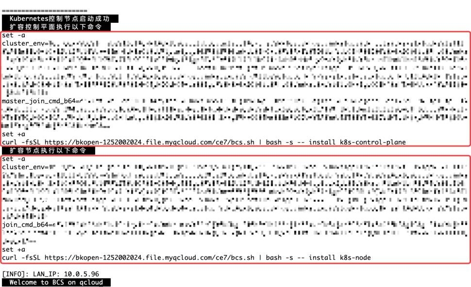

## 使用 bcs.sh 快速部署 k8s 集群
### 部署初始 master
欢迎使用蓝鲸提供的 `bcs.sh` 脚本快速部署 k8s 集群。

请在 **第一台 `master` 机器**（下文称为 **初始 master**，新手用户建议复用 **中控机**）上执行此命令：
``` bash
curl -fsSL https://bkopen-1252002024.file.myqcloud.com/ce7/bcs.sh | bash -s -- -i k8s
```

安装成功后输出如下图所示（红框内的命令会在扩容章节里说明获取方法，此时无需保存）:


这表示你成功部署了一个 k8s 集群，此时你可以使用 `kubectl` 命令了。接下来开始添加节点吧。

### 扩容节点

在 **初始 master** 机器上执行如下命令可显示扩容命令：
``` bash
curl -fsSL https://bkopen-1252002024.file.myqcloud.com/ce7/bcs.sh | bash -s -- -i k8sctrl
```
上述命令的输出如下图所示，不同类型的节点扩容命令不同，请按需选择：
* 如果要扩容 `master`，请复制 **扩容控制平面** 下方的全部命令（已用红框标出）。注意 master **总数量** 应该为 **奇数**，一般为 1、3、5，如需更多 master，请根据集群规模谨慎评估。
* 如果要扩容 `node`，请复制 **扩容节点** 下方的全部命令（已用红框标出）。


>**提示**
>
>同一类型的机器扩容命令相同。

在待扩容的机器上粘贴刚才复制的命令。扩容成功后, 会在结尾输出:
``` text
This node has joined the cluster:
* Certificate signing request was sent to apiserver and a response was received.
* The Kubelet was informed of the new secure connection details.

Run 'kubectl get nodes' on the control-plane to see this node join the cluster.

[INFO]: 添加Kubernetes节点成功

[INFO]: LAN_IP: 10.0.0.5
  Welcome to BCS on qcloud
```

### 复制 config 文件到中控机
如果你的 **中控机** 同时兼任 `master`，则可 **跳过本章节**。

否则需要将 `master` 上的 `~/.kube/config` 复制到 **中控机** 的 `~/.kube/config` 路径下，命令如下（请替换 `k8s-master`为具体的主机名或 IP）：
```bash
master_ip=10.0.0.2  # 请自行修改为bcs.sh所部署的master ip，建议配置好中控机免密登录。
mkdir -p ~/.kube
scp "$master_ip":.kube/config ~/.kube/config  # 复制kubeconfig，如未配置免密登录请输入master的密码
grep bcs.local /etc/hosts || ssh "$master_ip" grep bcs.local /etc/hosts | tee -a /etc/hosts  # 导出master上的bcs hosts配置到中控机，如未配置免密登录请输入master的密码
scp "$master_ip":/usr/bin/kubectl /usr/bin/  # 从master上复制kubectl二进制到中控机使用
```

# 下一步
前往《[准备中控机](prepare-bkctrl.md)》文档。
