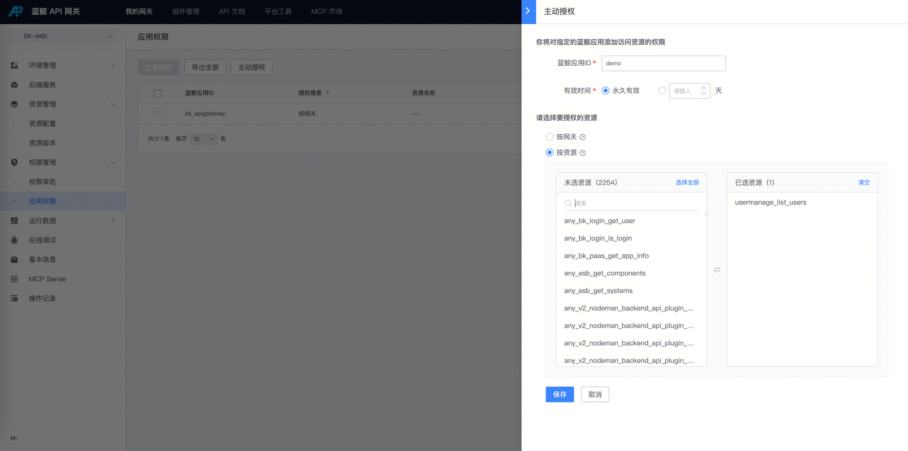

# 开启 bk-esb 接口权限检验

## 权限校验说明

当前 bk-esb 默认关闭接口权限校验功能。若强制开启可能影响用户自研 SaaS 的正常使用，建议根据实际需求选择性启用（例如：优先开启用户管理接口的权限校验）。

## 开启步骤

> 使用 admin 登录蓝鲸， 默认就是网关超级管理员

如需启用 bk-esb 接口权限校验，请按以下步骤操作：

### 1. 统计组件 API 调用

- 如果没有配置网关日志采集/清洗： 需要获取 bk-apigateway-bk-esb 容器标准输出，json 日志
	- req_system_name： 组件系统名， 例如 USERMANAGE
	- req_component_name： 组件名,  例如  list_users
	- req_app_code: 请求的应用 app_code
- 如果有配置网关日志采集/清洗： 
	- 使用蓝鲸 API 网关管理员，到网关首页, 找到 网关 【bk-esb】，进入网关页面找到【运行数据-流水日志】可以看到各组件的流水日志，可以通过过滤条件查询日志
	- 或者到 bklog， 找到采集项 【bkapigateway-esb-container】，通过日志平台的流水获取统计数据

### 2. 主动授权

1. 以网关管理员权限登录蓝鲸，到网关首页
2. 找到 网关 【bk-esb】，进入网关页面找到【权限管理-应用权限】
3. 点击主动授权
	1. 配置 【 app_code - 按资源】， 选择目标资源
	2. 确认保存

### 3. 将对应 ESB 接口开启权限校验

> 以用户管理相关接口为例

开启权限校验之后，调用对应组件接口需要在开发者中心申请权限， 并且由网关超级管理员审批通过后，才能调用对应接口

1. 以网关管理员权限登录蓝鲸，到网关首页
2. 点击【组件管理】，进入组件管理页面
3. 在左侧菜单【组件管理】，找到目标组件接口，点击【编辑】
4. 将组件接口权限级别由 【无限制】 改成 【普通】
5. 点击 【同步到网关】
6. 到网关 【API 文档 - 组件 API 文档】页面
7. 到开发者中心云 API 权限申请页面

