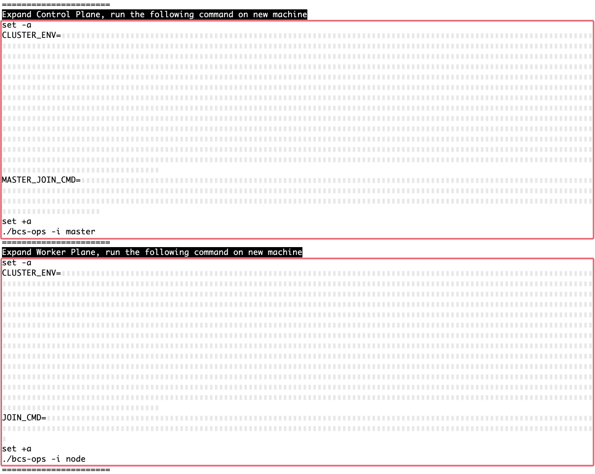

# 使用 bcs-ops 脚本快速部署 k8s 集群
bcs-ops 是蓝鲸容器管理平台 **当前维护** 的 k8s 新建集群方案。支持多种 k8s 版本，cri 则支持 docker 和 containerd。

## 下载 bcs-ops
我们在中控机下载 bcs-ops 脚本包：
``` bash
bkdl-7.2-stable.sh -ur latest bcs-ops
```

## 可选：在中控机制作离线安装目录
bcs-ops 会联网下载安装文件。通过制作离线安装目录，避免各节点从公网重复下载，从而节约下载时间和公网带宽。

TODO 补充文档

## 复制 bcs-ops 到 k8s master
将 bcs-ops 脚本包传输到 k8s master 上的 `/root` 目录（可自定义）。在中控机执行：
``` bash
master_ip=xxx
rsync -ra "$INSTALL_DIR/bcs-ops" "$master_ip":/root/
```
>**注意**
>
>即便是 中控机 复用 master，也需要复制 bcs-ops 目录。`$INSTALL_DIR/bcs-ops` 作为模板存在，以便后续维护。

## 部署初始 master

蓝鲸 7.2 默认使用 k8s-1.24.15 版本，选择 containerd 作为 CRI。

请登录到 **第一台 `master` 机器**（下文称为 **初始 master**）上执行此命令：
``` bash
# 注意这是 node 上的 bcs-ops 目录，不是中控机的。
cd /root/bcs-ops
# 如果不是腾讯云机器，则配置docker.io镜像为蓝鲸镜像站，请注意我们仅提供蓝鲸部署所需的镜像。
if ! grep -qF TencentCloud /etc/cloud/cloud.cfg 2>/dev/null; then export REPO_MIRRORS=https://hub.bktencent.com; fi
# 使用变量决定 k8s 版本及 cri 类型
K8S_VER="1.24.15" CRI_TYPE="containerd" ./bcs-ops -i master
```
>支持的 k8s 版本使用如下命令查询：`yq '.bcs-ops[].version' env/offline-manifest.yaml`。CRI 则固定为 `docker` 和 `containerd` 2 个关键词，仅 `K8S_VER<=1.24` 才支持 docker。

会开始输出安装日志，如下所示：
``` plain
[root@k8s-master bcs-ops]# ./bcs-ops -i master
├──[STEP 1/9] => [set_kernel_params] - [时间]
│   └──[SUCC] => 内核参数调优 配置成功
├──[STEP 2/9] => [set_ulimit] - [时间]
│   └──[SUCC] => set_ulimit : 当前值(204800).
├──[STEP 3/9] => [set_hostname] - [时间]
│   └──[SUCC] => set_hostname : 当前主机名(主机名).
├──[STEP 4/9] => [set_selinux] - [时间]
│   └──[SUCC] => set_selinux : 当前配置(Disabled).
├──[STEP 5/9] => [close_swap] - [时间]
│   └──[SUCC] => close_swap : 当前值(0B).
…
======================
Kubernetes Control Plane is running
<SOPS_VAR>CLUSTER_ENV:…</SOPS_VAR>
<SOPS_VAR>JOIN_CMD:…</SOPS_VAR>
<SOPS_VAR>MASTER_JOIN_CMD:…</SOPS_VAR>
======================
（扩容命令略去，此时无需保存。下文“获取扩容命令”会提供获取方法。）
======================
```

这表示你成功部署了一个 k8s 集群，此时你可以使用 `kubectl` 命令了。接下来开始添加节点吧。


## 扩容节点

### 复制 bcs-ops 到新机器
将 bcs-ops 脚本包传输到 **待扩容的机器** 上的 `/root` 目录（可自定义）。在 **中控机** 执行：
``` bash
k8s_ips="IP1 IP2..."
for k8s_ip in $k8s_ips; do
  rsync -ra "$INSTALL_DIR/bcs-ops" "$k8s_ip":/root/
done
```
>**注意**
>
>请务必从 **中控机** 的模板目录 `$INSTALL_DIR/bcs-ops` 复制。从集群其他节点复制的安装目录会携带对应节点的信息，引发集群混乱。

### 获取扩容命令
在 **初始 master** 上执行如下命令可显示扩容命令：
``` bash
# 注意这是 master node 上的 bcs-ops 目录，不是中控机的。
cd /root/bcs-ops
./bcs-ops -r joincmd
```
上述命令的输出如下图所示，不同类型的节点扩容命令不同，请按需选择：
* 如果要扩容 `master`，请复制 **Expand Control Plane** 下方的全部命令（已用红框标出）。注意 master **总数量** 应该为 **奇数**，一般为 1、3、5，如需更多 master，请根据集群规模谨慎评估。扩容后请自行参考 k8s 官网文档配置高可用。
* 如果要扩容 `node`，请复制 **Expand Worker Plane** 下方的全部命令（已用红框标出）。



### 可选：配置 containerd insecure registry
如果使用内网容器镜像仓库，可能没有有效的 SSL 证书，则无法正常拉取镜像。此时可以配置 containerd 使用 http 拉取镜像。

在 **待扩容的机器** 上执行：
``` bash
# 注意这是 node 上的 bcs-ops 目录，不是中控机的。
cd /root/bcs-ops
./k8s/insecure_registry.sh -c containerd -a 容器镜像仓库域名
```

### 执行扩容

在 **待扩容的机器** 上，先进入 `/root/bcs-ops`目录，然后粘贴刚才复制的命令：
``` bash
# 注意这是 node 上的 bcs-ops 目录，不是中控机的。
cd /root/bcs-ops
# 如果不是腾讯云机器，则配置docker.io镜像为蓝鲸镜像站，请注意我们仅提供蓝鲸部署所需的镜像。
if ! grep -qF TencentCloud /etc/cloud/cloud.cfg 2>/dev/null; then export REPO_MIRRORS=https://hub.bktencent.com; fi
# 粘贴刚才复制的扩容命令并执行：
#set -a
#...
#./bcs-ops -i ...
```

扩容成功后, 会在结尾输出:
``` plain
This node has joined the cluster:
* Certificate signing request was sent to apiserver and a response was received.
* The Kubelet was informed of the new secure connection details.

Run 'kubectl get nodes' on the control-plane to see this node join the cluster.

Created symlink /etc/systemd/system/multi-user.target.wants/kubelet.service → /usr/lib/systemd/system/kubelet.service.
```

# 在中控机管理集群

## 在中控机安装 kubectl

如果你的 **中控机** 同时兼任 `master`，则可 **跳过本章节**。

本文预期 **中控机** 和 `master` 的操作系统相同，故直接复制二进制到中控机使用。如为其他系统，你可以参考 k8s 官方文档安装： https://kubernetes.io/zh/docs/tasks/tools/install-kubectl-linux/

在 **中控机** 上执行如下命令（请赋值 `master_ip`为 master 的 IP）：
```bash
master_ip=10.0.0.2  # 请自行修改为master ip，建议配置好中控机免密登录。
scp "$master_ip":/usr/bin/kubectl /usr/bin/
```

### 配置 kubectl 命令行补全
鉴于 `kubectl` 命令参数复杂，且部分资源实例名称随机。日常进行命令行操作时，启用命令补全功能会大幅提升效率。

在 **中控机** 上执行如下命令：
``` bash
yum install -y bash-completion
mkdir -p /etc/bash_completion.d/
# 写入默认的命令行补全配置文件。
kubectl completion bash > /etc/bash_completion.d/kubectl
# 补全会在下次登录时加载。如需在当前会话补全，主动加载之。
source /etc/bash_completion.d/kubectl
```

## 配置 kubectl 连接集群

如果你的 **中控机** 同时兼任 `master`，则可 **跳过本章节**。

需要将 `master` 上的 `~/.kube/config` 复制到 **中控机** 的 `~/.kube/config` 路径下。

在 **中控机** 上执行如下命令（请替换 `k8s-master`为具体的主机名或 IP）：
```bash
mkdir -p ~/.kube
# 复制kubeconfig，如未配置免密登录请输入master的密码
scp "$master_ip":.kube/config ~/.kube/config
# 导出master上的bcs hosts配置到中控机，如未配置免密登录请输入master的密码
grep bcs.local /etc/hosts || ssh "$master_ip" grep bcs.local /etc/hosts | tee -a /etc/hosts
```

## 检查 k8s 集群节点
在 **中控机** 上执行如下命令：
```bash
kubectl get nodes
```
其输出如下所示：
``` plain
# kubectl get nodes
NAME             STATUS   ROLES           AGE   VERSION
master-10-0-0-1  Ready    control-plane   14h   v1.24.15
node-10-0-0-2    Ready    <none>          13h   v1.24.15
node-10-0-0-3    Ready    <none>          13h   v1.24.15
node-10-0-0-4    Ready    <none>          13h   v1.24.15
node-10-0-0-5    Ready    <none>          13h   v1.24.15
node-10-0-0-6    Ready    <none>          13h   v1.24.15
```

当  `STATUS`  列的值为  `Ready` ，即表示此 `node` 已经成功加入集群且工作正常。

如需了解对应  `node`  的详情，可使用命令：
```bash
kubectl describe nodes NAME  # NAME参数为 kubectl get nodes输出的 NAME 列
```

# 部署蓝鲸所需的调整项

## 配置默认命名空间
设置 k8s 默认 ns, 方便后续操作。在中控机执行：
``` bash
kubectl config set-context --current --namespace=blueking
```

## 可选：适配 localpv
bcs-ops 适配多种存储类，故不再制备 pv 目录。

如果你决意使用 localpv，请继续操作。

>**注意**
>
>node 需要先加入集群，然后才能执行此命令。

需要登录到各 node 上操作（如果希望让 master 能提供 pv，则也需操作）：
``` bash
# 注意这是 node 上的 bcs-ops 目录，不是中控机的。
cd /root/bcs-ops/
# 设置localpv的目录和数量。注意LOCALPV_DST_DIR需要和 values 里的 `localpv.hostDir` 一致
export LOCALPV_DIR=/data/bcs/localpv LOCALPV_DST_DIR=/mnt/blueking LOCALPV_COUNT=20
./system/mount_localpv
```
如果有扩容新机器，记得在新机器上执行。

## 可选：配置 ssh 免密登录
部署脚本中不会登录到其他节点，本文档中为了方便你快速上手，一些命令片段会从直接中控机上调用 `ssh` 登录 k8s node（包括 master） 执行命令。

如果你提前配置免密登录，则可直接复制这些命令使用。

>**提示**
>
>如果你所在的公司有安全规范禁止直接添加公钥授权，可跳过此章节，到时手动 ssh 到对应机器操作即可。

在 **中控机** 执行如下命令：
``` bash
# 集群所有机器的IP
node_ips=$(kubectl get nodes -o jsonpath='{.items[*].status.addresses[?(@.type=="InternalIP")].address}')
test -f /root/.ssh/id_rsa || ssh-keygen -N '' -t rsa -f /root/.ssh/id_rsa  # 如果不存在rsa key则创建一个。
# 开始给发现的ip添加ssh key，期间需要你输入各节点的密码。
for ip in $node_ips; do
  ssh-copy-id "$ip" || { echo "failed on $ip."; break; }  # 如果执行失败，则退出
done
```

常见报错：
1. `Host key verification failed.`，且开头提示 `REMOTE HOST IDENTIFICATION HAS CHANGED`: 检查目的主机是否重装过。如果确认没连错机器，可以使用 `ssh-keygen -R IP地址` 命令删除 `known_hosts` 文件里的记录。


# 下一步

[部署基础套餐](install-bkce.md)
