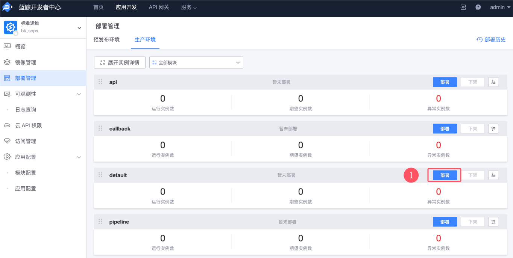

# 介绍

蓝鲸消息通知中心是一套蓝鲸PaaS平台的基础服务，旨在提供给平台管理者和应用开发者一个站内的消息通知渠道，如：平台公告、活动通知、个人消息等等

>**提示**
>
>在部署前，请根据实际业务需求评估其适用性。如果不需要蓝鲸站内的消息通知功能，可以选择不部署此系统。

# 部署消息通知中心

## 在中控机使用脚本部署
### 下载安装包
在 **中控机** 运行：
``` bash
bkdl-7.2-stable.sh -ur latest notice
```

### 使用脚本部署
在 **中控机** 运行：
``` bash
cd $INSTALL_DIR/blueking/  # 进入工作目录
scripts/setup_bkce7.sh -i notice
```


## 在开发者中心部署
本章节演示另外一种部署方法：在浏览器完成整个部署过程。效果和上文的“脚本部署”是相同的。

### 下载安装包
当浏览器访问“开发者中心”进行部署时，需要提前在浏览器里下载安装包：
| 名字及 app_code | 版本号 | 下载链接 |
|--|--|--|
| 消息通知中心（bk_notice） | 1.5.11 | https://bkopen-1252002024.file.myqcloud.com/saas-paas3/bk_notice/bk_notice-V1.5.11.tar.gz |


### 创建应用
在第一次部署时，需要先在 “开发者中心” 点击 “创建应用”，上传刚才的安装包。

具体步骤可以参考 [《部署步骤详解 —— SaaS》文档的“上传安装包”章节](manual-install-saas.md#upload-bkce-saas)。


<a id="deploy-bkce-saas-notice" name="deploy-bkce-saas-notice"></a>

### 部署消息通知中心（bk_notice）
请参考上文 上传安装包 章节完成应用创建或者安装包更新。

消息通知中心（bk_notice） **无需额外配置**，所以可以直接在 “部署管理” 界面开始部署。

共有 **一个模块** 需要部署，详细步骤如下：
1. 切换面板到 “生产环境”。
2. 只有 `default` 模块，点击“部署”按钮。
3. 弹出的“选择部署分支”下拉框，会展示最新版本，请注意确认。“镜像拉取策略”选择“`IfNotPresent`”即可。
4. 点击“部署至生产环境”按钮。开始部署，期间会显示进度及日志。
5. 部署成功后，即可点击“访问”按钮了。如果访问出错或者白屏，可能是服务尚未启动完毕，稍等 1 分钟后重试。

>**提示**
>
>部署如有异常，请先查阅《[SaaS 部署问题案例](troubles/deploy-saas.md)》文档。


# 开启消息通知功能
蓝鲸部分产品已经适配了消息通知功能，但是默认并未开启。请按需配置。

默认开启的产品：
* 标准运维
* 容器管理平台
<!--
* 蓝鲸流程引擎服务
-->

目前暂不支持开启的产品：
* 制品库
* 用户管理
* 蓝盾

<!--
* gsekit
* DBM
* BKBase
* 图表平台
* 审计中心
-->

## 基础套餐开启通知功能

### 修改全局 values

在 **中控机** 运行：
``` bash
cd $INSTALL_DIR/blueking/  # 进入工作目录
yq -i '.bkNotice.enabled = true' environments/default/custom.yaml
```

### 重启 release
``` bash
# 基础套餐产品开启
helmfile -f base-blueking.yaml.gotmpl \
-l name=bk-apigateway \
-l name=bk-console \
-l name=bk-iam-saas \
-l name=bk-paas \
-l name=bk-job \
-l name=bk-nodeman \
apply
```

### 配置流程服务（bk_itsm）

>**注意**
>
>开启之后不能关闭。

在 中控机 执行：
``` bash
kubectl -n bkapp-bk0us0itsm-prod exec deploy/bk0us0itsm--web -- /app/.heroku/python/bin/python manage.py register_notice
```

执行注册命令，提示 “成功注册平台” 即开启成功。


### 配置标准运维（bk_sops）

请登录蓝鲸桌面，打开 “开发者中心”应用，点击应用开发进入 “标准运维” 后，开始配置：
1. 展开侧栏 “应用引擎”，点击进入 “环境配置” 界面。
2. 新增环境变量，对应的配置项为 `ENABLE_NOTICE_CENTER`: `true` ，生效环境为所有环境，点击“添加”按钮即可。

环境变量需要部署后生效，共有 **四个模块** 需要部署，操作步骤为：
1. 切换面板到 “生产环境”。
2. 标准运维（bk_sops）先部署 `default` 模块，点击“部署”按钮。
   
3. 弹出的“选择部署分支”下拉框，会展示最新版本，请注意确认。“镜像拉取策略”选择“`IfNotPresent`”即可。
4. 点击“部署至生产环境”按钮。开始部署，期间会显示进度及日志。
5. 等 `default`模块 **部署成功后**，开始部署 `api`、`pipeline`与`callback` 等 3 个模块（无次序要求，可同时部署），重复步骤 2-4 即可。


### 配置蓝鲸配置平台（bk_cmdb_saas）

请登录蓝鲸桌面，打开 “开发者中心”应用，点击应用开发进入 “蓝鲸配置平台” 后，开始配置：

1. 展开侧栏 “应用引擎”，点击进入 “环境配置” 界面。
2. 新增环境变量，对应的配置项为 `BK_CMDB_ENABLE_BK_NOTICE`: `true` ，生效环境为所有环境，点击“添加”按钮即可。

环境变量需要部署后生效，共有 **一个模块** 需要部署，步骤为：
1. 切换面板到 “生产环境”。
2. 配置平台 SaaS（bk_cmdb_saas）只有 `web` 模块，点击“部署”按钮。
3. 弹出的“选择部署分支”下拉框，会展示最新版本，请注意确认。“镜像拉取策略”选择“`IfNotPresent`”即可。
4. 点击“部署至生产环境”按钮。开始部署，期间会显示进度及日志。
5. 部署成功后，即可点击“访问”按钮了。如果访问出错或者白屏，可能是服务尚未启动完毕，稍等 1 分钟后重试。


## 监控平台开启通知功能

``` bash
kubectl -n blueking exec $(kubectl -n blueking get pods -l processType=web,app.kubernetes.io/instance=bk-monitor -o name) -- bash -c '/app/venv/bin/python manage.py register_application'
```
提示 “成功注册平台” 即开启成功。

## 日志平台开启通知功能

前面调整 values 成功后，重新 apply：
``` bash
helmfile -f 04-bklog-search.yaml.gotmpl apply
```

## 运维开发平台开启通知功能

请登录蓝鲸桌面，打开 “开发者中心”应用，点击应用开发进入 “运维开发平台” 后，开始配置：

1. 展开侧栏 “应用引擎”，点击进入 “环境配置” 界面。
2. 新增环境变量，对应的配置项为 `NOTICE_CENTER_ENABLE`: `true` ，生效环境为所有环境，点击“添加”按钮即可。

环境变量需要部署后生效，共有 **一个模块** 需要部署，步骤为：
1. 切换面板到 “生产环境”。
2. 只有 `default` 模块，点击“部署”按钮。
3. 弹出的“选择部署分支”下拉框，会展示最新版本，请注意确认。“镜像拉取策略”选择“`IfNotPresent`”即可。
4. 点击“部署至生产环境”按钮。开始部署，期间会显示进度及日志。
5. 部署成功后，即可点击“访问”按钮了。如果访问出错或者白屏，可能是服务尚未启动完毕，稍等 1 分钟后重试。


# 使用
* [产品简介](../../BKNotice/1.5/UserGuide/Introduction/What-is-BKNotice.md)
* [发布新公告](../../BKNotice/1.5/UserGuide/Features/new-announcement.md)

# 验证
参考上文指引发布一条新公告，然后进入蓝鲸桌面，打开刚才公告面向的平台。查看效果。

# 下一步
* 回到《[部署基础套餐](install-bkce.md#next)》文档看看其他操作
* 开始 [了解消息通知中心](../../BKNotice/1.5/UserGuide/Introduction/What-is-BKNotice.md)
