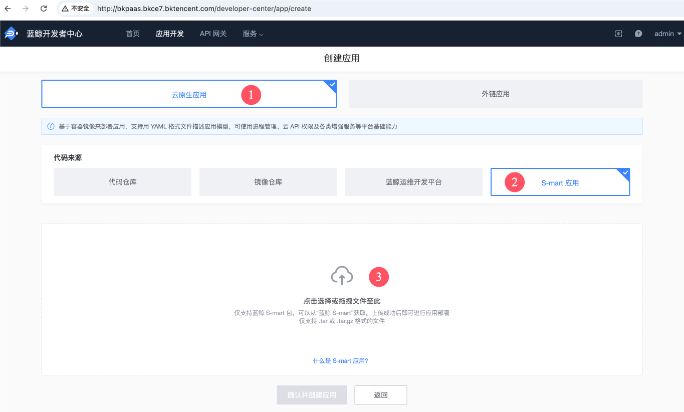
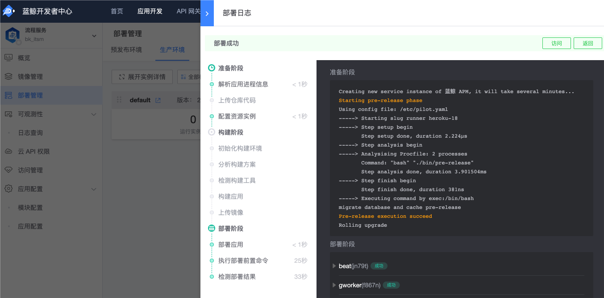

我们在《[部署基础套餐](install-bkce.md#setup_bkce7-i-saas)》文档中使用了“一键脚本”部署 SaaS，脚本逻辑可以等价于下面的操作。


<a id="saas-res-download" name="saas-res-download"></a>

## 需要提前下载的资源

在你开始下载后，可以继续跟随文档完成一些初始设置，待下载完成后部署 SaaS。

## 下载 SaaS 安装包
需要你先在浏览器中下载，随后访问 “开发者中心” 应用，上传安装包并部署到生产环境。

| 名字及 app_code | 版本号 | 下载链接 |
|--|--|--|
| 流程服务（bk_itsm） | 2.7.8 | https://bkopen-1252002024.file.myqcloud.com/saas-paas3/bk_itsm/bk_itsm-V2.7.8.tar.gz |
| 标准运维（bk_sops） | 3.33.14 | https://bkopen-1252002024.file.myqcloud.com/saas-paas3/bk_sops/bk_sops-V3.33.14.tar.gz |
| 配置平台 SaaS（bk_cmdb_saas） | 3.14.1-beta1 | https://bkopen-1252002024.file.myqcloud.com/saas-paas3/bk_cmdb_saas/bk_cmdb_saas-V3.14.1-beta1.tar.gz |
| 节点管理（bk_nodeman） | -- | 在中控机部署，期间会自动下载。无需在浏览器里单独下载。 |


<a id="paas-svc-redis" name="paas-svc-redis"></a>

## 在 PaaS 界面配置 Redis 资源池
添加 SaaS 使用的 Redis 资源池。如果部署 SaaS 时提示 “分配不到 redis”，则需补充资源实例。

>**提示**
>
>目前 Redis 资源池分为 2 类：
>- `0shared`：共享实例。池内实例允许重复以供多个 SaaS 复用。由 SaaS 自主规避 `key` 冲突。
>- `1exclusive`：独占实例。池内实例不应该重复，否则可能因为 `key` 冲突而影响 SaaS 运行。

>**提示**
>
>如果使用蓝鲸预置的 Redis，可在中控机执行 `./scripts/setup_bkce7.sh -u redis`，每次可添加 10 个共享实例。

先登录「开发者中心」。访问 `http://bkpaas.$BK_DOMAIN` （需替换 `$BK_DOMAIN` 为你配置的蓝鲸基础域名。）

访问蓝鲸 PaaS Admin（如果未登录则无法访问）： `http://bkpaas.$BK_DOMAIN/backend/admin42/platform/pre-created-instances/manage` 。

点击 “`0shared`” 这行的 “添加实例” 按钮。


在弹出的“添加实例”窗口中，启用 “可回收复用” 开关，并在 “实例配置” 贴入配置代码。


>**提示**
>
>如需复用蓝鲸公共 Redis，可在 **中控机** 生成配置代码：
>``` bash
>redis_json_tpl='{"host":"%s","port": %d,"password":"%s"}'
>redis_host="bk-redis-master.blueking.svc.cluster.local"  # 默认用蓝鲸默认的redis，可自行修改
>redis_port=6379  # 按需修改
>redis_pass=$(kubectl get secret --namespace blueking bk-redis \
>  -o jsonpath="{.data.redis-password}" | base64 --decode)  # 读取默认redis的密码，按需修改赋值语句
>printf "$redis_json_tpl\n" "$redis_host" "$redis_port" "$redis_pass" | jq .  # 格式化以确保json格式正确
>```

>**提示**
>
>如需保障 SaaS 性能，可使用自建的 Redis 服务（需确保 k8s node 可访问）。配置模板如下：
>``` json
>{
>  "host":"Redis 服务域名",
>  "port": 端口号（数字）,
>  "password":"密码"
>}
>```

点击 “确定” 按钮，即可添加 1 个实例。回到列表页继续点击 “添加实例” 按钮，添加更多实例（配置可相同）。

蓝鲸基础套餐会占用 6 个实例，建议添加 10 个实例（余量可供后续安装的 SaaS 使用）。

点击方案左侧的箭头，即展开实例列表。可看到实例配置及分配情况。如果“已分配”为“否”的行较少，建议及时添加实例备用。

<a id="upload-bkce-saas" name="upload-bkce-saas"></a>

## 上传安装包
私有化环境里需要先行创建应用并上传安装包，后续更新需在该应用的管理界面上传。

蓝鲸 SaaS 应用采用 `S-Mart` 包分发。你可以在 [S-Mart 市场](https://bk.tencent.com/s-mart/market) 中找到更多应用，也是通过此方法安装。

>**注意**
>
>请选择适配蓝鲸 7.0 的应用，未适配版本可能无法正常运行。
>
>旧版包的安装过程需要构建工具，默认没有安装，请完成《[上传 PaaS runtimes 到制品库](paas-upload-runtimes.md)》文档。

### 创建应用
登录 “蓝鲸桌面”，在侧栏导航里打开 “开发者中心”。

此时位于“首页”，点击右上角的 “创建应用” 按钮，进入“创建应用”界面。

选择 “云原生应用”——“S-mart 应用”，点击上传区域，选择提前下载的 SaaS 安装包。操作步骤如下图所示：



文件选择成功后，后台会开始检查安装包。并显示解析到的包信息，点击 “确认并创建应用” 按钮开始创建。

>**提示**
>
>如果报错 `应用ID: xxx 的应用已存在!`，说明已经存在应用，需要执行下文的 更新安装包 流程。
>
>其他异常请查阅《[SaaS 部署问题案例](troubles/deploy-saas.md)》文档。

稍等片刻后，会显示成功页面：`恭喜，应用 "应用名称" 创建成功`。此时可点击提示下方的 “部署应用” 链接，进入“部署管理”界面开始部署。


### 更新安装包
全新安装的开发者中心默认使用云原生应用，操作路径有变。

创建应用后，如果需要更新安装包版本。需使用如下步骤：
1. 使用有权限管理开发者中心的账户（如 admin ）登录到桌面，在左侧打开 “开发者中心” 应用。
2. 点击导航栏的 “应用开发”。选择要更新的应用（如“流程服务”），会进入“应用概览”。
3. 在左侧展开“应用配置”——“模块配置”。进入“构建配置”，点击“上传新版本”按钮。（SMart 应用只需在任意模块下上传 1 次。）
  
4. 弹出上传窗口的操作流程和上文 创建应用 类似，此处不再赘述。
5. 新版本上传成功后，在页面左侧导航栏点击 “部署管理” 开始部署，后续操作见对应应用的部署章节。

>**提示**
>
>普通应用使用如下步骤：
>1. 使用有权限管理开发者中心的账户（如 admin ）登录到桌面，在左侧打开 “开发者中心” 应用。
>2. 点击导航栏的 “应用开发”。选择要更新的应用（如“流程服务”），会进入“应用概览”。
>3. 此时在左侧展开“应用引擎”，点击“包版本管理”。
>4. 在包版本管理界面，点击“上传新版本”按钮，会弹出上传窗口。后续流程和上文 创建应用 类似，此处不再赘述。
>5. 新版本上传成功后，在页面左侧导航栏展开 “应用引擎”目录，点击 “部署管理” 开始部署，后续操作见对应应用的部署章节。


<a id="deploy-bkce-saas" name="deploy-bkce-saas"></a>

## 各 SaaS 部署过程

<a id="deploy-bkce-saas-itsm" name="deploy-bkce-saas-itsm"></a>

### 部署流程服务（bk_itsm）
请参考上文 上传安装包 章节完成应用创建或者安装包更新。

流程服务（bk_itsm） **无需额外配置**，所以可以直接在 “部署管理” 界面开始部署。

共有 **一个模块** 需要部署，详细步骤如下：
1. 切换面板到 “生产环境”。
2. 流程服务（bk_itsm）只有 `default` 模块，点击“部署”按钮。
   
3. 弹出的“选择部署分支”下拉框，会展示最新版本，请注意确认。“镜像拉取策略”选择“`IfNotPresent`”即可。
   
4. 点击“部署至生产环境”按钮。开始部署，期间会显示进度及日志。
   

>**提示**
>
>部署如有异常，请先查阅《[SaaS 部署问题案例](troubles/deploy-saas.md)》文档。


<!--
<a id="deploy-bkce-saas-gsekit" name="deploy-bkce-saas-gsekit
"></a>

### 部署进程配置管理（bk_gsekit）

**无需额外配置**，只有 `default` 模块需要部署。

具体步骤可参考 “[部署流程服务（bk_itsm）](#deploy-bkce-saas-itsm)” 章节。
-->

<a id="deploy-bkce-saas-sops" name="deploy-bkce-saas-sops"></a>

### 部署标准运维（bk_sops）
请参考上文 上传安装包 章节完成应用创建或者安装包更新。

标准运维（bk_sops）**无需额外配置**，共有 **四个模块** 需要部署，步骤为：
1. 切换面板到 “生产环境”。
2. 标准运维（bk_sops）先部署 `default` 模块，点击“部署”按钮。
   
3. 弹出的“选择部署分支”下拉框，会展示最新版本，请注意确认。“镜像拉取策略”选择“`IfNotPresent`”即可。
4. 点击“部署至生产环境”按钮。开始部署，期间会显示进度及日志。
5. 等 `default`模块 **部署成功后**，开始部署 `api`、`pipeline`与`callback` 等 3 个模块（无次序要求，可同时部署），重复步骤 2-4 即可。


<a id="deploy-bkce-saas-bk_cmdb_saas" name="deploy-bkce-saas-bk_cmdb_saas"></a>

### 部署配置平台 SaaS（bk_cmdb_saas）
请参考上文 上传安装包 章节完成应用创建或者安装包更新。

#### 配置环境变量
需要配置 **环境变量**，SaaS 才能正常工作。

在左侧展开“应用配置”——“模块配置”。位于 “web” 模块下，点击 “环境变量” Tab。

在环境变量列表界面，可以点击底部的“新增环境变量”按钮逐条新增，也可以导出一个模板后，自行处理如下表格，生成配置文件导入。

| KEY | 建议取值 | 描述 | 取值说明 |
| -- | -- | -- | -- |
| BK_APIGW_BK_NOTICE_URL | http://bkapi.bkce7.bktencent.com/api/bk-notice/prod | 消息通知中心 API GATEWAY 网关地址 | `${HTTP_SCHEMA}://bkapi.${BK_DOMAIN}/api/bk-notice/prod` |
| BK_APIGW_BK_CMDB_URL | http://bkapi.bkce7.bktencent.com/api/bk-cmdb/prod | cmdb API GATEWAY 网关地址 | `${HTTP_SCHEMA}://bkapi.${BK_DOMAIN}/api/bk-cmdb/prod` |
| BK_CMDB_APP_CODE | bk_cmdb | cmdb app code | 固定取值 |
| BK_CMDB_APP_SECRET | 略 | cmdb app secret | 在中控机查询： `yq e '.appSecret.bk_cmdb' environments/default/app_secret.yaml` |
| BK_CMDB_AUTH_SCHENE | iam | 权限模式，web 页面使用，可选值：internal, iam | 蓝鲸中必须对接权限中心，开源版本自行实现 |
| BK_HTTP_SCHEMA | http | 访问协议 | http 或 https |
| BK_CMDB_APIGW_JWT_ENABLED | true | 是否通过 jwt 调用 apigw | true 或 false |
| BK_CMDB_APIGW_JWT_PUBLICKEY | 略 | cmdb API GATEWAY 网关公钥  | 中控机查询：`yq e '.builtinGateway.bk-cmdb.publicKeyBase64' environments/default/bkapigateway_builtin_keypair.yaml` |
| BK_CMDB_ES_STATUS | off | 全文检索功能开关 | on 或 off |
| BK_CMDB_ENABLE_BK_NOTICE | false | 是否启用消息通知 | true 或 false |
| BK_CMDB_MONGODB_HOST | bk-mongodb-headless.blueking.svc.cluster.local:27017 | cmdb mongodb 地址 | 此处取预置的 `bk-mongodb` 服务的域名，可调整 |
| BK_CMDB_MONGODB_PORT | 27017 | cmdb mongodb 端口 |  |
| BK_CMDB_MONGODB_RS_NAME | rs0 | cmdb mongodb  rsName | 按实际情况填写 |
| BK_CMDB_MONGODB_MECHANISM | SCRAM-SHA-1 | cmdb mongodb mechanism | 按实际情况填写 |
| BK_CMDB_MONGODB_USERNAME | cmdb | cmdb mongodb 用户 | 按实际情况填写 |
| BK_CMDB_MONGODB_PASSWORD | cmdb | cmdb mongodb 密码 | 按实际情况填写 |
| BK_CMDB_MONGODB_DATABASE | cmdb | cmdb mongodb 数据库名称 | 注意需要和后端为同一数据库 |
| BK_CMDB_MONGODB_MAX_IDLE_CONNS | 100 | cmdb mongodb 最大空闲连接数 |  |
| BK_CMDB_MONGODB_MAX_OPEN_CONNS | 3000 | cmdb mongodb 最大连接数 |  |
| BK_CMDB_MONGODB_SOCKET_TIMEOUT_SECONDS | 10 | cmdb mongodb socket 连接的超时时间 |  |
| BK_CMDB_REDIS_SENTINEL_HOST | bk-redis-master.blueking.svc.cluster.local | cmdb redis sentinel 地址 | 此处取预置的 `bk-redis` 服务的域名，可调整 |
| BK_CMDB_REDIS_SENTINEL_PORT | 6379 | cmdb redis sentinel 端口 |  |
| BK_CMDB_REDIS_DATABASE | 0 | cmdb redis 数据库名称 | 按实际情况填写 |
| BK_CMDB_REDIS_PASSWORD | blueking | cmdb redis 密码 | 按实际情况填写 |
| BK_CMDB_REDIS_MAX_IDLE_CONNS | 1000 | cmdb redis 最大空闲连接数 |  |
| BK_CMDB_REDIS_MAX_OPEN_CONNS | 3000 | cmdb redis 最大连接数 |  |

#### 部署
环境变量配置完成后，即可回到“部署管理”界面开始部署。

共有 **一个模块** 需要部署，步骤为：
1. 切换面板到 “生产环境”。
2. 配置平台 SaaS（bk_cmdb_saas）只有 `web` 模块，点击“部署”按钮。
3. 弹出的“选择部署分支”下拉框，会展示最新版本，请注意确认。“镜像拉取策略”选择“`IfNotPresent`”即可。
4. 点击“部署至生产环境”按钮。开始部署，期间会显示进度及日志。

如果部署失败，请先检查环境变量是否正确。

#### 配置访问地址
在部署完成后，需要配置访问地址为 `cmdb.$BK_DOMAIN`。在 **中控机** 执行：
``` bash
cd $INSTALL_DIR/blueking/  # 进入工作目录
BK_DOMAIN=$(yq e '.domain.bkDomain' environments/default/custom.yaml)
kubectl exec -in blueking deploy/bkpaas3-apiserver-web -- python manage.py publish_app --app_code bk_cmdb_saas --module_name web --domain cmdb.$BK_DOMAIN --force true
```
看到提示即表示配置成功：
``` plain
paasng.accessories.publish.sync_market.engine(ln:78): 成功更新应用bk_cmdb_saas的数据, 影响记录1条，更新数据:{'external_url': 'http://cmdb.bkce7.bktencent.com/', 'is_already_online': True, 'is_display': True, 'state': 4}
```

然后即可在应用市场找到 “蓝鲸配置平台”应用，添加到桌面，点击即可正常访问了。


<a id="deploy-bkce-saas-nodeman" name="deploy-bkce-saas-nodeman"></a>

### 部署节点管理（bk_nodeman）
目前节点管理已经改为了 Charts 形态，通过 `helmfile` 命令进行部署。

安装节点管理之前，保障中控机上能解析 `bkrepo.$BK_DOMAIN` 的域名，因为安装时会自动调用脚本在 bkrepo 中创建 bucket。
``` bash
cd $INSTALL_DIR/blueking/  # 进入工作目录
helmfile -f base-blueking.yaml.gotmpl -l name=bk-nodeman sync
```

<a id="bkconsole-add-app-saas" name="bkconsole-add-app-saas"></a>

## 为用户桌面添加应用
>**提示**
>
>使用“一键部署” 脚本部署 标准运维、流程服务、蓝鲸配置平台和节点管理 时，会自动完成此步骤。

在用户 **首次** 进入蓝鲸桌面时，会触发桌面初始化事件：在 “桌面 1” 添加 **默认应用**。此事件无法重放。

在部署 SaaS 成功后，管理员可能希望让全部用户桌面直接出现这个应用。

那么可以组合如下的脚本达成效果：
* 使用 `set_desktop_default_app.sh` 将应用设置为 **默认应用**。用户首次进入桌面后即可看到这些应用。<br/>
  如果用户已经登录，则后续设置的默认应用 **不会添加** 到此用户桌面。
* 使用 `add_user_desktop_app.sh` 为 **已进入过桌面的用户** 添加指定应用到 “桌面 1”。<br/>
  如果用户未曾登录过，则操作失败，提示 `user(用户名) not exists`。

脚本用法如下：
``` bash
cd $INSTALL_DIR/blueking/  # 进入工作目录
# 将 bk_itsm, bk_sops 和 bk_nodeman 设为默认应用。
./scripts/set_desktop_default_app.sh -a "bk_itsm,bk_sops,bk_nodeman,bk_cmdb_saas"
# 在之前的步骤中，用户 admin 已经登录过桌面。默认应用对其无效，需要主动为其添加。
./scripts/add_user_desktop_app.sh -u "admin" -a "bk_itsm,bk_sops,bk_nodeman,bk_cmdb_saas"
```

脚本执行成功无输出；如果失败，会显示报错。

常见报错：
* app_code 有误，输出为 `App(app-code-not-exist) not exists`。

# 访问

部署成功后，即可点击“访问”按钮了。如果访问出错或者白屏，可能是服务尚未启动完毕，稍等 1 分钟后重试。

>**提示**
>
>蓝鲸配置平台与运维开发平台需要通过独立域名(例如 `cmdb.$BK_DOMAIN` )来访问。


## 异常排查

### 访问链路

- **saas 访问链路**: `http://apps.$BK_DOMAIN/sub-path`
  
  客户端 -> 网关 -> ingress-nginx -> bk-ingress -> service
- **独立域名 saas 访问链路:** `http://*.$BK_DOMAIN`
  
  客户端 -> 网关 -> ingress-nginx -> service

### 404

如果访问 saas 首页返回 404 状态码，可按以下思路排查：
1. 检查开发者中心对应的 saas 是否已部署至生产环境
2. 检查后端 `ingress-nginx` 命名空间下的 `ingress-nginx-controller` pod 标准输出日志是否有访问日志
3. 检查是否按照规范配置独立域名(`*.$BK_DOMAIN`)
4. 检查对应 saas 命名空间下的 ingress 资源对象是否生成且 `annotations` 配置为 `kubernetes.io/ingress.class: bk-ingress-nginx`(独立域名为 `nginx`)
5. TODO

### 502

如果访问 saas 首页返回 502 状态码，可按以下思路排查：
1. 检查对应 saas 命名空间下的 ingress 资源对象是否生成且 `annotations` 配置为 `kubernetes.io/ingress.class: bk-ingress-nginx`(独立域名为 `nginx`)
2. 检查后端 pod 里面进程是否已经正常启动
3. 检查 ingress 访问日志

# 下一步
继续部署，[配置节点管理及安装 Agent](config-nodeman.md)。

或者回到《[部署基础套餐](install-bkce.md#next)》文档看看其他操作。
