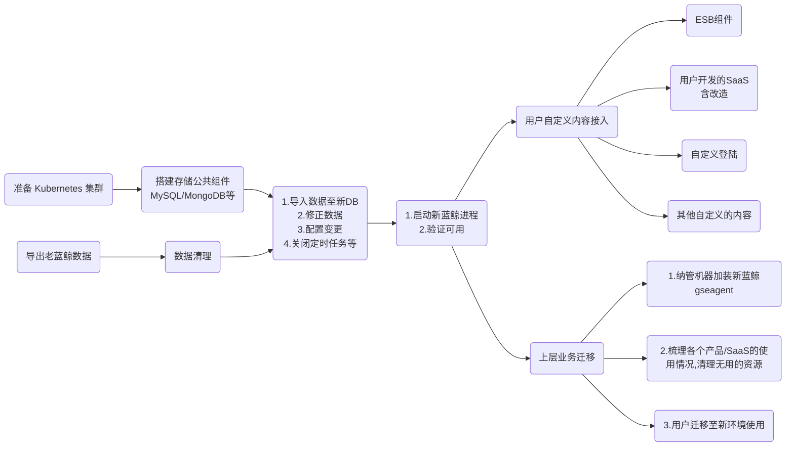

## 1. 方案简述

本方案旨在通过迁移数据库数据和重新搭建蓝鲸平台的方式，实现蓝鲸跨版本产品升级。正式迁移前可以重复执行此方案进行测试，整个迁移过程不会影响现有蓝鲸环境的正常使用。

- 异常处理机制：

如果在迁移过程中遇到任何步骤执行失败且无法自行解决的情况，请及时收集相关异常日志和截图，并联系蓝鲸助手寻求帮助。

- 操作路径


- 注意事项：
  1. 容器管理平台不支持二进制版本数据迁移至新平台，此处为全新部署 “容器管理平台”
  2. 最低支持版本为 v6.2 

## 2. 新蓝鲸：准备工作

### 2.1. 资源及环境要求

参考：https://bk.tencent.com/docs/markdown/ZH/DeploymentGuides/7.2/prepare.md

### 2.2. 准备中控机

参考：https://bk.tencent.com/docs/markdown/ZH/DeploymentGuides/7.2/prepare-bkctrl.md

### 2.3. 下载所需的资源文件

```bash
bkdl-7.2-stable.sh -ur latest base demo nm_gse_full saas scripts
```

### 2.4. 准备 Kubernetes 集群

> 不能与老蓝鲸复用同一批机器资源

Kubenetes 版本支持：1.20、1.24，**建议使用 1.24**

- 自建集群
  - 参考：https://bk.tencent.com/docs/markdown/ZH/DeploymentGuides/7.2/get-k8s-create-bcsops.md
    - 注意 storageclass 的准备：如若使用 localpv，请务必提前制备：参考：https://bk.tencent.com/docs/markdown/ZH/DeploymentGuides/7.2/storage-services.md#localpv
- 购买云服务，如 TKE
  - 参考：https://cloud.tencent.com/document/product/457/54231
  
## 3. 老蓝鲸：数据导出和处理

### 3.1. 导出 db 数据

- 说明：
  1. 对 MySQL、MongoDB、zookeeper 的数据进行导出、修正并保存
  2. Redis、rabbitmq、Kafka、Elasticsearch 的数据不导出、不迁移

#### 3.1.1. 下载 bk-upgrade-tool

```bash
cd /data
wget https://bkopen-1252002024.file.myqcloud.com/ce/bk-upgrade-tools-v1.0.0.tar.gz
tar xf bk-upgrade-tools-v1.0.0.tar.gz
```

#### 3.1.2. 导出与修正 MySQL 的数据

```bash
cd /data/install && source utils.fc
cd /data/bk-upgrade-tools
# 如果输出有 Warn 或者 Error ，请按提示分析异常的原因'
MYSQL_PWD=${BK_MYSQL_ADMIN_PASSWORD} ./mysql_backup.sh --backup-dir /data/backup --mysql-args "-u${BK_MYSQL_ADMIN_USER} -h${BK_MYSQL_IP}"
```

#### 3.1.3. 导出 MongoDB 的数据

```bash
cd /data/install && source utils.fc
backup_dir=/data/backup/mongodb
mkdir -p $backup_dir
# 安装 mongodump 
yum -y install /opt/yum/mongodb-org-tools-4.2.3-1.el7.x86_64.rpm
# 导出数据
mongodump --host ${BK_MONGODB_IP0} --username ${BK_MONGODB_ADMIN_USER} --password ${BK_MONGODB_ADMIN_PASSWORD} --port 27017 --gzip --out ${backup_dir}

# 打包备份目录
cd ${backup_dir%/*}
tar czf mongodb-backup-$(date +%F-%H-%M-%S).tgz mongodb
echo -e "\n备份文件为：\n $(ls -lrt ${backup_dir%/*}/mongodb-backup-*tgz | tail -n1)"
```

#### 3.1.4. 导出 zookeeper 的数据

```bash
# 数据导出
cd /data/install && source utils.fc
backup_dir=/data/backup
rsync -av $BK_ZK_IP0:/var/lib/zookeeper ${backup_dir}

# 打包备份目录
cd ${backup_dir}
tar -czf ${backup_dir}/zk-backup-$(date +"%F-%H-%M-%S").tgz zookeeper
echo -e "\n[info]备份文件为：\n $(ls -lrt ${backup_dir}/zk*tgz | tail -n1)"
```

### 3.2. 导出平台配置数据

```bash
cd /data/bk-upgrade-tools
./generate_bk_custom_yaml.sh -t ce -d /data/install
mv custom_yaml.tgz /data/backup
```

## 4. 新蓝鲸：数据导入和配置更新

### 4.1. 将老蓝鲸备份数据同步至新蓝鲸中控机

需同步的文件列表，**请将老蓝鲸备份数据同步至新蓝鲸中控机的 `/data/backup` 下**
- /data/backup/mongodb-backup-xxx.tgz
- /data/backup/mysql-backup-xxx.tgz
- /data/backup/zk-backup-xxx.tgz
- /data/backup/custom_yaml.tgz

### 4.2. 修改新蓝鲸配置

- 设置访问域名，不建议复用老蓝鲸域名
```bash
# 设定期望的主域名
BK_DOMAIN=bk7.bktencent.com

cd $INSTALL_DIR/blueking/
touch environments/default/custom.yaml
yq -i ".imageRegistry = \"hub.bktencent.com\" | \
  .domain.bkDomain = \"$BK_DOMAIN\"  | \
  .domain.bkMainSiteDomain = \"$BK_DOMAIN\"" \
  environments/default/custom.yaml
```
- gse_agent_v2 部署路径
兼容双 agent 并存的场景，使用不用的路径部署不同的 agent
```bash
# 设定 gse agent v2 安装路径前缀。
GSE_ALIAS=gse2

touch environments/default/bkcmdb-custom-values.yaml.gotmpl
yq -i ".common.eventServer.hostIdentifier.fileName = \"hostid\" | \
  .common.eventServer.hostIdentifier.linux.filePath = \"/var/lib/${GSE_ALIAS}/host\" | \
  .common.eventServer.hostIdentifier.windows.filePath = \"c:/${GSE_ALIAS}/data/host\"" \
  environments/default/bkcmdb-custom-values.yaml.gotmpl
  
touch environments/default/bknodeman-custom-values.yaml.gotmpl
yq -i ".config.gseEnvironDir = \"/etc/sysconfig/gse/${GSE_ALIAS}\" | \
  .config.gseEnvironWinDir = \"C:\\\\\\\\Windows\\\\\\\\System32\\\\\\\\config\\\\\\\\gse\\\\\\\\${GSE_ALIAS}\" | \
  .config.bkAppGseAgentHome = \"/usr/local/${GSE_ALIAS}\" | \
  .config.bkAppGseAgentLogDir = \"/var/log/${GSE_ALIAS}\" | \
  .config.bkAppGseAgentRunDir = \"/var/run/${GSE_ALIAS}\" | \
  .config.bkAppGseAgentDataDir = \"/var/lib/${GSE_ALIAS}\" | \
  .config.bkAppGseWinAgentHome = \"C:\\\\\\\\${GSE_ALIAS}\" | \
  .config.bkAppGseWinAgentLogDir = \"C:\\\\\\\\${GSE_ALIAS}\\\\\\\\logs\" | \
  .config.bkAppGseWinAgentRunDir = \"C:\\\\\\\\${GSE_ALIAS}\\\\\\\\data\" | \
  .config.bkAppGseWinAgentDataDir = \"C:\\\\\\\\${GSE_ALIAS}\\\\\\\\data\"" \
  environments/default/bknodeman-custom-values.yaml.gotmpl
  
touch environments/default/bklog-collector-custom-values.yaml.gotmpl
yq -i ".rootWorkPath = \"/var/lib/${GSE_ALIAS}/bkunifylogbeat\" | \
  .bkunifylogbeat.ipcPath = \"/var/run/${GSE_ALIAS}/ipc.state.report\" | \
  .bkunifylogbeat.hostIDPath = \"/var/lib/${GSE_ALIAS}/host/hostid\"" \
  environments/default/bklog-collector-custom-values.yaml.gotmpl

touch environments/default/bkmonitor-operator-custom-values.yaml.gotmpl
yq -i ".global.ipc.path = \"/var/run/${GSE_ALIAS}\" | \
  .global.ipc.endpoint = \"ipc.state.report\" | \
  .global.ipc.hostid = \"/var/lib/${GSE_ALIAS}/host\"" \
  environments/default/bkmonitor-operator-custom-values.yaml.gotmpl
```
- 注入 gse 的 zk 认证信息
```bash
# 注意 custom_yaml.tgz 的路径
CUSTOM_YAML_TGZ_PATH='/data/backup/custom_yaml.tgz'
CURRENT_ZK_AUTH=$(tar -xOf ${CUSTOM_YAML_TGZ_PATH} | yq .gse.zookeeper.token)
# 确认输出
echo $CURRENT_ZK_AUTH
yq -i ".gse.zookeeper.token = \"${CURRENT_ZK_AUTH}\"" environments/default/custom.yaml
```
- 还原应用 app_secret，请勿手动更新
```bash
tar -xOf ${CUSTOM_YAML_TGZ_PATH} ./app_secret.yaml > environments/default/app_secret.yaml
```
- 还原作业平台的加密秘钥
```bash
JOB_ENCRYPT_PASSWORD=$(tar -xOf ${CUSTOM_YAML_TGZ_PATH} ./bkjob-custom-values.yaml.gotmpl | yq .job.encrypt.password)
# 确认输出
echo $JOB_ENCRYPT_PASSWORD
touch environments/default/bkjob-custom-values.yaml.gotmpl
yq -i ".job.encrypt.password = \"${JOB_ENCRYPT_PASSWORD}\"" environments/default/bkjob-custom-values.yaml.gotmpl
```
- 设置作业平台运行模式为标准模式
```bash
touch environments/default/bkjob-custom-values.yaml.gotmpl
yq -i '.deploy.mode = "standard"' environments/default/bkjob-custom-values.yaml.gotmpl
```
- 启用开发者中心的 SaaS 迁移选项
```bash
touch environments/default/bkpaas3-custom-values.yaml.gotmpl
yq -i '.apiserver.appMigrationEnabled = true' environments/default/bkpaas3-custom-values.yaml.gotmpl
```
- 设置 PaaS 初始化应用列表
```bash
yq -i '.initThirdAppCodes = "bk_repo,bk_job,bk_usermgr,bk_iam,bk_bcs,bk_log_search,bk_monitorv3,bk_nodeman,bk_fta_solution"' \
  environments/default/bkpaas3-custom-values.yaml.gotmpl
```
- apigateway 迁移时需要读取老蓝鲸的 ESB 数据库，定义 legacyEsb 数据库信息
```bash
touch environments/default/bkapigateway-custom-values.yaml.gotmpl
yq -i ".externalDatabase.legacyEsb.host = \"{{ .Values.mysql.host }}\" | \
  .externalDatabase.legacyEsb.port = \"{{ .Values.mysql.port }}\" | \
  .externalDatabase.legacyEsb.user = \"root\" | \
  .externalDatabase.legacyEsb.password = \"{{ .Values.mysql.rootPassword }}\" | \
  .externalDatabase.legacyEsb.name = \"open_paas\"" \
  environments/default/bkapigateway-custom-values.yaml.gotmpl
```
- 修正监控数据库信息
```bash
touch environments/default/bkmonitor-custom-values.yaml.gotmpl
yq -i ".externalDatabase.grafana.name = \"bk_monitorv3_grafana\" | \
  .externalDatabase.saas.name = \"bk_monitorv3\" | \
  .externalDatabase.backend.name = \"bkmonitorv3_alert\"" \
  environments/default/bkmonitor-custom-values.yaml.gotmpl
```

### 4.3. 数据导入

####  4.3.1. MySQL 数据导入

1. 启动服务
  
```bash
cd $INSTALL_DIR/blueking/
helmfile -f base-storage.yaml.gotmpl -l name=bk-mysql8 sync
```
2. 解压备份数据，并复制到 mysql pod 内
```bash
cd /data/backup
ls -t mysql-backup-*tgz | head -n1 | xargs tar xf
kubectl cp -n blueking ./mysql bk-mysql8-0:/bitnami/mysql/backup
```
3. 导入数据
```bash
echo "MYSQL 密码：$(kubectl get secret --namespace blueking bk-mysql8 -o jsonpath="{.data.mysql-root-password}" | base64 -d)"
kubectl exec -it -n blueking bk-mysql8-0 -- bash
	
# 确保已经登陆至 mysql pod 内，终端名称默认为："I have no name!@bk-mysql-0:/$"
cd /bitnami/mysql/backup
for sql in $(ls /bitnami/mysql/backup); do
  echo "${sql} 导入中"
  # 默认密码为 blueking, 可以按需更改
  MYSQL_PWD=blueking mysql -uroot < ${sql}
done

# [可选] 清理备份文件
rm -rf /bitnami/mysql/backup

# 执行完成后退出该容器终端
exit
```
4. 数据修正
```bash
# 以下的变量可以按需更改
HTTP_SCHEME=http
BK_DOMAIN=$(yq e '.domain.bkDomain' $INSTALL_DIR/blueking/environments/default/custom.yaml)
MYSQL_HOST="bk-mysql8.blueking.svc.cluster.local"
MYSQL_USER=root
MYSQL_PORT=3306
MYSQL_PWD=$(kubectl get secret --namespace blueking bk-mysql8 -o jsonpath="{.data.mysql-root-password}" | base64 -d)

kubectl run bk-mysql8-client --rm --tty -i --restart='Never' \
  --image hub.bktencent.com/bitnami/mysql:8.0.37-debian-12-r2 \
  --namespace blueking --env HTTP_SCHEME=$HTTP_SCHEME --env BK_DOMAIN=$BK_DOMAIN \
  --env MYSQL_HOST=$MYSQL_HOST --env MYSQL_USER=$MYSQL_USER --env MYSQL_PORT=$MYSQL_PORT \
  --env MYSQL_PWD=$MYSQL_PWD --command -- bash

# 注意：需要进入容器后，再执行下列操作（关注输出是否有 Warnings、Errors）
## 操作了什么？
## 1. 修正用户管理的 app_code
## 2. 修正权限中心的回调地址
## 3. 修正 saas 访问地址，上线状态
## 4. 修正 saas db 信息
## 5. 修正标准运维轻应用的访问地址
## 6. 修正节点管理默认启动插件，仅保留 bkmonitorbeat
## 7. 修正 bk_monitorv3 的 auth_token
MYSQL_PWD="$MYSQL_PWD" mysql -vv -h$MYSQL_HOST -u$MYSQL_USER <<EOF
UPDATE open_paas.paas_app 
SET code = 'bk_usermgr' 
WHERE code = 'bk_user_manage';

UPDATE bkiam.saas_system_info
SET provider_config = JSON_SET(provider_config, '$.host',
    CASE id
        WHEN 'bk_paas' THEN '${HTTP_SCHEME}://${BK_DOMAIN}'
        WHEN 'bk_sops' THEN '${HTTP_SCHEME}://apps.${BK_DOMAIN}/bk--sops'
        WHEN 'bk_itsm' THEN '${HTTP_SCHEME}://apps.${BK_DOMAIN}/bk--itsm'
        WHEN 'bk_nodeman' THEN '${HTTP_SCHEME}://bknodeman.${BK_DOMAIN}'
        WHEN 'bk_monitorv3' THEN '${HTTP_SCHEME}://bkmonitor.${BK_DOMAIN}'
        WHEN 'bk_log_search' THEN '${HTTP_SCHEME}://bklog.${BK_DOMAIN}'
    END)
WHERE id IN ('bk_paas', 'bk_sops', 'bk_itsm', 'bk_nodeman', 'bk_monitorv3', 'bk_log_search');

UPDATE open_paas.paas_app 
SET is_already_test = 0,
    is_already_online = 0 
WHERE id >= 1;

UPDATE open_paas.paas_app
SET migrated_to_paasv3 = 1
WHERE code IN ('bk_iam', 'bk_usermgr', 'bk_nodeman', 'bk_monitorv3', 'bk_log_search');

UPDATE open_paas.paas_app_secureinfo
SET db_host = '${MYSQL_HOST}',
    db_port = '${MYSQL_PORT}',
    db_username = '${MYSQL_USER}',
    db_password = '${MYSQL_PWD}'
WHERE db_type = 'mysql';

UPDATE open_paas.paas_app
SET external_url = REPLACE(external_url, 
                            CONCAT(SUBSTRING_INDEX(SUBSTRING_INDEX(external_url, '/', 3), '/', -1), '/o/bk_sops'), 
                            'apps.$BK_DOMAIN/bk--sops')
WHERE external_url LIKE '%appmaker%';

SET @auth_token = (SELECT auth_token FROM open_paas.paas_app WHERE code = 'bk_monitorv3');
UPDATE open_paas.esb_app_account 
SET app_token = @auth_token 
WHERE app_code = 'bk_monitorv3';
EOF

# 执行完成后退出该容器终端
exit
```

#### 4.3.2. MongoDB 数据导入

1. 启动服务
```bash
cd $INSTALL_DIR/blueking/
helmfile -f base-storage.yaml.gotmpl -l name=bk-mongodb sync
```
2. 解压备份数据，并复制到 mongodb pod 内
```bash
cd /data/backup
ls -t mongodb-backup-*tgz | head -n1 | xargs tar xf
kubectl cp -n blueking ./mongodb bk-mongodb-0:/bitnami/mongodb
```
3. 导入数据
```bash
echo "MongoDB 密码：$(kubectl get secret --namespace blueking bk-mongodb -o jsonpath="{.data.mongodb-root-password}" | base64 --decode)"
kubectl exec -it -n blueking bk-mongodb-0 -- bash

# 确保已经登陆至 mongodb pod 内，终端名称默认为："I have no name!@bk-mongodb-0:/$"
## 关注最后一段输出，确认是否完成数据的导入
### 2024-09-26T03:47:55.622+0000    x document(s) restored successfully. 0 document(s) failed to restore.
cd /bitnami/mongodb/mongodb
dbs=(cmdb gse cmdb_events joblog)
for db in ${dbs[@]}; do
  echo "${db} 导入中"
  # 默认密码为 blueking, 可以按需更改
  mongorestore --quiet --authenticationDatabase admin -u root -p blueking -d ${db} ./${db} --gzip
done

# [可选] 清理备份文件
rm -rf /bitnami/mongodb/mongodb

# 执行完成后退出该容器终端
exit
```

#### 4.3.3. zookeeper 数据导入

1. 启动服务
```bash
cd $INSTALL_DIR/blueking/
helmfile -f base-storage.yaml.gotmpl -l name=bk-zookeeper sync
```
2. 获取 pv 挂载机器 IP、路径
```bash
pvc=$(kubectl get pod -n blueking --selector=app.kubernetes.io/name=zookeeper -o jsonpath='{.items[*].spec.volumes[*].persistentVolumeClaim.claimName}')
pv=$(kubectl get pvc -n blueking $pvc -o jsonpath='{.spec.volumeName}')
node=$(kubectl get pv $pv -o jsonpath='{.spec.nodeAffinity.required.nodeSelectorTerms[*].matchExpressions[*].values[0]}')
node_ip=$(kubectl get node $node -o jsonpath='{.status.addresses[?(@.type=="InternalIP")].address}')
local_path=$(kubectl get pv $pv -o jsonpath='{.spec.local.path}')
# 记录以下信息。（若输出为空，可能是服务尚未完成启动，可以重新执行该步骤获取对应信息）
echo "IP：${node_ip} ，挂载路径：${local_path}"
```
3. 调整 zk 副本数为 0
```bash
kubectl scale statefulset -n blueking bk-zookeeper --replicas=0
```
3. 同步备份文件目标机器
```bash
cd /data/backup
zk_backup_tgz=$(ls -t zk-backup-*tgz | head -n1)
rsync -av ${zk_backup_tgz} ${node_ip}:/data

ssh ${node_ip} <<EOF
cd /data
tar xf ${zk_backup_tgz}

rsync -av --delete /data/zookeeper/ ${local_path}/data/
chown -R 1001.1001 ${local_path}/data
EOF
```
4. 恢复 zk 副本数
```bash
kubectl scale statefulset -n blueking bk-zookeeper --replicas=1
```

### 4.4. 关闭定时任务

- 关闭标准运维定时任务、计划任务；关闭作业平台定时任务
```bash
MYSQL_HOST="bk-mysql8.blueking.svc.cluster.local"
MYSQL_USER=root
MYSQL_PORT=3306
MYSQL_PWD=$(kubectl get secret --namespace blueking bk-mysql8 -o jsonpath="{.data.mysql-root-password}" | base64 -d)

kubectl run bk-mysql8-client --rm --tty -i --restart='Never' \
  --image hub.bktencent.com/bitnami/mysql:8.0.37-debian-12-r2 \
  --namespace blueking --env MYSQL_HOST=$MYSQL_HOST --env MYSQL_USER=$MYSQL_USER \
  --env MYSQL_PORT=$MYSQL_PORT --env MYSQL_PWD=$MYSQL_PWD --command -- bash

# 注意：需要进入容器后，再执行下列操作
MYSQL_PWD="$MYSQL_PWD" mysql -vv -h$MYSQL_HOST -u$MYSQL_USER <<'EOF'
USE bk_sops
BEGIN;
UPDATE django_celery_beat_periodictask SET enabled = 0 WHERE task IN ('pipeline.contrib.periodic_task.tasks.bamboo_engine_periodic_task_start','gcloud.clocked_task.tasks.clocked_task_start');
UPDATE clocked_task_clockedtask SET state = 'started' WHERE state != 'started';
COMMIT;

UPDATE job_crontab.cron_job SET is_enable=0 WHERE is_enable = 1 AND is_deleted = 0;
EOF

# 执行完成后退出该容器终端
exit
```
- 关闭用户自定义功能中的定时任务
:heavy_exclamation_mark:用户按实际情况进行操作，如自建 SaaS 中的定时消息通知，无 agent 作业任务等等

## 5. 新蓝鲸：部署基础套餐

### 5.1. 部署基础套餐后台

```bash
BK_DOMAIN=$(yq e '.domain.bkDomain' $INSTALL_DIR/blueking/environments/default/custom.yaml)
cd $INSTALL_DIR/blueking/
scripts/setup_bkce7.sh -i base --domain "$BK_DOMAIN"
```

### 5.2. 更新 DNS

- [配置集群、node 内 DNS](https://bk.tencent.com/docs/markdown/ZH/DeploymentGuides/7.2/install-bkce.md#更新-dns)，参考（如锚点跳转失效，请 CTRL + F 搜索“更新-dns”）

- 完善 SaaS 运行环境> [确保 node 能拉取 SaaS 镜像 / 配置容器运行时访问蓝鲸制品库](https://bk.tencent.com/docs/markdown/ZH/DeploymentGuides/7.2/saas-node-pull-images.md)
  1. :heavy_exclamation_mark:请确保在所有 node 机器可以解析 `docker.bk7.bktencent.com` （二级域名请按实际修改）

- 用户浏览器访问
  1. 请参考 “[访问蓝鲸](https://bk.tencent.com/docs/markdown/ZH/DeploymentGuides/7.2/install-bkce.md#访问蓝鲸)” 一节进行配置
  2. 登陆信息：管理员 admin 密码与老蓝鲸的密码保持一致

### 5.3. 部署配置平台SaaS

```bash
./scripts/setup_bkce7.sh -i bk_cmdb_saas
```

### 5.4. 迁移标准运维和流程服务

#### 5.4.1. 标准运维

1. 前往开发者中心迁移“标准运维”应用
  - 操作路径：“开发者中心” > “一键迁移” > 选择“标准运维” > “迁移到新版开发者中心”，按提示操作
2. 前往开发者中心去掉下面三个环境变量
  - 操作路径：打开“标准运维” > “应用配置” > “模块配置” > “环境变量”，
    - `BKAPP_FILE_MANAGER_TYPE`
    - `BKAPP_NFS_HOST_ROOT`
    - `BKAPP_NFS_CONTAINER_ROOT`
3. 在中控机进行部署：
    ```bash
    ./scripts/setup_bkce7.sh -i sops
    ```
4. 上述操作完成后返回迁移列表页面点击“确认迁移”
5. 前往开发者中心打开“标准运维”，在“应用配置” > “应用市场”，将已发布到应用市场关闭后再重新打开

#### 5.4.2. 流程服务

1. 前往开发者中心迁移“流程服务”应用
  - 操作路径：“开发者中心” > “一键迁移” > 选择“流程服务” > “迁移到新版开发者中心”，按提示操作
2. 在中控机进行部署：
    ```bash
    ./scripts/setup_bkce7.sh -i itsm
    ```
3. 上述操作完成后返回迁移列表页面点击“确认迁移”
4. 前往开发者中心打开“流程服务”，在“应用配置” > “应用市场”，将已发布到应用市场关闭后再重新打开

### 5.5. 部署和配置节点管理

- 部署节点管理

```bash
helmfile -f base-blueking.yaml.gotmpl -l seq=fifth sync
# 添加图标、设置默认应用
scripts/add_user_desktop_app.sh -u "admin" -a "bk_nodeman"
scripts/set_desktop_default_app.sh -a "bk_nodeman"
```

- 上传 gse agent 包

```bash
# 下载 agent 包
bkdl-7.2-stable.sh -ur latest gse_agent
bkdl-7.2-stable.sh -ur latest gse_proxy
bkdl-7.2-stable.sh -ur latest gse_plugins_freq

# 上传
./scripts/setup_bkce7.sh -u agent
./scripts/setup_bkce7.sh -u plugin
./scripts/setup_bkce7.sh -u proxy
./scripts/setup_bkce7.sh -u opentools
```
- 接入点配置

> :heavy_exclamation_mark::heavy_exclamation_mark::heavy_exclamation_mark:
> 如果有需要自定义配置，请执行执行 sql 变更后在节点管理页面修改。

```bash
ZK_HOST=$(kubectl get pod -A -l statefulset.kubernetes.io/pod-name=bk-zookeeper-0 -o jsonpath='{.items[0].status.hostIP}')
BKREPO_ADDR="$(kubectl get pod -A -l bk.repo.scope=gateway -o jsonpath='{.items[0].status.hostIP}'):30025"
BKNODEMAN_API_ADDR="$(kubectl get pod -A -l app.kubernetes.io/component=bk-nodeman-backend-api -o jsonpath='{.items[0].status.hostIP}'):30300"
GSE_ALIAS=gse2
MYSQL_HOST="bk-mysql8.blueking.svc.cluster.local"
MYSQL_USER=root
MYSQL_PORT=3306
MYSQL_PWD=$(kubectl get secret --namespace blueking bk-mysql8 -o jsonpath="{.data.mysql-root-password}" | base64 -d)

kubectl run bk-mysql8-client --rm --tty -i --restart='Never' --image hub.bktencent.com/dev/bitnami/mysql:8.0.37-debian-12-r2 \
  --namespace blueking --env ZK_HOST=$ZK_HOST --env BKREPO_ADDR=$BKREPO_ADDR \
  --env BKNODEMAN_API_ADDR=$BKNODEMAN_API_ADDR --env GSE_ALIAS=$GSE_ALIAS \
  --env MYSQL_HOST=$MYSQL_HOST --env MYSQL_USER=$MYSQL_USER --env MYSQL_PORT=$MYSQL_PORT \
  --env MYSQL_PWD=$MYSQL_PWD --command -- bash

# 注意：需要进入容器后，再执行下列操作
MYSQL_PWD="$MYSQL_PWD" mysql -vv -h$MYSQL_HOST -u$MYSQL_USER <<EOF
UPDATE bk_nodeman.node_man_accesspoint
SET 
    name = 'GSEv2默认接入点',
    zk_hosts = JSON_SET(
        zk_hosts, 
        '\$[0].zk_ip', '${ZK_HOST}', 
        '\$[0].zk_port', '32181'
    ),
    package_inner_url = 'http://${BKREPO_ADDR}/generic/blueking/bknodeman/data/bkee/public/bknodeman/download',
    package_outer_url = 'http://${BKREPO_ADDR}/generic/blueking/bknodeman/data/bkee/public/bknodeman/download',
    agent_config = '{"linux":{"dataipc":"/var/run/${GSE_ALIAS}/ipc.state.report","log_path":"/var/log/${GSE_ALIAS}","run_path":"/var/run/${GSE_ALIAS}","data_path":"/var/lib/${GSE_ALIAS}","temp_path":"/tmp/${GSE_ALIAS}","setup_path":"/usr/local/${GSE_ALIAS}","hostid_path":"/var/lib/${GSE_ALIAS}/host/hostid"},"windows":{"dataipc":47000,"log_path":"C:\\\\\\\\${GSE_ALIAS}\\\\\\\\logs","run_path":"C:\\\\\\\\${GSE_ALIAS}\\\\\\\\data","data_path":"C:\\\\\\\\${GSE_ALIAS}\\\\\\\\data","temp_path":"C:\\\\\\\\tmp\\\\\\\\${GSE_ALIAS}","setup_path":"C:\\\\\\\\${GSE_ALIAS}","hostid_path":"C:\\\\\\\\${GSE_ALIAS}\\\\\\\\data\\\\\\\\host\\\\\\\\hostid"}}',
    port_config = '{"bt_port": 20020, "io_port": 28668, "data_port": 28625, "proc_port": 50000, "trunk_port": 48331, "bt_port_end": 60030, "tracker_port": 20030, "bt_port_start": 60020, "db_proxy_port": 58817, "file_svr_port": 28925, "api_server_port": 50002, "file_svr_port_v1": 58926, "agent_thrift_port": 48669, "btsvr_thrift_port": 58931, "data_prometheus_port": 29402, "file_metric_bind_port": 29404}',
    outer_callback_url = 'http://${BKNODEMAN_API_ADDR}/backend',
    callback_url = 'http://${BKNODEMAN_API_ADDR}/backend',
    gse_version = 'V2'
WHERE id = 1;
EOF

# 退回中控机
exit
```
- 安装蓝鲸 K8S 集群机器的 Agent

  1. 页面操作，打开 `bknodeman.${BK_DOMAIN}`，选择 “安装 Agent”，“普通安装”
  2. 业务选择 “蓝鲸”，管控区域选择 “直连区域”，接入点选择“GSEv2默认接入点”
  3. 输入机器内网 ip，填入认证信息，开始安装

### 5.6. [可选] 本地文件同步至 bkrepo

蓝鲸 v6 运行过程中，用户在本地目录 / nfs 存储了创建的文件，现将转存至 bkrepo 中存储。

#### 5.6.1. 作业平台本地文件转存

- 导出“作业平台的本地文件”

> :heavy_exclamation_mark::heavy_exclamation_mark::heavy_exclamation_mark: 
> 在老蓝鲸上操作

> 若老蓝鲸可以访问新蓝鲸 bkrepo (域名：bkrepo.${BK_DOMAN})，亦可直接在老蓝鲸 job 的机器上执行，具体指令参考下一节 **“迁移作业平台本地文件至 bkrepo”**

> Q：是否可以跳过本步骤？
> 
> A: 
>  1. 没有使用过 “作业” 中的 “本地文件” 作为文件来源的，可以直接跳过
>  2. 文件夹占用空间过大，对文件用途不确定，希望借此可以清理无用资源（缺点：需要逐一梳理“有用”的作业，并重新上传“本地文件”）

```bash
cd /data/install && source utils.fc
# 请先确认文件夹大小，是否有足够的空间打包转存
pcmd -m job 'du -sh ${INSTALL_PATH}/public/job/localupload/; df -Th'
# 打包并拷贝到中控机
JOB_LOCALFILE_BACKUP="job-localfile-backup-$(date +%F-%H-%M-%S).tgz"
pcmd -m job "cd $INSTALL_PATH/public; tar --exclude='job/backup' -czf $JOB_LOCALFILE_BACKUP job; ls -lrt $INSTALL_PATH/public/$JOB_LOCALFILE_BACKUP"
rsync -av $BK_JOB_IP:$INSTALL_PATH/public/$JOB_LOCALFILE_BACKUP /data/backup/
```
- 复制 `job-localfile-backup-*tgz` 至新蓝鲸中控机 `/data/backup` 下
- 迁移作业平台本地文件至 bkrepo
```bash
# 进入备份文件目录
cd /data/backup
ls -t job-localfile-backup-*tgz | head -n1 | xargs tar xf
cd job
BK_DOMAIN=$(yq e '.domain.bkDomain' $INSTALL_DIR/blueking/environments/default/custom.yaml)
BKREPO_PROJECT=$(helm get values -n blueking bk-job -a | yq .artifactory.job.project)
BKREPO_USERNAME=$(helm get values -n blueking bk-job -a | yq .artifactory.job.username)
BKREPO_PASSWORD=$(helm get values -n blueking bk-job -a | yq .artifactory.job.password)
while read f; do
  curl -X PUT \
    -H "X-BKREPO-OVERWRITE: true" \
    -u ${BKREPO_USERNAME}:${BKREPO_PASSWORD} \
    -T "$f" \
    http://bkrepo.${BK_DOMAIN}/generic/${BKREPO_PROJECT}/${f#./}
done < <(find ./localupload/ -type f)
```

#### 5.6.2. 节点管理用户插件转存

- 用户自定义插件导出

> :heavy_exclamation_mark::heavy_exclamation_mark::heavy_exclamation_mark: 
> 在老蓝鲸上操作

```bash
cd /data/install && source utils.fc
# 请先确认文件夹大小，是否有足够的空间打包转存
pcmd -m nodeman 'du -sh ${INSTALL_PATH}/public/bknodeman/; df -Th'
# 打包并拷贝到中控机
BKNODEMAN_LOCALFILE_BACKUP="bknodeman-localfile-backup-$(date +%F-%H-%M-%S).tgz"
pcmd -m nodeman "cd $INSTALL_PATH/public; tar -czf $BKNODEMAN_LOCALFILE_BACKUP bknodeman; ls -lrt $INSTALL_PATH/public/$BKNODEMAN_LOCALFILE_BACKUP"
rsync -av $BK_NODEMAN_IP:$INSTALL_PATH/public/$BKNODEMAN_LOCALFILE_BACKUP /data/backup/
```
- 复制 `bknodeman-localfile-backup-*tgz` 至新蓝鲸中控机 `/data/backup` 下
- 迁移至 bkrepo
```bash
# 进入备份文件目录
cd /data/backup
ls -t bknodeman-localfile-backup-*tgz | head -n1 | xargs tar xf
cd bknodeman
BK_DOMAIN=$(yq e '.domain.bkDomain' $INSTALL_DIR/blueking/environments/default/custom.yaml)
BKREPO_PROJECT=$(helm get values -n blueking bk-nodeman -a | yq .config.bkRepoProject)
BKREPO_USERNAME=$(helm get values -n blueking bk-nodeman -a | yq .config.bkRepoUsername)
BKREPO_PASSWORD=$(helm get values -n blueking bk-nodeman -a | yq .config.bkRepoUsername)
BKNODEMAN_REPO_PATH_PREFIX=$(helm get values -n blueking bk-nodeman -a | yq .config.bkAppPublicPath)
BKREPO_BUCKET=$(helm get values -n blueking bk-nodeman -a | yq .config.bkRepoPublicBucket)
# 分批执行上传动作
while read f; do
  curl -X PUT \
    -H "X-BKREPO-OVERWRITE: true" \
    -u ${BKREPO_USERNAME}:${BKREPO_PASSWORD} \
    -T "$f" \
    http://bkrepo.${BK_DOMAIN}/generic/${BKREPO_PROJECT}/${BKREPO_BUCKET}/${BKNODEMAN_REPO_PATH_PREFIX}/${f#./}
done < <(find ./export -type f)

while read f; do
  curl -X PUT \
    -H "X-BKREPO-OVERWRITE: true" \
    -u ${BKREPO_USERNAME}:${BKREPO_PASSWORD} \
    -T "$f" \
    http://bkrepo.${BK_DOMAIN}/generic/${BKREPO_PROJECT}/${BKREPO_BUCKET}/${BKNODEMAN_REPO_PATH_PREFIX}/${f#./}
done < <(find ./upload -type f)

while read f; do
  curl -X PUT \
    -H "X-BKREPO-OVERWRITE: true" \
    -u ${BKREPO_USERNAME}:${BKREPO_PASSWORD} \
    -T "$f" \
    http://bkrepo.${BK_DOMAIN}/generic/${BKREPO_PROJECT}/${BKREPO_BUCKET}/${PATH_PREFIX}/${f#./}
done < <(find ./download -type f \( -path './download/linux/*' -o -path './download/windows/*' \))
```

### 5.7. 至此，蓝鲸基础套餐主体已经完成部署 :+1:

- [基础套餐的功能验证](https://bk.tencent.com/docs/markdown/ZH/QuickStart/7.0/quick-start-v7.0-info.md)
- 完善 SaaS 运行环境
  - [推荐：上传 PaaS runtimes 到制品库](https://bk.tencent.com/docs/markdown/ZH/DeploymentGuides/7.2/paas-upload-runtimes.md)
  - [可选：配置 SaaS 专用 node](https://bk.tencent.com/docs/markdown/ZH/DeploymentGuides/7.2/saas-dedicated-node.md)
- 部署基础套餐的可选组件
  - [启动蓝鲸 API 测试工具](https://bk.tencent.com/docs/markdown/ZH/DeploymentGuides/7.2/run-apicheck.md)
  - [部署蓝鲸通知中心](https://bk.tencent.com/docs/markdown/ZH/DeploymentGuides/7.2/install-notice.md)
  - [部署服务配置中心](https://bk.tencent.com/docs/markdown/ZH/DeploymentGuides/7.2/install-bscp.md)
- 用户自定义内容迁移
  - [如何迁移（导入）自定义 ESB 组件](https://iwiki.woa.com/p/4012699590)
  - 自定义登陆 ee_login 适配
  - 用户 SaaS 迁移
- 下一步：[部署容器管理平台、监控日志套餐等](.)
- 不需要使用容器管理平台、监控日志套餐，请直接进入：[9. 用户业务数据迁移](#userdata-migration)

## 6. 新蓝鲸：部署容器管理平台

> :heavy_exclamation_mark::heavy_exclamation_mark::heavy_exclamation_mark: 
> 
> 不支持二进制版本数据迁移至新平台，此处为全新部署 “容器管理平台”

请参考文档进行部署：[部署容器管理套餐](https://bk.tencent.com/docs/markdown/ZH/DeploymentGuides/7.2/install-bcs.md)

## 7. 新蓝鲸：部署监控日志套餐

### 7.1. 配置

- 注入 bcsApiGatewayToken
```bash
GATEWAY_TOKEN=$(kubectl get secret --namespace bcs-system bcs-password -o jsonpath="{.data.gateway_token}" | base64 -d) 

cd $INSTALL_DIR/blueking/
touch environments/default/bkmonitor-custom-values.yaml.gotmpl
yq -i ".monitor.config.bcsApiGatewayToken = \"${GATEWAY_TOKEN}\"" environments/default/bkmonitor-custom-values.yaml.gotmpl
touch environments/default/bklog-search-custom-values.yaml.gotmpl
yq -i ".configs.bcsApiGatewayToken = \"${GATEWAY_TOKEN}\"" environments/default/bklog-search-custom-values.yaml.gotmpl
```

### 7.2. 数据修正

> :heavy_exclamation_mark::heavy_exclamation_mark::heavy_exclamation_mark: 
> 
> 以下命令仅适用使用默认值进行部署、未曾对集群配置信息进行过变更的用户
> 如果曾经增删过集群信息，请阅读以下 SQL 命令，按实际情况进行更新，请勿直接操作

```bash
MYSQL_HOST="bk-mysql8.blueking.svc.cluster.local"
MYSQL_USER=root
MYSQL_PORT=3306
MYSQL_PWD=$(kubectl get secret --namespace blueking bk-mysql8 -o jsonpath="{.data.mysql-root-password}" | base64 -d)

kubectl run bk-mysql8-client --rm --tty -i --restart='Never' --image hub.bktencent.com/dev/bitnami/mysql:8.0.37-debian-12-r2 \
  --namespace blueking --env MYSQL_HOST=$MYSQL_HOST --env MYSQL_USER=$MYSQL_USER --env MYSQL_PORT=$MYSQL_PORT \
  --env MYSQL_PWD=$MYSQL_PWD --command -- bash

# 使用 **默认值** 更新 “集群配置信息” 
## 注意：需要进入容器后，再执行下列操作
MYSQL_PWD="$MYSQL_PWD" mysql -vv -h$MYSQL_HOST -u$MYSQL_USER <<EOF
UPDATE bkmonitorv3_alert.metadata_clusterinfo
SET domain_name = 'bk-kafka.blueking.svc.cluster.local',
    port = '9092',
    gse_stream_to_id = '-1'
WHERE cluster_name = 'kafka_cluster1';

UPDATE bkmonitorv3_alert.metadata_clusterinfo
SET domain_name = 'bk-monitor-influxdb-proxy-http',
    port = '10203',
    gse_stream_to_id = '-1'
WHERE cluster_name = 'influx_cluster1';

UPDATE bkmonitorv3_alert.metadata_clusterinfo
SET domain_name = 'bk-elastic-elasticsearch-master.blueking.svc.cluster.local',
    password = 'blueking',
    port = '9200',
    gse_stream_to_id = '-1'
WHERE cluster_name = 'es7_cluster';
EOF

# 使用 **默认值** 更新 “InfluxDB 集群信息”
## 注意：需要进入容器后，再执行下列操作
MYSQL_PWD="$MYSQL_PWD" mysql -vv -h$MYSQL_HOST -u$MYSQL_USER <<EOF
UPDATE bkmonitorv3_alert.metadata_influxdbhostinfo
SET password = 'blueking',
    domain_name = 'bk-influxdb.blueking.svc.cluster.local'
WHERE host_name = 'INFLUXDB_IP0';
EOF

# 执行完成后退出该容器终端
exit
```

### 7.3. 部署监控日志套餐
```bash
# 部署监控依赖的存储资源
helmfile -f monitor-storage.yaml.gotmpl sync 
# 部署蓝鲸监控
helmfile -f 04-bkmonitor.yaml.gotmpl sync
# 部署日志平台
helmfile -f 04-bklog-search.yaml.gotmpl sync
# 部署监控平台采集器组件
helmfile -f 04-bkmonitor-operator.yaml.gotmpl sync
# 部署日志平台日志采集组件
helmfile -f 04-bklog-collector.yaml.gotmpl sync
# 添加图标、设置默认应用
scripts/add_user_desktop_app.sh -u "admin" -a "bk_monitorv3,bk_fta_solution,bk_log_search"
scripts/set_desktop_default_app.sh -a "bk_monitorv3"
scripts/set_desktop_default_app.sh -a "bk_fta_solution"
scripts/set_desktop_default_app.sh -a "bk_log_search"
```

### 7.4 更多功能

参考“[更多功能](https://bk.tencent.com/docs/markdown/ZH/DeploymentGuides/7.2/install-co-suite.md#更多功能)”、“[采集蓝鲸各平台的数据](https://bk.tencent.com/docs/markdown/ZH/DeploymentGuides/7.2/install-co-suite.md#采集蓝鲸各平台的数据)”

## 8. 部署其他套餐/模块

* [部署持续集成套餐](https://bk.tencent.com/docs/markdown/ZH/DeploymentGuides/7.2/install-ci-suite.md)
* [部署蓝盾平台](https://bk.tencent.com/docs/markdown/ZH/DeploymentGuides/7.2/install-ci-suite.md)
* [部署运维开发平台](https://bk.tencent.com/docs/markdown/ZH/DeploymentGuides/7.2/install-lesscode.md)
* [部署流程引擎服务](https://bk.tencent.com/docs/markdown/ZH/DeploymentGuides/7.2/install-flowengine.md)
* 其他请查阅[部署维护](https://bk.tencent.com/docs/markdown/ZH/DeploymentGuides/7.2/index.md)

## 9. 用户业务数据迁移
<a id="userdata-migration"></a>

1. 对纳管机器加装新蓝鲸 gse agent
2. 梳理各个产品、SaaS 的使用情况，测试业务流程的可用
3. 重新启动定时任务，并关闭老蓝鲸下相同的定时任务，避免任务重新执行
4. 重新下发监控、日志采集
5. 两套蓝鲸并行运行一段时间，新蓝鲸运行正常后，下线旧agent、停止老蓝鲸进程，下线老蓝鲸机器

## 10. 其他

### 10.1. 如何迁移（导入）自定义 ESB 组件

1. 迁移自助接入 ESB 组件

进入 bk-apigateway-dashboard-celery，然后执行以下指令，将 open-paas/esb 中的普通组件同步到 bk-esb，将自助接入组件同步到 apigateway
```bash
# 进入 bk-apigateway-dashboard-celery
kubectl exec -n blueking $(kubectl get pod -n blueking | grep  bk-apigateway-dashboard-celery | awk '{print $1}') -it -- bash
# 检查数据
python manage.py pre_check_buffet_data
# 检查数据成功，则执行以下指令同步数据
python manage.py sync_buffet_definitions
# 退回中控机
exit
```

2. 迁移自定义编码组件

请参照文档：[组件编码](https://bk.tencent.com/docs/document/6.0/130/5928) 开发系统代码。
进入自定义组件根目录，有类似的目录结构：

```plain
components/generic/apis/
└── hcp
    ├── __init__.py
    ├── get_host_list.py
    └── toolkit
        ├── __init__.py
        ├── configs.py
        └── tools.py
```

使用 chart 包自带的 `esb-custom-component-configmap-updater.sh` 脚本，执行以下命令：
  `esb-custom-component-configmap-updater.sh -n bk-apigateway -r path/to/components/generic/apis/`
请修改命令中的命名空间和组件路径，指定你的组件目录，执行之后，命令会调用 kubectl 创建对应的 configmap，并输出对应的 values 配置：

```yaml
bkEsb:
  customComponentConfigMaps:
    - configmap: "esb.custom.hcp"
      mountPath: "hcp"
    - configmap: "esb.custom.hcp.toolkit"
      mountPath: "hcp/toolkit"
```

请将输出的 `bkEsb.customComponentConfigMaps` 合并到 values，重新更新 chart。
configmap 更新之后，esb 不会自动重启，需要重新发布生效。