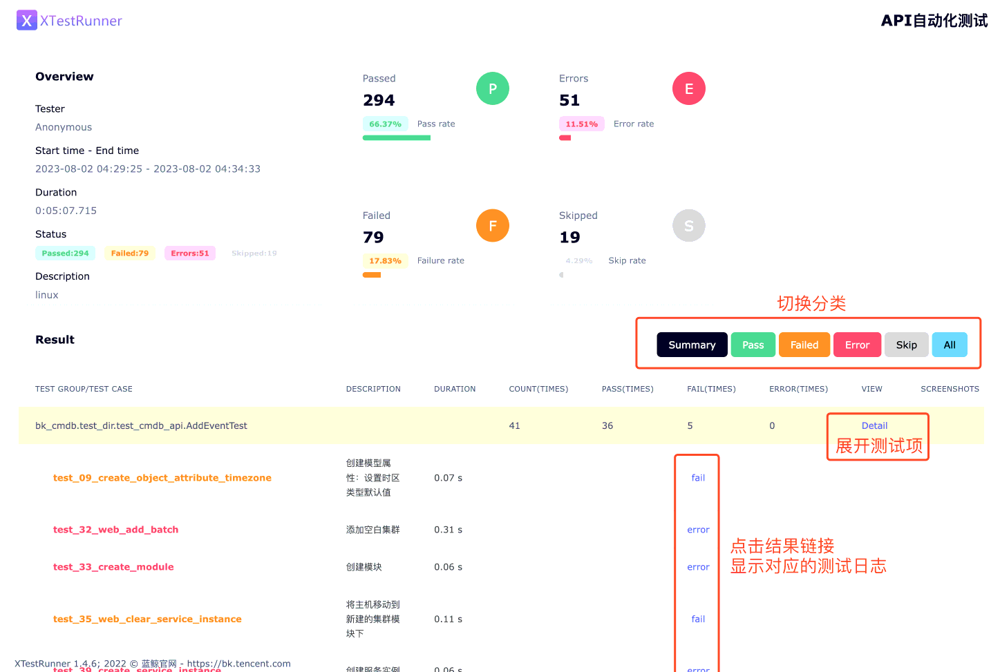

欢迎体验蓝鲸自动化 API 测试工具。

# 须知
1. 在执行测试任务时，bk-apicheck 会调用对应平台的 API 创建并删除数据。鉴于平台大都实现为了软删除（标记删除，但记录保留），因此你开始使用时，新增资源的自增 ID 不是从 1 开始。
2. 部署完成后，会自动开始第一轮全量测试。
3. 全量测试包括“监控平台”。如果第一轮全量测试时尚未部署，会导致测试结果为 “failed”。后续可以在界面上单独对其测试。

# 部署 bk-apicheck
部署 bk-apicheck:
``` bash
helmfile -f 05-bkapicheck.yaml.gotmpl sync
```

等待命令执行完毕，结尾输出如下即为更新成功：
>``` plain
>UPDATED RELEASES:
>NAME          CHART                  VERSION
>bk-apicheck   blueking/bk-apicheck   2.1.2
>```


# 使用 bk-apicheck
## 访问地址
目前预置的域名为 `bk-apicheck.$BK_DOMAIN`。操作步骤已经并入 《部署步骤详解 —— 后台》 文档 的 “[配置用户侧的 DNS](manual-install-bkce.md#hosts-in-user-pc)” 章节。

配置 DNS 或 hosts 成功后，需要在浏览器输入域名访问。暂时无法在蓝鲸桌面打开。

访问界面如下图所示：


## 界面用法

我们提供了 “全量 API” 模式和一些系统的单项测试，二者是独立的。所以执行“全量 API”任务后，不会出现单项的报告。

初次部署会自动进行一次“全量 API”测试，请耐心等待任务完成，期间无法重复发起任务。

点击每个卡片里的 “执行” 按钮，即会发起测试任务。测试完毕后会自动跳转到报告页。全量测试耗时 8-15 分钟，其余单平台测试每个 1-3 分钟。

下图为一个测试报告：


>**注意**
>
>* 当报告页提示“您访问的报告不存在”：说明尚未开始执行测试。可以重新点击“执行”按钮试试，并登录中控机检查 pod 是否产生异常日志。
>* 当报告页白屏：说明正在执行测试，历史报告已被清空。可以稍等几分钟刷新页面。


# 停止 bk-apicheck
目前 bk-apicheck 尚无鉴权。因此在测试完毕后，应该尽快停止此服务，以避免潜在的信息泄漏风险。

``` bash
helmfile -f 05-bkapicheck.yaml.gotmpl destroy
```

# 下一步
回到《[部署基础套餐](install-bkce.md#next)》文档看看其他操作。
