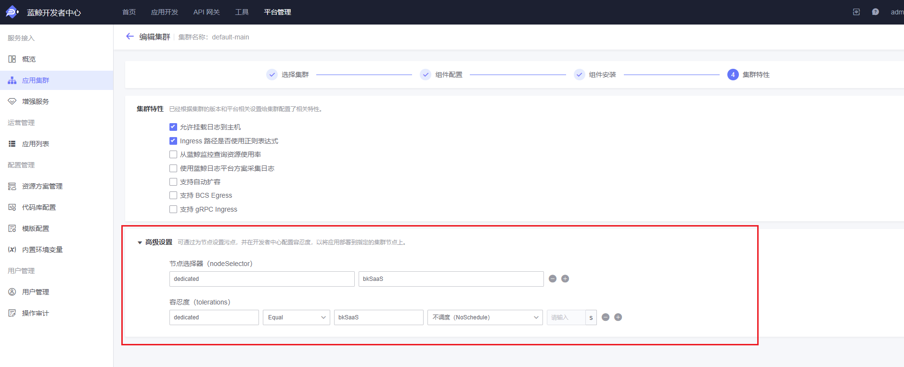
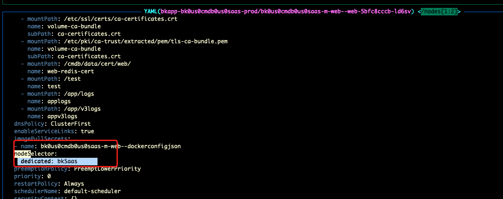

在资源充足的情况下，可以为 SaaS/应用分配专用的 Kubernetes Node，避免构建与运行阶段的高 IO/高 CPU 波动影响同节点上的其他业务 Pod。通过 Kubernetes 污点（taint）与容忍度（toleration）配合节点标签（label），可以实现“专机专用”。

## 版本信息
PaaS：1.7.0-alpha.53以上（支持云原生应用）

## 前置条件：准备节点

先在 Kubernetes 集群中为目标 Node 添加 label 与 taint（以下示例将专用池命名为 bkSaaS）：

```bash
kubectl label nodes <node-name> dedicated=bkSaaS
kubectl taint nodes <node-name> dedicated=bkSaaS:NoSchedule
```

说明：
*   label 用于 `nodeSelector` 匹配。
*   taint 用于阻止未容忍该污点的 Pod 调度到专用节点。

## 配置项说明

*   **节点选择器（nodeSelector）**: JSON 对象，键值均为字符串，用于作为 Pod 的 `nodeSelector`。
*   **污点容忍度（tolerations）**: JSON 数组，每个元素为一个 Kubernetes `toleration` 条目。

用途：让“部署到本集群的应用”默认调度到匹配标签的节点，或允许其调度到带有指定污点（taint）的节点。

## 方法一：在页面配置（推荐）

入口：平台管理 -> 应用集群 -> 新增/编辑集群 -> 第四步「集群特性」-> 「高级设置」。

   

### 节点选择器示例

```json
{"dedicated": "bkSaaS"}
```

### 污点容忍度示例

```json
[
  {
    "key": "dedicated",
    "operator": "Equal",
    "value": "bkSaaS",
    "effect": "NoSchedule"
  }
]
```

规则说明：
*   `operator` 支持 `Equal` / `Exists`。
    *   当为 `Equal` 时必须提供 `value`。
    *   当为 `Exists` 时不应提供 `value`。
*   `effect` 支持 `NoSchedule` / `PreferNoSchedule` / `NoExecute`。
    *   仅当 `effect` 为 `NoExecute` 时才允许配置 `tolerationSeconds`。

## 方法二：通过 Chart 环境变量注入（用于初始化默认集群）

当使用 Chart/初始化 Job 创建默认集群时，可通过环境变量注入同样的默认调度配置：

```bash
PAAS_WL_CLUSTER_NODE_SELECTOR='{"dedicated":"bkSaaS"}'
PAAS_WL_CLUSTER_TOLERATIONS='[{"key":"dedicated","operator":"Equal","value":"bkSaaS","effect":"NoSchedule"}]'
```

说明：
*   以上环境变量会在初始化默认集群时写入集群的默认调度配置。
*   JSON 字符串需保证可被解析（注意引号与转义）。

## 验证
*   部署到该集群的应用默认调度到带有 `dedicated=bkSaaS` 标签的节点。
*   应用yaml配置文件有相应的nodeSelector和tolerations配置。


## 问题排查

*   Pod 调度到其他节点：
    *   检查 Node 是否已正确设置 label/taint，且 key/value 与平台配置保持一致。
    *   检查集群「高级设置」中 nodeSelector/tolerations 是否保存成功并已对目标集群生效。
    *   检查专用节点资源是否充足；资源不足时调度可能失败并触发回退/重调度。
*   保存集群配置时报错 “ingress_config: frontend_ingress_ip”：
    *   填写集群的“集群出口 IP/访问入口 IP（frontend_ingress_ip）”后再保存。

