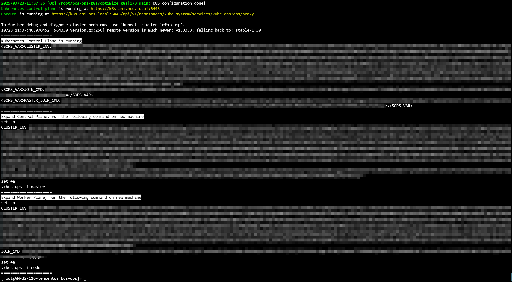
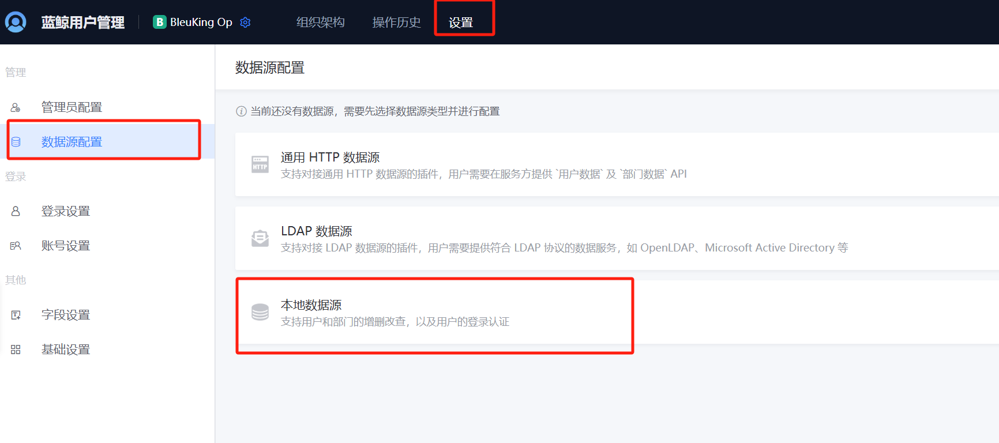
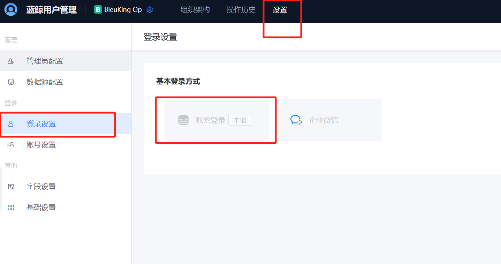
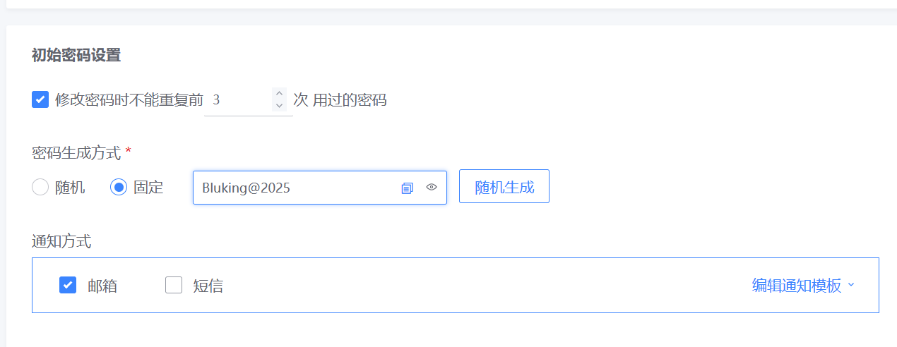
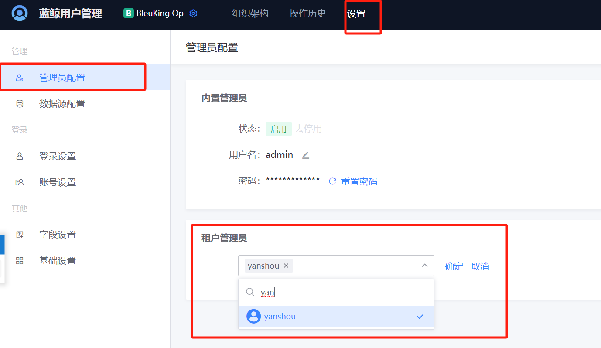
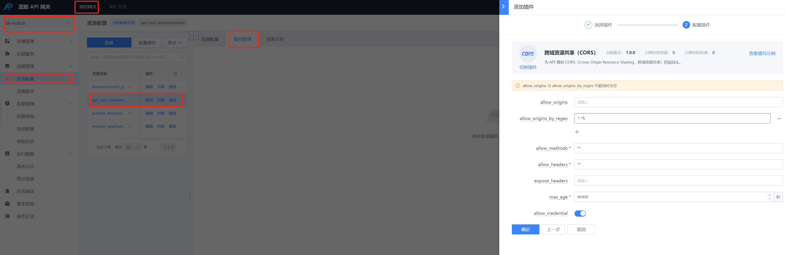
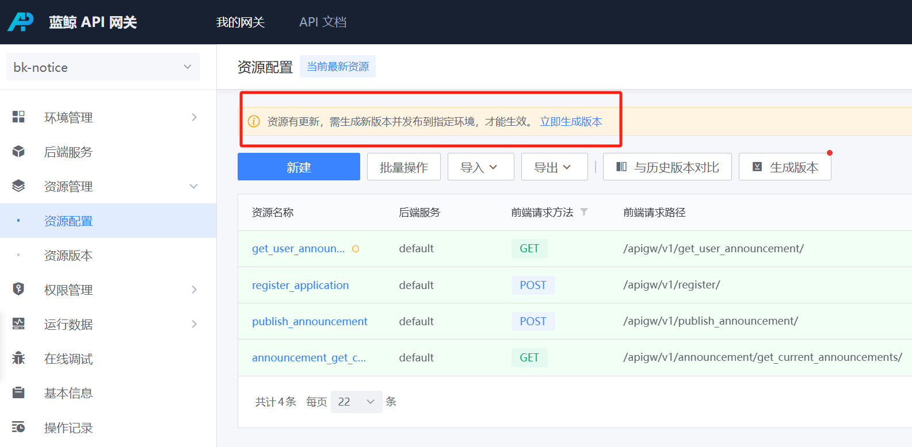

部署过程大致可以分为以下几个阶段：
1. 初始化中控机
2. 部署 k8s 集群
3. 完善配置文件
4. 部署存储服务
5. 部署基础套餐
6. 部署容器管理套餐


# 需要提供的包

- [部署 helmfile 包](https://github.com/TencentBlueKing/helmfile-d/archive/refs/tags/7.3.0-tenant-alpha.8.tar.gz) 
- saas 包

# 机器信息

配置参考 [环境要求](https://bk.tencent.com/docs/markdown/ZH/DeploymentGuides/7.2/prepare.md)

本文使用：
- k8s master 8C32G TencentOS 3.2 * 1
- k8s node 8C32G TencentOS 3.2 * 4

# 版本列表

## 公共组件

| NAME              | VERSION |
|-------------------|------------|
| kubernetes    | 1.30     |
| containerd     | 1.6.9 | 
| bk-mysql8         | 8.0.37     |
| bk-rabbitmq       | 3.10.8     |
| bk-redis          | 6.2.7      |
| bk-redis-cluster  | 6.2.7      |
| bk-mongodb        | 7.0.12     |
| bk-elastic        | 7.16.2     |
| bk-zookeeper      | 3.8.0      |
| bk-etcd           | 3.5.4      |
| ingress-nginx  | 1.3.1    |
| provisioner       | 2.4.0   |
| bk-kafka           | 3.4.0   |
| bk-consul         |  1.12.2 |
| bk-influxdb       | 1.8.6   |

## 蓝鲸

| NAME                        | CHART VERSION                                | APP VERSION      |
|-----------------------------|----------------------------------------|-----------------|
| bk-repo                     | 2.2.5-beta.1                           | v2.2.5-beta.1      |
| bk-auth                     | 1.1.0-alpha.3                          | 1.1.0-alpha.3           |
| bk-apigateway               | 1.17.0-beta.1                        | 1.17.0-beta.1          |
| bk-user                     | 3.0.1-alpha.60                         | v3.0.1-alpha.60          |
| bk-iam                      | 1.14.0-alpha.5                     | v1.14.0-alpha.5        |
| bk-ssm                      | 1.1.0-alpha.2                          | 1.1.0-alpha.2          |
| bk-console                  | 0.3.0-beta.3                           | v0.3.0-beta.3           |
| bk-iam-saas                 | 1.12.0-alpha.22                        | 1.12.0-alpha.22        |
| bk-iam-search-engine        | 0.1.4                                  | v1.1.4        |
| bk-gse                      | v2.1.6-beta.59                         | v2.1.6-beta.59           |
| bk-cmdb                     | 3.16.1-feature-tenant-alpha15          | 3.15.1-feature-tenant-alpha15          |
| bkpaas-app-operator         | 1.7.0-alpha.38                         | 1.7.0-alpha.38          |
| bk-paas                     | 1.7.0-alpha.38                         | 1.7.0-alpha.38         |
| bk-applog                   | 1.1.16                                 | 1.1.16          |
| bk-ingress-nginx            | 1.3.5                                  | 1.3.1   |
| bk-ingress-rule             | 0.0.4                                  | 0.0.4           |
| bk-job                      | 0.9.0-alpha.221                        | 3.12.0-alpha.221           |
| bk-nodeman                  | 2.4.8-pre-alpha.1927                  | 2.4.8-pre-alpha.1927           |
| bk-sops                     |                    |   3.35.1-alpha.0-2075         |
| cw-aitsm                    |                    | 4.5.203-rc.549           |
| bk-cmsi                     |                    |   1.1.5         |
| bk-notice                   |                    |  1.6.1.322          |
| bcs-services-stack          | 1.31.0-alpha.8-tenant                  | v1.31.0-alpha.8-tenant           |

# 可选：配置 ssh 免密登录

在 **中控机** 执行如下命令：
```bash
# 集群所有机器的IP
k8s_ips=""
test -f /root/.ssh/id_rsa || ssh-keygen -N '' -t rsa -f /root/.ssh/id_rsa  # 如果不存在rsa key则创建一个。
# 开始给发现的ip添加ssh key，期间需要你输入各节点的密码。
for ip in $k8s_ips; do
  ssh-copy-id "$ip" || { echo "failed on $ip."; break; }  # 如果执行失败，则退出
done
```

# 在中控机安装工具

> 注：本文中控机与 `k8s master` 复用

## 补齐系统命令

如下命令在部署或者下载脚本中会用到。

请在 **中控机** 执行如下命令安装：
```bash
yum install -y unzip uuid pssh
```

## 安装蓝鲸下载脚本
```bash
mkdir -p ~/bin/
curl -sSf https://bkopen-1252002024.file.myqcloud.com/ce7/7.2-stable/bkdl-7.2-stable.sh -o ~/bin/bkdl-7.2-stable.sh && chmod +x ~/bin/bkdl-7.2-stable.sh
curl -sSfo ~/bin/bkdl-7-devel.sh https://bkopen-1252002024.file.myqcloud.com/ce7/bkdl-7-devel.sh && chmod +x ~/bin/bkdl-7-devel.sh
```

在 `V7` 版本，下载脚本的默认安装目录变为了 `$HOME/bkce7.3-install/`。
建议配置 `.bashrc` 文件固定 `INSTALL_DIR` 变量：
```bash
# 下载好的文件默认放置在 `$HOME/bkce7.3-install/` 下，如有修改，请调整此变量。
INSTALL_DIR=$HOME/bkce7.3-install/
# 把上述环境变量写入 bashrc
bashrc=$HOME/.bashrc
if grep -qxF "export INSTALL_DIR=\"${INSTALL_DIR%/}\"" "$bashrc"; then
  echo "$bashrc is up-to-date."
elif grep -qE "^export INSTALL_DIR=" "$bashrc"; then
  sed -ri 's|export INSTALL_DIR=.*|export INSTALL_DIR="'"${INSTALL_DIR%/}"'"|' "$bashrc"
else
  tee -a "$bashrc" <<<"export INSTALL_DIR=\"${INSTALL_DIR%/}\""
fi
# 重新加载变量
source "$bashrc"
echo "INSTALL_DIR=\"$INSTALL_DIR\"".
```

## 安装部署所需的工具

中控机需要安装如下命令。
- `jq`：部署脚本会调用 `jq` 命令，用于在中控机解析服务端 API 返回的 JSON 响应。
- `yq`：用于解析 helmfile 模板以及 values 文件（YAML 格式）。
- `helm`：蓝鲸使用 helm 进行编排。
- `helm-diff`：用于比较 helm release 差异。方便增量更新。
- `helmfile`：鉴于 helm release 数量较多，我们使用 helmfile 来控制流程和管理配置。

使用下载脚本下载 `tools`：
```bash
bkdl-7.2-stable.sh -r latest tools
```

将下载好的命令复制到系统 PATH 路径下：
```bash
# 安装部署脚本所需的命令到 /usr/local/bin/，请确保此路径在 $PATH 中
for _cmd in helmfile helm yq jq; do
  cp -v "${INSTALL_DIR:-INSTALL_DIR-not-set}/bin/$_cmd" /usr/local/bin/
done
# 安装helm-diff插件到 $HOME 目录。
tar xf "${INSTALL_DIR:-INSTALL_DIR-not-set}/bin/helm-plugin-diff.tgz" -C ~/
```

检查 helm diff 插件：
```bash
helm plugin list
```

预期输出 diff 及其版本：
```
NAME	VERSION	DESCRIPTION
diff	3.1.3  	Preview helm upgrade changes as a diff
```


# 搭建 k8s 基座

## 下载 bcs-ops

我们在中控机下载 bcs-ops 脚本包：
```bash
bkdl-7.2-stable.sh -ur latest bcs-ops
```

## 复制 bcs-ops 到 k8s master

将 bcs-ops 脚本包传输到 k8s master 上的 `/root` 目录（可自定义）。在中控机执行：
```bash
master_ip=xxx # 本文中控机与master复用，只需执行 cp -r "$INSTALL_DIR/bcs-ops" /root/
rsync -ra "$INSTALL_DIR/bcs-ops" root@"$master_ip":/root/
```

## 部署初始 master

蓝鲸 7.3 默认使用 k8s-1.30.11 版本，选择 containerd 作为 CRI。

请在中控机（`master`）上执行此命令：
```bash
cd /root/bcs-ops
# 如果不是腾讯云机器，则配置docker.io镜像为蓝鲸镜像站，请注意我们仅提供蓝鲸部署所需的镜像。
if ! grep -qF TencentCloud /etc/cloud/cloud.cfg 2>/dev/null; then export REPO_MIRRORS=https://hub.bktencent.com; fi
# 使用变量决定 k8s 版本及 cri 类型
K8S_VER="1.30.11" CRI_TYPE="containerd" ./bcs-ops -i master
```
安装成功后输出如下图所示



这表示你成功部署了一个 k8s 集群，此时你可以使用 `kubectl` 命令了。接下来开始添加节点吧。

## 扩容节点

### 复制 bcs-ops 到新机器

将 bcs-ops 脚本包传输到 **待扩容的机器** 上的 `/root` 目录（可自定义）。在 **中控机** 执行：
```bash
k8s_ips="IP1 IP2..."
for k8s_ip in $k8s_ips; do
  rsync -ra "$INSTALL_DIR/bcs-ops" root@"$k8s_ip":/root/
done
```
>**注意**
请务必从 **中控机** 的模板目录 `$INSTALL_DIR/bcs-ops` 复制。从集群其他节点复制的安装目录会携带对应节点的信息，引发集群混乱。

### 获取扩容命令

在 **初始 master** 上执行如下命令可显示扩容命令：
```bash
# 注意这是 master node 上的 bcs-ops 目录，不是中控机的。
cd /root/bcs-ops
./bcs-ops -r joincmd
```

### 可选：配置 containerd insecure registry

如果使用内网容器镜像仓库，可能没有有效的 SSL 证书，则无法正常拉取镜像。此时可以配置 containerd 使用 http 拉取镜像。
在 **待扩容的机器** 上执行：
```bash
# 注意这是 node 上的 bcs-ops 目录，不是中控机的。
cd /root/bcs-ops
./k8s/insecure_registry.sh -c containerd -a 容器镜像仓库域名
```
### 执行扩容

---

临时：
```bash
k8s_node="IP1 IP2..."
pssh -H "${k8s_node}" -t 1200 --user root -I < <(/root/bcs-ops/bcs-ops -r joincmd |& awk '/Expand Worker Plane/,/-i node/' | grep -v 'Expand Worker Plane' | sed -r 's#.*(bcs-ops)#/root/bcs-ops/\1#')
```

---

在 **待扩容的机器** 上，先进入 `/root/bcs-ops`目录，然后粘贴刚才复制的命令：
```bash
# 注意这是 node 上的 bcs-ops 目录，不是中控机的。
cd /root/bcs-ops
# 如果不是腾讯云机器，则配置docker.io镜像为蓝鲸镜像站，请注意我们仅提供蓝鲸部署所需的镜像。
if ! grep -qF TencentCloud /etc/cloud/cloud.cfg 2>/dev/null; then export REPO_MIRRORS=https://hub.bktencent.com; fi
# 粘贴刚才复制的扩容命令并执行：
#set -a
#...
#./bcs-ops -i ...
```
扩容成功后, 会在结尾输出:
```
This node has joined the cluster:
* Certificate signing request was sent to apiserver and a response was received.
* The Kubelet was informed of the new secure connection details.

Run 'kubectl get nodes' on the control-plane to see this node join the cluster.

Created symlink /etc/systemd/system/multi-user.target.wants/kubelet.service → /usr/lib/systemd/system/kubelet.service.
```
 
# 在中控机管理集群

## 在中控机安装 kubectl

如果你的 **中控机** 同时兼任 `master`，则可 **跳过本章节**。

你可以参考 k8s 官方文档安装： https://kubernetes.io/zh/docs/tasks/tools/install-kubectl-linux/

在 **中控机** 上执行如下命令：
```bash
curl -LO https://dl.k8s.io/release/v1.30.0/bin/linux/amd64/kubectl
install -o root -g root -m 0755 kubectl /usr/local/bin/kubectl
```

## 配置 kubectl 命令行补全

在 **中控机** 上执行如下命令：
```bash
yum install -y bash-completion
mkdir -p /etc/bash_completion.d/
# 写入默认的命令行补全配置文件。
kubectl completion bash > /etc/bash_completion.d/kubectl
# 补全会在下次登录时加载。如需在当前会话补全，主动加载之。
source /etc/bash_completion.d/kubectl
```

## 配置 kubectl 连接集群

如果你的 **中控机** 同时兼任 `master`，则可 **跳过本章节**。
在 **中控机** 上执行如下命令（请替换 `k8s-master`为具体的主机名或 IP）：
```bash
mkdir -p ~/.kube
# 复制kubeconfig，如未配置免密登录请输入master的密码
cp *** ~/.kube/config
chmod 600 ~/.kube/config
```

## 检查 k8s 集群节点
在 **中控机** 上执行如下命令：
```bash
kubectl get nodes
```

其输出如下所示：
```
# kubectl  get node
NAME                 STATUS   ROLES           AGE     VERSION
master-10-0-0-1      Ready    control-plane   18m     v1.30.11
node-10-0-0-2        Ready    <none>          3m46s   v1.30.11
node-10-0-0-3        Ready    <none>          3m20s   v1.30.11
node-10-0-0-4        Ready    <none>          3m46s   v1.30.11
node-10-0-0-5        Ready    <none>          3m44s   v1.30.11
```

## 配置默认命名空间

设置 k8s 默认 ns, 方便后续操作。在中控机执行：
```bash
kubectl config set-context --current --namespace=blueking
```

## 可选：适配 localpv

bcs-ops 适配多种存储类，故不再制备 pv 目录。
如果你决意使用 localpv，请继续操作。
>**注意**
node 需要先加入集群，然后才能执行此命令。

需要登录到各 node 上操作（如果希望让 master 能提供 pv，则也需操作）：
```bash
# 注意这是 node 上的 bcs-ops 目录，不是中控机的。
cd /root/bcs-ops/
# 设置localpv的目录和数量。注意LOCALPV_DST_DIR需要和 values 里的 `localpv.hostDir` 一致
export LOCALPV_DIR=/data/bcs/localpv LOCALPV_DST_DIR=/mnt/blueking LOCALPV_COUNT=20
./system/mount_localpv
```
如果有扩容新机器，记得在新机器上执行。

# 自定义配置

## 下载所需的资源文件

请在 **中控机** 使用如下命令下载文件到 `$INSTALL_DIR` 目录。
```bash
bkdl-7-devel.sh -ur "latest" bkhelmfile demo scripts # 这里bkhelmfile用新包来覆盖
```

## 配置 helm 仓库

```bash
helm repo add blueking https://hub.bktencent.com/chartrepo/dev && helm repo update
```

## 配置全局 custom-values

导入自定义配置
```bash
cd $INSTALL_DIR/blueking/  # 进入工作目录
BK_DOMAIN=bkce7-tenant.bktencent.com # 自行更改域名
BK_ADMIN_PASSWD=$(tr -cd '0-9a-zA-Z!@#$%'< /dev/urandom|head -c 24;echo) # 生成默认租户账号超管登录密码
bkApigwToBkUserInnerBearerToken=$(tr -cd '0-9a-zA-Z'< /dev/urandom|head -c 32;echo) # 生成网关调用登录或用户管理内部 api token

cat >> ./environments/default/custom.yaml << EOF
imageRegistry: hub.bktencent.com/dev
domain:
  bkDomain: $BK_DOMAIN
  bkMainSiteDomain: $BK_DOMAIN

bkuser:
  ## 默认租户初始超级管理员密码，注意：该配置仅首次部署初始化默认租户时候生效
  initialAdminPassword: "${BK_ADMIN_PASSWD}"
  bkApigwToBkUserInnerBearerToken: "${bkApigwToBkUserInnerBearerToken}"
apps:
  bkappFilebeat:
    containersLogPath: $(./scripts/get_cri_root_dir.sh) # 到 node 上 containerd config dump

EOF
```

## 生成 values 文件

还有一些 values 文件随着部署环境的不同而变化，所以我们提供了脚本快速生成。

### 生成蓝鲸 app code 对应的 secret
```bash
./scripts/generate_app_secret.sh ./environments/default/app_secret.yaml
```

### 生成 apigw 所需的 keypair
```bash
./scripts/generate_rsa_keypair.sh ./environments/default/bkapigateway_builtin_keypair.yaml
```

### 生成 paas 所需的 clusterAdmin
```bash
./scripts/create_k8s_cluster_admin_for_paas3.sh
```

## 安装localpv
```bash
helmfile -f 00-localpv.yaml.gotmpl sync
```


## 安装 ingress controller

```bash
helmfile -f 00-ingress-nginx.yaml.gotmpl sync
kubectl get pods -A -l app.kubernetes.io/name=ingress-nginx  # 查看创建的pod
```

## 配置 coredns

在部署过程中，会在容器内访问这些域名，所以需要提前配置 coredns，将蓝鲸域名解析到 service IP。
>**注意**
>
当 service 被删除，重建后 clusterIP 会变动，此时需刷新 hosts 文件。

因此需要注入 hosts 配置项到 `kube-system` namespace 下的 `coredns` 系列 pod，步骤如下：
```bash
cd $INSTALL_DIR/blueking/  # 进入工作目录
BK_DOMAIN=$(yq e '.domain.bkDomain' environments/default/custom.yaml)  # 从自定义配置中提取, 也可自行赋值
IP1=$(kubectl get svc -A -l app.kubernetes.io/instance=ingress-nginx -o jsonpath='{.items[0].spec.clusterIP}')
./scripts/control_coredns.sh update "$IP1" $BK_DOMAIN bkrepo.$BK_DOMAIN docker.$BK_DOMAIN bkapi.$BK_DOMAIN bkpaas.$BK_DOMAIN bkiam-api.$BK_DOMAIN bkiam.$BK_DOMAIN apps.$BK_DOMAIN bknodeman.$BK_DOMAIN job.$BK_DOMAIN jobapi.$BK_DOMAIN cmdb.$BK_DOMAIN apigw.$BK_DOMAIN bkuser.$BK_DOMAIN
```

确认注入结果，执行如下命令：
```bash
cd $INSTALL_DIR/blueking/  # 进入工作目录
./scripts/control_coredns.sh list
```
参考输出如下：
```
        10.244.0.5 bkce7-tenant.bktencent.com
        10.244.0.5 bkrepo.bkce7-tenant.bktencent.com
        10.244.0.5 docker.bkce7-tenant.bktencent.com
        10.244.0.5 bkapi.bkce7-tenant.bktencent.com
        10.244.0.5 bkpaas.bkce7-tenant.bktencent.com
        10.244.0.5 bkiam-api.bkce7-tenant.bktencent.com
        10.244.0.5 bkiam.bkce7-tenant.bktencent.com
        10.244.0.5 apps.bkce7-tenant.bktencent.com
        10.244.0.5 bknodeman.bkce7-tenant.bktencent.com
        10.244.0.5 job.bkce7-tenant.bktencent.com
        10.244.0.5 jobapi.bkce7-tenant.bktencent.com
        10.244.0.5 cmdb.bkce7-tenant.bktencent.com
        10.244.0.5 apigw.bkce7-tenant.bktencent.com
        10.244.0.5 bkuser.bkce7-tenant.bktencent.com
```

# 部署蓝鲸存储服务

```bash
helmfile -f base-storage.yaml.gotmpl sync
```

# 部署基础套餐

接下来的部署过程中，默认工作目录为 `$INSTALL_DIR/blueking/`。

## 部署基础套餐后台

> **注：多租户开关  `enableMultiTenantMode` 默认是 `true`**

```bash
helmfile -f base-blueking.yaml.gotmpl  -l seq=first sync
```

bkiam-saas 生成32位随机字符串作为 ITSM 系统的 token（首次部署后不可修改）

```bash
cd $INSTALL_DIR/blueking/  # 进入工作目录
bkItsmSystemToken=$(tr -cd '0-9a-zA-Z!@#$%^&*'< /dev/urandom|head -c 32;echo)
touch ./environments/default/bkiam-saas-custom-values.yaml.gotmpl
yq -i ".bkItsmSystemToken=\"${bkItsmSystemToken}"" ./environments/default/bkiam-saas-custom-values.yaml.gotmpl

# 检查输出
yq ".bkItsmSystemToken" ./environments/default/bkiam-saas-custom-values.yaml.gotmpl
```

继续部署
```bash
helmfile -f base-blueking.yaml.gotmpl  -l seq=second sync
```

创建虚拟用户
```bash
./scripts/bk-tenant-admin.sh vuser system set bk_admin bk_admin
# 预期出现 "Successfully upserted virtual user: bk_admin"
```

继续部署
```bash
helmfile -f base-blueking.yaml.gotmpl  -l seq=third sync
```

> 注： 这里要检查 cmdb init job 的日志，确保权限已经注册成功

再次执行租户权限初始化动作
```bash
./scripts/bk-tenant-admin.sh create system Bluking@2025 # 密码随意指定
# 部分产品还未部署完可能会出现初始化报错，等待起来之后多次执行上述命令即可
```

## 绑定 bk-gse 所在主机（可选）

```bash
node_gse_data=$(kubectl get pod -A -l app=gse-data -o jsonpath='{.items[0].spec.nodeName}')
node_gse_file=$(kubectl get pod -A -l app=gse-file -o jsonpath='{.items[0].spec.nodeName}')
node_gse_task=$(kubectl get pod -A -l app=gse-cluster -o jsonpath='{.items[0].spec.nodeName}')

touch environments/default/bkgse-ce-custom-values.yaml.gotmpl
yq -i ".nodeSelector = {\"kubernetes.io/os\":\"linux\"} |
.gseData.nodeSelector = {\"kubernetes.io/hostname\": \"$node_gse_data\"} |
.gseFile.nodeSelector = {\"kubernetes.io/hostname\": \"$node_gse_file\"} |
.gseCluster.nodeSelector = {\"kubernetes.io/hostname\": \"$node_gse_task\"}" environments/default/bkgse-ce-custom-values.yaml.gotmpl

# 重新部署生效
helmfile -f base-blueking.yaml.gotmpl  -l name=bk-gse apply
```

## 部署作业平台

```bash
helmfile -f base-blueking.yaml.gotmpl  -l seq=fourth sync
```

## 客户端配置 hosts 解析（可选）

注：中控机也需要配置

```bash
cd ${INSTALL_DIR:-~/bkce7.3-install}/blueking && ./scripts/dns-helper.sh $(ssh $(kubectl get pods -A -l app.kubernetes.io/name=ingress-nginx -o jsonpath='{.items[0].status.hostIP}') 'curl -s ip.sb')
```

## 运营租户配置数据源

获取运营租户管理员登录入口后页面访问输入账号即可
默认账号：admin / Bluking@2024，也可从命令获取密码 `helm get values bk-user | yq -oprops | grep bkuser.initialAdminPassword` 
```bash
./scripts/bk-tenant-admin.sh create system Bluking@2025 |& grep IDP
# 预期输出 https://bk-tenant-v7.bktencent.com/login/builtin-management-auth/idps/***********/
```

**配置本地数据源**



**登录设置**



建议将密码生成方式配置为固定，该租户下新增用户的密码固定为 `Bluking@2025`



配置租户管理员账号，用户名自行定义，该账号仅用于用户管理本身的租户数据管理




## 权限中心同步租户

```bash
kubectl exec -n blueking deploy/bkiam-saas-web bkiam-saas -- python manage.py sync_organization --tenant_id=system
# 预期出现 "tenant(system) sync organization successfully"
```

## 配置 .bashrc 文件固定 userid 变量

请根据自己环境修改管理员用户名，在用户管理界面点击查看用户详情也可以查到 “`userid`”

假设这里管理员用户为 `yanshou` ，这里管理员指的是所有产品的管理员而不是租户数据管理

```bash
# 这里管理员用户请根据自己环境修改
tenant_supermanager_userid=$(kubectl -n blueking exec bk-mysql8-0 -- mysql -uroot -pblueking bkuser -NsBe 'select tenant_user_id from tenant_tenantuseridrecord where code="yanshou" and tenant_id="system";')

# 把上述环境变量写入 bashrc
bashrc=$HOME/.bashrc
if grep -qxF "export tenant_supermanager_userid=\"${tenant_supermanager_userid}\"" "$bashrc"; then
  echo "$bashrc is up-to-date."
elif grep -qE "^export tenant_supermanager_userid=" "$bashrc"; then
  sed -ri 's|export tenant_supermanager_userid=.*|export tenant_supermanager_userid="'"${tenant_supermanager_userid}"'"|' "$bashrc"
else
  tee -a "$bashrc" <<<"export tenant_supermanager_userid=\"${tenant_supermanager_userid}\""
fi
# 重新加载变量
source "$bashrc"
echo "tenant_supermanager_userid=\"$tenant_supermanager_userid\"".
```

## 给租户下的管理员用户授权

管理员用户请根据自己环境修改

```bash
./scripts/bk-tenant-admin.sh grant ${tenant_supermanager_userid} iam ALL # 授权权限中心管理员
./scripts/bk-tenant-admin.sh su ${tenant_supermanager_userid} paas # 授权开发者中心管理员
./scripts/bk-tenant-admin.sh su ${tenant_supermanager_userid} bkrepo # 授权制品库，该步骤需要用户登录访问过制品库页面才行
./scripts/bk-tenant-admin.sh grant ${tenant_supermanager_userid} gw ALL # 授权 API 网关
```

## 上传 PaaS runtimes 到制品库

### 下载基础文件

```bash
bkdl-7.2-stable.sh -C ce7/paas-runtimes -ur paas3-1.5 common

for v in 2.7.18 3.6.8 3.6.12 3.10.5 3.11.10; do
  bkdl-7.2-stable.sh -C ce7/paas-runtimes -r paas3-1.5 python=$v
done
# 这些pip同时提供py2和py3版本。
for v in 9.0.2 19.1.1 20.0.2 20.1.1 20.2.3 20.2.4 20.3.4; do
  bkdl-7.2-stable.sh -C ce7/paas-runtimes -r paas3-1.5 pip-whl-py23=$v
done
# 这些pip仅提供py3版本。
for v in 21.3.1 22.0.4 22.1.2 22.2.2 22.3.1 23.0.1; do
  bkdl-7.2-stable.sh -C ce7/paas-runtimes -r paas3-1.5 pip-whl=$v
done

for v in 10.10.0 12.16.3 14.16.1 16.16.0; do
  bkdl-7.2-stable.sh -C ce7/paas-runtimes -r paas3-1.5 node=$v
done

for v in 1.12.17 1.17.10 1.18.6 1.19.1 1.20.14 1.22.3; do
  bkdl-7.2-stable.sh -C ce7/paas-runtimes -ur paas3-1.5 go=$v
done

# 下载python开发框架模板
bkdl-7.2-stable.sh -C ce7/paas-runtimes -ur paas3-1.5 pysdk
# 下载node开发框架模板
bkdl-7.2-stable.sh -C ce7/paas-runtimes -ur paas3-1.5 nodesdk
# 下载golang开发框架模板
bkdl-7.2-stable.sh -C ce7/paas-runtimes -ur paas3-1.5 gosdk
```

### 上传文件

在 **中控机** 执行如下命令上传文件到制品库 `bkpaas` 项目下。
```bash
cd $INSTALL_DIR/blueking/  # 进入工作目录
# 从 bk-repo secret中的 BLOBSTORE_BKREPO_CONFIG 变量读取账户信息并设置变量 PROJECT ENDPOINT USERNAME PASSWORD
source <(kubectl get secret -n blueking bkpaas3-apiserver-bkrepo-envs -o json | jq -r '.data.BLOBSTORE_BKREPO_CONFIG|@base64d|gsub(", ";"\n")|gsub("[{}]";"")')
# 搜索文件列表上传
while read filepath; do
  bucket="${filepath#../paas-runtimes/}"
  bucket="${bucket%%/*}"
  remote="/${filepath#../paas-runtimes/*/}"
  remote="${remote%/*}/"
  scripts/bkrepo_tool.sh -u "$USERNAME" -p "$PASSWORD" -P "$PROJECT" -i "$ENDPOINT/generic" -n "$bucket" -X PUT -O -R "$remote" -T "$filepath"
  sleep 1
done < <(find ../paas-runtimes/ -mindepth 2 -type f)
```

## 部署 SaaS

### 配置 node DNS

需要确保 node 能正常访问蓝鲸制品库的 Docker Registry 服务（入口域名为前面章节中配置的 `docker.$BK_DOMAIN`）。
一般配置 DNS 系统，或者修改 node 的 `/etc/hosts` 文件实现域名解析。
因为 node 内都使用 服务 IP 访问，所以域名指向 ingress 的 Cluster IP。
在中控机执行命令显示 hosts 项：
```bash
cd $INSTALL_DIR/blueking/  # 进入工作目录
BK_DOMAIN=$(yq e '.domain.bkDomain' environments/default/custom.yaml)  # 从自定义配置中提取, 也可自行赋值
IP1=$(kubectl get svc -A -l app.kubernetes.io/instance=ingress-nginx -o jsonpath='{.items[0].spec.clusterIP}')
kubectl get nodes -o=yaml | yq .items[].status.addresses[0].address | xargs -i ssh {} "echo -e \"$IP1 docker.$BK_DOMAIN\n$IP1 bkrepo.$BK_DOMAIN\" >> /etc/hosts"
```

### 可选：忽略 containerd 的 https 证书检查

>** 如果环境为 https，可忽略该步骤**

在 **中控机** 执行：
```bash
cd $INSTALL_DIR/blueking/  # 进入工作目录
# 取全部 node 的ip，包括master
all_nodes="$(kubectl get nodes -o jsonpath='{.items[*].status.addresses[?(@.type=="InternalIP")].address}')"
# 从自定义配置中提取, 也可自行赋值
BK_DOMAIN=$(yq e '.domain.bkDomain' environments/default/custom.yaml) 
# bkrepo-docker 服务入口
bkrepo_docker_fqdn="docker.$BK_DOMAIN"
for ip in $all_nodes; do
  ssh -n "$ip" "cd /root/bcs-ops && ./k8s/insecure_registry.sh -c containerd -a $bkrepo_docker_fqdn"
done

# 重启containerd 
kubectl get nodes -o=yaml | yq .items[].status.addresses[0].address | xargs -i ssh {} 'systemctl daemon-reload'
kubectl get nodes -o=yaml | yq .items[].status.addresses[0].address | xargs -i ssh {} 'systemctl restart containerd'
```

### 消息通知中心

> 这里需要提前将 `bk_notice-V1.6.1.315_paas3.tar.gz` 版本的包放置部署saas目录并改名为 `bk_notice.tgz`

```bash
cd $INSTALL_DIR/blueking
./scripts/setup_bkce7.sh  -i notice
```

#### 配置跨域插件

授权网关给当前管理员用户
```bash
./scripts/bk-tenant-admin.sh grant  "$tenant_supermanager_userid" gw ALL # 也可将ALL 改为 bk-notice
```

进入API网关页面找到 `bk-notice` 网关配置插件 `http://apigw.bkce7-tenant.bktencent.com/`



配置后按照页面提示重新发布网关



### 蓝鲸配置平台

> 这里需要提前将 `bk_cmdb_saas` 的包放置部署 saas 目录(`$INSTALL_DIR/saas`)并命名为 `bk_cmdb_saas.tgz`

```bash
mkdir -v $INSTALL_DIR/saas # 创建目录
```
部署
```bash
cd $INSTALL_DIR/blueking
./scripts/setup_bkce7.sh -i bk_cmdb_saas
```

### 标准运维

> 这里需要提前将 ` bk_sops` 的包放置部署 saas 目录并改名为 `bk_sops.tgz`

```bash
cd $INSTALL_DIR/blueking
./scripts/setup_bkce7.sh -i sops
```

### CMSI

> 这里需要提前将 `bk_cmsi` 的包放置部署 saas 目录并改名为 `bk_cmsi.tgz`

部署
```bash
cd $INSTALL_DIR/blueking
./scripts/setup_bkce7.sh -i cmsi
```

#### 关闭应用市场

```bash
kubectl exec deploy/bkpaas3-apiserver-web -- python manage.py disable_market --app-code bk_cmsi
```

#### 初始化通知渠道（可选）

- cmsi 部署后需要初始化四个通知渠道：`mail, sms, voice, weixin`

初始化命令参考如下：
```bash
# 语音
./scripts/bk-tenant-admin.sh cmsi system voice '{"qcloud_app_id": "sss", "qcloud_app_key": "ssss"}'
# 企业微信
./scripts/bk-tenant-admin.sh cmsi system weixin '{"corp_id": "sss", "to_user": "", "wx_type": "qy", "agent_id": "4", "wx_token": "", "wx_app_id": "", "wx_secret": "", "corp_secret": "sss", "wx_template_id": ""}'
# 短信
./scripts/bk-tenant-admin.sh cmsi system sms '{"qcloud_app_id": "ss", "qcloud_app_key": "ss", "qcloud_sms_sign": "【腾讯蓝鲸】"}'
# 邮件
./scripts/bk-tenant-admin.sh cmsi system mail '{"smtp_pwd": "ss", "smtp_host": "smtp.exmail.qq.com", "smtp_port": 465, "smtp_user": "bk_sender@bktencent.com", "mail_sender": "bk_sender@bktencent.com", "smtp_usessl": True, "smtp_usetls": ""}'
```

### 流程服务

> 这里需要提前将 `cw_aitsm` 的包放置部署 saas 目录并改名为 `cw_aitsm.tgz`

部署
```bash
cd $INSTALL_DIR/blueking
./scripts/setup_bkce7.sh -i itsm
```

进入pod
```bash
kubectl -n bkapp-cw0us0aitsm-prod exec -it deploy/cw0us0aitsm--web -- /app/.heroku/python/bin/python manage.py shell
```

执行
```bash
# 同步运营租户用户数据
from bk_itsm.core.services.usermanager.tasks import refresh_organization_and_user
refresh_organization_and_user("system")
```

### 授权 saas 管理员权限

```bash
./scripts/bk-tenant-admin.sh grant "$tenant_supermanager_userid" bkapp bk_cmdb_saas bk_sops bk_cmsi cw_aitsm bk_notice
```
也可以进入页面  `https://bkpaas.${BK_DOMAIN}/backend/admin42/applications/` ， 手动授权

### 配置桌面应用

```bash
./scripts/add_user_desktop_app.sh -u $tenant_supermanager_userid -a 'bk_sops,cw_aitsm,bk_cmdb_saas,bk_notice' # 现有用户添加桌面应用
./scripts/set_desktop_default_app.sh -a 'bk_sops,cw_aitsm,bk_cmdb_saas,bk_notice' # 默认应用
```

## 部署节点管理

```bash
helmfile -f base-blueking.yaml.gotmpl -l name=bk-nodeman sync

userid='' # 用户管理页面查询对应管理员用户的id
./scripts/add_user_desktop_app.sh -u $tenant_supermanager_userid -a 'bk_job,bk_nodeman'  # 现有用户添加桌面应用
./scripts/set_desktop_default_app.sh -a 'bk_job,bk_nodeman'# 添加默认图标
```

### 安装 Agent

```bash
bkdl-7.2-stable.sh -ur latest gse_agent=2.1.6-beta.59 # 下载最新版 gse_agent 包
bkdl-7-devel.sh -ur latest gse_proxy=2.1.6-beta.59


# 下载采集插件
bkdl-7.2-stable.sh -ur latest bkmonitorbeat=3.71.3653
bkdl-7.2-stable.sh -ur latest bkunifylogbeat=7.7.2-rc.107
bkdl-7.2-stable.sh -ur latest bk-collector=0.83.3261

./scripts/setup_bkce7.sh  -u agent # 上传到制品库
./scripts/setup_bkce7.sh  -u proxy # 上传到制品库
./scripts/setup_bkce7.sh  -u plugin # 上传到制品库

./scripts/setup_bkce7.sh -u opentools # 上传到制品库
```

### 配置接入点

参考 `https://bk.tencent.com/docs/markdown/ZH/DeploymentGuides/7.2/config-nodeman.md`

注意：多租户环境制品库的项目需要加上租户前缀，例如`system.blueking`。

### 安装 Agent

参考 `https://bk.tencent.com/docs/markdown/ZH/DeploymentGuides/7.2/config-nodeman.md`

## 租户初始化

后续由各个产品初始化 system 租户

```bash
./scripts/bk-tenant-admin.sh create system Bluking@2025 # 密码随意指定
```


# 部署容器管理套餐

## 确认 storageClass

在 **中控机** 检查当前 k8s 集群所使用的存储：
```bash
kubectl get sc
```
预期输出为：
```
NAME                      PROVISIONER                    RECLAIMPOLICY   VOLUMEBINDINGMODE      ALLOWVOLUMEEXPANSION   AGE
local-storage (default)   kubernetes.io/no-provisioner   Delete          WaitForFirstConsumer   false                  3d21h
```
如果输出的名称不是 `local-storage`，则需通过创建 `custom.yaml` 实现修改：
```bash
cd $INSTALL_DIR/blueking/
cat <<EOF >> environments/default/custom.yaml
bcs:
  storageClass: 填写上面的查询到的名称
EOF
```
## 配置 coredns

容器管理平台 会在 pod 内请求 蓝鲸制品库 提供的 helm 及 docker 仓库，需确保 coredns 配置正确。
在 **中控机** 执行：
```bash
cd $INSTALL_DIR/blueking/  # 进入工作目录
BK_DOMAIN=$(yq e '.domain.bkDomain' environments/default/custom.yaml)  # 从自定义配置中提取, 也可自行赋值
IP1=$(kubectl get svc -A -l app.kubernetes.io/instance=ingress-nginx -o jsonpath='{.items[0].spec.clusterIP}')
./scripts/control_coredns.sh update "$IP1" bcs.$BK_DOMAIN bcs-api.$BK_DOMAIN docker.$BK_DOMAIN helm.$BK_DOMAIN
./scripts/control_coredns.sh list  # 检查添加的记录。
```

前面在部署完 cmdb_saas 后已经设置好业务公共变量（BCS依赖）
```bash
# 检查
./scripts/bk-tenant-admin.sh var system json
# 确保输出为如下：
{
  "default_bk_biz_id": "1"
}
```
## 部署
```bash
helmfile -f 03-bcs.yaml.gotmpl sync

./scripts/add_user_desktop_app.sh -u $tenant_supermanager_userid -a 'bk_bcs' # 现有用户添加桌面应用
./scripts/set_desktop_default_app.sh -a 'bk_bcs' # 默认应用
```

## 关闭容器监控

由于监控还未适配多租户，先将容器监控开关关掉

```bash
kubectl -n bcs-system edit cm bcs-monitor # 设置base_conf.service_enable: false
kubectl -n bcs-system rollout restart deployment bcs-monitor-api # 重启服务
```

## 授权网关权限

```bash
./scripts/bk-tenant-admin.sh grant ${tenant_supermanager_userid} gw ALL # 授权 API 网关
```
