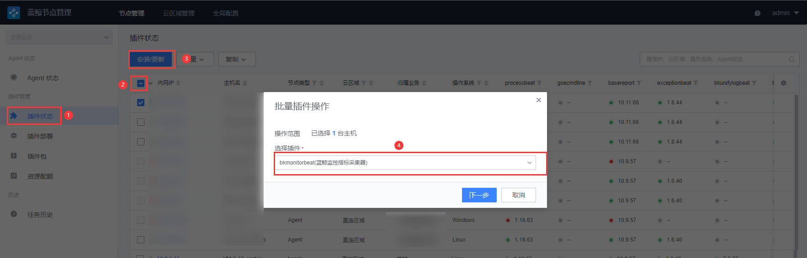
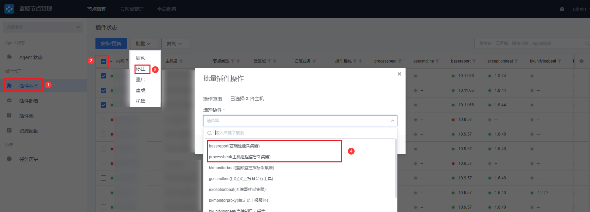
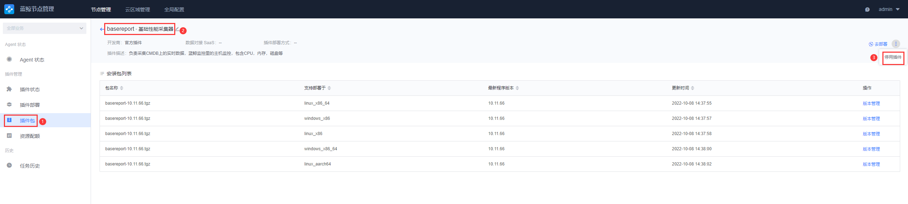

### 适用范围

- 6.1.1-beta1 升级至 6.1.2

## 说明

- 文中所述的目录路径均以默认为主，如与实际有出入，请以升级实际路径为主。
- 如无特殊说明，所述操作均在中控机执行。
- 本次升级仅面向涉及到的产品，未更新的产品不做阐述，请知悉。详细请见官网文档：[组件更新](../../维护手册/日常维护/update.md)。
- 本次升级会停止部分服务，请避开业务高峰期进行升级，以免影响业务正常运行。

## 获取更新产品信息

本次社区版 6.1.2 更新涉及产品，请查看 [版本日志](../../../../../VersionLog/6.1/v612.md)。

获取目前自身环境下的版本，以避免升级过程带来的问题：

```bash
# 获取版本
cd /data/src; grep . VERSION
# 蓝鲸各产品版本
cd /data/src; grep . */*VERSION */*/VERSION
```

## 前置准备

1. 下载相关产品包。请前往 [蓝鲸下载页](https://bk.tencent.com/download/) 下载。

   - 基础套餐包 (bkce_basic_suite-6.1.2.tgz)
   - 监控告警及日志服务套餐包 (bkce_co_package-6.1.2.tgz)

2. 将相关产品包上传至服务器 /data 目录。

3. 准备新版本部署脚本以及产品包

    ```bash
    # 创建新版本产品临时存放目录
    mkdir /data/tmp
    #将基础套餐包、监控告警及日志服务套餐包解压至临时存放目录
    tar xf bkce_basic_suite-6.1.2.tgz -C /data/tmp/
    tar xf bkce_co_package-6.1.2.tgz -C /data/tmp/
    # 解压增强包监控平台、日志平台整包
    cd /data/tmp/
    for i in *.tgz; do tar xf $i; done
    # 解压后会有各产品的目录，包含各产品的后台包以及 SaaS 包，需要将其拷贝 /data/tmp/src 目录下
    # 拷贝各产品后台包
    for pkg in $(find bklog bkmonitorv3 -name "bk*.tgz"); do cp -a $pkg /data/tmp/src; done
    # 拷贝各产品 SaaS 包
    for pkg in $(find bklog bkmonitorv3 -name "bk_*.tar.gz"); do cp -a $pkg /data/tmp/src/official_saas/; done
    ```

## 数据备份

### 备份 MySQL

该备份方式仅供参考，可自行选择备份方式。

- 登录至 MySQL 机器，创建备份目录

    ```bash
    source /data/install/utils.fc
    ssh $BK_MYSQL_IP
    # 创建备份目录
    source /data/install/utils.fc
    mkdir -p /data/dbbak
    cd /data/dbbak
    ```

- 生成备份脚本

    ```bash
    # MySQL 机器上执行
    source /data/install/utils.fc
    cat >dbbackup_mysql.sh <<\EOF
    #!/bin/bash
    ignoredblist='information_schema|mysql|test|db_infobase|performance_schema|sys'
    dblist="$(mysql --login-path=default-root -Nse"show databases;"|grep -Ewv "$ignoredblist" | xargs echo)"
    mysqldump \
      --login-path=default-root \
      --skip-opt \
      --create-options \
      --default-character-set=utf8mb4 \
      -R -E -q -e \
      --single-transaction \
      --no-autocommit \
      --master-data=2 \
      --max-allowed-packet=1G \
      --hex-blob \
      -B $dblist > /data/dbbak/bk_mysql_alldata.sql
    EOF
    ```
- 开始备份
    ```bash
    # 执行备份操作
    bash dbbackup_mysql.sh
    # 请检查导出是否正确
    grep 'CREATE DATABASE' bk_mysql_alldata.sql
    ```
### 备份 MongoDB
该备份方式仅供参考，可自行选择备份方式。
- 登录至 MongoDB 机器，创建备份目录
    ```bash
    source /data/install/utils.fc
    ssh $BK_MONGODB_IP
    # 创建备份目录
    mkdir -p /data/mongodb_bak
    ```
- 开始备份 MongoDB
    ```bash
    # MongoDB 机器上执行
    source /data/install/utils.fc
    mongodump \
      --host $BK_MONGODB_IP \
      -u $BK_MONGODB_ADMIN_USER \
      -p $BK_MONGODB_ADMIN_PASSWORD \
      --oplog \
      --gzip \
      --out /data/mongodb_bak
    ```
### 备份 install、src 目录
```bash
# 中控机执行
cp -a -r /data/install /data/install_$(date +%Y%m%d%H%M)
mv /data/src /data/src.bak
```
## 更新软件包及相关文件
1. 替换部署脚本、各产品版本包。
    ```bash
    # 替换 src 目录
    mv /data/tmp/src /data/
    # 替换部署脚本
    rsync -avz --delete --exclude=".*" --exclude="install.config" --exclude="bin/0[1234]-*" /data/tmp/install/ /data/install/
    # 解压 src 下各个产品软件包
    cd /data/src/; for f in *gz;do tar xf $f; done
    # 还原证书
    cp -a /data/src.bak/cert /data/src/
    # 还原 backup 目录
    cp -a /data/src.bak/backup /data/src/
    ```
2. 配置 install.config
    本次升级，新增了监控的 monitorv3(unify-query)，monitorv3(ingester) 模块，请合理评估机器资源后，将其分布在 install.config 文件中。可参考下述默认的模块分布。
    ```config
    10.0.0.1 iam,ssm,usermgr,gse,license,redis,consul,es7,monitorv3(influxdb-proxy),monitorv3(monitor),monitorv3(grafana),monitorv3(ingester)
    10.0.0.2 nginx,consul,mongodb,rabbitmq,appo,influxdb(bkmonitorv3),monitorv3(transfer),fta,beanstalk,monitorv3(unify-query)
    10.0.0.3 paas,cmdb,job,mysql,zk(config),kafka(config),appt,consul,log(api),nodeman(nodeman),log(grafana)
    ```
3. 新增所需变量
    ```bash
    source /data/install/utils.fc
    # 新增变量值
    echo "BK_USERMGR_REDIS_PASSWORD=${BK_REDIS_ADMIN_PASSWORD}" >> /data/install/bin/03-userdef/usermgr.env
    echo "BK_MONITOR_TRANSFER_REDIS_PASSWORD=${BK_REDIS_ADMIN_PASSWORD}" >> /data/install/bin/03-userdef/bkmonitorv3.env
    echo "BK_MONITOR_ALERT_ES7_PASSWORD=${BK_ES7_ADMIN_PASSWORD}" >> /data/install/bin/03-userdef/bkmonitorv3.env
    echo "BK_PAAS_ES7_ADDR=elastic:${BK_ES7_ADMIN_PASSWORD}@es7.service.consul:9200" >> /data/install/bin/03-userdef/paas.env
    ```


### 开始更新

### 同步部署脚本
```bash
cd /data/install
./bkcli install bkenv
./bkcli sync common
```

### 同步 nginx 配置
```bash
pcmd -m nginx "rsync -av --delete /data/install/support-files/templates/nginx/*.conf /etc/consul-template/templates" && pcmd -m nginx "systemctl  reload consul-template.service"
```

### 更新 PaaS 平台
```bash
./bkcli sync paas
./bkcli install paas
./bkcli restart paas
## 加载新增 saas 相关变量
source tools.sh && add_saas_environment 
## 检查服务状态
./bkcli check paas
```

### 更新权限中心
```bash
./bkcli upgrade bkiam
./bkcli status bkiam
./bkcli check bkiam
./bkcli install saas-o bk_iam
```

### 更新用户管理
```bash
./bkcli install saas-o bk_user_manage
pcmd -m usermgr "rmvirtualenv usermgr-api"
./bkcli sync usermgr
./bkcli install usermgr
./bkcli restart usermgr
./bkcli status usermgr
```

### 更新配置平台
```bash
./bkcli upgrade cmdb
./bkcli initdata cmdb
## 检查服务状态
./bkcli check cmdb 
```

### 更新管控平台
```bash
./bkcli upgrade gse
## 检查服务状态
./bkcli check gse
```

### 更新作业平台
```bash
./bkcli upgrade job
./bkcli check job
```

### 更新节点管理
```bash
./bkcli install saas-o bk_nodeman
./bkcli upgrade bknodeman
./bkcli status bknodeman
```

### 更新插件
```bash
./bkcli initdata nodeman
```

### 更新标准运维
```bash
./bkcli install saas-o bk_sops
```

### 更新流程服务
```bash
./bkcli install saas-o bk_itsm
```

### 监控平台、故障自愈
由于在 6.1 的版本里，故障自愈合入了监控平台，所以本次升级将监控平台以及故障自愈一起说明。
#### 重要说明
##### 迁移影响
由于故障自愈产品形态后台架构完全不同，因此本次迁移仅作数据迁移，以下几点需要在迁移之后进行人工确认
1. 告警源： 由于监控告警源对接为新模块，其中 rest 推送和 zabbix 告警源在迁移之后，需要根据新版本的说明重新进行推送事件的配置才能生效。原有的监控 3.2 对接不再支持
2. 部分组合套餐包含了内置套餐（进程 CPU 和 MEM TOP10 发送, 磁盘清理）和 使用了标准运维套餐为节点的，由于迁移不支持子流程迁移， 需要用户手动配置确认
3. 所有的自愈接入策略迁移之后，将会关闭原有自愈接入，新版本默认为不开启状态，需要用户确认
4. 原对接监控平台的自愈接入，如果设置了监控目标，请注意检查原策略是否设置了有设置监控目标，如果无， 请设置为全业务，否则小目标范围优先生效的规则将不生效。
5. 升级后监控平台之前触发的告警数据只存在数据库中，页面只会展示新生成的告警事件。
##### 迁移内容
1. 内置处理套餐的迁移
    包括以下五项，均通过调用标准运维流程实现， 其中原有的磁盘清理迁移之后为标准运维磁盘清理流程，可通过选择标准运维类型套餐来进行内置磁盘清理配置
    - 【快捷套餐】微信发送内存使用率 Top 10 进程
    - 【快捷套餐】微信发送 CPU 使用率 Top 10 进程
    - 【快捷套餐】转移主机至故障机模块
    - 【快捷套餐】转移主机至空闲机模块
    - 【自愈套餐】磁盘清理 (适用于 Linux)
2. 普通套餐的迁移
    - 原有的作业平台和标准运维套餐保持类型不变
    - 原有的 http 回调调整为 webhook 回调
    - 原有的通知不做迁移，默认使用监控的通知
    - 原有的组合套餐迁移采用标准运维流程实现，现有自愈不再支持组合套餐功能
3. 告警源的迁移， 目前支持以下四个告警源
    - rest 拉取
    - rest 推送
    - zabbix
    - 原有的监控平台对接直接接入新版监控策略
4. 自愈接入的迁移
    - 所有自愈接入的内容，将会在监控策略对应业务下创建对应的策略
    - 原有自愈接入的通知方式和人员信息，将以告警组的方式进行迁移
    - 原有的全局防御，目前迁移为同策略下的告警防御策略，见策略详情告警处理部分
#### 开始升级
1. 迁移需要配置  `BKAPP_NEED_MIGRATE_FTA = True` 环境变量。步骤：访问 【PaaS 平台】 - 【开发者中心】 - 选择【监控平台】- 添加 【环境变量】
2. 迁移是通过直连故障自愈的 DB 进行数据迁移，故障自愈 DB 如果在默认的 MySQL 服务器上，则不需要配置 DB 信息，如果自愈为独立 DB，则需要配置以下几个环境变量
    - BKAPP_FTA_DB_NAME： DB 名称
    - BKAPP_FTA_DB_USERNAME： 用户名
    - BKAPP_FTA_DB_PASSWORD： 密码
    - BKAPP_FTA_DB_HOST： 服务器 IP 或域名
    - BKAPP_FTA_DB_PORT： DB 端口
```bash
# 更新监控平台 SaaS
./bkcli install saas-o bk_monitorv3
# 更新后台服务
./bkcli sync bkmonitorv3
pcmd -m monitorv3 "rmvirtualenv bkmonitorv3-monitor"
./bkcli install bkmonitorv3
./bkcli restart bkmonitorv3
./bkcli status bkmonitorv3
./bkcli check bkmonitorv3
```
#### 检查数据迁移情况
访问 PaaS 平台，打开【监控平台】-【配置】- 【处理套餐】查看数据是否迁移过来。
如果自动迁移失败，需要手动尝试，可通过在 APPO 的机器上手动执行：bk_biz_id 为对应的业务 ID，多个以逗号分隔
```bash
source /data/install/utils.fc
ssh $BK_APPO_IP
# 请注意替换 <bk_biz_id> 为实际的业务 ID
docker exec -i $(docker ps -aqf "name=^bk_monitorv3-")  bash <<EOF
export BK_FILE_PATH=/data/app/code/conf/saas_priv.txt
cd /data/app/code/
/cache/.bk/env/bin/python manage.py migrate_fta_strategy <bk_biz_id>
EOF
```
### 日志平台
```bash
./bkcli install saas-o bk_log_search
./bkcli sync bklog
pcmd -m log "rmvirtualenv bklog-api"
./bkcli install bklog
./bkcli restart bklog
./bkcli status bklog
```

### 删除原有 topo 结构
#### 蓝鲸后台服务器请求 CMDB 接口，开放页面修改蓝鲸业务拓扑限制
```bash
source /data/install/utils.fc
curl -H 'BK_USER:admin' -H 'BK_SUPPLIER_ID:0' -H 'HTTP_BLUEKING_SUPPLIER_ID:0' -X POST $BK_CMDB_IP0:9000/migrate/v3/migrate/system/user_config/blueking_modify/true
```

#### 上一步执行成功后，蓝鲸业务集群的节点信息中即可看到 删除节点 选项，请手动删除所有蓝鲸业务下的集群


#### 删掉所有的蓝鲸集群模板与进程模板
```bash
/opt/py36/bin/python ${CTRL_DIR}/bin/create_blueking_set.py -c ${BK_PAAS_APP_CODE}  -t ${BK_PAAS_APP_SECRET} --delete
```

#### 重建蓝鲸业务拓扑
```bash
## 中控机执行
## 去除 fta 安装标记
pcmd -m fta "sed -i '/fta/d' /data/bkce/.installed_module"
./bkcli initdata topo
```

### 刷新版本信息
```bash
source /data/install/tools.sh
_update_common_info
```

### 检查服务状态
```bash
cd /data/install; echo bkssm bkiam usermgr paas cmdb gse job consul bklog bkmonitorv3 | xargs -n1 ./bkcli check
```

### 新增可选模块

#### 部署 bkiam_search_engine (可选)
```bash
## 添加 bkiam_search_engine 模块分布，请注意替换示例 IP 为实际部署的机器 IP
cat << EOF >>/data/install/install.config
[iam_search_engine]
10.0.0.3 iam_search_engine
EOF

## 获取权限中心的 app_token，并将获取到的 app_token 做为 bkiam_search_engine 的 secret
echo BK_IAM_SAAS_APP_SECRET=$(mysql --login-path=mysql-default -e "use open_paas; select * from paas_app where code='bk_iam'\G"| awk '/auth_token/{print $2}') >> /data/install/bin/03-userdef/bkiam_search_engine.env

## 渲染 bkiam_search_engine 变量
./bkcli install bkenv
./bkcli sync common

## 开始部署
./bk_install bkiam_search_engine
```

#### 部署 paas_plugin（可选）
```bash
## 增加 es7 模块
## 请注意替换示例 IP 为实际部署的机器 IP，如 es7 模块已存在则不需要再次部署
cat  << EOF >>/data/install/install.config
10.0.0.3 es7
EOF

## 开始部署
./bk_install paas_plugin
```


#### 部署 API 自动化测试工具 (可选)
```bash
## 同步安装目录文件到指定机器（默认是 nginx 模块所在的机器）
./bkcli sync bkapi

## 部署 API 自动化测试工具
./bkcli install bkapi

## 运行 API 自动化测试工具
# 如果不带<module>,默认检查所有模块的api
./bkcli check bkapi

# 单模块检查
## 目前支持的模块 bk_cmdb, bk_job, bk_gse, bk_itsm, bk_monitorv3, bk_paas, bk_sops, bk_user_manage
## 因需要检查所有的 api，花费的时间较长，请耐心等待
./bkcli check bkapi bk_job
```

## 升级后操作
### 升级 agent 以及相关插件
- 升级完成后，请前往节点管理页面操作
    1. 升级 agent、p-agent 以及采集器相关插件
    2. 重装 Proxy （涉及 proxy 二进制改动，gse_data 将取代 gse_transit，gse_transit 也在 6.1 版本下线）
    3. 由于在 6.1.2 及后续版本中，basereport、processbeat 合入了 bkmonitorbeat，所以升级后需要将所有的机器安装 bkmonitorbeat 插件
    
    1. 停止所有机器上的 basereport、processbeat 插件（该步骤需要在步骤 3 操作完后方可操作）
    
    1. 停用 basereport、processbeat 插件（该步骤需要在步骤 4 操作完后方可操作）
    
### 下架故障自愈
1. 确保故障自愈再升级迁移数据无问题后再进行操作
```bash
pcmd -m fta "systemctl disable --now bk-fta.service"
sed -i 's/fta,//g' /data/install/install.config
./bkcli sync common
# 清理 fta 版本信息
mysql --login-path=mysql-default -e "delete from bksuite_common.production_info where code='fta';"
```
2. 前往【PaaS 平台】-【开发者中心】-【S-mart 应用】 下架故障自愈。

### 还原 bkci 以及 bcs 软件包
如果之前有部署 bkci 以及 bcs 的用户，请按照该方式将相关包进行还原 `没有部署请忽略该步骤`
```bash
# bkci
mv /data/src.bak/ci/ /data/src/
# bcs
mv /data/src.bak/public-images-community.tar.gz /data/src/
mv /data/src.bak/bcs_cc-ce-1.0.28.tar.gz /data/src/
mv /data/src.bak/python.tar.gz /data/src/
mv /data/src.bak/docker-18.09.5.tgz /data/src/
mv /data/src.bak/etcd-v3.3.12-linux-amd64.tar.gz /data/src/
mv /data/src.bak/mongodb-linux-x86_64-2.4.10.tgz /data/src/
mv /data/src.bak/jdk8.tar.gz /data/src/
mv /data/src.bak/bk_bcs_app_V1.3.21.tar.gz /data/src/
mv /data/src.bak/bcs-prom-k8s-ce-1.1.1.tar.gz /data/src/
mv /data/src.bak/harbor_api_ce-1.1.1.tgz /data/src/
mv /data/src.bak/docker-compose /data/src/
mv /data/src.bak/kubeops-ce_v1.tar.gz /data/src/
mv /data/src.bak/cryptools /data/src/
mv /data/src.bak/etcd-v3.4.13-linux-amd64.tar.gz /data/src/
mv /data/src.bak/harbor_charts-1.0.6.tar.gz /data/src/
mv /data/src.bak/bcs-service.ce.1.18.10-20.11.05.2011052349.tar.gz /data/src/
mv /data/src.bak/harbor_server-v1.7.6.tar.gz /data/src/
mv /data/src.bak/bk_bcs_monitor_V1.5.4.tar.gz /data/src/
mv /data/src.bak/devops-ce-1.0.29.11.tgz /data/src/
mv /data/src.bak/bcs_web_console-ce-V1.3.21.tar.gz /data/src/
mv /data/src.bak/java8.tgz /data/src/
mv /data/src.bak/bcs-monitor-ce-1.2.12-1.el7.x86_64.rpm /data/src/
mv /data/src.bak/bcs-thanos-ce-1.2.12-1.el7.x86_64.rpm /data/src/
```
### 还原外链应用链接
```bash
## 说明：此操作针对自定义域名的用户，若沿用了默认的蓝鲸域名则不需要操作

开发者中心 -> 外链应用 -> 修改所有外链应用 [基本信息] 栏中的 [系统链接] 为自身环境正确的地址，保存即可
```

如更新过程有任何疑问及问题，请前往蓝鲸社区群 (495299374) 联系值班蓝鲸助手获取技术支持。
