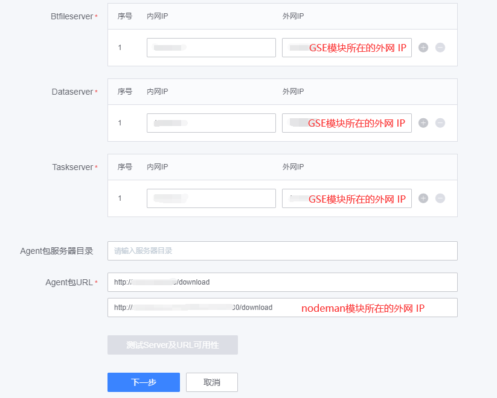

# 开启 Proxy

蓝鲸部署默认不开启 Proxy，因为部分用户存在跨云管控需求，而实现跨云管控需要安装 proxy 。

本文描述，开启 proxy 的方法，文章所涉及路径均为蓝鲸默认，如果出入，请以实际为准：

## 部署前

- 登录节点管理机器，将 nodeman 模块所在机器的外网 IP 写入指定文件。

```bash
# 中控机执行
source /data/install/utils.fc
ssh $BK_NODEMAN_IP

# 将节点管理机器外网 IP 写入指定文件
echo WAN_IP=$(curl -s icanhazip.com) >> /etc/blueking/env/local.env
```

- 将 gse 模块所在机器的外网 IP 写入至中控机指定的文件

    需要将 gse 外网写入至中控机指定文件，主要是为了解决 proxy 机器与 gse 机器的网络不通，导致无法与 gse 建立相关连接，因为未指定 gse 外网 IP 时，默认为 gse 的内网 IP。

```bash
# 中控机执行
ssh $BK_GSE_IP
echo BK_GSE_WAN_IP_LIST=$(curl -s icanhazip.com) >> /etc/blueking/env/local.env
```

- 将 gse 的 bt 模块监听 0.0.0.0 (6.0.4 之前版本需要此步骤)

```bash
# 中控机执行
sed -i '/filesvrthriftip/s/__LAN_IP__/0.0.0.0/' /data/src/gse/support-files/templates/#etc#gse#btsvr.conf
```

## 部署后

- 登录节点管理机器，将 nodeman 模块所在机器的外网 IP 写入指定文件。

```bash
# 中控机执行
source /data/install/utils.fc
ssh $BK_NODEMAN_IP

# 将节点管理机器外网 IP 写入指定文件
echo WAN_IP=$(curl -s icanhazip.com) >> /etc/blueking/env/local.env

```

- 注册 bkcfg/global/nodeman_wan_ip 至 consul

```bash
source /data/install/utils.fc
consul kv put bkcfg/global/nodeman_wan_ip $WAN_IP
```

- 重启 consul-template 关服务

```bash
systemctl restart consul-template
```

- 进入节点管理 SaaS，修改 gse 的全局配置 (该方式主要是为了解决 gse 与 proxy 内网不通时，如内网能通，请忽略该步骤)

  - 打开节点管理
  
  - 进入 【全局配置】，编辑【默认接入点】

  - 修改 `Btfileserver`、`Dataserver`、`Taskserver` 的 `外网IP列` 为实际的 GSE 外网 IP [gse 模块分布的机器]，可参考 `$CTRL_DIR/pcmd.sh -m gse "curl -s icanhazip.com" | tail -n 1`。

  - 修改 `Agent包 URL` 第二个输入框的域名，替换为节点管理的外网 IP [nodeman 模块分布的机器]，可参考 `$CTRL_DIR/pcmd.sh -m nodeman "curl -s icanhazip.com" | tail -n 1`
  
    

- 重新渲染配置

渲染配置可以选择重装或者重新渲染配置文件的方式。

```bash
./bkcli render bknodeman
```

- 重启节点管理进程

```bash
./bkcli restart bknodeman
```
