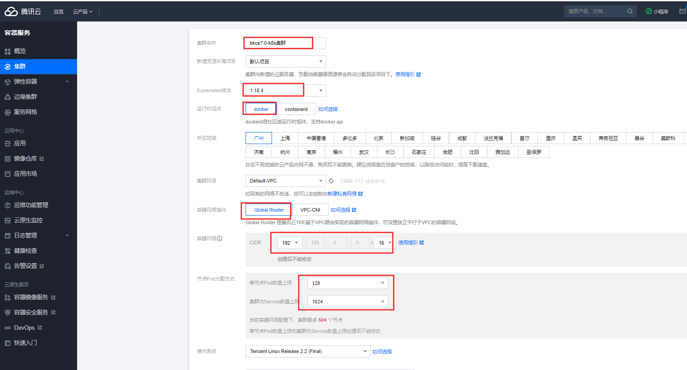
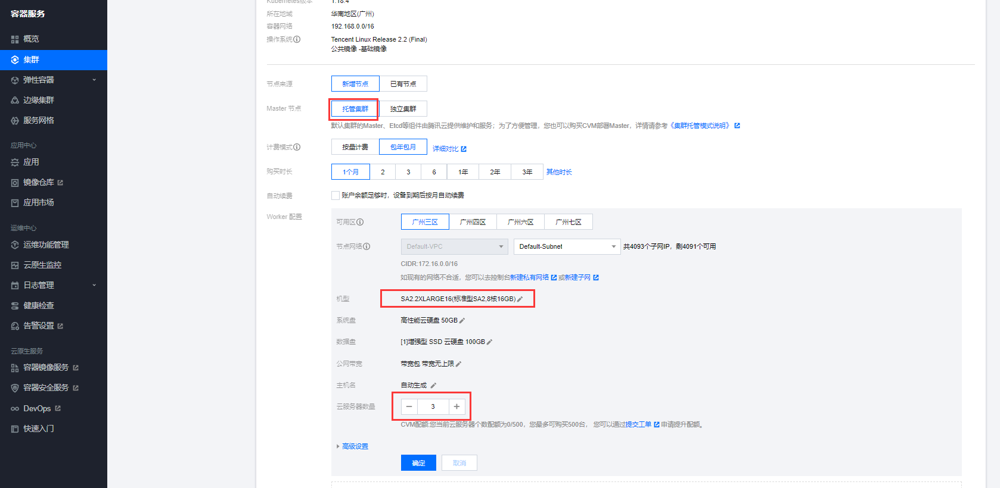
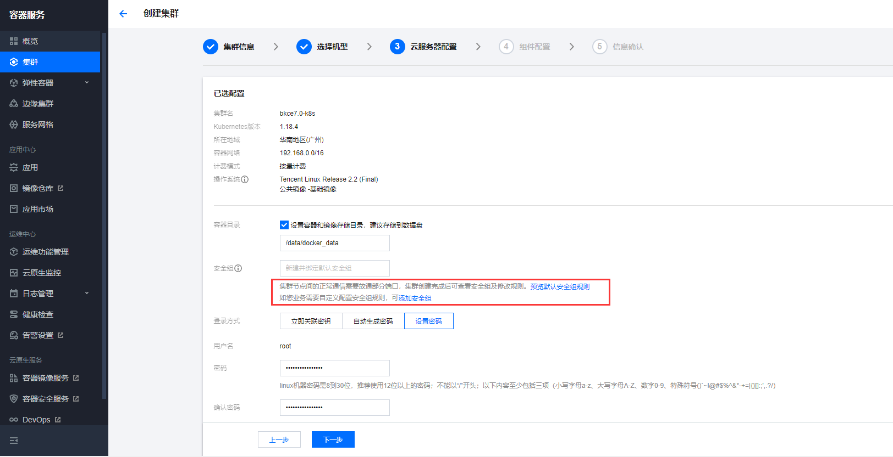
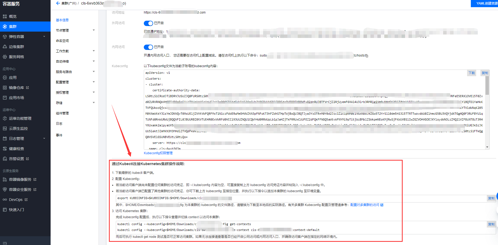
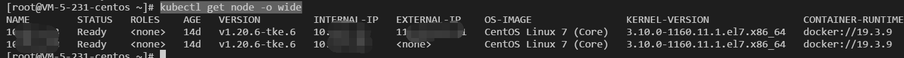

>**注意**
>
>本文档待重写，当前内容仅供参考。

# 采购腾讯云 TKE 集群
如需采购其他厂商提供的 K8S 集群服务，请阅读厂商官方的文档。

本文档基于腾讯云官方文档改写。

### 购买基础套餐部署所需 TKE 集群
https://console.cloud.tencent.com/tke2/cluster?rid=1
### 集群需求
- 版本：1.20
- 运行时组件：docker
- 容器网络插件：Global Router
- 容器网络：CIDR 自定义，不跟集群所在 VPC 网络冲突即可；建议：1024 个 Service/集群、128 个 Pod/节点、504 个节点/集群
- node 节点
 	- 基础套餐 8 核 16G 100G 硬盘 x 3 台
 	- 基础+监控日志套餐 8 核 16G 100G 硬盘 x 4 台
- master 节点：可以托管也可以自购 CVM 来独立部署，这里以托管 master 为例
>因为 master 独立部署模式至少需要 3 台 cvm，选择托管集群，另外只需要一台低配的中控机能通过 kubectl 连到集群即可，可以使用蓝鲸社区提供的 bcs.sh 脚本来初始化安装一些工具 ，如 kubectl、helm 等。注意：控制机要能访问到集群，注意设置安全组






### 初始化中控机（也可以自行下载安装 kubectl 等客户端）

使用 bcs.sh 脚本一键初始化，会部署一些常用的工具客户端，比如 kubectl、helm、docker 等，便于操作管理 TKE 集群
``` bash
curl -fsSL https://bkopen-1252002024.file.myqcloud.com/ce7/bcs.sh | bash -s -- -i k8s
```

###  部署 ingress-nginx，并禁用默认的 qcloud 的 nginx controller

```plain
控制机
cd ~/bkce7.1-install/blueking
helmfile -f 00-ingress-nginx.yaml.gotmpl sync
```
由于 TKE 集群默认启用了 ingressClass 为 qcloud 的 ingress-controller，我们可以将它禁用掉。否则，默认木有指定 ingressClass 的 LoadBalancerIP 会自动创建一个 CLB 资源，会很浪费（参考 TKE 文档：
https://cloud.tencent.com/document/product/457/45685  ）
 `kubectl scale --replicas=0 -n kube-system deployment l7-lb-controller`  如果接入层使用 clb，需要在腾讯云页面上配置下 clb 的以下参数：

```plain
client_max_body_size 10240M;
proxy_request_buffering off;
proxy_read_timeout 600s;
proxy_send_timeout 600s;
```
###  配置 Kubectl 连接 Kubernetes 集群操作

导出 kubeconfig ，将其内容写入  **中控机** 的  `~/.kube/config` 路径下即可：
```bash
mkdir -p ~/.kube/
cat > ~/.kube/config <<EOF
此处粘贴从TKE管理界面复制的Kubeconfig内容。
EOF
```

在 TKE 页面的基本信息里可以有具体的指引，参考配置即可：


使用 `kubectl get node -o wide` 命令检查集群节点，能正常显示则说明已经连上了集群。




# 下一步
前往《[准备中控机](prepare-bkctrl.md)》文档。
