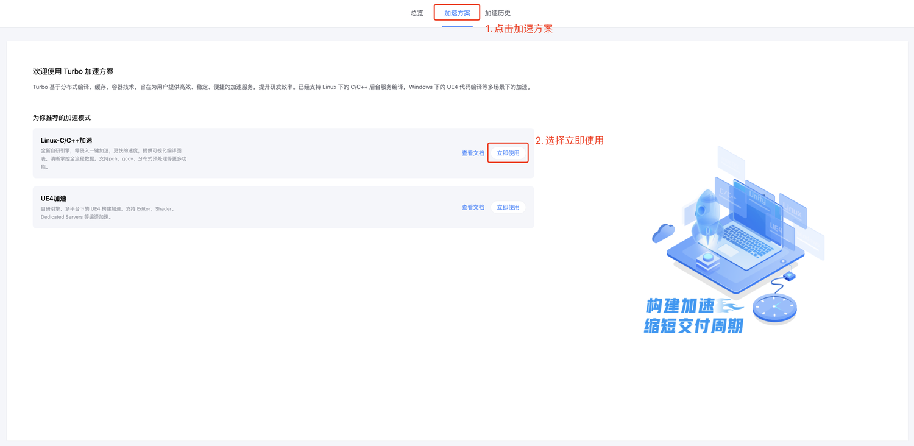

# 【推荐】Linux-C/C++加速方案

蓝盾Turbo提供了一套全新的自研加速引擎，零侵入一键加速，更快的速度，提供可视化编译图表，清晰掌控全流程数据。支持pch、gcov、分布式预处理等更多功能。

**1. 首先我们在“蓝盾”→“编译加速"中注册一个加速方案**

选择“Linux-C/C++加速”方案，点击“立即使用”。

如果已经有加速方案了，点击左上角的“新增方案”。

**2. 根据实际需求，配置我们的加速方案**

在新增页面里，需要依次填写几个配置。

1.方案名称：作为标识名称，可以填写诸如“wesley个人加速”、“每日构建加速”、“构建机出包加速”等等。
2.加速模式：选择要创建的加速模式，一旦创建，加速模式不可修改。
3.方案说明：可以写一些备注或者说明在这里。
4.编译环境：根据你的本地环境，选择对应的编译环境，如果列表中没有，请联系DevopsHelper，我们可以提供快速支持。
5.是否启用ccache：按需勾选是否要开启ccache，若开启，则会在本地优先考虑ccache，没有命中的部分再使用分布式加速。
6.优先调度区域：根据本地环境的区域，就近选择，若不确定，默认选择“深圳/广州”即可。

**3. 提交注册，获得专属方案ID**

点击提交后，会生成一个你专属的方案ID，这个ID后续也可以在“加速方案”→点击方案名字，进入详情页面查询到。

方案ID是使用加速的凭证，里面包含了你的环境信息、配置信息、权限信息。**请妥善保管好你的方案ID，不要随意透露给他人。**

