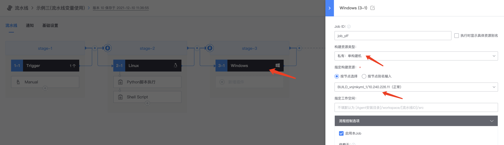
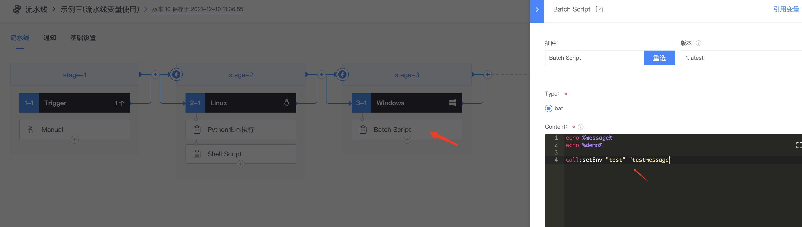

# 流水线变量使用

* 变量使用类型：
  * 全局变量引用，shell/python/windows变量引用方法
  * 插件变量设置方法以及跨插件变量引用
* 点击Trigger，新增变量message

* 添加stage，Job下选择Python脚本执行插件，通过${message}使用变量

添加shell插件，使用${message}使用变量

添加stage，Job类型选择windows

点击windows，选择windows私有构建机节点

添加Batch Script插件，使用%message%引用变量

*   插件设置全局变量方法

    在python脚本执行插件上，使用print("setEnv demo test1")，即设置了一个环境变量：demo（注：demo变量不能在当前插件使用）

在shell script以及batch script插件引用变量demo，跟trigger配置的变量引用的方式一样

windows设置全局变量的方式，call:setEnv "test" "testmessage"，引用test变量的方式如上

*   流水线默认全局变量

    点击任意插件，右上角有一个引用变量，流水线默认定义了一些变量，可以直接在插件上进行使用，变量引用方式如上

