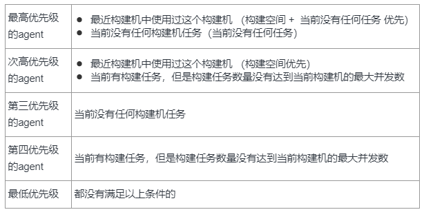

# 组建私有构建集群

## 关键词：私有、集群

## 业务挑战

如果一直使用多台单构建机，人为将不同流水线分配到不同的构建机上，不仅维护构建机自身会成为一个负担，更重要的是构建机使用效率较低。

## BKCI优势

BKCI环境管理，可以将多台单构建机整合成构建集群，提高整体资源利用效率

## 解决方案

1、打开BKCI，选择”环境管理”

2、“新增”环境，选取构建节点

3、 流水线Stage 配置中，选择“私有：构建集群”使用

组建为构建集群后，Job寻找构建节点的算法如下：

