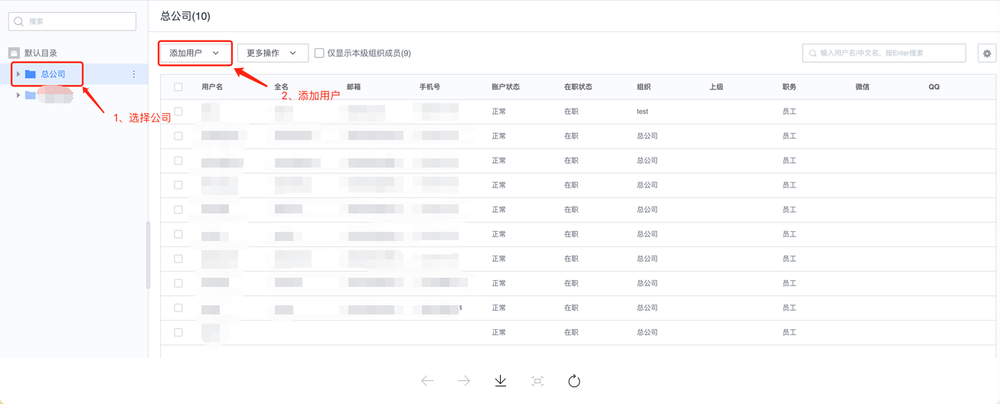
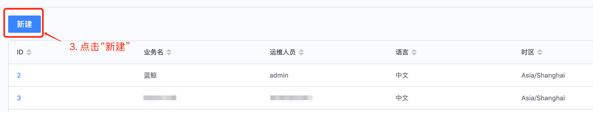
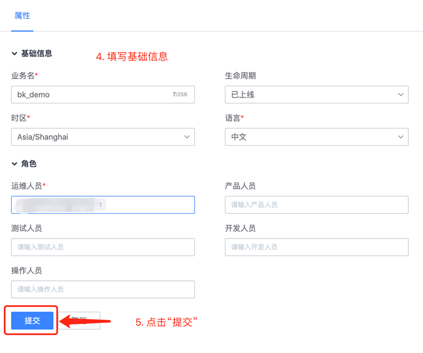
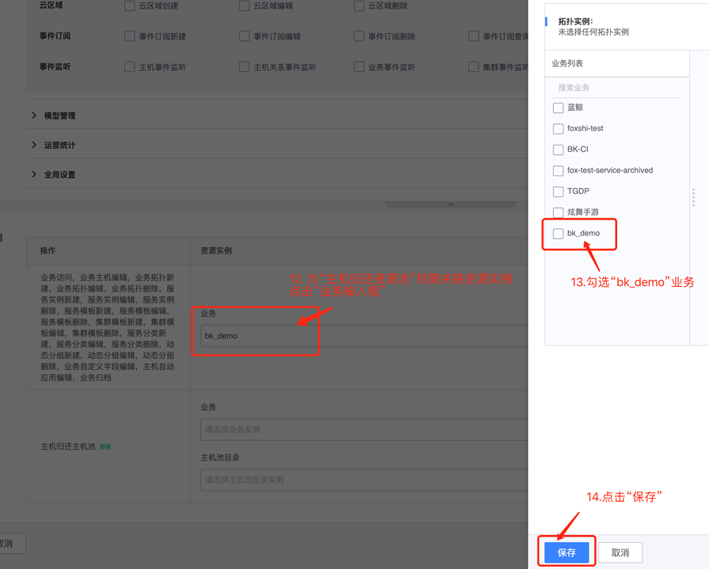
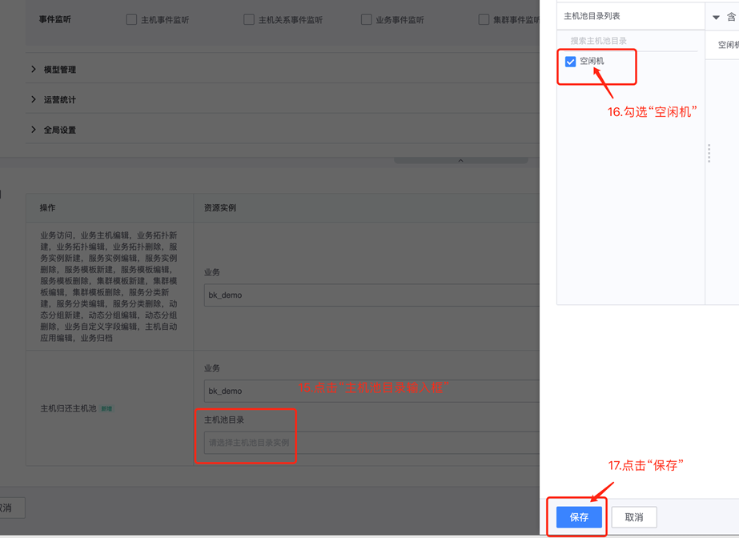
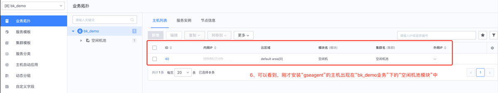
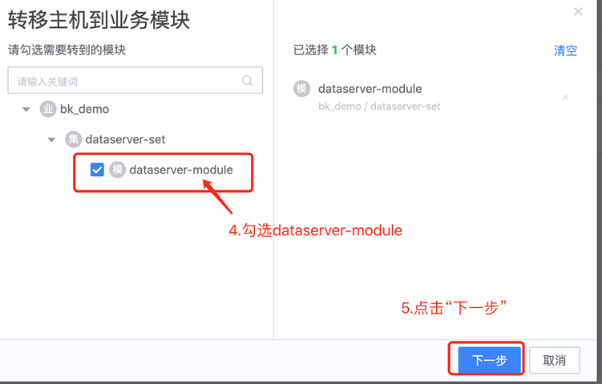
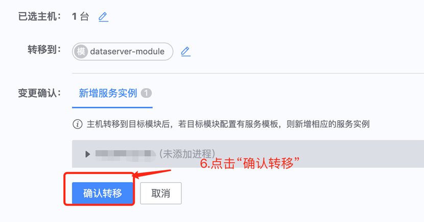
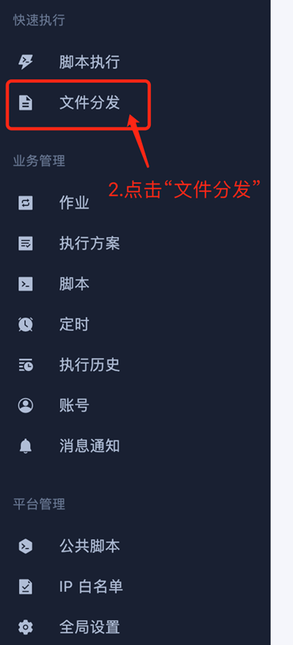

# **蓝鲸入门使用文档**

## **1. 创建一个用户**
蓝鲸环境中的用户信息相关的增删改查，可在“用户管理”中进行操作。如下图：

### **1.1 添加用户**

### **1.2 修改用户信息**

相关学习资料：
- [文档](../../../../../UserManage/2.5/UserGuide/Introduce/README.md)（该文档为社区版，与企业版功能基本一致）

- 视频：https://ke.qq.com/course/3101748?taid=10600778153546804

## **2. 创建一个业务**

进入“配置平台”，这里主要进行“业务-主机”的管理

### **2.1 创建业务**

### **2.2 查看业务的模块、主机**

如果没有看到刚创建的业务，点击页面左下角的“刷新应用”，再重复「步骤2」、「步骤3」即可
然后就看到我们刚才创建的业务的信息了。

## **3. 创建一个权限组，用来关联用户与平台内业务的操作权限**

这里，需要admin账户给业务进行权限添加，为了方便后续该业务的相关操作，建议使用“创建权限组”，然后将“用户”关联至“权限组”。

### **3.1 创建一个“业务权限的配置平台模板”**

切换身份后，进入“超级管理员”模式，只有超级管理员可以创建高权限级别的“业务权限组”

后续会推出“对应角色(如：运维、开发)推荐默认配置”的版本，现用版本需要手动勾选
然后为刚才选择的“权限”关联对应的“资源实例”

### **3.2 创建一个”业务权限组“**

## **4. 为业务添加一台主机**

进入首页，点击“节点管理”。

## **5. 在“配置平台”中管理主机**

下面，我们要在刚新加的主机上面部署一个叫做“dataserver”的服务。为了方便后续管理，我们先在“配置平台”上创建一些信息。

### **5.1 创建一个set（集群）和module（模块）**

### **5.2 移动主机到模块并修改主机相关信息**

## **6. 使用“作业平台”，部署dataserver服务**

### **6.1 上传本地文件至主机**

https://www.python.org/ftp/python/3.9.4/Python-3.9.4.tgz

### **6.2 使用“脚本执行”部署服务**

    
    cd /data
    yum install -y gcc python39-devel bzip2-devel sqlite-devel openssl-devel readline-devel xz-devel tk-devel gdbm-devel

    mkdir -p /data/corefile
    chmod 777 /data/corefile
    echo 'ulimit -c unlimited' >> /etc/profile
    sed -i "/^kernel.core_pattern =/d" /etc/sysctl.conf 
    echo 'kernel.core_pattern = /data/corefile/core_%e_%t' >> /etc/sysctl.conf
    sysctl -p /etc/sysctl.conf

    tar zxvf Python-3.9.4.tgz 
    cd Python-3.9.4
    ./configure
    make && make install
    make clean && make distclean

    mkdir -p /data/app
    pip3 install Flask
    pip3 freeze > /data/app/requirements.txt
    cat > /data/app/app.py <<EOF
    from flask import Flask
    app = Flask(__name__)

    @app.route('/')
    def hello_world():
        return 'Hello, World'
    EOF

    cd /data/app
    nohup python3 -m flask run >/dev/null 2>&1 &

## **7. 使用“监控平台”监控主机和进程**

### **7.1 在“配置平台”创建进程相关信息**

### **7.2 监控平台配置告警**

