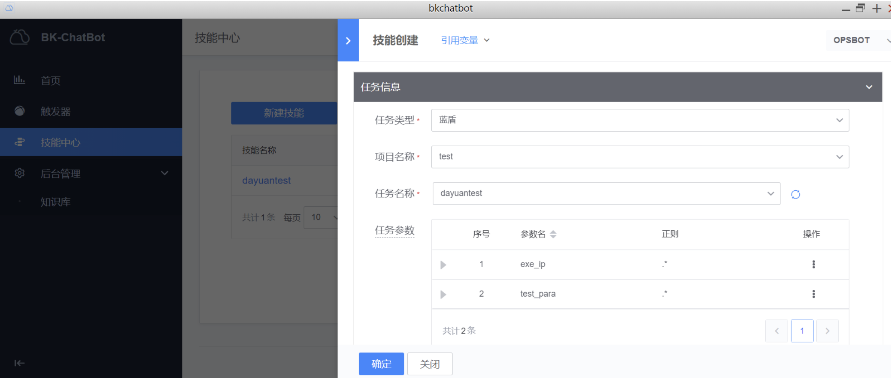

# **bkchat使用说明**

BkCHAT提供两种使用版本

1、免技能创建模式，即无鉴权版本，用户在企业微信可执行所有BKCI流水线

2、自定义技能模式，用户在页面上配置自定义的操作指令以及执行人员权限，可以限制特定用户的流水线执行权限

## **免技能创建模式**
1、直接打开已配置的应用号，输入“1”或者 “help” ， 点击消息右上角，会弹出对应的操作，可进行业务的绑定。

2、BKCICI执行， 点击 “CI” ， 弹出选择“BKCI项目”，选择后继续选择BKCI的”流水线“，到最终的执行。

3、标准运维执行, 支持“分组”模式的选择。

4、我们同时支持任务查找的功能，如下，您可自由输入你想要执行的任务，后台会给您匹配到最佳的任务。

5、语音交互样例展示

## **自定义技能模式**
1、配置技能(蓝鲸页面打开bk-chatbot应用)

我们可针对参数指定正则匹配，bkchat 对话时会针对正则进行参数提取。

2、触发任务

在企业微信搜索“底层消息通知”这个机器人(企业微信配置)，跟它私聊对话。

然后按照提示依次输入任务参数，输入完成后任务会自动触发启动。 同时BKChat也支持把技能和参数一起输入，这样机器人会根据前面配置的正则进行提取参数启动任务。

