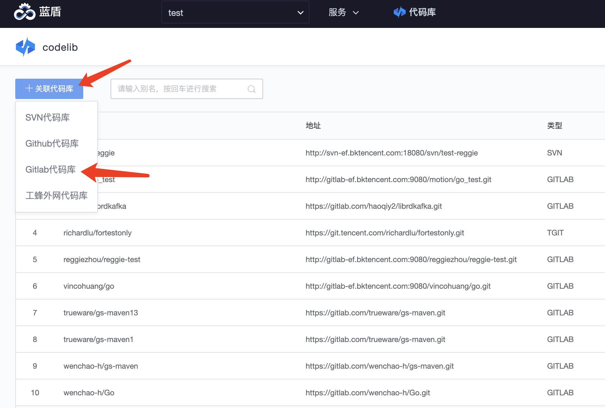
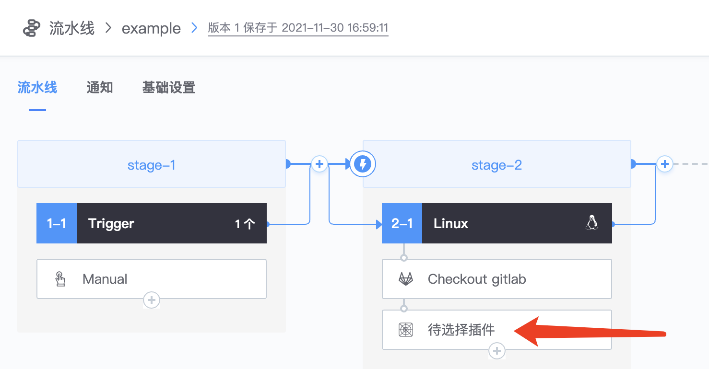

# 代码检查使用

**codecc接入步骤：**

1. 配置代码库，作为代码扫描的目标
2. 创建流水线，拉取目标代码
3. 配置codecc插件
4. 执行流水线
5. 查看代码检查结果

## codecc接入

### 配置代码库

「选择项目」-「服务」-「代码库」

「关联代码库」-「gitlab代码库」 这里以gitlab代码库为例

**其他类型代码库的使用请参考：**[代码库](../Coderepo/repos-link.md)

**关联gitlab代码库有几个条件：**

1. 使用accesstoken来关联
2. 创建accesstoken的所有者须是目标仓库的maintainer角色
3. accesstoken至少需要api的权限
4. 源代码地址是http/https协议的

accesstoken 使用「凭证管理」来进行注册，如果在「凭证管理」已经注册accesstoken，关联代码库时，可直接选中对应的accesstoken

如果在「凭证管理」注册accesstoken，则可以新增凭证，跳转至凭证管理页面

gitlab accesstoken创建请参考：[创建accesstoken](https://docs.gitlab.com/ee/user/profile/personal\_access\_tokens.html)

然后回到关联代码库页面，选中刚创建的accesstoken，确定

.png>)

**其他类型凭证使用请参考：**[凭证管理](../Ticket/ticket.md)

### 创建流水线

「选择项目」-「服务」-「流水线」-「新建流水线」-「项目自定义」-「填写流水线名称」-「新建」

流水线新建好后，需要添加代码拉取的插件以及代码检查的插件，代码检查需要将代码拉取到构建环境所在的工作空间，拉取代码需要选择checkout gitlab插件

「添加stage」-「选择linux构建机」-「新增插件」-「选择checkout gitlab插件」

配置checkout gitlab插件，选择代码库为前述步骤创建的代码库

### 配置代码检查

添加代码检查插件

配置代码检查，选择同步方式，「基础设置」根据代码库语言选择对应的工程语言，选择对应的规则集，规则集就是codecc进行代码扫描遵循的标准，codecc会提供默认的规则集，如果规则集不满足需求，可以自定义规则集。自定义规则集请参考：[代码检查规则](codecc-ruleset.md) 「扫描配置」选择增量扫描，「路径屏蔽」可以设置路径白名单，一旦设置后，代码检查只会扫描白名单路径下的文件；配置路径黑名单，则代码检查插件不会扫描该路径下的文件。

路径支持通配符，如果是完整路径，须以/开头，如需要屏蔽的文件是repo-name/initial/src/main/java/hello/HelloWorld.java，则路径白名单是/initial/src/main/java/hello/HelloWorld.java。

**其他代码检查插件配置请参考：**[代码检查配置](codecc-config.md)

### 执行流水线

流水线全貌：

保存并执行流水线：

### 查看代码检查结果

「等待执行完毕」-「点击代码检查插件」-「查看报告」

点击数字可以跳转查看具体的问题

