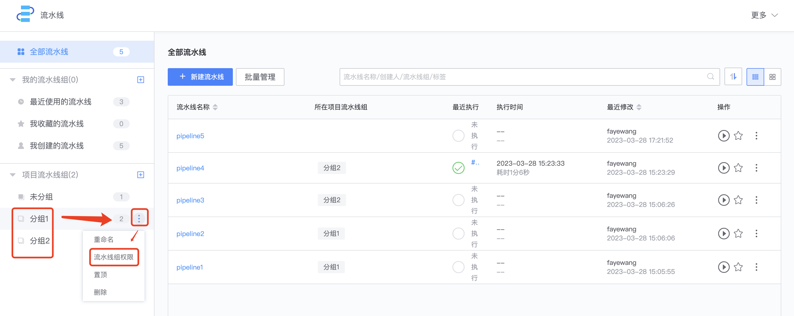
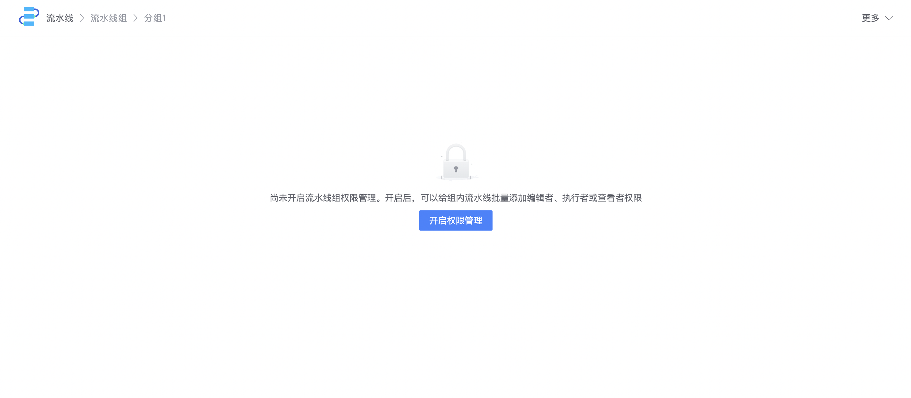
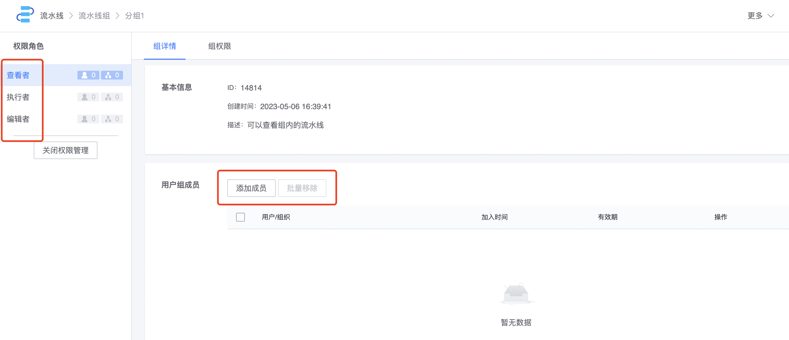

# 通过流水线组管理一批流水线的权限

流水线进行分组管理之后，可以通过流水线组，给组内的流水线批量添加成员。入口如下

流水线组默认不开启权限管理，进入后如下：

开启流水线组权限管理后，可以给组内的流水线批量添加编辑者、执行者或者查看者

流水线组上添加的成员权限，和单条流水线上添加的成员权限，是叠加的关系。

当流水线 A 加入一个开启了权限管理的流水线组时，流水线组上的“查看者”成员即拥有 A 的查看权限。 当 A 从流水线组中移出时，流水线组上的“查看者”成员即失去 A 的查看权限。

