# 流水线构建详情页

## 功能区介绍

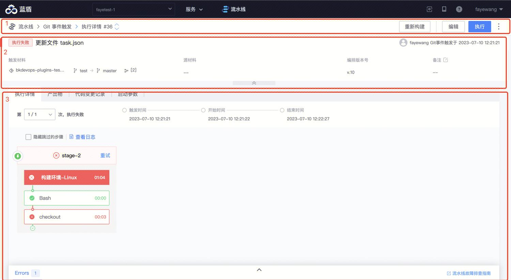

页面分为 3 部分：
* 面包屑和操作
* Summary 小结
* 构建详情和产物

## 面包屑和操作

### 返回流水线列表
点击「流水线」，可以回到流水线列表

### 进入流水线查看页
点击 {流水线名称}，进入流水线查看页面

### 切换到其它流水线

点击流水线名称后的箭头，可以切换流水线
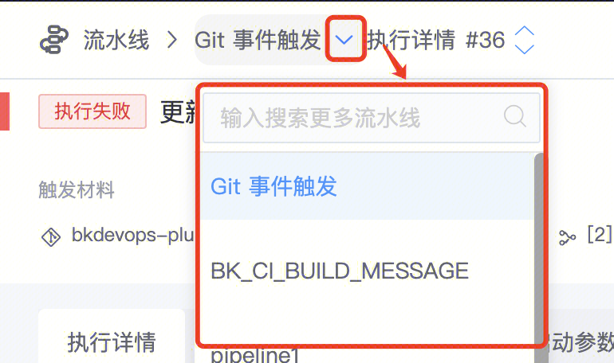

### 切换构建号
点击构建号后 向上/向下 的箭头，可以到 上一次/下一次 执行详情页

### 重新构建
当流水线运行结束后，若因插件问题或者第三方服务问题导致运行结果不符合预期，可以对整条流水线进行重新构建。
重新构建时：
* 启动参数不变
* checkout 插件拉取的代码版本不变

### 流水线基本操作
需要时，可以：
* 执行：以手动触发方式新启动一次构建
* 编辑：修改流水线
* 更多操作：

## Summary 小结

小结区域包括如下信息：

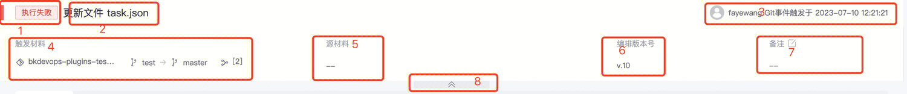

### 最终运行状态

同一次构建，可能经过多次重试、或者重新构建，BK_CI_BUILD_ID 不变。此处展示的是最后一次运行结束时的状态。
当流水线被取消时，可以查看操作人

### 构建信息

构建信息作为当前次运行原因的参考信息，最长 128，超长内容会被截断。取值规则为：

- 当手动触发时，可以手动填写，若不填写，默认为“手动触发”

  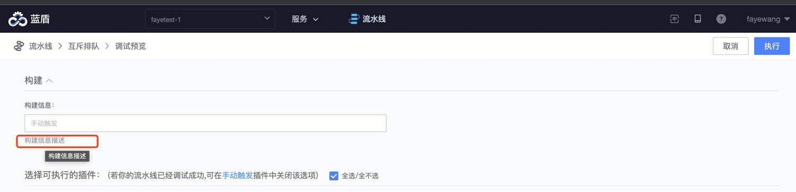

- 当 Git/Gitlab/Github/SVN/P4 Push 事件触发时，为提交信息
- 当 Git/Gitlab/Github MR/PR 事件触发时时，为 MR/PR 标题
- 当 Git/Gitlab/Github Tag 事件触发时时，为 Tag 名称
- 当 Git/Gitlab/Github Issue 事件触发时时，为 Issue 标题
- 当 Git/Gitlab/Github CR 事件触发时时，为 CR 标题
- 当 Git/Gitlab/Github 评论 事件触发时时，为 评论内容 标题

### 触发人/方式/时间

### 触发材料

根据触发事件不同，有不同的触发材料

### 源材料

流水线中拉取的代码，作为流水线构建的源材料，这里汇总了流水线中拉取的所有代码库/分支/Commit ID 信息
注：仅官方提供的插件支持上报可源材料，用户自定义的插件没有此信息

### 编排版本

当前次运行时的流水线版本号
排查问题时可以作为参考

### 备注

流水线备注信息，可以在流水线运行过程中动态设置备注，也可以手动填写备注

### 收起小结区域

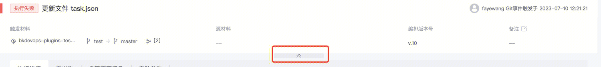

当流水线 Stage 下的 Job/Task 比较多时，滚动页面会自动收起小结区域
也可以手动收起小结

## 构建详情和产物

### 执行详情

#### 重试/重新构建 次数

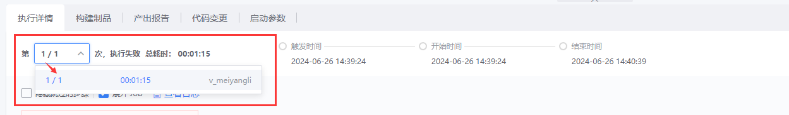

可以查看当前次触发流水线运行后：
- 重试/重新构建了多少次
- 每次操作人是谁

#### 运行时间点和耗时

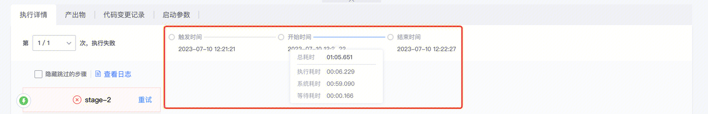

时间点：
- 触发时间：当前次运行的触发时间，如果是重试，为提交重试的时间
- 开始时间：当前次运行的开始运行（触发后可能有互斥排队、并发排队等，排队结束进入运行的时间）
- 结束时间：当前次运行的结束时间

耗时：
- 排队耗时：系统接收到触发事件的时间，到真正启动执行之间的耗时
   - 影响因素包括：
      - 触发事件解析
      - 触发条件判定
      - 运行策略判定（如只能串行时需等待前置构建运行完毕）等
- 执行耗时：启动运行后到运行结束之间，Sum（插件启动到插件运行完毕之间的耗时）
   - 插件运行完毕：插件逻辑运行结束，且输出信息已处理完成，对应步骤已为结束态
   - 注意：
      - 人工审核插件也属于此范畴（占用公共资源）
      - Stage/流水线 上计算执行耗时时，根据时间线来汇总处理，而不是将并发 Job 的执行时间相加
- 系统耗时：启动运行后到运行结束之间，由系统操作引入的耗时
   - 影响因素包括：
      - 构建机调度/准备/启动时间
      - 插件下载/安装/启动时间
      - 参数解析处理时间
      - 构建资源释放时间
   - 注意，Stage/流水线 上计算系统耗时时，根据时间线来汇总处理，而不是将所有系统耗时时间相加
- 等待耗时：启动运行后到运行结束之间，处于等待的耗时
   - 影响因素包括：
      - 第三方构建机等待资源耗时
      - Stage 准入人工审核等待耗时
      - Stage 准入的质量红线等待审核耗时
      - 插件暂停到启动/终止的等待耗时
      - Job 依赖等待被依赖 Job 运行完毕
      - Job 互斥等待
   - 注意，Stage/流水线 上计算等待耗时时，根据时间线来汇总处理，而不是将并发 Job 的等待时间相加

#### 隐藏跳过的步骤

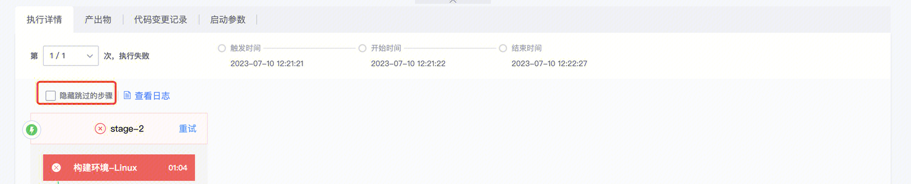

#### 查看和下载全量日志

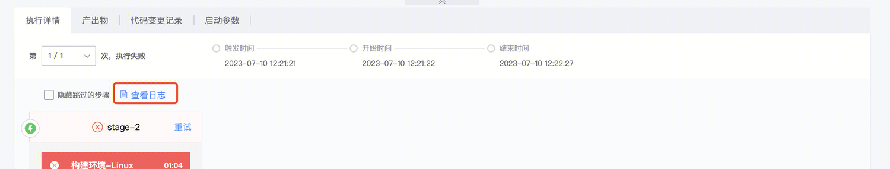

#### 流水线编排/步骤详情

#### 明确重试起点

当不是重新构建，从中间进行重试时，当前次重试未执行的步骤弱化展示

#### 错误汇总

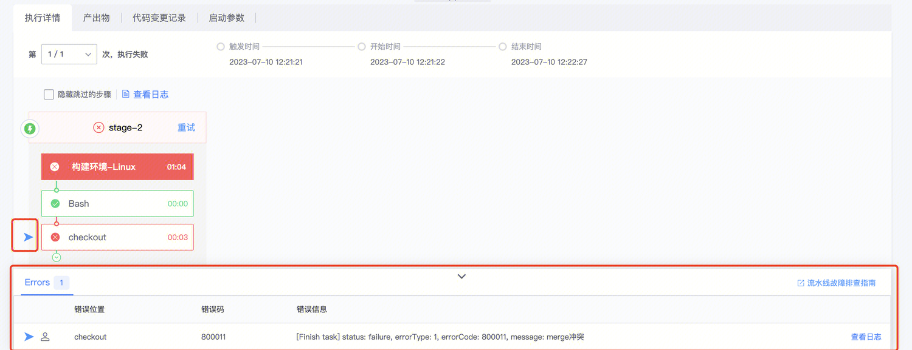

- 当运行失败时，汇总所有的失败信息
- 点击每一行错误，可以自动定位到对应的 Task/Job

## 产出物

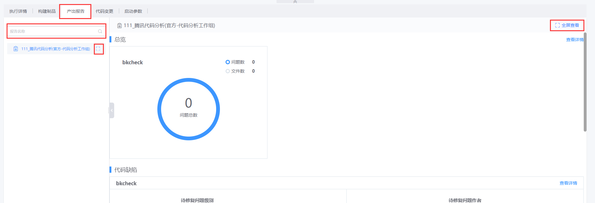

产出物包括制品和报告
可以全屏查看报告

## 代码变更记录

展示当前次构建和上一次构建相比，变更的代码范围

## 启动参数

流水线启动时的变量和对应的值列表

## 接下来你可能需要

* [BKCI 导航条](.././../Console/Console.md)
* [流水线列表页](../pipeline-list.md)
* [创建/编辑流水线](../pipeline-edit-guide/pipeline-edit.md)
* [流水线任务历史](../pipeline-history.md)
