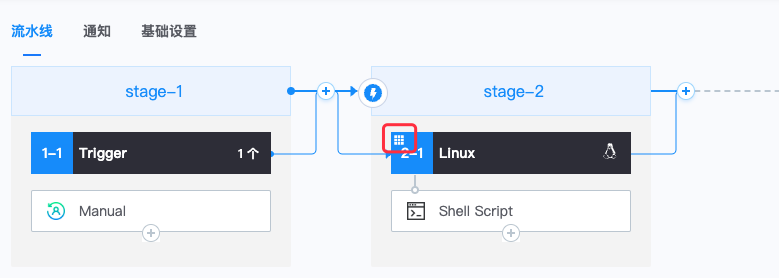

# 启用 Matrix Job(构建矩阵)

在BKCI流水线编排界面，添加一个 job 后，可以编辑 job 属性，启用 Matrix，启用界面如下图所示：


勾选后，即启用 Matrix（需按照后续步骤填写对应的参数才生效）

启用 Matrix Job 后，流水线编辑界面，左上角有矩阵标识：



# Matrix 配置

Matrix 配置包含如下五个参数：


## 矩阵

参数矩阵为 Matrix 分裂为多个 job 的依据。值格式为 Object<String, List<String>>，YAML 语法。

比如在参数 cpu 为 amd64 的情况下对服务 webhook 和 apiserver 分别进行构建，则矩阵设置为：

```
cpu: [ amd64 ] microservice: [webhook, apiserver]  
```

执行时，将生成 1*2 个 job：

- job0：cpu=amd64, microservice=webhook
- job1：cpu=amd64, microservice=apiserver

## 额外添加的参数组合

在矩阵的基础上，可以添加额外的参数组合。值格式为 list<object<String, String>>，YAML 语法。

### 在2.1所示的矩阵基础上，添加参数名一致，仅参数值不同的组合

如添加 cpu=arm64时，对 webhook 服务进行构建：

```
- cpu: arm64  microservice: webhook
```

此时，将在 2.1 的基础上增加一个 job：

- job2：cpu=arm64, microservice=webhook

### 给 2.1 所示的矩阵中的某个参数组合添加一个额外的属性

如给cpu=amd64, microservice=webhook的参数组合添加个属性 tag=test

```
- cpu: amd64  microservice: webhook  tag: test
```

此时，Matrix 分裂后的 job 还是两个，第一个job增加了 tag 参数

- job0：cpu=amd64, microservice=webhook, tag=test
- job1：cpu=amd64, microservice=apiserver

## 排除的参数组合

当按照矩阵生成的参数组合中，部分组合不需要时，可以通过此配置来排除。值格式为 list<object<String, String>>，YAML 语法。

比如在 2.1 的基础上排除 cpu=amd64, microservice=apiserver 的组合：

```
- cpu: amd64  microservice: apiserver
```

## 启用 Fast-Kill

默认选中。当启用时，若 Matrix 中任意 job 失败，则所有 job 也立即停止执行。

若不启用，则等待所有 job 执行完毕，才结束

## 最大并发数

默认为 5。

Matrix 配置生成的 job 可能比较多，这些 job 同时并发可能会导致资源不足，比如达到单项目下 job 并发数超过50的限制导致执行失败，或者机器资源不足导致获取不到机器失败。所以需要对并发数做限制。

最大值不超过 20。

# 访问变量

##  在 Matrix Job 内访问 Matrix 配置

通过 matrix 上下文访问配置的属性，如 ${{ matrix.cpu }}、${{ matrix.microservice}}，示例：


可以在如下位置引用 Matrix 配置：

-  job 下的 task 入参中引用


## 在 Matrix Job 内访问上游步骤的输出变量

通过 Matrix 生成的多个 job ，编排是一致的，插件输出的变量名也是一样的，不能通过BKCI原来的访问变量方式来访问，应通过 steps 上下文来访问当前 job 下生成的局部变量。

比如，在本 job 内定义了 step-id 为 “build” 的步骤，该步骤输出变量 a，后续步骤可以通过 ${{ steps.build.outputs.a }} 来访问

[在bash插件里设置输出变量](../../../intro/terminology/Variables.md)


## 在 Matrix Job 下游访问 Matrix 中输出的变量

比如，在一个 job-id 为 "build_job" 下定义了 step-id 为 “build” 的步骤，该步骤输出变量 a，后序的不同 job 中可以分两种方式来访问：

- 可以通过 ${{ jobs.build_job.<matrix-index>.steps.build.outputs.a }} 来访问其中一个分裂job的值（其中 matrix-index 为分裂结果的顺序值，从0开始）
- 可以通过 ${{ jobs.build_job.steps.build.outputs.a }} 访问整个matrix输出结果的数组


# Matrix Job 的参数矩阵通过变量动态设置

## 整个矩阵参数作为变量动态传入

变量赋值示例：

```
echo "::set-variable name=parameters::{\"service\":[\"api\",\"project\",\"gateway\"],\"cpu\":[\"amd64\", \"arm64\"]}"
```

矩阵参数设置示例：

```
${{ fromJSON(variables.parameters) }}
```

## 矩阵参数中的某一个维度值作为变量传入

变量赋值示例：

```
echo "::set-variable name=file_list::[\"file_1\",\"file_2\",\"file_3\"]"
```

矩阵参数设置示例：

```
file_list: ${{ fromJSON(variables.file_list) }} b: [1,2]
```


**注：fromJSON 为BKCI内置函数，目前仅支持在matrix参数矩阵配置时使用**

