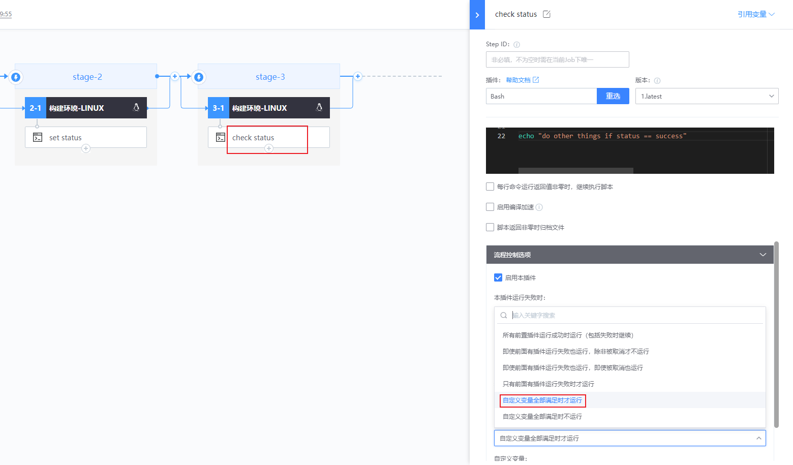

# 使用变量来控制流水线

用户可以通过自定义变量来控制后续 task 的执行，从而达到控制流水线运行流的目的

**假设一种场景：** 当 stage2 的 shell 脚本执行成功的时候，stage3 的 shell 脚本才执行

1. stage2 shell 插件设置 status 变量

    

2. stage3 shell 插件选择「自定义变量全部满足时才运行」

    

3. shell 插件新增执行条件变量为`status==success`

    

4. 条件满足，执行成功

    

5. 模拟变量设置失败

    

6. 条件不满足，插件不执行

    

    类似地，还可以给插件反向设置执行条件：「自定义变量全部不满足时运行」

    