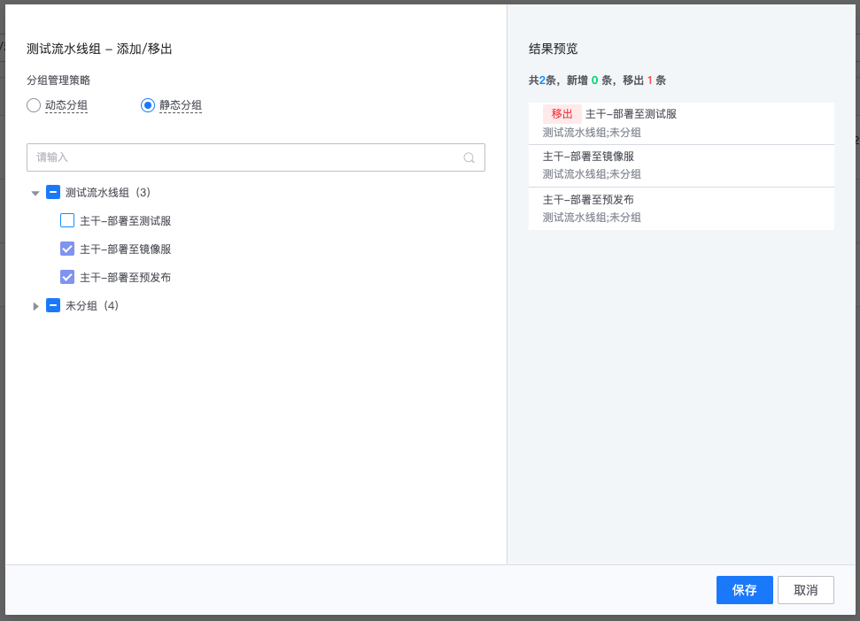
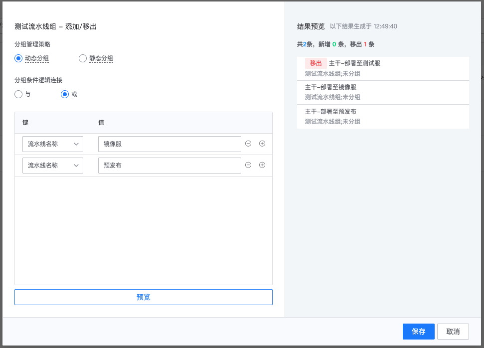
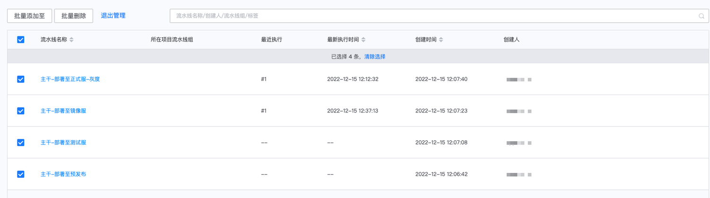

# 流水线组

当项目不断发展，流水线数量日益增多，为了在繁多的流水线中让自己或项目成员便捷的定位所需求的流水线，可以使用流水线组功能对流水线进行分类管理。

在流水线首页，左侧默认会分为“我的流水线组”和“项目流水线组”
- “我的流水线组”任意项目均可创建，创建后仅自己可见
- “项目流水线组”只有项目管理员可创建，创建后所有项目成员可见

## 创建流水线组

点图示的 加号，创建流水线组：

## 添加/移出流水线

流水线组分为“静态分组”和“动态分组”两种分组管理策略；

静态分组：精确手动指定在组内的流水线；

动态分组：通过设置流水线名称、创建人、流水线标签等条件，动态将流水线划归进组管理；

### 静态分组中添加流水线

### 静态分组中移出流水线

### 动态分组中添加、移出流水线

修改动态分组的条件后，若原来组中的流水线已不满足新条件，保存后将自动移出：

## 批量管理

点击批量管理，进入“批量”操作页面

### 批量添加至

### 批量删除

