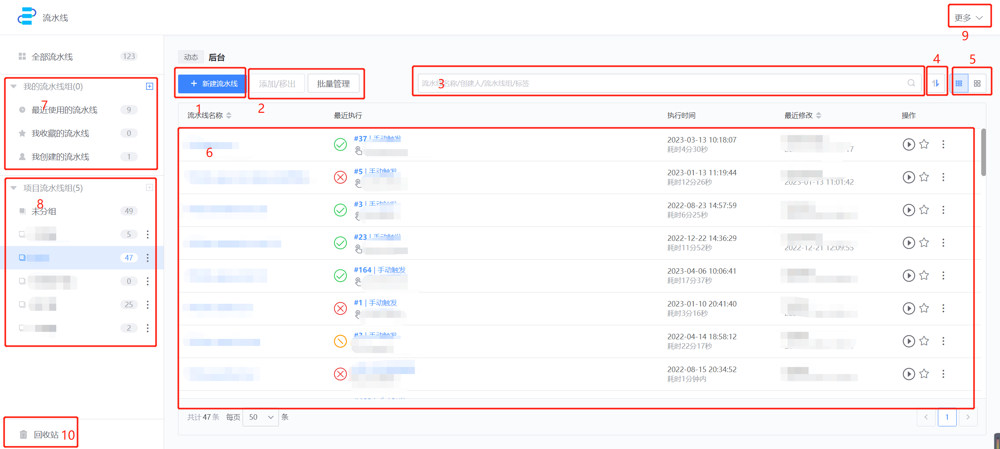

# 流水线列表页

你切换至流水线服务后的第一个页面就是流水线列表页，在这里你可以找到管理流水线需要的常见入口。

## 功能区介绍 

1. 新建流水线
2. 批量管理
    - 添加/移出：往当前选中的流水线组中批量添加流水线，或者批量移出
    - 批量删除：删除一批流水线（有删除权限的前提下）
    - 批量添加至：将流水线批量添加到其他流水线组
3. 筛选：支持按照名称、创建人等条件筛选流水线
4. 排序：支持按照名称、创建时间、修改时间、执行时间进行排序
5. 流水线列表视图切换入口，支持列表方式和卡片方式
6. 流水线，如图所示的列表视图，每行一条流水线，可以在操作区域执行、收藏流水线
7. 我的流水线组，个人视图
8. 项目流水线组，项目视图，项目管理员可以增加、修改
9. 流水线下更多服务
    - 标签管理
    - 模板管理
    - 插件管理
    - 操作审计
10. 回收站：30天内删除的流水线，可以从回收站中恢复

## 接下来你可能需要

* [BKCI 导航条](.././../Console/Console.md)
* [流水线列表页](../pipeline-list.md)
* [创建/编辑流水线](../pipeline-edit-guide/pipeline-edit.md)
* [流水线任务历史](../pipeline-history.md)
