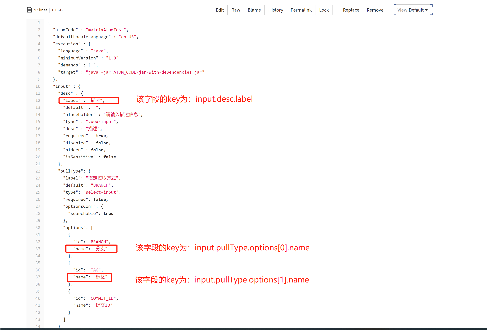

# Golang 插件国际化

## 1、国际化使用的插件 SDK 要求

SDK 要求：>= v1.2.5

## 2、国际化配置文件管理方式

国际化配置文件，统一放到插件工程 i18n 目录下的资源文件中进行管理。如下图所示：


**资源文件命名规范：** message_$language.properties

支持的 language 列表如下：

| **语言名称** | **语言标识** |
| ------ | ------ |
| 简体中文 | zh_CN |
| 繁体中文 | zh_TW |
| 英文 | en_US |
| 日文 | ja_JP |
| 韩文 | ko_KR |
| 意大利文 | it_IT |
| 德文 | de_DE |
| 法文 | fr_FR |


**资源文件的编码需为 UTF-8**

## 3、需要国际化的如下内容

### 错误描述

每个错误码都需要有对应的错误描述，错误码定义规范见 [插件错误码规范](../plugin-dev-standard/plugin-error-code.md)

### 初始化数据

### 打印的日志

### 插件上架时，填写的基本信息

插件上架时，填写的基本信息，也通过在插件的国际化资源文件里配置实现国际化。配置 key 如下：

| 字段名称     | 国际化 key                              |
| ------------ | -------------------------------------- |
| 插件名称     | releaseInfo.name                       |
| 插件简介     | releaseInfo.summary                    |
| 插件描述     | releaseInfo.description                |
| 发布者       | releaseInfo.versionInfo.publisher      |
| 版本日志内容  | releaseInfo.versionInfo.versionContent |

### 插件配置文件 task.json 里的配置信息

插件的前端页面通过 task.json 中的配置渲染出来，实现国际化只需如下几步：

1、把插件的 task.json 中的需要国际化翻译的字段提取出来，字段的 key 为该字段在 task.json 中的节点路径



2、把 task.json 中需要进行国际化翻译的字段信息配置到资源文件中


3、设置插件支持的默认语言

task.json 支持新增 defaultLocaleLanguage 字段，缺省为简体中文 zh_CN

可选值为国际化支持的语言，若为简体中文则值为：zh_CN

该配置指定插件默认支持的语言，对应语言无需在国际化资源文件中重复定义。若 defaultLocaleLanguage 值与当前环境蓝盾系统的默认语言一致，则以 task.json 中的配置为准


## 4、通过 go generate 工具解析 i18n 文件生成代码

### 4.1、在代码文件中配置 go generate 信息即 //go:generate i18ngenerator 国际化文件夹路径 生成的代码文件路径


### 4.2、在项目根目录下安装生成代码的 i18ngenerator 以及进行代码生成

``` bash
# 安装代码生成工具
go install github.com/ci-plugins/golang-plugin-sdk/cmd/i18ngenerator@latest
# 生成代码
go generate .
```

## 5、通过调用 SDK 提供的 InitI18n 方法使用生成好的国际化代码，同时获取并使用运行时的语言信息进行初始化并且通过 Localize 使用


## 6、自定义 UI 的插件前端国际化

见 [自定义 UI 的插件前端国际化](./plugin-i18n-custom-ui.md)
