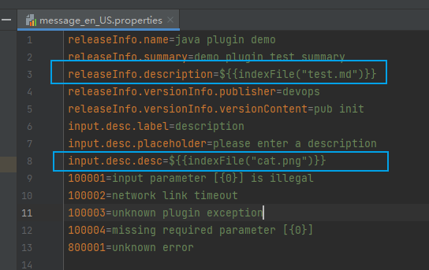

# Python 插件国际化

## 1、国际化使用的插件 SDK 要求

SDK 要求：>= v1.0.1

## 2、国际化配置文件管理方式

国际化配置文件，统一放到插件工程 i18n 目录下的资源文件中进行管理。如下图所示：

**资源文件命名规范：** message_$language.properties

支持的 language 列表如下：

| **语言名称** | **语言标识** |
| ------ | ------ |
| 简体中文 | zh_CN |
| 繁体中文 | zh_TW |
| 英文 | en_US |
| 日文 | ja_JP |
| 韩文 | ko_KR |
| 意大利文 | it_IT |
| 德文 | de_DE |
| 法文 | fr_FR |

**资源文件的编码需为 UTF-8**

## 3、需要国际化的如下内容

### 错误描述

每个错误码都需要有对应的错误描述，错误码定义规范见 [插件错误码规范](../plugin-dev-standard/plugin-error-code.md)

### 初始化数据

### 打印的日志

### 插件上架时，填写的基本信息

插件上架时，填写的基本信息，也通过在插件的国际化资源文件里配置实现国际化。配置 key 如下：

| 字段名称     | 国际化 key                              |
| ------------ | -------------------------------------- |
| 插件名称     | releaseInfo.name                       |
| 插件简介     | releaseInfo.summary                    |
| 插件描述     | releaseInfo.description                |
| 发布者       | releaseInfo.versionInfo.publisher      |
| 版本日志内容  | releaseInfo.versionInfo.versionContent |

### 插件配置文件 task.json 里的配置信息

插件的前端页面通过 task.json 中的配置渲染，实现国际化只需如下几步：

3.1、把插件的 task.json 中的需要国际化翻译的字段提取出来，字段的 key 为该字段在 task.json 中的节点路径

3.2、把 task.json 中需要进行国际化翻译的字段信息配置到资源文件中

3.3、设置插件支持的默认语言

task.json 支持新增 defaultLocaleLanguage 字段，缺省为简体中文 zh_CN

可选值为国际化支持的语言，若为简体中文则值为：zh_CN

该配置指定插件默认支持的语言，对应语言无需在国际化资源文件中重复定义。若 defaultLocaleLanguage 值与当前环境BK-CI系统的默认语言一致，则以 task.json 中的配置为准

## 4、i18n 环境配置
- 1、确认项目根目录下存在 i18n 目录并且配置了国际化配置文件
- 2、在 setup.py 中调用 setup 之前调用 python_atom_sdk.prepare_i18n_environment({包名称})
- 3、在 package_data 中配置路径 f'i18n/*.properties'
  
    

## 5、插件通过 SDK 工具类根据运行时语言去资源文件读取指定内容
- 运行时可通过当前项目的模块安装目录 site-packages\\{模块名称}\i18n 获取到国际化配置文件
  - 
- 通过 SDK 提供的 get_language 方法获取运行时语言环境信息
- 通过 SDK 提供的 get_message_by_locale 方法获取对应的国际化信息和错误码信息

## 6、自定义 UI 的插件前端国际化

见 [自定义 UI 的插件前端国际化](./plugin-i18n-custom-ui.md)

## 7、国际化配置文件支持引入文件

- 支持使用表达式${{indexFile("文件路径")}}引入文件
  - 需要插件项目跟路径增加 file 目录，表达式以这个目录为根目录
  - 
- 引入的文件格式支持文档文件及静态文件(jpg、jpeg、png、gif)
- 引入的文档文件中也支持使用表达式引入静态文件，不支持引入文档文件
- 