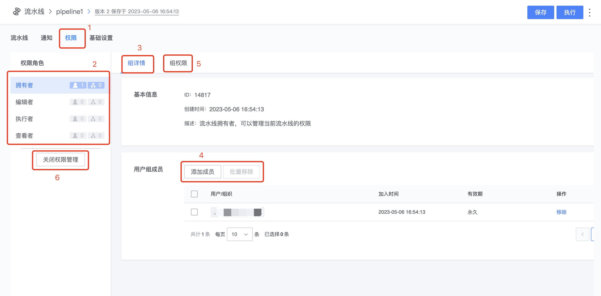

# 添加用户到资源级别的用户组

- 仅流水线、Codecc 任务等资源可以由管理员主动添加用户到对应的用户组
- 其他资源一般通过用户主动申请加入对应的用户组

## 添加用户到流水线

流水线 A 创建成功后，系统将自动生成对应的拥有者、编辑者、执行者、查看者 4 个用户组。

流水线的拥有者，可以根据需要给用户开通流水线的权限

1. 入口在编辑流水线页面，“权限” tab
2. 系统默认的 4 个用户组
3. 组详情：包括基本信息和组成员
4. 可以添加成员或组织架构到组内，可以单个或批量移出成员
5. 组权限：当前用户组中的用户可以进行的操作
6. 可以关闭流水线权限管理，由流水线组来统一管理权限