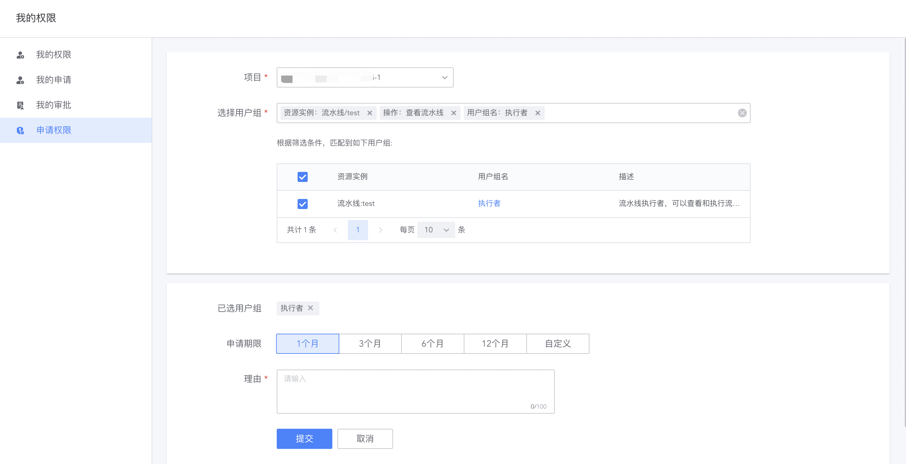

# 申请权限

有两个申请权限的入口：
- 统一的申请权限入口
- 操作资源没有权限时的就近申请入口

## 统一的申请权限入口

从导航右上角、用户信息下拉菜单中的“我的权限”入口进入，点击 “申请权限”，如下图所示：

1. 项目：申请的目标项目。除了保密项目，其他项目都可以申请
2. 选择用户组：可以通过条件查询目标用户组
    - 若已加入项目，可以通过项目下的资源(如流水线、凭据、环境、节点等)进行查询
    - 若尚未加入项目，不能通过项目下的资源查询，只能搜索项目级别的用户组
    
3. 可以选择申请的期限，最长 1 年。到期后可以续期
4. 申请理由：说明清楚申请的理由，关于审批人进行评估

点击“提交”之后，系统自动生成权限申请单：
- 项目级别的用户组，将由项目管理员审批
- 资源级别的用户组，将由资源拥有者审批

提单后，可以在“我的申请”查看申请单进度：

申请单审批通过之后，申请人获得对应的权限。

## 资源就近申请入口

以流水线为例，当没有流水线的查看时，在流水线操作位置有“申请权限”按钮：

点击后如下图所示，可以选择希望加入的流水线用户组：

选择用户组后，进入申请权限页面，默认选中对应的用户组：

提单后，可以在“我的申请”查看申请单进度：

