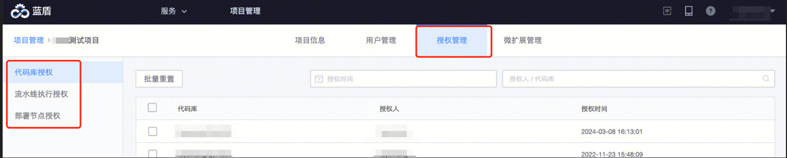

# 授权管理

## 授权类型
目前蓝盾上以个人名义授权的场景有如下三种：

1. 代码库授权：用户关联代码库到蓝盾时，如工蜂、Github 等代码库支持使用 OAUTH 授权。用户授权后、流水线运行时使用此授权进行代码拉取

2. 流水线执行授权：流水线除了手动触发，有真实的用户在操作，其他触发场景（如代码库触发、子流水线触发、远程触发、openapi触发、定时触发）不是一个具有登录态身份的真实用户在操作，此时将使用「流水线权限代持人」的身份进行权限校验，校验通过才能执行。 

3. 部署节点授权：用户将机器关联到蓝盾节点管理，使用蓝盾作业平台插件进行部署或者脚本执行时，只有机器的负责人/备份负责人可以导入，并对这些机器在流水线中使用进行授权，若机器负责人发生变更，机器将不能使用，需新的负责人重新授权

将用户移出项目时，如上的授权也需要交接出去，才能移出。

## 重置代码库授权
新负责人需要拥有对应代码库的「读取代码」权限

## 重置流水线执行授权
新负责人需拥有对应流水线的「执行」权限

## 重置部署节点授权
新负责人需要是对应节点的「负责人」或「备份负责人」（公司 CMDB 中的设置）

 
