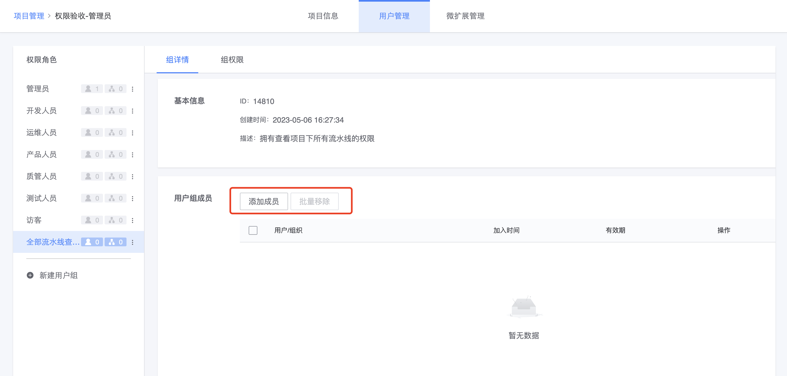

# 自定义项目级别的用户组

系统默认的项目级别用户组，除了“管理员”组的成员拥有项目下所有资源的权限外，其它用户组默认只有新增和列表的权限。

当默认的用户组不满足管理需求，比如需要给指定的用户开通项目下所有流水线的查看权限的场景，可以通过自定义项目级别的用户组来实现。

## Step1 进入项目管理

在切换项目的入口，点击 “用户管理“ 快速进入项目管理界面，入口如下：

## Step2 新建自定义用户组

新建用户组入口在左侧导航底部，点击后新建页面如上图所示

1. 用户组名：用户组的名称

2. 描述：描述用户组的权限范围和适用场景。建议填写，给管理员添加组成员、以及用户申请加入用户组时提供参考

3. 添加组权限：定义用户组中的用户能进行的操作和范围

以 “给指定的用户开通项目下所有流水线的查看权限” 场景为例：

- 首先选中 “查看流水线” 操作
> 系统将自动选中 “访问项目” 和 “流水线列表” 两个操作，因为需要进入项目下查看流水线，流水线列表中也需要能看到对应的流水线
- 点击确定后，页面如下：

- 针对每个操作设置资源范围
    - 不同操作对应的资源类型不一样，必要时需逐项设置
    - 当前示例中，可以进行批量编辑，选中当前项目

    

4. 添加组成员

在创建用户组时，非必填，可以先创建好组之后再添加成员。

添加组成员页面如下：

- 添加组成员时，可以按照人员添加，也可以按照组织架构添加

完成以上 4 个步骤，点击 “提交” 即成功创建自定义的用户组。