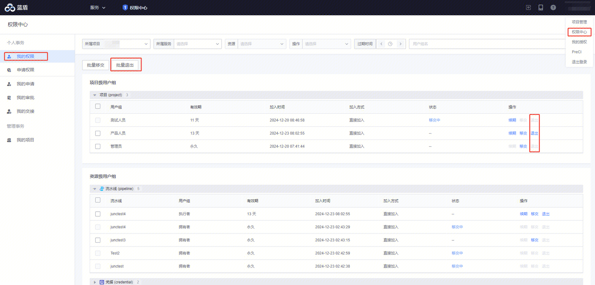
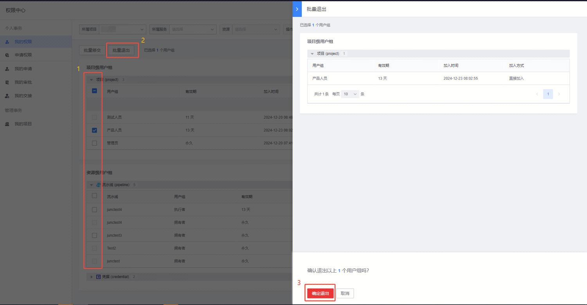
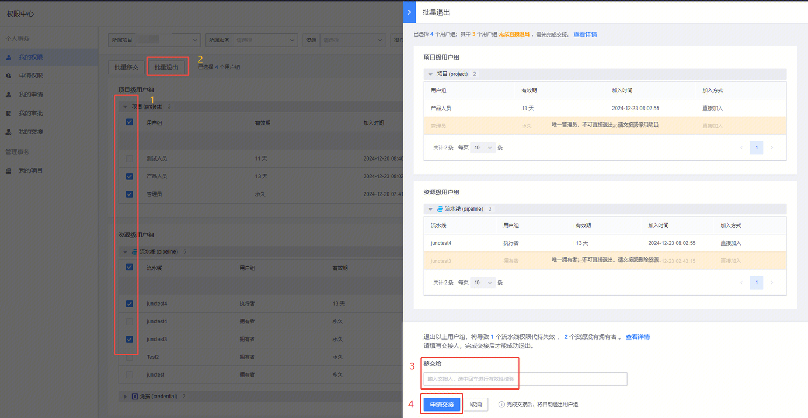
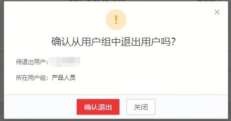

# 权限退出

当用户负责的工作范围发生变更，可以将自己名下的用户组权限退出，

>**说明：如果是唯一拥有者或者唯一管理员，则只能进行权限移交，无法直接权限退出!!**<!-- (enter) -->  

权限退出入口如下所示：

1、进行批量退出（无移交场景）:

- 选择待退出的权限（用户组）
- 点击”批量退出“
- 点击”确认退出“
即可完成权限退出

2、进行批量退出（有移交场景）:

- 选择待退出的权限（用户组）
- 点击”批量退出“
- 输入交接人
- 点击”申请交接“
等待交接人同意移交即可完成权限退出

3、进行单项退出：

- 待退出的权限（用户组）点击”退出“
- 点击”确认退出“
即可完成权限退出
